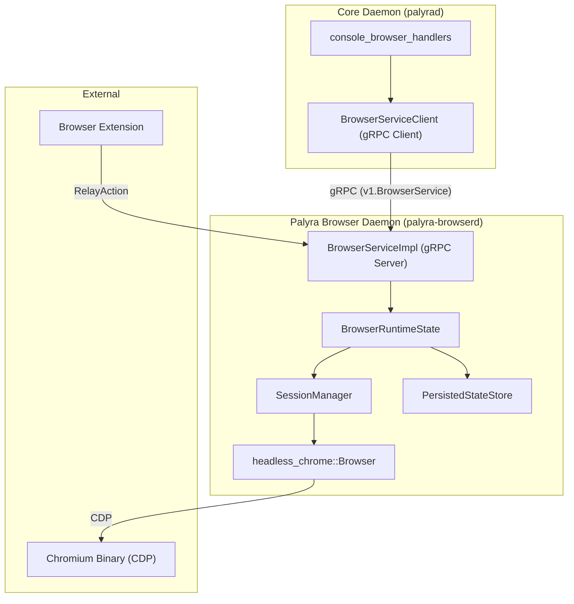

# Browser Automation (palyra-browserd)

Relevant source files

The following files were used as context for generating this wiki page:

- crates/palyra-browserd/Cargo.toml
- crates/palyra-browserd/build.rs
- crates/palyra-browserd/src/lib.rs
- crates/palyra-browserd/src/support/tests.rs
- crates/palyra-browserd/src/transport/grpc/service.rs
- crates/palyra-cli/src/args/browser.rs
- crates/palyra-cli/src/commands/browser.rs
- crates/palyra-cli/tests/workflow_regression_matrix.rs
- crates/palyra-daemon/src/transport/http/handlers/console/browser.rs
- schemas/proto/palyra/v1/browser.proto

The `palyra-browserd` daemon is a dedicated service responsible for headless browser orchestration within the Palyra platform. It provides a secure, resource-constrained environment for AI agents to interact with the web using the Chromium engine via the Chrome DevTools Protocol (CDP).

### Role in the Platform

`palyra-browserd` acts as a specialized worker that abstracts complex browser interactions into a high-level gRPC API. It is designed to be decoupled from the main `palyrad` daemon, allowing it to run in isolated environments (e.g., separate containers or sandboxes) to mitigate risks associated with executing untrusted web content.

**Key Integration Points:**
*   **Main Daemon (`palyrad`):** Calls the browser daemon via gRPC to fulfill "Browser Tool" requests from agents.
*   **Web Console:** Proxies user-initiated browser actions and session inspections through the `palyrad` HTTP layer [crates/palyra-daemon/src/transport/http/handlers/console/browser.rs#5-22](http://crates/palyra-daemon/src/transport/http/handlers/console/browser.rs#5-22).
*   **Browser Extension:** Interacts via the `RelayAction` API to bridge local user browser state with the headless daemon [schemas/proto/palyra/v1/browser.proto#35-35](http://schemas/proto/palyra/v1/browser.proto#35-35).

### System Architecture

The following diagram illustrates the relationship between the code entities that manage the browser lifecycle and the external components they interact with.

**Browser Automation Entity Map**

Sources: [crates/palyra-browserd/src/transport/grpc/service.rs#7-12](http://crates/palyra-browserd/src/transport/grpc/service.rs#7-12), [crates/palyra-browserd/src/support/tests.rs#80-101](http://crates/palyra-browserd/src/support/tests.rs#80-101), [crates/palyra-daemon/src/transport/http/handlers/console/browser.rs#15-22](http://crates/palyra-daemon/src/transport/http/handlers/console/browser.rs#15-22)

### BrowserService gRPC API

The primary interface for automation is the `BrowserService` defined in `browser.proto`. This API provides comprehensive control over browser sessions, tabs, and page interactions.

**Core Capabilities:**
*   **Session Management:** `CreateSession`, `CloseSession`, and `InspectSession` for managing isolated browser contexts [schemas/proto/palyra/v1/browser.proto#9-13](http://schemas/proto/palyra/v1/browser.proto#9-13).
*   **Automation Actions:** High-level primitives like `Navigate`, `Click`, `Type`, `Scroll`, and `WaitFor` [schemas/proto/palyra/v1/browser.proto#19-23](http://schemas/proto/palyra/v1/browser.proto#19-23).
*   **State Observation:** Tools for agents to "see" the page, including `Screenshot`, `Observe` (DOM/Accessibility tree), and `NetworkLog` [schemas/proto/palyra/v1/browser.proto#25-27](http://schemas/proto/palyra/v1/browser.proto#25-27).
*   **Profile Management:** Persistent identities via `CreateProfile` and `ListProfiles` [schemas/proto/palyra/v1/browser.proto#14-18](http://schemas/proto/palyra/v1/browser.proto#14-18).

For a full breakdown of the protobuf definitions and request/response structures, see **[BrowserService gRPC API](browserservice_grpc_api/README.md)**.

### Session Lifecycle and Security

Every browser interaction occurs within a `BrowserSession`. These sessions are governed by strict `SessionBudget` constraints to prevent resource exhaustion.

**Security Controls:**
*   **Resource Limits:** Constraints on navigation timeouts, screenshot sizes, and total actions per session [crates/palyra-browserd/src/transport/grpc/service.rs#105-164](http://crates/palyra-browserd/src/transport/grpc/service.rs#105-164).
*   **Target Validation:** URL filtering to prevent access to sensitive local metadata services or unauthorized internal domains [crates/palyra-browserd/src/support/tests.rs#8-8](http://crates/palyra-browserd/src/support/tests.rs#8-8).
*   **State Encryption:** Persisted session snapshots and profiles are encrypted using ChaCha20-Poly1305 [crates/palyra-browserd/src/lib.rs#46-50](http://crates/palyra-browserd/src/lib.rs#46-50).
*   **Artifact Quarantine:** Downloads are intercepted and placed in a quarantine directory for inspection [crates/palyra-browserd/src/lib.rs#141-156](http://crates/palyra-browserd/src/lib.rs#141-156).

For details on how Chromium is launched and how sessions are secured, see **[Browser Session Lifecycle and Security](browser_session_lifecycle_and_security/README.md)**.

### Browser Extension Integration

The `apps/browser-extension` allows the Palyra platform to bridge the gap between the headless daemon and the user's actual browser. This is primarily achieved through the `RelayAction` mechanism.

**Integration Flow:**
1.  The extension generates a `RelayAction` (e.g., `CAPTURE_SELECTION`).
2.  The action is sent to `palyra-browserd` via gRPC [schemas/proto/palyra/v1/browser.proto#35-35](http://schemas/proto/palyra/v1/browser.proto#35-35).
3.  The daemon correlates the relay token with an active session to ingest the data (e.g., cookies or page snapshots).

For details on the extension architecture and relay protocol, see **[Browser Extension](browser_extension/README.md)**.

### CLI Tooling

The `palyra` CLI provides an operator interface for managing the browser daemon. It supports starting/stopping the service, creating sessions, and executing manual automation steps for debugging [crates/palyra-cli/src/commands/browser.rs#174-234](http://crates/palyra-cli/src/commands/browser.rs#174-234).

**Common Commands:**
*   `palyra browser start`: Launches the daemon process [crates/palyra-cli/src/args/browser.rs#15-26](http://crates/palyra-cli/src/args/browser.rs#15-26).
*   `palyra browser status`: Checks health and active sessions [crates/palyra-cli/src/args/browser.rs#5-13](http://crates/palyra-cli/src/args/browser.rs#5-13).
*   `palyra browser open --url <URL>`: Quick session creation and navigation [crates/palyra-cli/src/args/browser.rs#30-47](http://crates/palyra-cli/src/args/browser.rs#30-47).

---

### Child Pages
*   **[BrowserService gRPC API](browserservice_grpc_api/README.md)** — Full documentation of the protobuf contract and service implementation.
*   **[Browser Session Lifecycle and Security](browser_session_lifecycle_and_security/README.md)** — Deep dive into Chromium integration, resource budgeting, and encryption.
*   **[Browser Extension](browser_extension/README.md)** — Details on the extension's role in relaying state and capturing user context.

**Sources:**
*   `schemas/proto/palyra/v1/browser.proto` (API Definitions)
*   `crates/palyra-browserd/src/lib.rs` (Constants and Dependencies)
*   `crates/palyra-browserd/src/transport/grpc/service.rs` (Service Implementation)
*   `crates/palyra-cli/src/commands/browser.rs` (CLI Logic)
*   `crates/palyra-daemon/src/transport/http/handlers/console/browser.rs` (Console Proxy)

## Child Pages

- [BrowserService gRPC API](browserservice_grpc_api/README.md)
- [Browser Session Lifecycle and Security](browser_session_lifecycle_and_security/README.md)
- [Browser Extension](browser_extension/README.md)
