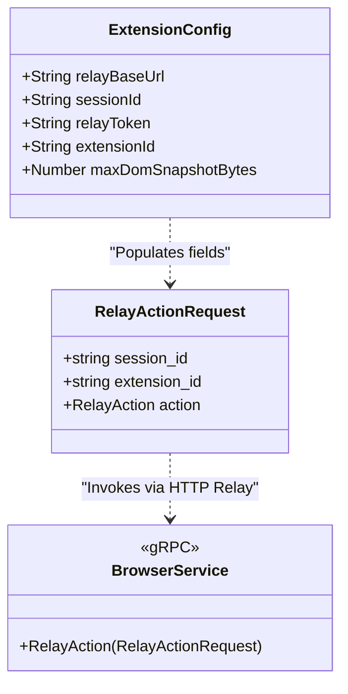

# Browser Extension

<details>
<summary>Relevant source files</summary>

The following files were used as context for generating this wiki page:

- apps/browser-extension/README.md
- apps/browser-extension/background.js
- apps/browser-extension/content_script.js
- apps/browser-extension/lib.mjs
- apps/browser-extension/manifest.json
- apps/browser-extension/package.json
- apps/browser-extension/popup.html
- apps/browser-extension/popup.js
- apps/browser-extension/tests/content_script.test.mjs
- apps/browser-extension/tests/lib.test.mjs
- crates/palyra-browserd/Cargo.toml
- crates/palyra-browserd/build.rs
- schemas/proto/palyra/v1/browser.proto

</details>


The Palyra Browser Extension (Relay Companion) is a Manifest V3 extension designed to bridge the gap between a user's local browsing session and the `palyra-browserd` automation daemon. It provides a secure, local-only relay mechanism to capture page state, take screenshots, and execute remote actions within the context of a specific browser session.

### Purpose and Scope
The extension serves as a "Relay Companion" for human-in-the-loop workflows where an AI agent needs to observe or interact with a tab that is already open in the user's primary browser, rather than a headless instance. It is intentionally narrow in scope, focusing on safe page captures and a specific set of `RelayAction` types.

Sources: [apps/browser-extension/README.md#1-14](http://apps/browser-extension/README.md#1-14), [apps/browser-extension/manifest.json#1-22](http://apps/browser-extension/manifest.json#1-22)

---

## Architecture and Data Flow

The extension consists of three primary components: the **Background Service Worker**, the **Content Script**, and the **Popup UI**. Communication with the Palyra ecosystem is strictly limited to loopback addresses to ensure data sovereignty.

### Component Interaction Diagram

This diagram illustrates how the extension components interact with each other and the external `palyra-browserd` daemon.

Title: Extension Component and Relay Flow
```mermaid
graph TD
    subgraph "Browser Extension"
        [popup.js] -- "chrome.runtime.sendMessage" --> [background.js]
        [background.js] -- "chrome.scripting.executeScript" --> [content_script.js]
        [background.js] -- "chrome.tabs.sendMessage" --> [content_script.js]
        [content_script.js] -- "sendResponse" --> [background.js]
    end

    subgraph "External Daemon"
        [background.js] -- "HTTP POST /console/v1/browser/relay/actions" --> [palyra-browserd]
    end

    [User] --> [popup.html]
    [popup.html] --> [popup.js]
```
Sources: [apps/browser-extension/background.js#159-173](http://apps/browser-extension/background.js#159-173), [apps/browser-extension/background.js#120-128](http://apps/browser-extension/background.js#120-128), [apps/browser-extension/manifest.json#10-14](http://apps/browser-extension/manifest.json#10-14)

---

## Core Components

### 1. Content Script (`content_script.js`)
The content script is injected dynamically into the active tab to perform DOM inspection and text extraction. It is designed to be non-destructive and avoids materializing large strings like `outerHTML` or `innerText` directly to prevent memory spikes.

*   **`collectDomSnapshotCapped`**: Iteratively traverses the DOM tree to build a serialized HTML string. It uses a `stack` based approach and a `createCappedBuffer` to ensure the output does not exceed the `maxDomBytes` limit defined in the relay configuration. [apps/browser-extension/content_script.js#98-151](http://apps/browser-extension/content_script.js#98-151)
*   **`collectVisibleTextCapped`**: Uses a `TreeWalker` (`NodeFilter.SHOW_TEXT`) to extract human-readable text from the page, applying normalization and length capping. [apps/browser-extension/content_script.js#159-182](http://apps/browser-extension/content_script.js#159-182)
*   **Message Listener**: Listens for the `palyra.collect_snapshot` message type to trigger extraction. [apps/browser-extension/content_script.js#184-208](http://apps/browser-extension/content_script.js#184-208)

### 2. Background Service Worker (`background.js`)
The background script acts as the orchestrator. It manages the extension state (stored in `chrome.storage.local`), handles relay requests, and captures screenshots.

*   **`captureCurrentTabContext`**: Coordinates the injection of the content script and retrieves the DOM/Text snapshot. [apps/browser-extension/background.js#117-142](http://apps/browser-extension/background.js#117-142)
*   **`captureScreenshot`**: Utilizes `chrome.tabs.captureVisibleTab` to grab a PNG data URL of the current viewport. It includes a safety check against `maxScreenshotBytes`; if the image is too large, the payload is omitted to prevent transport errors. [apps/browser-extension/background.js#144-157](http://apps/browser-extension/background.js#144-157)
*   **`dispatchRelayAction`**: Performs the authenticated HTTP POST to the `palyra-browserd` relay endpoint. It attaches the `session_id`, `extension_id`, and the `relayToken` (as a Bearer token). [apps/browser-extension/background.js#159-187](http://apps/browser-extension/background.js#159-187)

### 3. Utility Library (`lib.mjs`)
Shared logic for validation and normalization used by both the background and popup scripts.

*   **`validateOpenTabUrl`**: Ensures that any `OPEN_TAB` request targets a URL that matches the user-defined `openTabAllowlist`. It specifically rejects URLs containing credentials (username/password) to prevent phishing or confusion attacks. [apps/browser-extension/lib.mjs#126-192](http://apps/browser-extension/lib.mjs#126-192)
*   **`clampUtf8Bytes`**: A binary-search-based truncation utility that ensures strings are cut at valid UTF-8 boundaries without splitting multi-byte characters. [apps/browser-extension/lib.mjs#28-50](http://apps/browser-extension/lib.mjs#28-50)

Sources: [apps/browser-extension/content_script.js#1-209](http://apps/browser-extension/content_script.js#1-209), [apps/browser-extension/background.js#1-216](http://apps/browser-extension/background.js#1-216), [apps/browser-extension/lib.mjs#1-204](http://apps/browser-extension/lib.mjs#1-204)

---

## Relay Actions and Protocol

The extension communicates with `palyra-browserd` via the `RelayAction` interface. This allows the extension to act as a proxy for the agent.

### Supported Relay Actions
| Action Kind | Description | Implementation |
| :--- | :--- | :--- |
| `OPEN_TAB` | Opens a new URL in the user's browser, subject to allowlist. | `runRelayOpenTab` [apps/browser-extension/background.js#189-200](http://apps/browser-extension/background.js#189-200) |
| `CAPTURE_SELECTION` | Requests a specific element's content via CSS selector. | `runRelayCaptureSelection` [apps/browser-extension/background.js#202-214](http://apps/browser-extension/background.js#202-214) |
| `SEND_PAGE_SNAPSHOT` | Pushes the current tab's DOM, URL, and title to the daemon. | `runRelaySendPageSnapshot` (inferred) [apps/browser-extension/README.md#13](http://apps/browser-extension/README.md#13) |

### Data Model Mapping
This diagram maps the extension's internal configuration and logic to the gRPC service definitions in the daemon.

Title: Extension State to BrowserService Mapping

Sources: [apps/browser-extension/background.js#19-30](http://apps/browser-extension/background.js#19-30), [schemas/proto/palyra/v1/browser.proto#35](http://schemas/proto/palyra/v1/browser.proto#35), [apps/browser-extension/background.js#159-165](http://apps/browser-extension/background.js#159-165)

---

## Security Model

The extension implements several layers of security to protect the user's local environment:

1.  **Loopback Enforcement**: The `relayBaseUrl` is strictly validated to ensure it only targets `127.0.0.1`, `localhost`, or `::1`. This prevents the extension from leaking data to remote relay servers. [apps/browser-extension/lib.mjs#81-83](http://apps/browser-extension/lib.mjs#81-83)
2.  **Relay Tokens**: Communication requires a short-lived "Relay Token" minted by the Palyra Console. This token is stored in extension local storage and never persisted to disk in plain text by the daemon. [apps/browser-extension/README.md#31-41](http://apps/browser-extension/README.md#31-41)
3.  **Resource Bounding**: All captures (DOM, Text, Screenshots) are subject to hard byte limits (`MAX_DOM_SNAPSHOT_BYTES_DEFAULT`, etc.) to prevent OOM conditions or denial-of-service via massive page structures. [apps/browser-extension/lib.mjs#7-12](http://apps/browser-extension/lib.mjs#7-12)
4.  **Navigation Guardrails**: The `open_tab` action is restricted by a configurable prefix allowlist (defaulting to `https://` and local addresses). [apps/browser-extension/lib.mjs#2-6](http://apps/browser-extension/lib.mjs#2-6), [apps/browser-extension/lib.mjs#126-192](http://apps/browser-extension/lib.mjs#126-192)

Sources: [apps/browser-extension/README.md#15-21](http://apps/browser-extension/README.md#15-21), [apps/browser-extension/lib.mjs#67-88](http://apps/browser-extension/lib.mjs#67-88)
