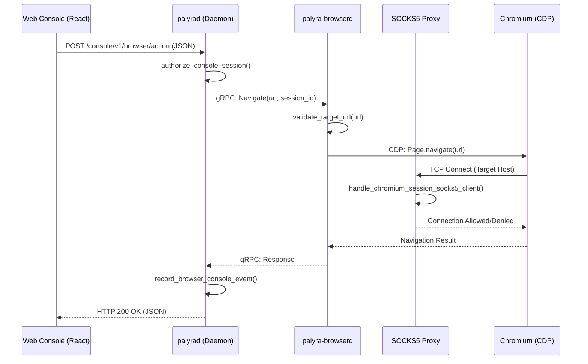
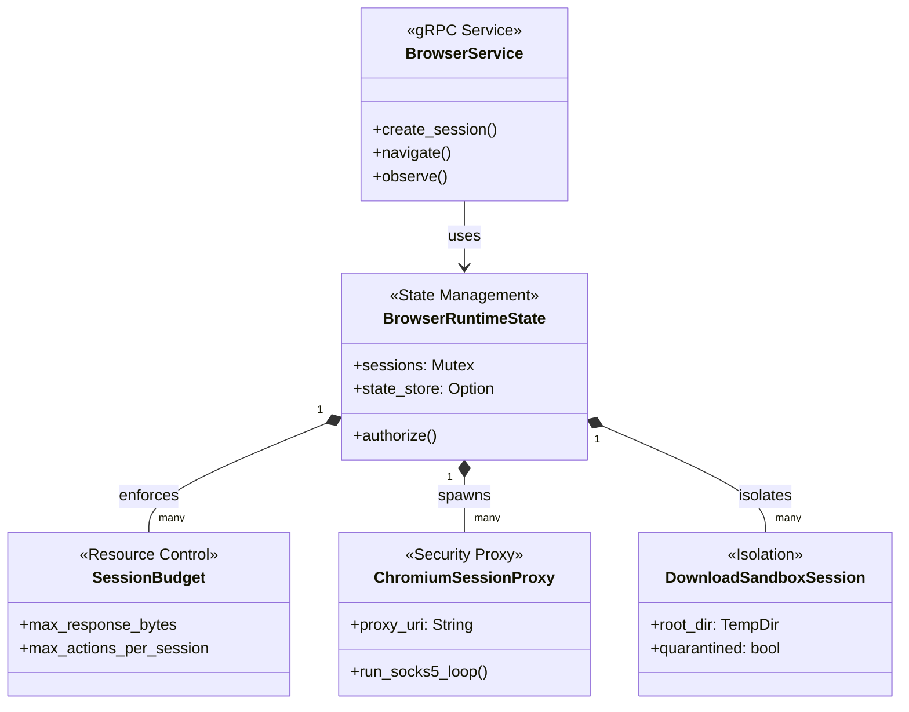

# Browser Session Lifecycle and Security

Relevant source files

The following files were used as context for generating this wiki page:

- apps/web/src/console/hooks/useUsageDomain.ts
- crates/palyra-browserd/src/domain/downloads.rs
- crates/palyra-browserd/src/engine/chromium.rs
- crates/palyra-browserd/src/lib.rs
- crates/palyra-browserd/src/security/target_validation.rs
- crates/palyra-browserd/src/support/tests.rs
- crates/palyra-browserd/src/transport/grpc/service.rs
- crates/palyra-cli/src/args/browser.rs
- crates/palyra-cli/src/commands/browser.rs
- crates/palyra-cli/src/commands/daemon.rs
- crates/palyra-cli/tests/workflow_regression_matrix.rs
- crates/palyra-daemon/src/application/route_message/orchestration.rs
- crates/palyra-daemon/src/application/run_stream/orchestration.rs
- crates/palyra-daemon/src/transport/http/handlers/console/browser.rs
- crates/palyra-daemon/src/transport/http/handlers/console/usage.rs
- crates/palyra-daemon/src/usage_governance.rs

The `palyra-browserd` daemon manages the lifecycle of headless Chromium instances, providing a secure, multi-tenant environment for AI agents to perform web automation. Security is enforced through resource budgeting, target URL validation, and artifact quarantine, while state is managed via encrypted profile persistence.

## Session Lifecycle Management

Browser sessions are created via the `CreateSession` gRPC endpoint. Each session is identified by a unique ULID and is associated with a specific `principal` (the identity of the agent or user) [crates/palyra-browserd/src/transport/grpc/service.rs#27-36](http://crates/palyra-browserd/src/transport/grpc/service.rs#27-36).

### 1. Initialization and Provisioning
When a session is initialized, `palyra-browserd` performs the following steps:
*   **Identity Resolution**: Resolves the `BrowserProfileRecord` for the given principal [crates/palyra-browserd/src/transport/grpc/service.rs#40-46](http://crates/palyra-browserd/src/transport/grpc/service.rs#40-46).
*   **State Restoration**: If `persistence_enabled` is true, it loads an encrypted `PersistedSessionSnapshot` from the `PersistedStateStore` [crates/palyra-browserd/src/transport/grpc/service.rs#73-89](http://crates/palyra-browserd/src/transport/grpc/service.rs#73-89).
*   **Budget Clamping**: The session's `SessionBudget` is established by merging requested constraints with system-wide defaults [crates/palyra-browserd/src/transport/grpc/service.rs#98-158](http://crates/palyra-browserd/src/transport/grpc/service.rs#98-158).
*   **Proxy Spawning**: A dedicated SOCKS5 proxy (`ChromiumSessionProxy`) is spawned for the session to intercept and validate all network traffic [crates/palyra-browserd/src/engine/chromium.rs#70-96](http://crates/palyra-browserd/src/engine/chromium.rs#70-96).

### 2. Resource Constraints (SessionBudget)
The `SessionBudget` struct enforces hard limits on the session's activity to prevent resource exhaustion and data exfiltration [crates/palyra-browserd/src/transport/grpc/service.rs#105-165](http://crates/palyra-browserd/src/transport/grpc/service.rs#105-165):
*   **Timeouts**: `max_navigation_timeout_ms` and `max_session_lifetime_ms`.
*   **Data Limits**: `max_screenshot_bytes`, `max_response_bytes`, and `max_observe_snapshot_bytes`.
*   **Action Quotas**: `max_actions_per_session` and rate-limiting via `max_actions_per_window`.
*   **Tab Limits**: Enforced by `DEFAULT_MAX_TABS_PER_SESSION` (32) [crates/palyra-browserd/src/lib.rs#102-102](http://crates/palyra-browserd/src/lib.rs#102-102).

### 3. Termination and Cleanup
Sessions are terminated when:
*   The `CloseSession` gRPC method is called.
*   The `max_session_lifetime_ms` is reached.
*   The session remains idle beyond `idle_ttl_ms` [crates/palyra-browserd/src/transport/grpc/service.rs#93-97](http://crates/palyra-browserd/src/transport/grpc/service.rs#93-97).

During termination, `palyra-browserd` shuts down the Chromium instance, terminates the SOCKS5 proxy, and, if persistence is enabled, encrypts and saves the final session state [crates/palyra-browserd/src/transport/grpc/service.rs#73-89](http://crates/palyra-browserd/src/transport/grpc/service.rs#73-89).

## Security Architecture

### Target URL Validation
To prevent agents from accessing internal infrastructure or malicious sites, `palyra-browserd` implements strict URL validation. The `navigate_with_guards` function checks targets against:
*   **Private Target Blocking**: Unless `allow_private_targets` is explicitly true, the SOCKS5 proxy rejects connections to loopback, link-local, and private IP ranges (RFC 1918) [crates/palyra-browserd/src/engine/chromium.rs#197-210](http://crates/palyra-browserd/src/engine/chromium.rs#197-210).
*   **DNS Validation**: The `handle_chromium_session_socks5_client` resolves hostnames and validates the resulting IP addresses before allowing the connection [crates/palyra-browserd/src/engine/chromium.rs#210-225](http://crates/palyra-browserd/src/engine/chromium.rs#210-225).

### Download Artifact Quarantine
Downloads are handled through a specialized `DownloadSandboxSession` [crates/palyra-browserd/src/domain/downloads.rs#19-25](http://crates/palyra-browserd/src/domain/downloads.rs#19-25).
*   **Isolation**: Files are downloaded into a temporary directory with `allowlist` and `quarantine` subdirectories [crates/palyra-browserd/src/domain/downloads.rs#28-43](http://crates/palyra-browserd/src/domain/downloads.rs#28-43).
*   **MIME/Extension Filtering**: Only safe file types (e.g., `.txt`, `.csv`, `.pdf`, `.json`) are allowed [crates/palyra-browserd/src/lib.rs#147-156](http://crates/palyra-browserd/src/lib.rs#147-156).
*   **Quarantine Logic**: If a file exceeds `DOWNLOAD_MAX_FILE_BYTES` (8MB) or fails MIME-type sniffing, it is moved to the quarantine directory and marked as unsafe [crates/palyra-browserd/src/domain/downloads.rs#159-194](http://crates/palyra-browserd/src/domain/downloads.rs#159-194).
*   **Quota Enforcement**: Total download size per session is capped by `DOWNLOAD_MAX_TOTAL_BYTES_PER_SESSION` (32MB) [crates/palyra-browserd/src/lib.rs#141-141](http://crates/palyra-browserd/src/lib.rs#141-141).

### Profile Persistence and Encryption
Browser profiles (cookies, localStorage) are stored using AES-256-GCM encryption.
*   **Encryption Keys**: Derived using the `PALYRA_BROWSERD_STATE_ENCRYPTION_KEY` environment variable [crates/palyra-browserd/src/lib.rs#117-117](http://crates/palyra-browserd/src/lib.rs#117-117).
*   **Storage**: Profiles are stored in `profiles.enc` within the state directory [crates/palyra-browserd/src/lib.rs#132-132](http://crates/palyra-browserd/src/lib.rs#132-132).
*   **Metadata**: Each profile record includes a `persistence_id` and a `principal` to ensure data isolation between users [crates/palyra-browserd/src/transport/grpc/service.rs#50-71](http://crates/palyra-browserd/src/transport/grpc/service.rs#50-71).

## Engine Integration (Chromium/CDP)

The system uses the `headless_chrome` crate to interface with Chromium via the Chrome DevTools Protocol (CDP).

### Headless Execution
Chromium is launched with a set of security-hardened flags, including `--headless`, `--disable-gpu`, and `--proxy-server` pointing to the session-specific SOCKS5 proxy [crates/palyra-browserd/src/engine/chromium.rs#77-89](http://crates/palyra-browserd/src/engine/chromium.rs#77-89).

### Automation Actions
Actions are proxied from gRPC to CDP:
*   **Navigation**: `navigate_with_guards` handles URL validation before triggering the CDP `Page.navigate` command [crates/palyra-browserd/src/engine/chromium.rs#37-45](http://crates/palyra-browserd/src/engine/chromium.rs#37-45).
*   **Observation**: `ChromiumObserveSnapshot` captures the DOM, page title, and URL [crates/palyra-browserd/src/engine/chromium.rs#30-34](http://crates/palyra-browserd/src/engine/chromium.rs#30-34).
*   **Interactions**: `Click`, `Type`, and `Scroll` are implemented as blocking tasks using `run_chromium_blocking` to ensure sequential execution [crates/palyra-browserd/src/engine/chromium.rs#59-67](http://crates/palyra-browserd/src/engine/chromium.rs#59-67).

## Daemon HTTP Console Proxy

The main `palyrad` daemon provides an HTTP console that proxies browser actions to `palyra-browserd`.

### Console Handlers
The handlers in `palyra-daemon` (e.g., `console_browser_profiles_list_handler`) act as a bridge [crates/palyra-daemon/src/transport/http/handlers/console/browser.rs#5-9](http://crates/palyra-daemon/src/transport/http/handlers/console/browser.rs#5-9):
1.  **Authorization**: Validates the operator's web session [crates/palyra-daemon/src/transport/http/handlers/console/browser.rs#10-10](http://crates/palyra-daemon/src/transport/http/handlers/console/browser.rs#10-10).
2.  **Client Building**: Constructs a gRPC client for the `BrowserService` [crates/palyra-daemon/src/transport/http/handlers/console/browser.rs#15-15](http://crates/palyra-daemon/src/transport/http/handlers/console/browser.rs#15-15).
3.  **Request Transformation**: Maps HTTP JSON payloads to `browser_v1` protobuf messages [crates/palyra-daemon/src/transport/http/handlers/console/browser.rs#16-20](http://crates/palyra-daemon/src/transport/http/handlers/console/browser.rs#16-20).
4.  **Audit Logging**: Records browser events (e.g., `browser.profile.created`) to the daemon's journal [crates/palyra-daemon/src/transport/http/handlers/console/browser.rs#70-82](http://crates/palyra-daemon/src/transport/http/handlers/console/browser.rs#70-82).

### Data Flow Diagram: Browser Action Execution

The following diagram illustrates the flow from the Web Console through the Daemons to the Chromium engine.

Title: Browser Action Flow (Console to CDP)

Sources: [crates/palyra-daemon/src/transport/http/handlers/console/browser.rs#5-32](http://crates/palyra-daemon/src/transport/http/handlers/console/browser.rs#5-32), [crates/palyra-browserd/src/transport/grpc/service.rs#27-50](http://crates/palyra-browserd/src/transport/grpc/service.rs#27-50), [crates/palyra-browserd/src/engine/chromium.rs#197-210](http://crates/palyra-browserd/src/engine/chromium.rs#197-210).

## Code Entity Map

The following diagram maps high-level concepts to their specific implementations in the codebase.

Title: Browser System Code Entity Mapping

Sources: [crates/palyra-browserd/src/transport/grpc/service.rs#7-12](http://crates/palyra-browserd/src/transport/grpc/service.rs#7-12), [crates/palyra-browserd/src/transport/grpc/service.rs#105-165](http://crates/palyra-browserd/src/transport/grpc/service.rs#105-165), [crates/palyra-browserd/src/engine/chromium.rs#70-74](http://crates/palyra-browserd/src/engine/chromium.rs#70-74), [crates/palyra-browserd/src/domain/downloads.rs#19-25](http://crates/palyra-browserd/src/domain/downloads.rs#19-25).

### Summary of Key Constants
| Constant | Value | Description |
| :--- | :--- | :--- |
| `DEFAULT_MAX_TABS_PER_SESSION` | 32 | Limit on concurrent tabs per session |
| `DOWNLOAD_MAX_FILE_BYTES` | 8 MB | Max size for a single download |
| `DOWNLOAD_MAX_TOTAL_BYTES` | 32 MB | Total download quota per session |
| `STATE_KEY_LEN` | 32 bytes | Length of the AES-256 encryption key |
| `CLEANUP_INTERVAL_MS` | 15,000 | Frequency of idle session cleanup |

Sources: [crates/palyra-browserd/src/lib.rs#82-143](http://crates/palyra-browserd/src/lib.rs#82-143).
