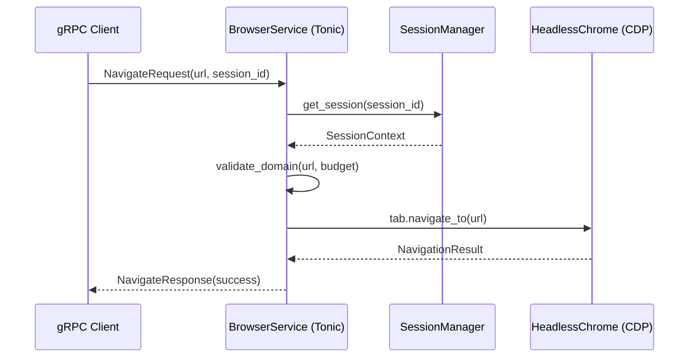
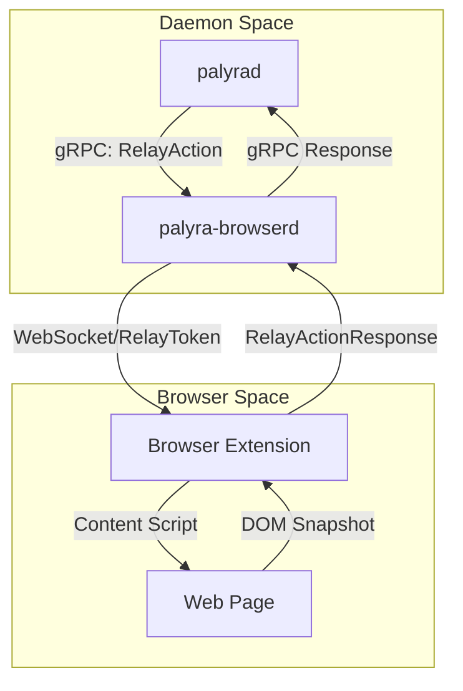

# BrowserService gRPC API

Relevant source files

The following files were used as context for generating this wiki page:

- crates/palyra-browserd/Cargo.toml
- crates/palyra-browserd/build.rs
- schemas/generated/kotlin/ProtocolStubs.kt
- schemas/generated/rust/protocol_stubs.rs
- schemas/generated/swift/ProtocolStubs.swift
- schemas/proto/palyra/v1/browser.proto
- schemas/proto/palyra/v1/gateway.proto

The `BrowserService` is the primary gRPC interface provided by `palyra-browserd` to enable programmatic control over headless Chromium instances. It facilitates session-based browser automation, state observation, and profile management, serving as the bridge between the Palyra daemon (`palyrad`) and the underlying browser engine.

### Service Definition and Transport
The service is defined in `palyra/v1/browser.proto` and utilizes `tonic` for gRPC implementation in Rust. The build process uses `protoc-bin-vendored` to ensure consistent stub generation across platforms.

| Component | Entity | Role |
| --- | --- | --- |
| **Protocol** | `palyra.browser.v1.BrowserService` | Service definition [schemas/proto/palyra/v1/browser.proto#7-37](http://schemas/proto/palyra/v1/browser.proto#7-37) |
| **Server** | `palyra-browserd` | Binary implementing the gRPC server [crates/palyra-browserd/Cargo.toml#9-10](http://crates/palyra-browserd/Cargo.toml#9-10) |
| **Engine** | `headless_chrome` | Underlying CDP (Chrome DevTools Protocol) integration [crates/palyra-browserd/Cargo.toml#17-17](http://crates/palyra-browserd/Cargo.toml#17-17) |

**Sources:** [schemas/proto/palyra/v1/browser.proto#1-37](http://schemas/proto/palyra/v1/browser.proto#1-37), [crates/palyra-browserd/Cargo.toml#12-33](http://crates/palyra-browserd/Cargo.toml#12-33), [crates/palyra-browserd/build.rs#14-17](http://crates/palyra-browserd/build.rs#14-17)

---

### Session Management
Browser interactions are encapsulated within a `Session`. Each session maintains its own lifecycle, budget constraints, and optional persistence.

#### Lifecycle Methods
*   **`CreateSession`**: Initializes a new browser context. It accepts a `SessionBudget` to enforce resource limits and a `profile_id` for state persistence.
*   **`CloseSession`**: Gracefully terminates the browser instance and cleans up temporary artifacts.
*   **`GetSession` / `ListSessions`**: Provides metadata about active sessions, including tab counts and idle timers.
*   **`InspectSession`**: A deep-dive diagnostic method that can retrieve cookies, local storage, and action logs for debugging.

#### Session Resource Governance
The `SessionBudget` message is critical for security and stability, defining hard limits on the automation environment.

| Field | Description |
| --- | --- |
| `max_navigation_timeout_ms` | Maximum time allowed for a page load [schemas/proto/palyra/v1/browser.proto#53-53](http://schemas/proto/palyra/v1/browser.proto#53-53) |
| `max_screenshot_bytes` | Quota for image capture size [schemas/proto/palyra/v1/browser.proto#55-55](http://schemas/proto/palyra/v1/browser.proto#55-55) |
| `max_actions_per_session` | Total automation steps allowed before auto-close [schemas/proto/palyra/v1/browser.proto#59-59](http://schemas/proto/palyra/v1/browser.proto#59-59) |
| `max_network_log_entries` | Buffer limit for network activity tracking [schemas/proto/palyra/v1/browser.proto#65-65](http://schemas/proto/palyra/v1/browser.proto#65-65) |

**Sources:** [schemas/proto/palyra/v1/browser.proto#71-117](http://schemas/proto/palyra/v1/browser.proto#71-117), [schemas/proto/palyra/v1/browser.proto#52-69](http://schemas/proto/palyra/v1/browser.proto#52-69), [schemas/proto/palyra/v1/browser.proto#222-238](http://schemas/proto/palyra/v1/browser.proto#222-238)

---

### Automation and Observation
The API provides standard automation primitives that map to `headless_chrome` actions.

#### Core Actions
*   **`Navigate`**: Directs the browser to a URL.
*   **`Click`**: Simulates mouse events on selectors.
*   **`Type`**: Injects keyboard events into input fields.
*   **`Scroll`**: Adjusts window or element scroll position.
*   **`WaitFor`**: Pauses execution until a DOM element matches a selector or a timeout occurs.

#### Observation API
To allow AI agents to "see" the page, the service provides:
1.  **`Screenshot`**: Returns a PNG/JPEG buffer of the current viewport.
2.  **`Observe`**: Provides a structural snapshot of the DOM, often filtered for accessibility or visibility.
3.  **`NetworkLog`**: Retrieves a list of HTTP requests/responses captured during the session.

#### Code Entity Mapping: Action Flow
The following diagram illustrates how a gRPC request traverses the system into the browser engine.

**Browser Action Execution Flow**

**Sources:** [schemas/proto/palyra/v1/browser.proto#19-27](http://schemas/proto/palyra/v1/browser.proto#19-27), [schemas/generated/rust/protocol_stubs.rs#135-149](http://schemas/generated/rust/protocol_stubs.rs#135-149), [crates/palyra-browserd/Cargo.toml#17-17](http://crates/palyra-browserd/Cargo.toml#17-17)

---

### Profile and Tab Management
The service manages browser profiles (user data directories) and individual tabs within a session.

*   **Profiles**: `CreateProfile`, `RenameProfile`, and `DeleteProfile` allow for persistent identities (logged-in states) across multiple sessions.
*   **Tabs**: `OpenTab`, `SwitchTab`, and `CloseTab` allow the orchestrator to manage multi-page workflows. `ListTabs` returns a list of `BrowserTab` objects containing titles and URLs.

**Sources:** [schemas/proto/palyra/v1/browser.proto#14-18](http://schemas/proto/palyra/v1/browser.proto#14-18), [schemas/proto/palyra/v1/browser.proto#29-32](http://schemas/proto/palyra/v1/browser.proto#29-32), [schemas/generated/kotlin/ProtocolStubs.kt#118-129](http://schemas/generated/kotlin/ProtocolStubs.kt#118-129)

---

### Extension Interoperability (RelayAction)
The `RelayAction` RPC is a specialized endpoint for communication with the Palyra Browser Extension. It enables the daemon to trigger actions that require a privileged extension context or to receive data initiated by a human user in the browser.

#### Relay Payloads
*   **`RelayOpenTabPayload`**: Requests the extension to open a specific URL in the user's active browser.
*   **`RelayCaptureSelectionPayload`**: Retrieves text currently selected by the user.
*   **`RelayPageSnapshotPayload`**: Requests a full DOM/MHTML snapshot from the extension's perspective.

**Data Flow: Extension Relay**

**Sources:** [schemas/proto/palyra/v1/browser.proto#35-35](http://schemas/proto/palyra/v1/browser.proto#35-35), [schemas/proto/palyra/v1/browser.proto#249-260](http://schemas/proto/palyra/v1/browser.proto#249-260), [schemas/generated/swift/ProtocolStubs.swift#218-238](http://schemas/generated/swift/ProtocolStubs.swift#218-238)

---

### API Summary Table

| RPC Method | Request Type | Response Type | Primary Function |
| --- | --- | --- | --- |
| `Health` | `BrowserHealthRequest` | `BrowserHealthResponse` | Monitor daemon uptime and load [8-8]() |
| `CreateSession` | `CreateSessionRequest` | `CreateSessionResponse` | Initialize sandbox [9-9]() |
| `Navigate` | `NavigateRequest` | `NavigateResponse` | URL transition [19-19]() |
| `Screenshot` | `ScreenshotRequest` | `ScreenshotResponse` | Visual capture [25-25]() |
| `Observe` | `ObserveRequest` | `ObserveResponse` | Semantic page analysis [26-26]() |
| `RelayAction` | `RelayActionRequest` | `RelayActionResponse` | Extension bridge [35-35]() |

**Sources:** [schemas/proto/palyra/v1/browser.proto#7-37](http://schemas/proto/palyra/v1/browser.proto#7-37)
