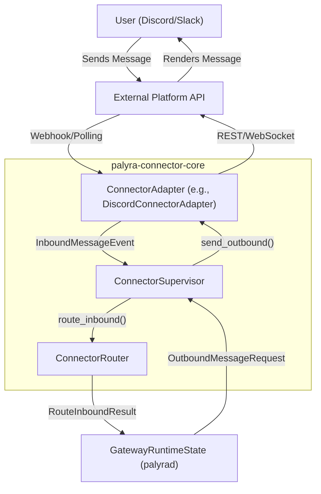
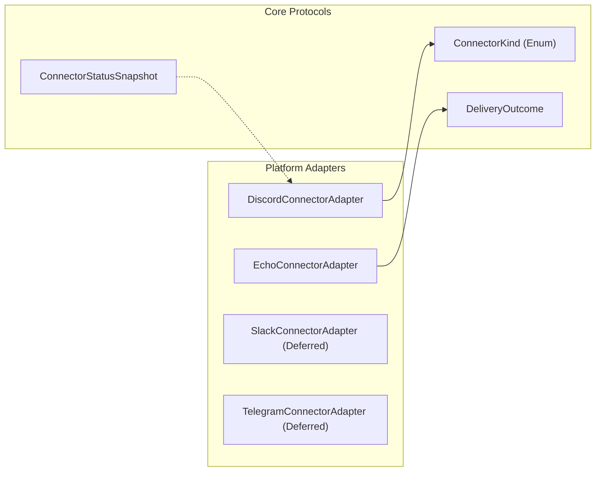

# Channel Connectors

<details>
<summary>Relevant source files</summary>

The following files were used as context for generating this wiki page:

- crates/palyra-cli/src/args/webhooks.rs
- crates/palyra-cli/src/commands/channels/mod.rs
- crates/palyra-cli/src/commands/webhooks.rs
- crates/palyra-cli/tests/help_snapshots/webhooks-help.txt
- crates/palyra-connector-core/src/storage.rs
- crates/palyra-connector-core/src/supervisor.rs
- crates/palyra-connectors/src/connectors/echo.rs
- crates/palyra-connectors/src/connectors/mod.rs
- crates/palyra-connectors/src/connectors/slack.rs
- crates/palyra-connectors/src/connectors/telegram.rs
- crates/palyra-connectors/src/lib.rs
- crates/palyra-daemon/src/transport/http/handlers/admin/channels/connectors/discord.rs
- crates/palyra-daemon/src/transport/http/handlers/admin/channels/mod.rs
- crates/palyra-daemon/src/transport/http/handlers/console/channels/connectors/discord.rs
- crates/palyra-daemon/src/webhooks.rs

</details>


Channel Connectors provide the integration layer between the Palyra AI gateway and external messaging platforms. The architecture is designed to be provider-agnostic, using a standardized supervisor/adapter pattern to handle message ingestion, delivery, and rate limiting across different protocols.

### System Architecture

The connector subsystem is managed by the `ConnectorSupervisor`, which orchestrates the lifecycle of multiple `ConnectorAdapter` implementations. It acts as the bridge between the internal `GatewayRuntimeState` and external APIs.

#### Interaction Flow: NL Space to Code Entities

The following diagram illustrates how a natural language message from a user (e.g., on Discord) flows into the system and how the system responds.



**Sources:**
- [crates/palyra-connector-core/src/supervisor.rs#128-134](http://crates/palyra-connector-core/src/supervisor.rs#128-134) (`ConnectorRouter` trait)
- [crates/palyra-connector-core/src/supervisor.rs#137-174](http://crates/palyra-connector-core/src/supervisor.rs#137-174) (`ConnectorAdapter` trait)
- [crates/palyra-connector-core/src/supervisor.rs#194-214](http://crates/palyra-connector-core/src/supervisor.rs#194-214) (`ConnectorSupervisor` definition)

---

### Connector Framework

The framework provides the core traits and data structures used by all integrations. It manages the `ConnectorStore` (SQLite-backed persistence for connector state) and handles complex delivery logic like exponential backoff and dead-lettering.

| Component | Responsibility |
| :--- | :--- |
| `ConnectorAdapter` | Trait for platform-specific logic (send/poll). |
| `ConnectorSupervisor` | Manages adapter lifecycles and message queuing. |
| `OutboundMessageRequest` | Standardized internal format for outgoing messages. |
| `DeliveryOutcome` | Enum representing `Delivered`, `Retry`, or `PermanentFailure`. |
| `DeadLetterRecord` | Stores messages that failed after maximum retries. |

For details, see [Connector Framework](connector_framework/README.md).

**Sources:**
- [crates/palyra-connectors/src/lib.rs#2-12](http://crates/palyra-connectors/src/lib.rs#2-12) (Crate exports)
- [crates/palyra-connector-core/src/supervisor.rs#25-36](http://crates/palyra-connector-core/src/supervisor.rs#25-36) (`ConnectorSupervisorConfig`)

---

### Platform Integrations

Palyra supports multiple messaging platforms with varying levels of maturity. The `DiscordConnectorAdapter` is the primary reference implementation, supporting rich features like attachment pre-processing and secure DM pairing.

#### Code Entity Mapping: Integration Components

This diagram maps system concepts to specific code entities within the `palyra-connectors` and platform crates.



For details, see [Discord and Other Platform Integrations](discord_and_other_platform_integrations/README.md).

**Sources:**
- [crates/palyra-connectors/src/connectors/mod.rs#15-18](http://crates/palyra-connectors/src/connectors/mod.rs#15-18) (`default_adapters` implementation)
- [crates/palyra-connectors/src/connectors/echo.rs#21-24](http://crates/palyra-connectors/src/connectors/echo.rs#21-24) (`EchoConnectorAdapter`)
- [crates/palyra-connectors/src/connectors/slack.rs#10-13](http://crates/palyra-connectors/src/connectors/slack.rs#10-13) (`SlackConnectorAdapter`)

---

### Webhooks

The Webhook subsystem allows external services to push events into Palyra. It includes a `WebhookRegistry` for managing endpoint configurations and security features like signature verification and replay protection.

*   **Registry Management:** Handled via `WebhookRegistry` which persists to `webhooks.toml`.
*   **Diagnostics:** The system provides snapshots via `WebhookDiagnosticsSnapshot` to track the health of integrations.
*   **Testing:** A dedicated CLI and API surface allows for simulated payload testing.

For details, see [Webhooks](webhooks/README.md).

**Sources:**
- [crates/palyra-daemon/src/webhooks.rs#107-111](http://crates/palyra-daemon/src/webhooks.rs#107-111) (`WebhookRegistry` struct)
- [crates/palyra-daemon/src/webhooks.rs#52-72](http://crates/palyra-daemon/src/webhooks.rs#52-72) (`WebhookIntegrationRecord`)
- [crates/palyra-cli/src/commands/webhooks.rs#100-131](http://crates/palyra-cli/src/commands/webhooks.rs#100-131) (`WebhooksCommand::Test` implementation)

---

### Management and Monitoring

Connectors can be managed via the CLI or the Admin API. The system tracks saturation states (e.g., `rate_limited`, `backpressure`, `retrying`) to provide operators with visibility into delivery health.

```rust
// Example of how the system builds a health snapshot for a connector
// From crates/palyra-daemon/src/transport/http/handlers/admin/channels/mod.rs:113-147
let saturation_state = if !connector.enabled {
    "paused"
} else if queue.dead_letters > 0 {
    "dead_lettered"
} else if active_route_limits > 0 {
    "rate_limited"
} else {
    "healthy"
};
```

**Sources:**
- [crates/palyra-daemon/src/transport/http/handlers/admin/channels/mod.rs#29-53](http://crates/palyra-daemon/src/transport/http/handlers/admin/channels/mod.rs#29-53) (`build_channel_status_payload`)
- [crates/palyra-cli/src/commands/channels/mod.rs#61-112](http://crates/palyra-cli/src/commands/channels/mod.rs#61-112) (`run` command for channel lifecycle)

## Child Pages

- [Connector Framework](connector_framework/README.md)
- [Discord and Other Platform Integrations](discord_and_other_platform_integrations/README.md)
- [Webhooks](webhooks/README.md)
