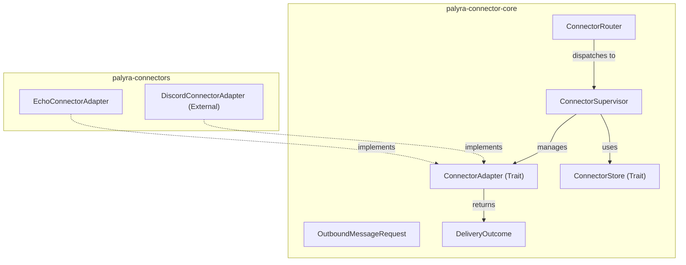
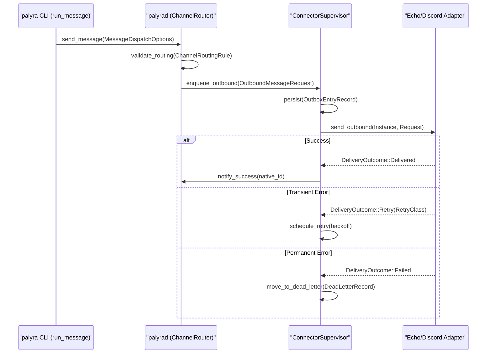

# Connector Framework

Relevant source files

The following files were used as context for generating this wiki page:

- crates/palyra-cli/src/args/message.rs
- crates/palyra-cli/src/client/message.rs
- crates/palyra-cli/src/commands/message.rs
- crates/palyra-connector-core/src/lib.rs
- crates/palyra-connector-core/src/protocol.rs
- crates/palyra-connectors/src/connectors/echo.rs
- crates/palyra-connectors/src/lib.rs
- crates/palyra-daemon/src/channel_router.rs

The Connector Framework provides a standardized abstraction for integrating external messaging platforms (e.g., Discord, Slack, Telegram) into the Palyra ecosystem. It is primarily implemented across the `palyra-connector-core` and `palyra-connectors` crates, defining how the Palyra daemon communicates with third-party APIs while maintaining consistent message routing, delivery guarantees, and security policies.

## Architecture Overview

The framework follows a supervisor-adapter pattern. The `ConnectorSupervisor` manages the lifecycle and state of various `ConnectorAdapter` implementations.

### Code Entity Mapping

The following diagram maps high-level framework concepts to their specific implementation entities in the codebase.

| Concept | Code Entity | Role |
| :--- | :--- | :--- |
| **Adapter Interface** | `ConnectorAdapter` | Trait defining how to send messages and report capabilities. |
| **Lifecycle Manager** | `ConnectorSupervisor` | Orchestrates starting, stopping, and monitoring connector instances. |
| **Persistence** | `ConnectorStore` | Trait for persisting connector configuration and state. |
| **Routing Logic** | `ConnectorRouter` | Logic for dispatching inbound/outbound messages to the correct adapter. |
| **Outbound Request** | `OutboundMessageRequest` | Standardized payload for sending messages to external platforms. |

**Diagram: Connector Framework Entity Map**

Sources: [crates/palyra-connector-core/src/lib.rs#1-23](http://crates/palyra-connector-core/src/lib.rs#1-23), [crates/palyra-connectors/src/lib.rs#1-12](http://crates/palyra-connectors/src/lib.rs#1-12)

## ConnectorAdapter Trait

The `ConnectorAdapter` is the core trait that every platform integration must implement. It defines the identity, availability, and message delivery capabilities of a connector.

### Key Functions
*   `kind()`: Returns the `ConnectorKind` (e.g., `Echo`, `Discord`) [crates/palyra-connectors/src/connectors/echo.rs#35-37](http://crates/palyra-connectors/src/connectors/echo.rs#35-37).
*   `availability()`: Reports if the connector is `Supported`, `InternalTestOnly`, or `Deferred` [crates/palyra-connectors/src/connectors/echo.rs#39-41](http://crates/palyra-connectors/src/connectors/echo.rs#39-41).
*   `send_outbound()`: The primary method for delivering messages. It accepts an `OutboundMessageRequest` and returns a `DeliveryOutcome` [crates/palyra-connectors/src/connectors/echo.rs#43-75](http://crates/palyra-connectors/src/connectors/echo.rs#43-75).

### Outbound Messaging and Delivery
When the system sends a message, it uses the `OutboundMessageRequest` struct, which contains the target conversation, text, and optional attachments [crates/palyra-connector-core/src/protocol.rs#312-332](http://crates/palyra-connector-core/src/protocol.rs#312-332).

The result of a send operation is a `DeliveryOutcome`:
*   `Delivered`: Successful delivery with a `native_message_id` from the platform [crates/palyra-connector-core/src/protocol.rs#408-410](http://crates/palyra-connector-core/src/protocol.rs#408-410).
*   `Retry`: Indicates a transient failure (e.g., rate limits or connector restarting) with a `RetryClass` [crates/palyra-connector-core/src/protocol.rs#411-415](http://crates/palyra-connector-core/src/protocol.rs#411-415).
*   `Failed`: Permanent failure that should not be retried [crates/palyra-connector-core/src/protocol.rs#416-419](http://crates/palyra-connector-core/src/protocol.rs#416-419).

Sources: [crates/palyra-connector-core/src/supervisor.rs#30-65](http://crates/palyra-connector-core/src/supervisor.rs#30-65), [crates/palyra-connector-core/src/protocol.rs#26-100](http://crates/palyra-connector-core/src/protocol.rs#26-100)

## Connector Lifecycle and Supervision

The `ConnectorSupervisor` manages `ConnectorInstanceRecord` objects, which represent configured instances of a connector (e.g., a specific Discord bot).

### ConnectorInstanceRecord
This record tracks the operational state of a connector instance:
*   `readiness`: (`Ready`, `MissingCredential`, `AuthFailed`, `Misconfigured`) [crates/palyra-connector-core/src/protocol.rs#110-115](http://crates/palyra-connector-core/src/protocol.rs#110-115).
*   `liveness`: (`Stopped`, `Running`, `Restarting`, `Crashed`) [crates/palyra-connector-core/src/protocol.rs#142-147](http://crates/palyra-connector-core/src/protocol.rs#142-147).
*   `restart_count`: Tracks how many times the supervisor has attempted to recover the instance [crates/palyra-connector-core/src/storage.rs#35-35](http://crates/palyra-connector-core/src/storage.rs#35-35).

### Dead-Letter Handling
If a message fails delivery after the configured maximum attempts (defined in `ChannelRouterConfig.max_retry_attempts` [crates/palyra-daemon/src/channel_router.rs#182-182](http://crates/palyra-daemon/src/channel_router.rs#182-182)), it is moved to a dead-letter state. The `DeadLetterRecord` captures the failed `OutboundMessageRequest` along with the final error reason for manual operator intervention [crates/palyra-connector-core/src/storage.rs#104-115](http://crates/palyra-connector-core/src/storage.rs#104-115).

Sources: [crates/palyra-connector-core/src/storage.rs#24-50](http://crates/palyra-connector-core/src/storage.rs#24-50), [crates/palyra-daemon/src/channel_router.rs#178-192](http://crates/palyra-daemon/src/channel_router.rs#178-192)

## Data Flow: Message Delivery

The following diagram illustrates the flow of an outbound message from the Palyra CLI/Daemon through the framework to an external platform.

**Diagram: Outbound Message Data Flow**

Sources: [crates/palyra-cli/src/commands/message.rs#47-81](http://crates/palyra-cli/src/commands/message.rs#47-81), [crates/palyra-cli/src/client/message.rs#95-123](http://crates/palyra-cli/src/client/message.rs#95-123), [crates/palyra-daemon/src/channel_router.rs#215-235](http://crates/palyra-daemon/src/channel_router.rs#215-235)

## EchoConnector (Testing)

The `EchoConnectorAdapter` is a reference implementation used for internal testing and validation of the framework [crates/palyra-connectors/src/connectors/echo.rs#21-24](http://crates/palyra-connectors/src/connectors/echo.rs#21-24).

### Features
*   **Idempotency**: It tracks `delivered_native_ids` in a `Mutex<HashMap>` to ensure that re-sending the same `envelope_id` returns the same `native_message_id` [crates/palyra-connectors/src/connectors/echo.rs#68-70](http://crates/palyra-connectors/src/connectors/echo.rs#68-70).
*   **Simulated Failure**: If the message text contains `[connector-crash-once]`, the adapter returns a `RetryClass::ConnectorRestarting` outcome exactly once for that `envelope_id`, allowing verification of the supervisor's retry logic [crates/palyra-connectors/src/connectors/echo.rs#48-61](http://crates/palyra-connectors/src/connectors/echo.rs#48-61).
*   **Fallback IDs**: It generates stable hex fingerprints for messages using SHA-256 to simulate platform-generated IDs [crates/palyra-connectors/src/connectors/echo.rs#78-91](http://crates/palyra-connectors/src/connectors/echo.rs#78-91).

Sources: [crates/palyra-connectors/src/connectors/echo.rs#1-92](http://crates/palyra-connectors/src/connectors/echo.rs#1-92)

## Capabilities and Discovery

Connectors report their capabilities via the `ConnectorCapabilitySet` [crates/palyra-connector-core/src/protocol.rs#205-215](http://crates/palyra-connector-core/src/protocol.rs#205-215). This allows the UI and CLI to gracefully degrade or inform the user when certain actions (like editing or reacting to messages) are not supported by a specific platform.

The CLI uses the `capabilities` command to query these from the daemon:
1.  Calls `runtime.message_capabilities()` [crates/palyra-cli/src/commands/message.rs#35-44](http://crates/palyra-cli/src/commands/message.rs#35-44).
2.  The daemon responds with a `MessageCapabilities` struct [crates/palyra-cli/src/client/message.rs#51-56](http://crates/palyra-cli/src/client/message.rs#51-56).
3.  The CLI filters `SUPPORTED_MESSAGE_ACTIONS` and `UNSUPPORTED_MESSAGE_ACTIONS` to display status to the operator [crates/palyra-cli/src/client/message.rs#16-25](http://crates/palyra-cli/src/client/message.rs#16-25).

Sources: [crates/palyra-cli/src/client/message.rs#43-56](http://crates/palyra-cli/src/client/message.rs#43-56), [crates/palyra-connector-core/src/protocol.rs#173-215](http://crates/palyra-connector-core/src/protocol.rs#173-215)
