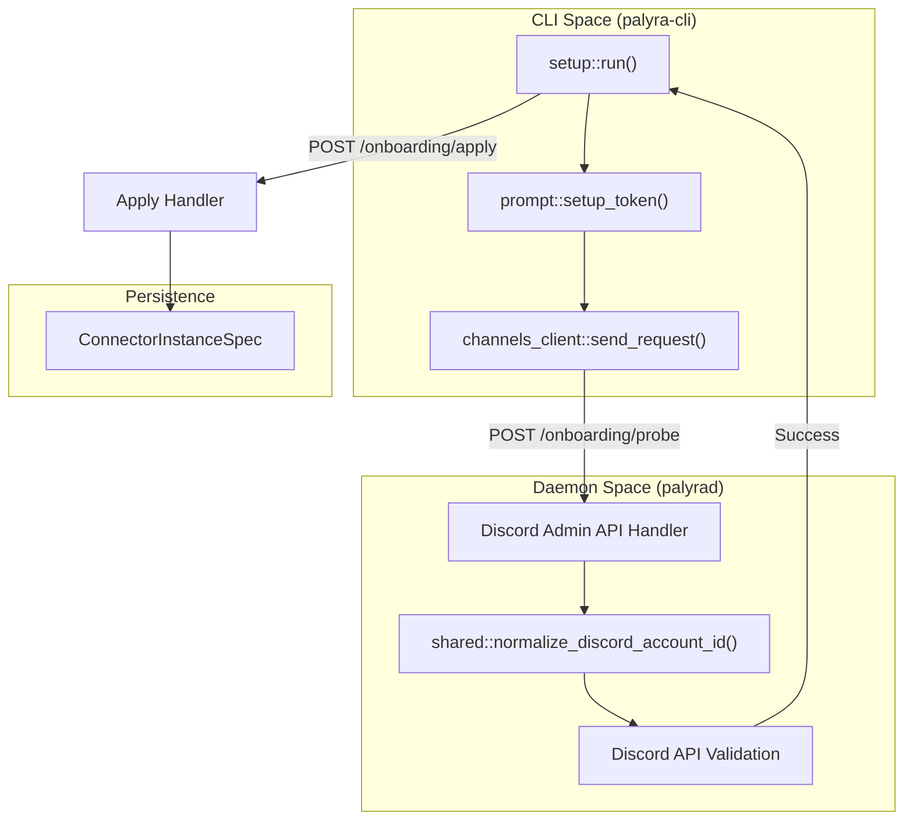
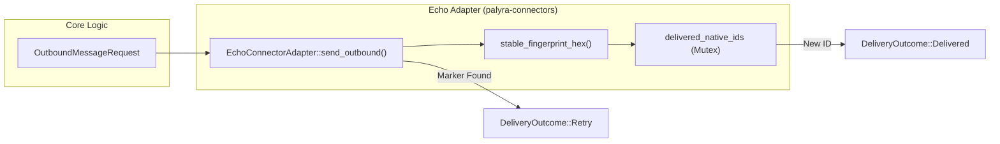

# Discord and Other Platform Integrations

Relevant source files

The following files were used as context for generating this wiki page:

- crates/palyra-cli/src/app/mod.rs
- crates/palyra-cli/src/client/channels.rs
- crates/palyra-cli/src/client/grpc.rs
- crates/palyra-cli/src/commands/approvals.rs
- crates/palyra-cli/src/commands/channels/connectors/discord/setup.rs
- crates/palyra-cli/src/commands/channels/connectors/discord/verify.rs
- crates/palyra-cli/src/commands/channels/router.rs
- crates/palyra-connectors/src/connectors/echo.rs
- crates/palyra-connectors/src/connectors/mod.rs
- crates/palyra-connectors/src/connectors/slack.rs
- crates/palyra-connectors/src/connectors/telegram.rs
- crates/palyra-connectors/src/lib.rs
- crates/palyra-daemon/src/channels/discord.rs

This page documents the specific platform implementations within the Palyra connector ecosystem. While `palyra-connector-core` defines the lifecycle and traits, the platform-specific crates handle the nuances of Discord, Slack, and Telegram, including authentication handshakes, message parsing, and attachment handling.

## Discord Connector (palyra-connector-discord)

The Discord connector is the primary production-ready external channel for Palyra. It allows the daemon to interact with users via Direct Messages (DMs) and Guild (Server) channels.

### Identity and Principal Mapping
Discord identities are mapped to Palyra principals using a canonical format to ensure consistency across the system.
*   **Sender Identity**: Mapped using `canonical_discord_sender_identity` [crates/palyra-daemon/src/channels/discord.rs#6-10](http://crates/palyra-daemon/src/channels/discord.rs#6-10).
*   **Channel Identity**: Mapped using `canonical_discord_channel_identity` [crates/palyra-daemon/src/channels/discord.rs#6-10](http://crates/palyra-daemon/src/channels/discord.rs#6-10).
*   **Principal String**: Generated via `discord_principal`, typically following the pattern `discord:<user_id>` [crates/palyra-daemon/src/channels/discord.rs#6-10](http://crates/palyra-daemon/src/channels/discord.rs#6-10).

### Security Handshake and Onboarding
The onboarding process for Discord is managed through a multi-step administrative flow via the CLI and Admin API. This ensures that the bot has the necessary permissions and that the operator has verified the connection.

1.  **Probe Phase**: The `run` function in the Discord setup module calls the `/admin/v1/channels/discord/onboarding/probe` endpoint [crates/palyra-cli/src/commands/channels/connectors/discord/setup.rs#33-46](http://crates/palyra-cli/src/commands/channels/connectors/discord/setup.rs#33-46). This validates the provided bot token and checks for required permissions (e.g., message history, file attachments).
2.  **Configuration Phase**: The operator configures the `inbound_scope` (DMs only vs. Guild channels) and sets `allow_from`/`deny_from` filters [crates/palyra-cli/src/commands/channels/connectors/discord/setup.rs#53-55](http://crates/palyra-cli/src/commands/channels/connectors/discord/setup.rs#53-55).
3.  **Apply Phase**: The configuration is committed via the `/admin/v1/channels/discord/onboarding/apply` endpoint [crates/palyra-cli/src/commands/channels/connectors/discord/setup.rs#73-95](http://crates/palyra-cli/src/commands/channels/connectors/discord/setup.rs#73-95). This persists the `ConnectorInstanceSpec` [crates/palyra-daemon/src/channels/discord.rs#18-21](http://crates/palyra-daemon/src/channels/discord.rs#18-21).

### Implementation Diagram: Discord Setup Flow
The following diagram illustrates how the CLI setup command interacts with the Daemon's Discord integration logic.

"Discord Setup Logic Flow"

Sources: [crates/palyra-cli/src/commands/channels/connectors/discord/setup.rs#10-97](http://crates/palyra-cli/src/commands/channels/connectors/discord/setup.rs#10-97), [crates/palyra-daemon/src/channels/discord.rs#13-21](http://crates/palyra-daemon/src/channels/discord.rs#13-21)

### Message and Attachment Processing
The Discord connector implements the `ConnectorAdapter` trait to handle bidirectional communication:
*   **Mention Matching**: In guild channels, the connector can be configured to require a mention (`require_mention`) before triggering a run [crates/palyra-cli/src/commands/channels/connectors/discord/setup.rs#57-64](http://crates/palyra-cli/src/commands/channels/connectors/discord/setup.rs#57-64).
*   **Egress Control**: Outbound messages are restricted by an egress allowlist, initialized via `discord_default_egress_allowlist` [crates/palyra-daemon/src/channels/discord.rs#6-10](http://crates/palyra-daemon/src/channels/discord.rs#6-10).
*   **Verification**: Operators can trigger test messages using the `verify` command, which calls the `test-send` endpoint [crates/palyra-cli/src/commands/channels/connectors/discord/verify.rs#25-43](http://crates/palyra-cli/src/commands/channels/connectors/discord/verify.rs#25-43).

## Other Platform Stubs

Palyra includes stubs for Slack and Telegram to define the architectural path for future integrations. These currently return `ConnectorAvailability::Deferred` [crates/palyra-connectors/src/connectors/slack.rs#19](http://crates/palyra-connectors/src/connectors/slack.rs#19).

### Slack and Telegram Status
| Platform | Class | Availability | Behavior |
| :--- | :--- | :--- | :--- |
| **Slack** | `SlackConnectorAdapter` | `Deferred` | Returns `PermanentFailure` on send [crates/palyra-connectors/src/connectors/slack.rs#13-30](http://crates/palyra-connectors/src/connectors/slack.rs#13-30) |
| **Telegram** | `TelegramConnectorAdapter` | `Deferred` | Returns `PermanentFailure` on send [crates/palyra-connectors/src/connectors/telegram.rs#13-30](http://crates/palyra-connectors/src/connectors/telegram.rs#13-30) |

## Echo Connector (Internal Testing)

The `EchoConnectorAdapter` is used for internal integration testing and development. It simulates a functional connector without requiring external network access.

### Key Features
*   **Idempotency**: It uses `fallback_native_message_id` to generate stable message IDs based on a fingerprint of the envelope, text, and thread [crates/palyra-connectors/src/connectors/echo.rs#78-86](http://crates/palyra-connectors/src/connectors/echo.rs#78-86).
*   **Failure Simulation**: It can simulate a connector crash/restart if the message text contains the `[connector-crash-once]` marker [crates/palyra-connectors/src/connectors/echo.rs#48-61](http://crates/palyra-connectors/src/connectors/echo.rs#48-61).
*   **Internal Availability**: It is explicitly marked as `ConnectorAvailability::InternalTestOnly` [crates/palyra-connectors/src/connectors/echo.rs#40](http://crates/palyra-connectors/src/connectors/echo.rs#40).

### Data Flow: Outbound Echo Message
This diagram bridges the abstract `OutboundMessageRequest` to the concrete `EchoConnectorAdapter` implementation.

"Echo Connector Data Flow"

Sources: [crates/palyra-connectors/src/connectors/echo.rs#34-75](http://crates/palyra-connectors/src/connectors/echo.rs#34-75), [crates/palyra-connectors/src/connectors/echo.rs#88-91](http://crates/palyra-connectors/src/connectors/echo.rs#88-91)

## Summary of Default Adapters
The `default_adapters()` function in the `palyra-connectors` crate initializes the set of active connectors available to the `ConnectorSupervisor` [crates/palyra-connectors/src/connectors/mod.rs#16-18](http://crates/palyra-connectors/src/connectors/mod.rs#16-18).

| Connector Kind | Implementation Class | Production Ready |
| :--- | :--- | :--- |
| `Echo` | `EchoConnectorAdapter` | No (Test Only) |
| `Discord` | `DiscordConnectorAdapter` | Yes |
| `Slack` | `SlackConnectorAdapter` | No (Stub) |
| `Telegram` | `TelegramConnectorAdapter` | No (Stub) |

Sources: [crates/palyra-connectors/src/connectors/mod.rs#16-18](http://crates/palyra-connectors/src/connectors/mod.rs#16-18), [crates/palyra-connectors/src/connectors/mod.rs#34-41](http://crates/palyra-connectors/src/connectors/mod.rs#34-41)
