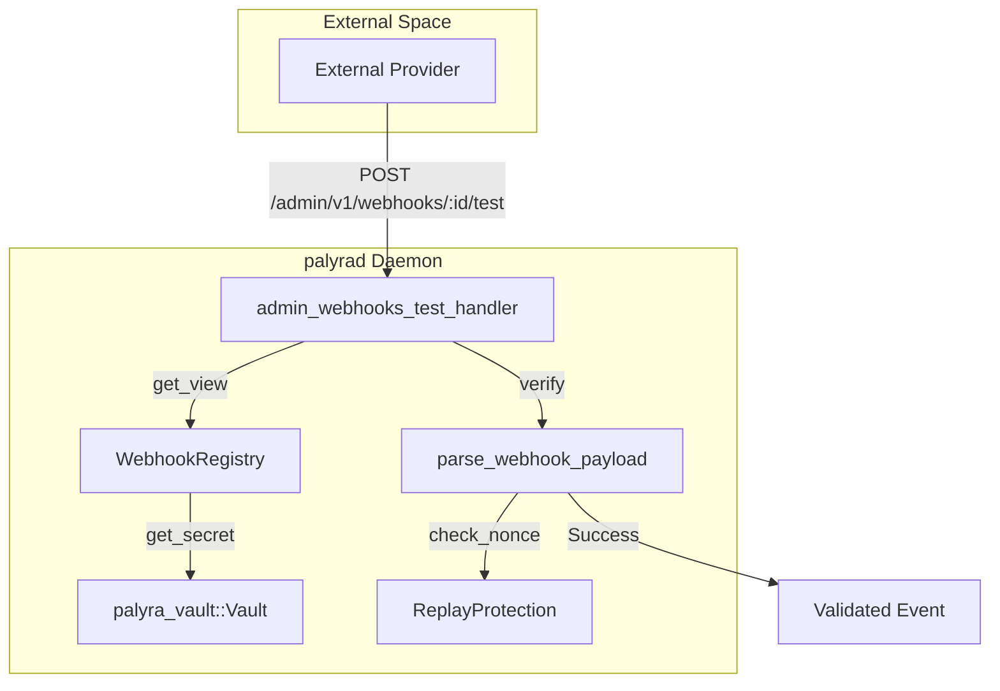
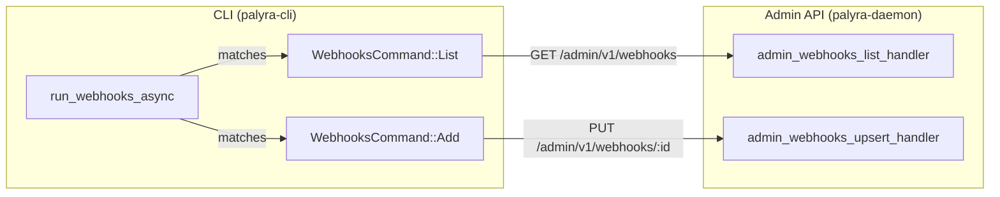

# Webhooks

Relevant source files

The following files were used as context for generating this wiki page:

- crates/palyra-cli/src/args/webhooks.rs
- crates/palyra-cli/src/commands/channels/mod.rs
- crates/palyra-cli/src/commands/webhooks.rs
- crates/palyra-cli/tests/help_snapshots/webhooks-help.txt
- crates/palyra-common/src/process_runner_input.rs
- crates/palyra-connector-core/src/storage.rs
- crates/palyra-connector-core/src/supervisor.rs
- crates/palyra-daemon/src/transport/http/handlers/admin/channels/connectors/discord.rs
- crates/palyra-daemon/src/transport/http/handlers/admin/channels/mod.rs
- crates/palyra-daemon/src/transport/http/handlers/console/channels/connectors/discord.rs
- crates/palyra-daemon/src/webhooks.rs
- fuzz/Cargo.lock
- fuzz/Cargo.toml
- fuzz/fuzz_targets/process_runner_input_parser.rs
- fuzz/fuzz_targets/workspace_patch_parser.rs

The Webhook subsystem in Palyra provides a mechanism for receiving and verifying asynchronous event notifications from external providers (e.g., GitHub, Stripe, or custom services). It is designed with a "security-first" approach, incorporating mandatory payload verification, nonce-based replay protection, and strict resource limits to prevent Denial-of-Service (DoS) attacks via large payloads.

## Architecture and Data Flow

The webhook subsystem is managed by the `WebhookRegistry`, which persists configuration in a TOML-based registry file. Incoming payloads are processed through a pipeline that validates the source, verifies cryptographic signatures, and checks for replay attacks before the data is passed to the internal orchestrator.

### Webhook Processing Pipeline

The following diagram illustrates the flow of a webhook payload from an external provider through the `palyrad` daemon.

**Webhook Ingestion Flow**

Sources: [crates/palyra-daemon/src/webhooks.rs#107-111](http://crates/palyra-daemon/src/webhooks.rs#107-111), [crates/palyra-daemon/src/webhooks.rs#189-216](http://crates/palyra-daemon/src/webhooks.rs#189-216), [crates/palyra-common/src/lib.rs#9-9](http://crates/palyra-common/src/lib.rs#9-9) (referenced as `parse_webhook_payload`).

## Webhook Registry

The `WebhookRegistry` manages the lifecycle of webhook integrations. It stores metadata such as provider types, allowed event lists, and references to secrets stored in the `palyra-vault`.

### Key Components
| Entity | Description |
| :--- | :--- |
| `WebhookRegistry` | The central manager for webhook configurations, utilizing a `Mutex<RegistryDocument>` for thread-safe access [crates/palyra-daemon/src/webhooks.rs#107-111](http://crates/palyra-daemon/src/webhooks.rs#107-111). |
| `WebhookIntegrationRecord` | The persistent data structure representing a single webhook, including its ID, provider, and security settings [crates/palyra-daemon/src/webhooks.rs#51-72](http://crates/palyra-daemon/src/webhooks.rs#51-72). |
| `REGISTRY_FILE` | The file name (`webhooks.toml`) where configurations are persisted within the state root [crates/palyra-daemon/src/webhooks.rs#16-16](http://crates/palyra-daemon/src/webhooks.rs#16-16). |

### Configuration Constraints
To ensure system stability, the registry enforces several hard limits:
* **Max Webhooks:** 1,024 integrations [crates/palyra-daemon/src/webhooks.rs#17-17](http://crates/palyra-daemon/src/webhooks.rs#17-17).
* **Max Payload Size:** Default 64 KB, with a hard limit of 1 MB [crates/palyra-daemon/src/webhooks.rs#23-24](http://crates/palyra-daemon/src/webhooks.rs#23-24).
* **Identifier Length:** Max 64 bytes for IDs and provider names [crates/palyra-daemon/src/webhooks.rs#18-19](http://crates/palyra-daemon/src/webhooks.rs#18-19).

Sources: [crates/palyra-daemon/src/webhooks.rs#15-24](http://crates/palyra-daemon/src/webhooks.rs#15-24), [crates/palyra-daemon/src/webhooks.rs#52-72](http://crates/palyra-daemon/src/webhooks.rs#52-72).

## Security and Verification

Security is enforced through three primary mechanisms: Vault-backed secrets, signature verification, and replay protection.

### Payload Verification
The system uses `palyra_common::parse_webhook_payload` to validate incoming data. If `signature_required` is set to `true` in the `WebhookIntegrationRecord`, the daemon retrieves the signing key from the `Vault` using the `secret_vault_ref` [crates/palyra-daemon/src/webhooks.rs#56-62](http://crates/palyra-daemon/src/webhooks.rs#56-62).

### Replay Protection
Palyra implements nonce-based replay protection to prevent attackers from re-sending intercepted valid webhook payloads. This is documented as a core requirement for the subsystem and is tested via specific fuzz targets [fuzz/Cargo.toml#75-79](http://fuzz/Cargo.toml#75-79).

### Webhook Readiness
An integration is considered "Ready" only if its secret is present in the vault and no configuration issues (like invalid filters) are detected [crates/palyra-daemon/src/webhooks.rs#75-86](http://crates/palyra-daemon/src/webhooks.rs#75-86).

Sources: [crates/palyra-daemon/src/webhooks.rs#41-43](http://crates/palyra-daemon/src/webhooks.rs#41-43), [crates/palyra-daemon/src/webhooks.rs#75-86](http://crates/palyra-daemon/src/webhooks.rs#75-86), [fuzz/Cargo.toml#75-79](http://fuzz/Cargo.toml#75-79).

## Management Interfaces

Webhooks can be managed via the `palyra` CLI or the Admin API.

### CLI Commands
The `palyra webhooks` command group provides full CRUD capabilities:
* `add`: Registers a new integration with filters for `allowed_events` and `allowed_sources` [crates/palyra-cli/src/commands/webhooks.rs#36-63](http://crates/palyra-cli/src/commands/webhooks.rs#36-63).
* `list`: Retrieves all configured webhooks, with optional filtering by provider or status [crates/palyra-cli/src/commands/webhooks.rs#21-31](http://crates/palyra-cli/src/commands/webhooks.rs#21-31).
* `test`: Manually triggers a verification check using a provided payload from `stdin` or a file [crates/palyra-cli/src/commands/webhooks.rs#100-131](http://crates/palyra-cli/src/commands/webhooks.rs#100-131).

### Admin API
The daemon exposes Axum handlers for webhook operations:
* `admin_webhooks_list_handler`: Lists integrations.
* `admin_webhooks_test_handler`: Accepts a base64 encoded payload and returns a `WebhookIntegrationTestOutcome` [crates/palyra-daemon/src/webhooks.rs#46-49](http://crates/palyra-daemon/src/webhooks.rs#46-49).

**CLI to API Mapping**

Sources: [crates/palyra-cli/src/commands/webhooks.rs#17-132](http://crates/palyra-cli/src/commands/webhooks.rs#17-132), [crates/palyra-daemon/src/webhooks.rs#189-216](http://crates/palyra-daemon/src/webhooks.rs#189-216).

## Fuzzing and Robustness

To ensure the parser is resilient against malformed or malicious inputs, the codebase includes dedicated fuzz targets in the `fuzz/` directory:

* **`webhook_payload_parser`**: Targets the core JSON parsing and field validation logic [fuzz/Cargo.toml#33-37](http://fuzz/Cargo.toml#33-37).
* **`webhook_replay_verifier`**: Specifically tests the nonce/timestamp window logic to ensure the replay protection cannot be bypassed [fuzz/Cargo.toml#75-79](http://fuzz/Cargo.toml#75-79).

These targets use `libfuzzer-sys` to provide arbitrary byte arrays to the `palyra-common` parsing functions.

Sources: [fuzz/Cargo.toml#33-37](http://fuzz/Cargo.toml#33-37), [fuzz/Cargo.toml#75-79](http://fuzz/Cargo.toml#75-79).
