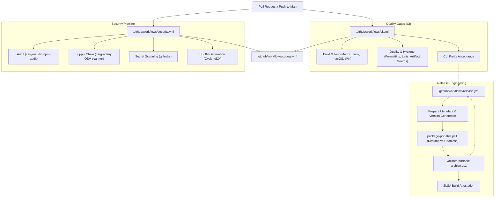
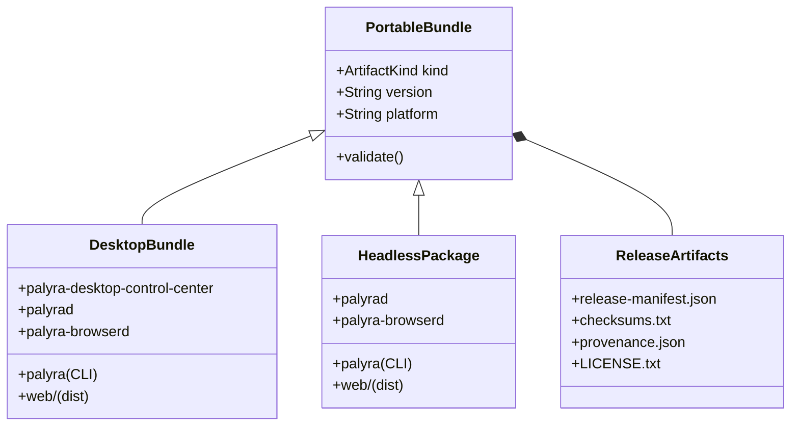

# CI/CD, Release Engineering, and Security Gates

Relevant source files

The following files were used as context for generating this wiki page:

- .github/codeql/codeql-config.yml
- .github/workflows/ci.yml
- .github/workflows/codeql.yml
- .github/workflows/dependency-review.yml
- .github/workflows/release.yml
- .github/workflows/security.yml
- crates/palyra-cli/src/commands/docs.rs
- scripts/release/common.ps1
- scripts/release/install-desktop-package.ps1
- scripts/release/install-headless-package.ps1
- scripts/release/package-portable.ps1
- scripts/release/validate-portable-archive.ps1
- scripts/test/run-release-smoke.ps1

This section provides an overview of the Palyra automation suite, which ensures code quality, supply chain security, and reproducible release distribution across Linux, macOS, and Windows. The pipeline is built primarily on GitHub Actions and a suite of specialized PowerShell and Bash scripts designed for cross-platform consistency.

The automation strategy is divided into three primary pillars:
1.  **Continuous Integration (CI):** Multi-platform build and test matrices.
2.  **Security Gates:** Deep supply chain analysis and static secret scanning.
3.  **Release Engineering:** Packaging of portable desktop and headless bundles with build provenance.

### Pipeline Orchestration Overview

The following diagram illustrates how code changes flow through the automated gates from pull request to final release artifact.

**Workflow Integration Map**

**Sources:** [.github/workflows/ci.yml#1-16](http://.github/workflows/ci.yml#1-16), [.github/workflows/security.yml#1-11](http://.github/workflows/security.yml#1-11), [.github/workflows/release.yml#1-29](http://.github/workflows/release.yml#1-29), [.github/workflows/codeql.yml#1-18](http://.github/workflows/codeql.yml#1-18)

---

### Continuous Integration Pipeline
The CI pipeline enforces a strict "no-regression" policy across the supported platform matrix. It pins the Rust toolchain to version `1.91.0` [[.github/workflows/ci.yml#31-31](http://[.github/workflows/ci.yml#31-31)] and utilizes a specialized `Vite+` setup for web components [[.github/workflows/ci.yml#35-39](http://[.github/workflows/ci.yml#35-39)].

Key quality jobs include:
*   **Multi-Platform Matrix:** Concurrent builds on `ubuntu-latest`, `macos-latest`, and `windows-latest` [[.github/workflows/ci.yml#18-23](http://[.github/workflows/ci.yml#18-23)].
*   **Artifact Hygiene:** Scripts like `check-no-vendored-artifacts.sh` and `check-runtime-artifacts.sh` prevent accidental commits of binary blobs or local database files [[.github/workflows/ci.yml#182-186](http://[.github/workflows/ci.yml#182-186)].
*   **CLI Parity:** A dedicated job ensures that the `palyra` CLI maintains feature parity across platforms by generating and validating a parity matrix [[.github/workflows/ci.yml#213-230](http://[.github/workflows/ci.yml#213-230)].

For details, see [Continuous Integration Pipeline](continuous_integration_pipeline/README.md).

---

### Security Gates and Supply Chain
Palyra employs a defense-in-depth approach to the software supply chain. Every change is subjected to multiple scanners to detect vulnerabilities in dependencies and hardcoded secrets.

The security workflow incorporates:
*   **Dependency Auditing:** Uses `cargo-audit` for Rust crates and `npm audit` for the web dashboard, with a custom allowlist for dev-only advisories [[.github/workflows/security.yml#30-64](http://[.github/workflows/security.yml#30-64), [.github/workflows/security.yml#95-96](http://.github/workflows/security.yml#95-96)].
*   **Vulnerability Scanning:** Integrates Google's `osv-scanner` and `cargo-deny` to enforce license compliance and block known-vulnerable crate versions [[.github/workflows/security.yml#98-104](http://[.github/workflows/security.yml#98-104)].
*   **Static Analysis:** Continuous `gitleaks` detection [[.github/workflows/security.yml#120-123](http://[.github/workflows/security.yml#120-123)] and scheduled CodeQL analysis for Rust and JavaScript [[.github/workflows/codeql.yml#19-25](http://[.github/workflows/codeql.yml#19-25)].
*   **SBOM:** Automatic generation of CycloneDX Software Bill of Materials (SBOM) for every release [[.github/workflows/security.yml#131-132](http://[.github/workflows/security.yml#131-132)].

For details, see [Security Gates and Supply Chain](security_gates_and_supply_chain/README.md).

---

### Release Engineering and Distribution
Release engineering transforms the compiled binaries into distributable "Portable Bundles." The system distinguishes between a **Desktop Portable Bundle** (including the Tauri-based Control Center) and a **Headless Portable Package** (optimized for server/CLI usage) [[scripts/release/package-portable.ps1#28-33](http://[scripts/release/package-portable.ps1#28-33)].

The release process includes:
*   **Version Coherence:** The `assert-version-coherence.ps1` script ensures the repository version matches the release tag [[.github/workflows/release.yml#45-45](http://[.github/workflows/release.yml#45-45)].
*   **Automated Packaging:** The `package-portable.ps1` script assembles binaries, web assets, and documentation into platform-specific ZIP archives [[scripts/release/package-portable.ps1#9-16](http://[scripts/release/package-portable.ps1#9-16)].
*   **Archive Validation:** Every package is inspected by `validate-portable-archive.ps1` to ensure it contains required binaries (e.g., `palyrad`, `palyra-browserd`, `palyra`) and is free of forbidden runtime artifacts like `.sqlite` or `.log` files [[scripts/release/validate-portable-archive.ps1#47-69](http://[scripts/release/validate-portable-archive.ps1#47-69)].
*   **Smoke Testing:** A comprehensive `run-release-smoke.ps1` script performs a full install/uninstall cycle of the packaged archives to verify CLI exposure and command resolution [[scripts/test/run-release-smoke.ps1#40-109](http://[scripts/test/run-release-smoke.ps1#40-109)].

**Release Entity Relationship**

**Sources:** [scripts/release/package-portable.ps1#28-61](http://scripts/release/package-portable.ps1#28-61), [scripts/release/validate-portable-archive.ps1#29-57](http://scripts/release/validate-portable-archive.ps1#29-57), [scripts/release/common.ps1#33-60](http://scripts/release/common.ps1#33-60)

For details, see [Release Packaging and Distribution](release_packaging_and_distribution/README.md).

## Child Pages

- [Continuous Integration Pipeline](continuous_integration_pipeline/README.md)
- [Security Gates and Supply Chain](security_gates_and_supply_chain/README.md)
- [Release Packaging and Distribution](release_packaging_and_distribution/README.md)
