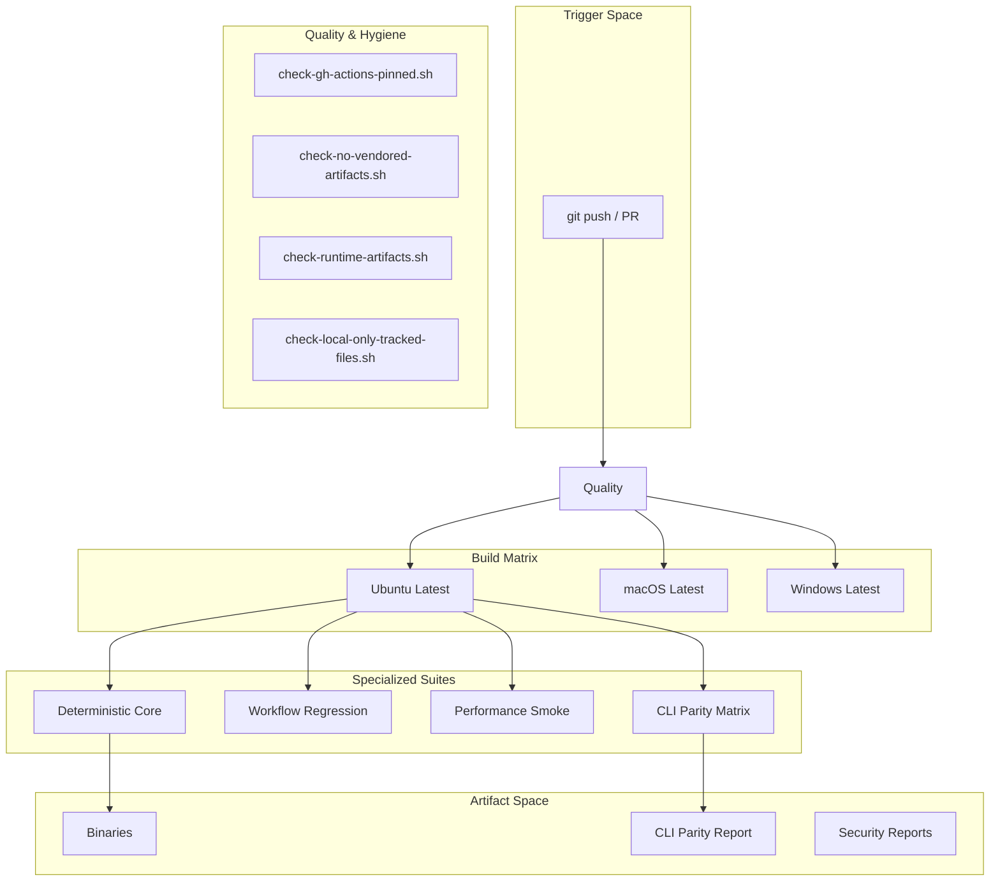
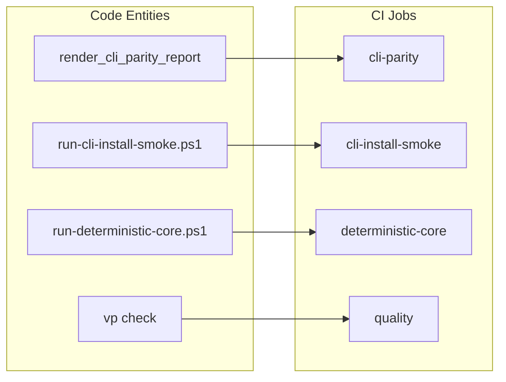

# Continuous Integration Pipeline

Relevant source files

The following files were used as context for generating this wiki page:

- .github/codeql/codeql-config.yml
- .github/workflows/ci.yml
- .github/workflows/cli-full-regression.yml
- .github/workflows/cli-install-smoke.yml
- .github/workflows/codeql.yml
- .github/workflows/dependency-review.yml
- .github/workflows/release.yml
- .github/workflows/security.yml
- crates/palyra-cli/examples/emit_cli_install_smoke_inventory.rs
- crates/palyra-cli/tests/installed_smoke.rs
- crates/palyra-cli/tests/support/bin_under_test.rs
- crates/palyra-cli/tests/support/cli_harness.rs
- crates/palyra-cli/tests/support/mod.rs
- scripts/test/run-cli-install-smoke.ps1
- scripts/test/run-cli-install-smoke.sh
- scripts/test/run-deterministic-core.ps1
- scripts/test/run-deterministic-core.sh
- scripts/test/run-performance-smoke.ps1
- scripts/test/run-workflow-regression.ps1
- scripts/test/run-workflow-regression.sh
- scripts/test/update-deterministic-fixtures.sh

The Palyra Continuous Integration (CI) pipeline is a multi-layered automation suite designed to ensure cross-platform binary compatibility, protocol integrity, and supply chain security. The pipeline is primarily defined in `.github/workflows/ci.yml` and supported by specialized workflows for security scanning, release regression, and static analysis.

## Pipeline Overview

The CI environment enforces a strict toolchain policy, pinning the Rust compiler to version `1.91.0` [.github/workflows/ci.yml#31](http://.github/workflows/ci.yml#31) and utilizing Node.js for web-related tasks via the `.node-version` file [.github/workflows/ci.yml#37](http://.github/workflows/ci.yml#37).

### Data Flow and Job Hierarchy

The following diagram illustrates the flow of a typical CI run from code push to artifact generation.

**CI Workflow Data Flow**

**Sources:** [.github/workflows/ci.yml#16-235](http://.github/workflows/ci.yml#16-235), [.github/workflows/security.yml#12-156](http://.github/workflows/security.yml#12-156)

---

## Multi-Platform Build Matrix

Palyra utilizes a strategy matrix to validate the workspace across Linux, macOS, and Windows [.github/workflows/ci.yml#20-23](http://.github/workflows/ci.yml#20-23).

### Rust and Web Environment
Every job in the matrix performs the following setup:
1.  **Toolchain Pinning:** Installs Rust `1.91.0` with `rustfmt` and `clippy` [.github/workflows/ci.yml#28-32](http://.github/workflows/ci.yml#28-32).
2.  **Vite+ Setup:** Uses a custom action `./.github/actions/setup-vp-safe` to prepare the Node environment and install dependencies [.github/workflows/ci.yml#34-39](http://.github/workflows/ci.yml#34-39).
3.  **UI Preparation:** Executes `ensure-desktop-ui.ps1` to ensure web assets are available for the Tauri-based desktop build [.github/workflows/ci.yml#41-43](http://.github/workflows/ci.yml#41-43).

### Desktop Linux Regressions
Because Linux desktop builds involve complex system dependencies (GTK3, WebKit2GTK, etc.), a dedicated `desktop-linux-release-regression` job is used [.github/workflows/ci.yml#51-87](http://.github/workflows/ci.yml#51-87). It installs `libgtk-3-dev`, `libwebkit2gtk-4.1-dev`, and `libayatana-appindicator3-dev` before running tests in `--release` mode [.github/workflows/ci.yml#70-87](http://.github/workflows/ci.yml#70-87).

**Sources:** [.github/workflows/ci.yml#17-88](http://.github/workflows/ci.yml#17-88)

---

## Quality Hygiene and Scripts

The `quality` job [.github/workflows/ci.yml#172](http://.github/workflows/ci.yml#172) runs a series of specialized bash scripts to maintain repository health and prevent the accidental inclusion of sensitive or redundant files.

| Script | Purpose | File Reference |
| :--- | :--- | :--- |
| `check-gh-actions-pinned.sh` | Ensures all GitHub Actions use SHA hashes instead of mutable tags. | [.github/workflows/ci.yml#180](http://.github/workflows/ci.yml#180) |
| `check-no-vendored-artifacts.sh` | Prevents checking in third-party binaries or large vendored blobs. | [.github/workflows/ci.yml#183](http://.github/workflows/ci.yml#183) |
| `check-runtime-artifacts.sh` | Validates that no temporary runtime files (DBs, logs) are tracked. | [.github/workflows/ci.yml#186](http://.github/workflows/ci.yml#186) |
| `check-local-only-tracked-files.sh` | Blocks tracking of files intended only for local development. | [.github/workflows/ci.yml#189](http://.github/workflows/ci.yml#189) |
| `vp check` | Runs Vite+ validation across `apps/web`, `apps/desktop/ui`, and `apps/browser-extension`. | [.github/workflows/ci.yml#204-205](http://.github/workflows/ci.yml#204-205) |

**Sources:** [.github/workflows/ci.yml#172-212](http://.github/workflows/ci.yml#172-212)

---

## Protocol and CLI Validation

To prevent schema drift and ensure the CLI remains consistent across versions, the CI includes specific validation jobs.

### CLI Parity Matrix
The `cli-parity` job generates a report using the `render_cli_parity_report` example [.github/workflows/ci.yml#225-226](http://.github/workflows/ci.yml#225-226). This compares the current CLI implementation against `cli_parity_matrix.toml` to ensure all commands are documented and functional [crates/palyra-cli/examples/emit_cli_install_smoke_inventory.rs#22-33](http://crates/palyra-cli/examples/emit_cli_install_smoke_inventory.rs#22-33).

### CLI Install Smoke
The `CLI install smoke` workflow [.github/workflows/cli-install-smoke.yml#1](http://.github/workflows/cli-install-smoke.yml#1) executes `run-cli-install-smoke.ps1` [.github/workflows/cli-install-smoke.yml#46](http://.github/workflows/cli-install-smoke.yml#46). This script:
1.  Creates a sandboxed `ScenarioContext` with isolated config, state, and vault directories [scripts/test/run-cli-install-smoke.ps1#41-83](http://scripts/test/run-cli-install-smoke.ps1#41-83).
2.  Runs non-interactive `setup` and `onboarding wizard` flows [crates/palyra-cli/tests/installed_smoke.rs#151-205](http://crates/palyra-cli/tests/installed_smoke.rs#151-205).
3.  Validates the `palyra doctor` output and protocol versioning [crates/palyra-cli/tests/installed_smoke.rs#72-84](http://crates/palyra-cli/tests/installed_smoke.rs#72-84).

**Sources:** [.github/workflows/ci.yml#213-236](http://.github/workflows/ci.yml#213-236), [scripts/test/run-cli-install-smoke.ps1#41-83](http://scripts/test/run-cli-install-smoke.ps1#41-83), [crates/palyra-cli/tests/installed_smoke.rs#38-205](http://crates/palyra-cli/tests/installed_smoke.rs#38-205)

---

## Security and Static Analysis

### CodeQL
The CodeQL workflow [.github/workflows/codeql.yml#1](http://.github/workflows/codeql.yml#1) is scheduled weekly [.github/workflows/codeql.yml#10](http://.github/workflows/codeql.yml#10) and runs on every push to `main`. It analyzes `actions`, `javascript-typescript`, and `rust` [.github/workflows/codeql.yml#25](http://.github/workflows/codeql.yml#25). Notably, it uses `build-mode: none` for Rust to keep analysis lightweight [.github/workflows/codeql.yml#44](http://.github/workflows/codeql.yml#44).

### Security Gates
The `security-gates` job in `security.yml` [.github/workflows/security.yml#12](http://.github/workflows/security.yml#12) performs a comprehensive audit of the supply chain:
*   **Rust Audit:** `cargo audit` and `cargo deny check` [.github/workflows/security.yml#95-99](http://.github/workflows/security.yml#95-99).
*   **Vulnerability Scanning:** `osv-scanner` for both Rust and NPM dependencies [.github/workflows/security.yml#101-104](http://.github/workflows/security.yml#101-104).
*   **Secret Scanning:** `gitleaks` detects committed secrets using SARIF reporting [.github/workflows/security.yml#120-123](http://.github/workflows/security.yml#120-123).
*   **NPM Governance:** Validates an allowlist of dev-only vulnerabilities using `validate-npm-audit-dev-allowlist.mjs` [.github/workflows/security.yml#56-63](http://.github/workflows/security.yml#56-63).
*   **SBOM Generation:** Produces CycloneDX Software Bill of Materials [.github/workflows/security.yml#131-132](http://.github/workflows/security.yml#131-132).

**CI Entity Association Map**

**Sources:** [.github/workflows/codeql.yml#1-48](http://.github/workflows/codeql.yml#1-48), [.github/workflows/security.yml#30-156](http://.github/workflows/security.yml#30-156), [.github/workflows/ci.yml#89-122](http://.github/workflows/ci.yml#89-122)
