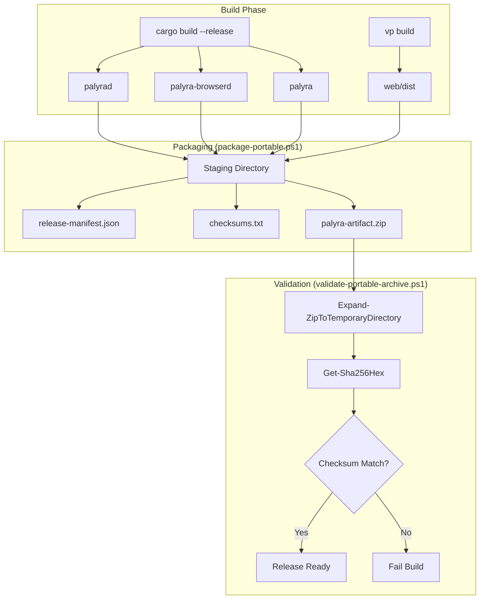

# Release Packaging and Distribution

Relevant source files

The following files were used as context for generating this wiki page:

- .github/codeql/codeql-config.yml
- .github/workflows/ci.yml
- .github/workflows/codeql.yml
- .github/workflows/dependency-review.yml
- .github/workflows/release.yml
- .github/workflows/security.yml
- crates/palyra-cli/src/commands/docs.rs
- scripts/release/common.ps1
- scripts/release/install-desktop-package.ps1
- scripts/release/install-headless-package.ps1
- scripts/release/package-portable.ps1
- scripts/release/uninstall-package.ps1
- scripts/release/validate-portable-archive.ps1
- scripts/test/install-clean-desktop.ps1
- scripts/test/run-release-smoke.ps1
- scripts/test/uninstall-clean-desktop.ps1

The Palyra release workflow ensures version coherence across all crates and platforms, automates the creation of portable bundles, and validates the integrity of distributed artifacts through SHA256 manifests and SLSA-compliant provenance. The system distinguishes between **Portable Desktop Bundles** (GUI-focused) and **Portable Headless Bundles** (server-focused), providing standardized install and uninstall scripts for both.

## Release Workflow Overview

The release process is triggered either by a version tag (`v*`) or manually via `workflow_dispatch` in GitHub Actions [[.github/workflows/release.yml#3-17](http://[.github/workflows/release.yml#3-17)] .

### Version Coherence Assertion
Before packaging begins, the system executes `assert-version-coherence.ps1` to ensure that the version defined in the repository metadata matches the requested release tag [[.github/workflows/release.yml#45-49](http://[.github/workflows/release.yml#45-49)] . This prevents "skewed" releases where the CLI, daemon, and desktop app report different versions.

### Build and Package Matrix
The release pipeline targets three primary operating systems:
*   **Linux** (`ubuntu-latest`)
*   **macOS** (`macos-latest`)
*   **Windows** (`windows-latest`)

For each platform, the workflow builds the core binaries (`palyrad`, `palyra-browserd`, `palyra`) and the Tauri-based desktop control center [[.github/workflows/release.yml#165-170](http://[.github/workflows/release.yml#165-170)] .

**Sources:** [[.github/workflows/release.yml#1-170](http://[.github/workflows/release.yml#1-170)]

---

## Artifact Bundling

Palyra distributes two primary artifact kinds via `package-portable.ps1` [[scripts/release/package-portable.ps1#1-16](http://[scripts/release/package-portable.ps1#1-16)] .

### Portable Desktop Bundle vs. Portable Headless Bundle

| Component | Desktop Bundle | Headless Bundle |
| :--- | :---: | :---: |
| `palyra-desktop-control-center` | Yes | No |
| `palyrad` (Daemon) | Yes | Yes |
| `palyra-browserd` (Browser) | Yes | Yes |
| `palyra` (CLI) | Yes | Yes |
| `web/` (Dashboard Dist) | Yes | Yes |
| `docs/` (Markdown/Snapshots) | Yes | Yes |
| `LICENSE.txt` | Yes | Yes |

### Packaging Logic (`package-portable.ps1`)
The packaging script creates a staging directory and populates it with:
1.  **Binaries**: Resolved via `Resolve-ExecutableName` to handle `.exe` extensions on Windows [[scripts/release/common.ps1#20-31](http://[scripts/release/common.ps1#20-31)] .
2.  **Web Assets**: The compiled React dashboard from `apps/web/dist` [[scripts/release/package-portable.ps1#54-61](http://[scripts/release/package-portable.ps1#54-61)] .
3.  **Documentation**: Bundled operator docs and CLI help snapshots used by the `palyra docs` command [[scripts/release/package-portable.ps1#50-53](http://[scripts/release/package-portable.ps1#50-53)] [[crates/palyra-cli/src/commands/docs.rs#11-14](http://[crates/palyra-cli/src/commands/docs.rs#11-14)] .
4.  **Metadata**: A `release-manifest.json` containing the version, platform slug (e.g., `linux-x64`), and artifact kind [[scripts/release/package-portable.ps1#28-33](http://[scripts/release/package-portable.ps1#28-33)] .

**Sources:** [[scripts/release/package-portable.ps1#1-95](http://[scripts/release/package-portable.ps1#1-95)] , [[scripts/release/common.ps1#20-60](http://[scripts/release/common.ps1#20-60)] , [[crates/palyra-cli/src/commands/docs.rs#11-14](http://[crates/palyra-cli/src/commands/docs.rs#11-14)]

---

## Validation and Provenance

To ensure supply chain security, every release undergoes rigorous validation and attestation.

### SHA256 Manifests
The packaging script generates a `checksums.txt` file containing the SHA256 hash of every file in the payload [[scripts/release/package-portable.ps1#215-225](http://[scripts/release/package-portable.ps1#215-225)] . During installation or smoke testing, `validate-portable-archive.ps1` recalculates these hashes and compares them against the manifest [[scripts/release/validate-portable-archive.ps1#94-111](http://[scripts/release/validate-portable-archive.ps1#94-111)] .

### Archive Validation
The `validate-portable-archive.ps1` script performs several safety checks:
*   **Path Traversal Guard**: Ensures no files in the ZIP attempt to extract outside the target directory [[scripts/release/common.ps1#209-245](http://[scripts/release/common.ps1#209-245)] .
*   **Forbidden Artifact Scan**: Blocks the inclusion of runtime-generated files like `.sqlite`, `.log`, or `node_modules` in the release package [[scripts/release/validate-portable-archive.ps1#59-92](http://[scripts/release/validate-portable-archive.ps1#59-92)] .
*   **Structure Verification**: Confirms all required binaries and the `web/index.html` exist [[scripts/release/validate-portable-archive.ps1#39-57](http://[scripts/release/validate-portable-archive.ps1#39-57)] .

### Provenance Sidecar
A `.provenance.json` (or build attestation) is generated to link the built artifact back to the specific GitHub Actions run and source commit [[.github/workflows/security.yml#147-149](http://[.github/workflows/security.yml#147-149)] [[.github/workflows/release.yml#21-22](http://[.github/workflows/release.yml#21-22)] .

**Sources:** [[scripts/release/package-portable.ps1#215-225](http://[scripts/release/package-portable.ps1#215-225)] , [[scripts/release/validate-portable-archive.ps1#1-111](http://[scripts/release/validate-portable-archive.ps1#1-111)] , [[scripts/release/common.ps1#209-245](http://[scripts/release/common.ps1#209-245)]

---

## Installation and Lifecycle

Palyra provides PowerShell-based installers that manage the setup of binaries, configuration, and system integration.

### Install Logic Flow
The installers (`install-headless-package.ps1` and `install-desktop-package.ps1`) follow a standardized sequence:

1.  **Extraction**: Unpacks the archive to the `InstallRoot` [[scripts/release/install-headless-package.ps1#29](http://[scripts/release/install-headless-package.ps1#29)] .
2.  **Permissions**: Sets executable bits on binaries [[scripts/release/install-headless-package.ps1#43-45](http://[scripts/release/install-headless-package.ps1#43-45)] .
3.  **CLI Exposure**: Creates a shim or symlink for the `palyra` command so it is available on the user's `PATH` [[scripts/release/install-headless-package.ps1#47-50](http://[scripts/release/install-headless-package.ps1#47-50)] .
4.  **Configuration**: For headless installs, runs `palyra setup` to initialize the `palyra.toml` config [[scripts/release/install-headless-package.ps1#61-62](http://[scripts/release/install-headless-package.ps1#61-62)] .
5.  **Service Integration**: On Linux, generates a `systemd` unit file (`palyrad.service`) pointing to the specific `InstallRoot` and `StateRoot` [[scripts/release/install-headless-package.ps1#88-112](http://[scripts/release/install-headless-package.ps1#88-112)] .

### Code-to-Entity Release Mapping

The following diagram maps the release script entities to the resulting filesystem structure.

**Release Packaging Data Flow**

**Sources:** [[scripts/release/package-portable.ps1#23-95](http://[scripts/release/package-portable.ps1#23-95)] , [[scripts/release/validate-portable-archive.ps1#23-111](http://[scripts/release/validate-portable-archive.ps1#23-111)]

---

## Release Smoke Testing

Before a release is finalized, `run-release-smoke.ps1` executes a full lifecycle test on the packaged artifacts [[scripts/test/run-release-smoke.ps1#1-6](http://[scripts/test/run-release-smoke.ps1#1-6)] .

### Smoke Test Sequence
1.  **Package**: Runs `package-portable.ps1` for both desktop and headless kinds [[scripts/test/run-release-smoke.ps1#152-169](http://[scripts/test/run-release-smoke.ps1#152-169)] .
2.  **Install**: Executes `install-headless-package.ps1` to a temporary directory [[scripts/test/run-release-smoke.ps1#182-191](http://[scripts/test/run-release-smoke.ps1#182-191)] .
3.  **Verify**: Calls `Invoke-InstalledCliSmoke`, which tests:
    *   `palyra version` and `--help` [[scripts/test/run-release-smoke.ps1#84-85](http://[scripts/test/run-release-smoke.ps1#84-85)] .
    *   `palyra doctor --json` for environment health [[scripts/test/run-release-smoke.ps1#86](http://[scripts/test/run-release-smoke.ps1#86)] .
    *   `palyra docs search` to ensure documentation was bundled correctly [[scripts/test/run-release-smoke.ps1#87-91](http://[scripts/test/run-release-smoke.ps1#87-91)] .
    *   Dry-runs of `update` and `uninstall` [[scripts/test/run-release-smoke.ps1#95-108](http://[scripts/test/run-release-smoke.ps1#95-108)] .

**Sources:** [[scripts/test/run-release-smoke.ps1#1-191](http://[scripts/test/run-release-smoke.ps1#1-191)]

---

## Supply Chain Security Gates

Release packaging is the final stage of a multi-tiered security pipeline defined in `security.yml` [[.github/workflows/security.yml#1-11](http://[.github/workflows/security.yml#1-11)] .

| Tool | Purpose | File Reference |
| :--- | :--- | :--- |
| `cargo-audit` | Checks for vulnerabilities in Rust dependencies | [[.github/workflows/security.yml#95-96](http://[.github/workflows/security.yml#95-96)] |
| `cargo-deny` | Enforces license policies and bans specific crates | [[.github/workflows/security.yml#98-99](http://[.github/workflows/security.yml#98-99)] |
| `osv-scanner` | Scans for vulnerabilities using Google's OSV database | [[.github/workflows/security.yml#101-104](http://[.github/workflows/security.yml#101-104)] |
| `gitleaks` | Detects hardcoded secrets in the source code | [[.github/workflows/security.yml#120-123](http://[.github/workflows/security.yml#120-123)] |
| `cargo-cyclonedx` | Generates a Software Bill of Materials (SBOM) | [[.github/workflows/security.yml#131-132](http://[.github/workflows/security.yml#131-132)] |
| `npm audit` | Validates web dependencies against an allowlist | [[.github/workflows/security.yml#30-63](http://[.github/workflows/security.yml#30-63)] |

**Sources:** [[.github/workflows/security.yml#1-156](http://[.github/workflows/security.yml#1-156)]
