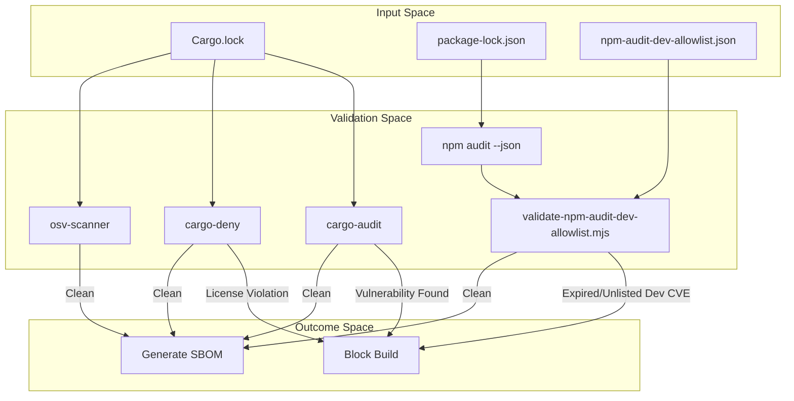
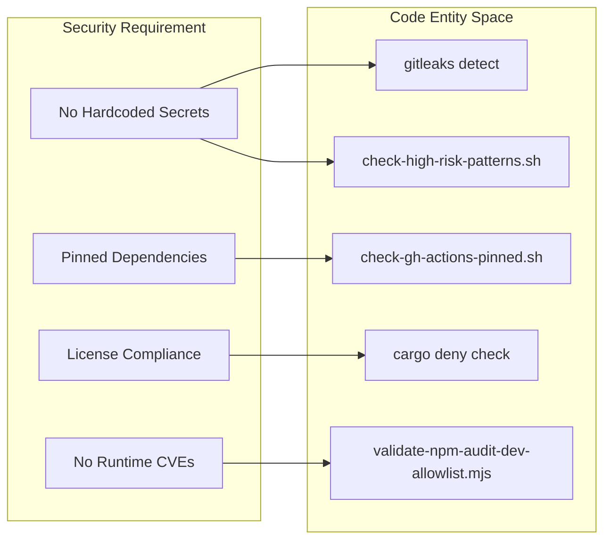

# Security Gates and Supply Chain

Relevant source files

The following files were used as context for generating this wiki page:

- .github/codeql/codeql-config.yml
- .github/workflows/ci.yml
- .github/workflows/codeql.yml
- .github/workflows/dependency-review.yml
- .github/workflows/release.yml
- .github/workflows/security.yml
- .gitleaks.toml
- CODEOWNERS
- crates/palyra-common/src/process_runner_input.rs
- fuzz/Cargo.lock
- fuzz/Cargo.toml
- fuzz/fuzz_targets/process_runner_input_parser.rs
- fuzz/fuzz_targets/workspace_patch_parser.rs
- npm-audit-dev-allowlist.json
- scripts/check-high-risk-patterns.sh
- scripts/validate-npm-audit-dev-allowlist.mjs
- scripts/validate-npm-audit-dev-allowlist.test.mjs

Palyra implements a comprehensive security and supply chain validation pipeline integrated into the CI/CD lifecycle. This workflow ensures that third-party dependencies, internal code patterns, and build artifacts meet strict security requirements before any release is finalized. The system combines automated vulnerability scanning, secret detection, and Software Bill of Materials (SBOM) generation with SLSA build provenance.

## Security Scanning Workflow

The security pipeline is primarily defined in the `security-gates` job within `.github/workflows/security.yml`. It executes a battery of tests against both the Rust and JavaScript/TypeScript codebases.

### Rust Security Gates
Palyra uses a three-tier approach to Rust dependency security:
1.  **cargo-audit**: Scans the `Cargo.lock` file for dependencies with reported security vulnerabilities in the RustSec Advisory Database [.github/workflows/security.yml#95-96](http://.github/workflows/security.yml#95-96).
2.  **cargo-deny**: Enforces a strict policy on dependency licenses, banned crates, and duplicate versions [.github/workflows/security.yml#98-99](http://.github/workflows/security.yml#98-99).
3.  **osv-scanner**: Uses Google's OSV database to provide a secondary layer of vulnerability detection across the dependency graph, outputting results to `security-artifacts/osv-results.json` [.github/workflows/security.yml#101-104](http://.github/workflows/security.yml#101-104).

### JavaScript Security Gates
The web dashboard and desktop UI dependencies are audited using `npm audit`. Because development dependencies often contain non-critical vulnerabilities that do not affect the production runtime, Palyra uses a custom allowlist mechanism:
*   **Runtime Audit**: Executes `npm audit --omit=dev` to ensure zero high-level vulnerabilities in the production bundle [.github/workflows/security.yml#30-31](http://.github/workflows/security.yml#30-31).
*   **Allowlist Validation**: The `scripts/validate-npm-audit-dev-allowlist.mjs` script compares a full audit against the runtime-only audit. Any vulnerability found in the full audit but not in the runtime audit must be explicitly documented in `npm-audit-dev-allowlist.json` with an expiration date [.github/workflows/security.yml#56-64](http://.github/workflows/security.yml#56-64).

### Data Flow: Dependency Validation
The following diagram illustrates how dependency data flows through the validation scripts to determine build success.

**Security Gate Logic Flow**

Sources: [.github/workflows/security.yml#30-104](http://.github/workflows/security.yml#30-104), [scripts/validate-npm-audit-dev-allowlist.mjs#198-248](http://scripts/validate-npm-audit-dev-allowlist.mjs#198-248), [npm-audit-dev-allowlist.json#1-5](http://npm-audit-dev-allowlist.json#1-5)

---

## Secret and Pattern Scanning

To prevent credential leakage and high-risk coding patterns, Palyra employs both industry-standard tools and custom heuristic scanners.

### Gitleaks
The pipeline runs `gitleaks` to detect hardcoded secrets, keys, and tokens across the entire repository history [.github/workflows/security.yml#120-123](http://.github/workflows/security.yml#120-123). It uses a SARIF report format for integration with GitHub's security dashboard.

### High-Risk Pattern Scan
A custom script, `scripts/check-high-risk-patterns.sh`, uses `rg` (ripgrep) or `grep` to scan for patterns that might evade standard secret scanners or represent architectural risks:
*   **Private Keys**: RSA, OPENSSH, EC, and DSA private key headers [.scripts/check-high-risk-patterns.sh#9-9](http://.scripts/check-high-risk-patterns.sh#9-9).
*   **Cloud Credentials**: AWS Access Key IDs (AKIA) and Slack tokens [.scripts/check-high-risk-patterns.sh#10-11](http://.scripts/check-high-risk-patterns.sh#10-11).
*   **Regex Heuristics**: Case-insensitive scanning for `aws_secret_access_key` assignments [.scripts/check-high-risk-patterns.sh#12-12](http://.scripts/check-high-risk-patterns.sh#12-12).

### GitHub Actions Pinning
The `scripts/check-gh-actions-pinned.sh` script (called during the `quality` job) ensures that all GitHub Actions used in workflows are pinned to specific SHA-1 hashes rather than mutable tags, preventing supply chain attacks via compromised action updates [.github/workflows/ci.yml#179-180](http://.github/workflows/ci.yml#179-180).

---

## Supply Chain Transparency

Palyra generates artifacts that allow users and automated systems to verify the integrity and composition of the software.

### SBOM Generation
The pipeline uses `cargo-cyclonedx` to generate a Software Bill of Materials in JSON format [.github/workflows/security.yml#131-132](http://.github/workflows/security.yml#131-132).
*   **Scope**: Covers all 18 internal crates and their transitive dependencies.
*   **Artifacts**: SBOM files are collected from the workspace and renamed to match their crate origin (e.g., `palyra_daemon_sbom.json`) before being uploaded as security artifacts [.github/workflows/security.yml#134-145](http://.github/workflows/security.yml#134-145).

### Build Provenance (SLSA)
During the release process, Palyra generates SLSA (Supply-chain Levels for Software Artifacts) build provenance:
*   **Attestations**: The `release.yml` workflow uses `actions/attest-build-provenance` to sign the build artifacts [.github/workflows/release.yml#22-22](http://.github/workflows/release.yml#22-22).
*   **Sidecars**: Release assets include `.provenance.json` files and SHA256 manifests, allowing offline verification of the binary's origin [.github/workflows/release.yml#87-87](http://.github/workflows/release.yml#87-87).

### Code Entity to Security Mapping
The following diagram maps security requirements to the specific scripts and files responsible for enforcing them.

**Security Policy Enforcement Map**

Sources: [.github/workflows/security.yml#120-130](http://.github/workflows/security.yml#120-130), [.github/workflows/ci.yml#179-180](http://.github/workflows/ci.yml#179-180), [scripts/check-high-risk-patterns.sh#1-37](http://scripts/check-high-risk-patterns.sh#1-37)

---

## Artifact Hygiene and Fuzzing

### Runtime Artifact Guards
The `scripts/check-runtime-artifacts.sh` script is a critical gate that prevents the accidental inclusion of build-time or local-only files in the final distribution [.github/workflows/security.yml#125-126](http://.github/workflows/security.yml#125-126). This includes checks against "local-only" tracked paths and vendored artifacts that should not be present in a clean build [.github/workflows/ci.yml#182-189](http://.github/workflows/ci.yml#182-189).

### Fuzzing
Palyra maintains a dedicated `fuzz/` directory with `libfuzzer-sys` targets to test the robustness of security-critical parsers [.fuzz/Cargo.toml#1-11](http://.fuzz/Cargo.toml#1-11).
*   **A2UI Parser**: `a2ui_json_parser` ensures the Agent-to-User Interface JSON patch protocol cannot be exploited via malformed payloads [.fuzz/Cargo.toml#26-30](http://.fuzz/Cargo.toml#26-30).
*   **Webhook Verification**: `webhook_payload_parser` and `webhook_replay_verifier` test the integrity of incoming external signals [.fuzz/Cargo.toml#33-37](http://.fuzz/Cargo.toml#33-37), [.fuzz/Cargo.toml#75-79](http://.fuzz/Cargo.toml#75-79).
*   **Redaction**: `redaction_routines` fuzzer validates that sensitive data masking cannot be bypassed [.fuzz/Cargo.toml#61-65](http://.fuzz/Cargo.toml#61-65).

Sources: [.github/workflows/security.yml#1-156](http://.github/workflows/security.yml#1-156), [.github/workflows/ci.yml#172-190](http://.github/workflows/ci.yml#172-190), [fuzz/Cargo.toml#1-82](http://fuzz/Cargo.toml#1-82), [scripts/check-high-risk-patterns.sh#1-37](http://scripts/check-high-risk-patterns.sh#1-37)
