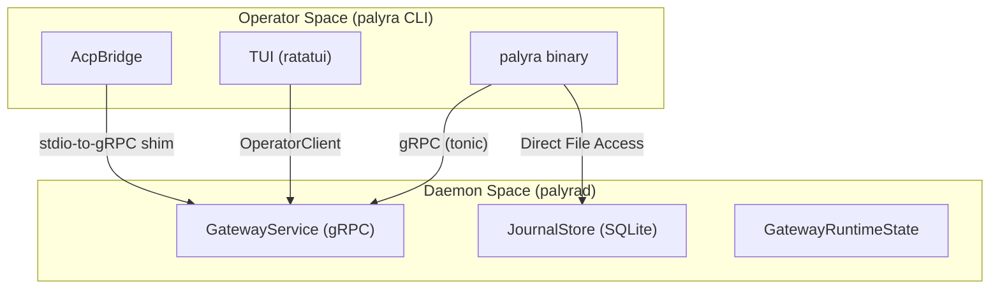

# CLI (palyra)

<details>
<summary>Relevant source files</summary>

The following files were used as context for generating this wiki page:

- crates/palyra-cli/src/args/mod.rs
- crates/palyra-cli/src/args/tests.rs
- crates/palyra-cli/src/commands/mod.rs
- crates/palyra-cli/src/lib.rs
- crates/palyra-cli/tests/help_snapshots.rs
- crates/palyra-cli/tests/help_snapshots/root-help-unix.txt
- crates/palyra-cli/tests/help_snapshots/root-help-windows.txt

</details>


The `palyra` CLI is the primary operator interface for the Palyra platform. It serves as a unified entry point for bootstrapping installations, managing the background daemon, interacting with AI agents via the Agent Control Protocol (ACP), and performing administrative tasks such as secret management and policy evaluation [crates/palyra-cli/src/args/mod.rs#109-140](http://crates/palyra-cli/src/args/mod.rs#109-140).

## High-Level Role and Communication

The CLI acts as a gRPC and HTTP client to the `palyrad` daemon. It abstracts complex multi-step workflows (like onboarding or skill auditing) into single commands. While most commands communicate with a running daemon, some (like `setup`, `init`, and `doctor`) operate directly on the local filesystem or system environment [crates/palyra-cli/src/lib.rs#77-90](http://crates/palyra-cli/src/lib.rs#77-90).

### Communication Architecture
The CLI utilizes a generated proto-client layer to interact with various daemon subsystems.


**Sources:** [crates/palyra-cli/src/lib.rs#15-59](http://crates/palyra-cli/src/lib.rs#15-59), [crates/palyra-cli/src/lib.rs#140-143](http://crates/palyra-cli/src/lib.rs#140-143), [crates/palyra-cli/src/commands/mod.rs#1-49](http://crates/palyra-cli/src/commands/mod.rs#1-49)

## Command Hierarchy

The CLI is built using `clap` and organized into a deeply nested hierarchy of subcommands. The root `Cli` struct defines global options like `--config`, `--profile`, and `--state-root` which are shared across all operations [crates/palyra-cli/src/lib.rs#76-89](http://crates/palyra-cli/src/lib.rs#76-89).

| Command Group | Purpose | Primary Entities |
| :--- | :--- | :--- |
| `setup` / `init` | Installation and environment bootstrapping. | `InitModeArg`, `InitTlsScaffoldArg` |
| `gateway` / `daemon` | Lifecycle and health of the `palyrad` process. | `JournalCheckpointModeArg` |
| `acp` | Bridge for IDEs and external tools via stdio. | `AcpBridgeArgs`, `AcpShimArgs` |
| `routines` / `cron` | Management of scheduled and event-driven tasks. | `CronScheduleTypeArg` |
| `skills` | Packaging, auditing, and installing WASM plugins. | `SkillsPackageCommand`, `SkillManifest` |
| `tui` | Interactive terminal interface for agent chat. | `TuiCommand` |

**Sources:** [crates/palyra-cli/src/args/mod.rs#46-107](http://crates/palyra-cli/src/args/mod.rs#46-107), [crates/palyra-cli/tests/help_snapshots/root-help-unix.txt#5-54](http://crates/palyra-cli/tests/help_snapshots/root-help-unix.txt#5-54)

## Subsystem Integration

The CLI maps high-level intent to specific internal crates and logic:

1.  **Identity & Security**: Commands like `pairing` and `auth` utilize `palyra-identity` for device handshakes and `palyra-auth` for credential management [crates/palyra-cli/src/lib.rs#112-115](http://crates/palyra-cli/src/lib.rs#112-115).
2.  **Vault & Secrets**: The `secrets` command interfaces with `palyra-vault` to store and retrieve encrypted sensitive data using platform-specific backends [crates/palyra-cli/src/lib.rs#122-125](http://crates/palyra-cli/src/lib.rs#122-125).
3.  **Policy Enforcement**: The `policy` command allows operators to test `Cedar` policies against specific contexts using `palyra-policy` [crates/palyra-cli/src/lib.rs#115-115](http://crates/palyra-cli/src/lib.rs#115-115).

### CLI-to-Code Mapping

The following diagram bridges the CLI command structure to the underlying Rust modules and data structures.

```mermaid
classDiagram
    class Cli {
        +RootOptions options
        +Command command
    }
    class Command {
        <<enumeration>>
        Setup
        Gateway
        Acp
        Tui
        Skills
    }
    class RootOptions {
        +PathBuf config
        +String profile
        +OutputFormat output_format
    }
    
    Cli *-- RootOptions : [crates/palyra-cli/src/lib.rs:76-89]
    Cli *-- Command : [crates/palyra-cli/src/args/mod.rs:1-45]
    Command ..> AcpBridgeArgs : "acp" [crates/palyra-cli/src/args/acp.rs]
    Command ..> SkillManifest : "skills" [crates/palyra-cli/src/lib.rs:119]
```
**Sources:** [crates/palyra-cli/src/lib.rs#76-125](http://crates/palyra-cli/src/lib.rs#76-125), [crates/palyra-cli/src/args/mod.rs#1-45](http://crates/palyra-cli/src/args/mod.rs#1-45)

## Cross-Platform Parity

To ensure consistent behavior across Linux, macOS, and Windows, the CLI uses a `CliParityMatrix`. This system compares command output snapshots (e.g., `root-help-unix.txt` vs `root-help-windows.txt`) to prevent regression in the operator experience across different operating systems [crates/palyra-cli/tests/help_snapshots.rs#4-7](http://crates/palyra-cli/tests/help_snapshots.rs#4-7).

**Sources:** [crates/palyra-cli/tests/help_snapshots.rs#75-120](http://crates/palyra-cli/tests/help_snapshots.rs#75-120), [crates/palyra-cli/tests/help_snapshots/root-help-unix.txt#1-112](http://crates/palyra-cli/tests/help_snapshots/root-help-unix.txt#1-112)

---

## Detailed Documentation

For more in-depth information on specific CLI components, refer to the following child pages:

*   **[Command Reference and Architecture](command_reference_and_architecture/README.md)**: Full documentation of the command surface, argument parsing, and the parity testing matrix.
*   **[ACP Bridge and Agent Control Protocol](acp_bridge_and_agent_control_protocol/README.md)**: Technical details on how the CLI bridges standard input/output to gRPC streams for external tool integration.
*   **[Terminal User Interface (TUI)](terminal_user_interface_tui/README.md)**: Overview of the `ratatui`-based interactive interface for managing sessions and interacting with agents.

## Child Pages

- [Command Reference and Architecture](command_reference_and_architecture/README.md)
- [ACP Bridge and Agent Control Protocol](acp_bridge_and_agent_control_protocol/README.md)
- [Terminal User Interface (TUI)](terminal_user_interface_tui/README.md)
