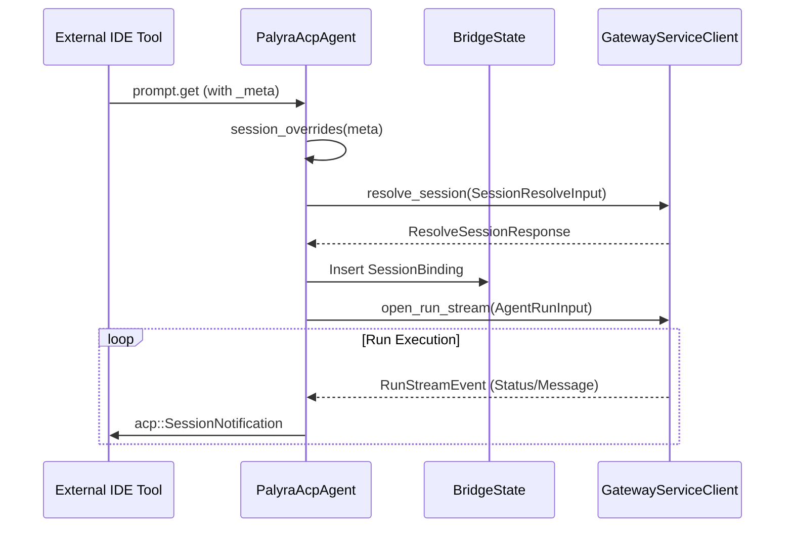

# ACP Bridge and Agent Control Protocol

<details>
<summary>Relevant source files</summary>

The following files were used as context for generating this wiki page:

- crates/palyra-cli/data/docs/README.md
- crates/palyra-cli/data/docs/architecture/README.md
- crates/palyra-cli/data/docs/architecture/browser-service-v1.md
- crates/palyra-cli/data/docs/cli-parity-migration-v1.md
- crates/palyra-cli/data/docs/cli-v1-acp-shim.md
- crates/palyra-cli/data/docs/release-engineering-v1.md
- crates/palyra-cli/data/docs/release-validation-checklist.md
- crates/palyra-cli/src/acp_bridge.rs
- crates/palyra-cli/src/args/sessions.rs
- crates/palyra-cli/src/client/operator.rs
- crates/palyra-cli/src/client/runtime.rs
- crates/palyra-cli/src/commands/agent.rs
- crates/palyra-cli/src/commands/agents.rs
- crates/palyra-cli/src/commands/sessions.rs
- crates/palyra-cli/src/commands/tui.rs
- crates/palyra-cli/src/tui/mod.rs
- crates/palyra-daemon/src/application/session_compaction.rs

</details>


The Agent Control Protocol (ACP) provides a standardized interface for external tools—such as IDE extensions, terminal multiplexers, and custom scripts—to interact with the Palyra gateway. The primary implementation is the `AcpBridge`, which translates the JSON-RPC based ACP over `stdio` into the high-performance gRPC streams used by the Palyra daemon.

## Architecture and Data Flow

The ACP Bridge acts as a protocol translator. It consumes standard input from a parent process (e.g., VS Code or Cursor), parses ACP JSON-RPC messages, and invokes corresponding methods on the `GatewayRuntimeClient`. Results and events from the gateway are then serialized back to standard output as ACP-compliant notifications or responses.

### Protocol Mapping Diagram

The following diagram illustrates how "Natural Language Space" (ACP JSON-RPC) maps to "Code Entity Space" (gRPC/Rust structs).

```mermaid
graph TD
    subgraph "External Tool (IDE)"
        A["JSON-RPC over stdio"]
    end

    subgraph "palyra-cli (AcpBridge)"
        B["acp::Server"]
        C["PalyraAcpAgent"]
        D["BridgeState"]
    end

    subgraph "palyra-daemon (Gateway)"
        E["GatewayServiceClient"]
        F["RunStream"]
    end

    A -->| "prompt.get / session.update" | B
    B -->| "Method Dispatch" | C
    C -->| "SessionBinding" | D
    C -->| "open_run_stream()" | E
    E -->| "RunStreamRequest" | F
    F -->| "RunStreamEvent" | E
    E -->| "ManagedRunStreamEvent" | C
    C -->| "acp::SessionNotification" | B
    B -->| "JSON-RPC Notification" | A
```
Sources: [crates/palyra-cli/src/acp_bridge.rs#30-63](http://crates/palyra-cli/src/acp_bridge.rs#30-63), [crates/palyra-cli/src/client/operator.rs#137-151](http://crates/palyra-cli/src/client/operator.rs#137-151), [crates/palyra-cli/src/client/runtime.rs#203-215](http://crates/palyra-cli/src/client/runtime.rs#203-215)

## The AcpBridge Implementation

The core of the ACP integration is the `PalyraAcpAgent` struct. It maintains the mapping between ACP session IDs and Palyra's internal ULID-based session identifiers.

### Key Components

| Component | Code Entity | Responsibility |
| :--- | :--- | :--- |
| **Agent State** | `BridgeState` | Tracks active `SessionBinding` and `active_runs` [crates/palyra-cli/src/acp_bridge.rs#38-42](http://crates/palyra-cli/src/acp_bridge.rs#38-42). |
| **Protocol Handler** | `PalyraAcpAgent` | Implements the `acp::Client` trait to handle incoming requests [crates/palyra-cli/src/acp_bridge.rs#56-63](http://crates/palyra-cli/src/acp_bridge.rs#56-63). |
| **Stream Manager** | `ManagedRunStream` | Wraps the gRPC bidirectional stream for tool interaction [crates/palyra-cli/src/client/operator.rs#31-35](http://crates/palyra-cli/src/client/operator.rs#31-35). |
| **Permission Bridge** | `ClientBridgeRequest` | Dispatches permission requests (e.g., tool execution approval) back to the ACP client [crates/palyra-cli/src/acp_bridge.rs#44-53](http://crates/palyra-cli/src/acp_bridge.rs#44-53). |

### Session Resolution Logic
When an external tool initiates a session, the bridge uses `SessionMetaOverrides` to determine if a specific `sessionKey` or `sessionLabel` is required. It then calls `OperatorRuntime::resolve_session` to establish the connection to the daemon.


Sources: [crates/palyra-cli/src/acp_bridge.rs#163-170](http://crates/palyra-cli/src/acp_bridge.rs#163-170), [crates/palyra-cli/src/acp_bridge.rs#100-116](http://crates/palyra-cli/src/acp_bridge.rs#100-116), [crates/palyra-cli/src/client/operator.rs#112-118](http://crates/palyra-cli/src/client/operator.rs#112-118)

## Legacy Compatibility and Shims

To support older integration patterns and ensure a stable surface for third-party developers, the CLI provides specific shim commands.

### ACP Shim Commands
- `palyra acp`: The primary entry point for modern ACP integrations [crates/palyra-cli/src/commands/agent.rs#111](http://crates/palyra-cli/src/commands/agent.rs#111).
- `palyra agent acp-shim`: A compatibility layer for legacy tool versions [crates/palyra-cli/src/commands/agent.rs#110](http://crates/palyra-cli/src/commands/agent.rs#110).

The bridge behavior follows the same security posture as the standard CLI, including enforcement of `allow_sensitive_tools` and identity verification via `AgentConnection` [crates/palyra-cli/src/acp_bridge.rs#56-63](http://crates/palyra-cli/src/acp_bridge.rs#56-63).

## Integration with External Tools

External tools typically integrate by spawning the Palyra CLI in ACP mode:
`palyra acp run --session-key <KEY>`

### Permission Handling
ACP allows for granular permission requests. When the Palyra gateway encounters a tool call requiring human-in-the-loop (HITL) approval, the `AcpBridge` sends a `RequestPermission` message to the IDE. The IDE can respond with:
- `allow-once`
- `allow-always`
- `reject-once`
- `reject-always`

These are mapped to `common_v1::ToolApprovalResponse` and sent back through the `ManagedRunStream` to the orchestrator.

Sources: [crates/palyra-cli/src/acp_bridge.rs#25-28](http://crates/palyra-cli/src/acp_bridge.rs#25-28), [crates/palyra-cli/src/acp_bridge.rs#118-131](http://crates/palyra-cli/src/acp_bridge.rs#118-131), [crates/palyra-cli/src/client/operator.rs#50-68](http://crates/palyra-cli/src/client/operator.rs#50-68)

## Summary of Key Functions

| Function | Location | Description |
| :--- | :--- | :--- |
| `run_agent_interactive_async` | [crates/palyra-cli/src/commands/agent.rs#115](http://crates/palyra-cli/src/commands/agent.rs#115) | Manages the interactive loop for standard input/output. |
| `execute_agent_stream` | [crates/palyra-cli/src/commands/agent.rs#73](http://crates/palyra-cli/src/commands/agent.rs#73) | Low-level execution of a gRPC run stream. |
| `send_session_update` | [crates/palyra-cli/src/acp_bridge.rs#100](http://crates/palyra-cli/src/acp_bridge.rs#100) | Dispatches ACP notifications back to the tool. |
| `build_agent_run_input` | [crates/palyra-cli/src/commands/agent.rs#60](http://crates/palyra-cli/src/commands/agent.rs#60) | Constructs the gRPC payload from CLI/ACP arguments. |

Sources: [crates/palyra-cli/src/acp_bridge.rs#1-131](http://crates/palyra-cli/src/acp_bridge.rs#1-131), [crates/palyra-cli/src/commands/agent.rs#1-112](http://crates/palyra-cli/src/commands/agent.rs#1-112), [crates/palyra-cli/src/client/operator.rs#1-150](http://crates/palyra-cli/src/client/operator.rs#1-150)
