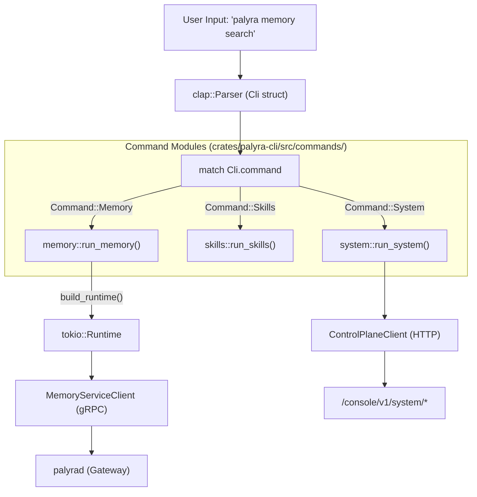
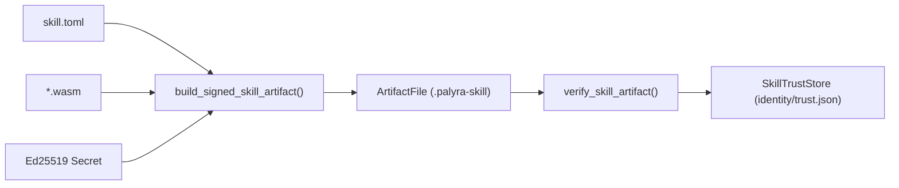

# Command Reference and Architecture

Relevant source files

The following files were used as context for generating this wiki page:

- crates/palyra-cli/examples/render_cli_parity_report.rs
- crates/palyra-cli/src/args/cron.rs
- crates/palyra-cli/src/args/memory.rs
- crates/palyra-cli/src/args/mod.rs
- crates/palyra-cli/src/args/sandbox.rs
- crates/palyra-cli/src/args/skills.rs
- crates/palyra-cli/src/args/system.rs
- crates/palyra-cli/src/args/tests.rs
- crates/palyra-cli/src/cli_parity.rs
- crates/palyra-cli/src/commands/memory.rs
- crates/palyra-cli/src/commands/mod.rs
- crates/palyra-cli/src/commands/operator_wizard.rs
- crates/palyra-cli/src/commands/sandbox.rs
- crates/palyra-cli/src/commands/skills.rs
- crates/palyra-cli/src/commands/system.rs
- crates/palyra-cli/src/lib.rs
- crates/palyra-cli/src/output/skills.rs
- crates/palyra-cli/tests/cli_parity.rs
- crates/palyra-cli/tests/help_snapshots.rs
- crates/palyra-cli/tests/help_snapshots/agent-help.txt
- crates/palyra-cli/tests/help_snapshots/agents-help.txt
- crates/palyra-cli/tests/help_snapshots/approvals-help.txt
- crates/palyra-cli/tests/help_snapshots/root-help-unix.txt
- crates/palyra-cli/tests/help_snapshots/root-help-windows.txt
- crates/palyra-cli/tests/skills_lifecycle.rs
- crates/palyra-cli/tests/wizard_cli.rs
- crates/palyra-daemon/src/transport/http/handlers/console/system.rs

The Palyra CLI (`palyra`) serves as the primary operator interface for managing both local and remote gateway runtimes. It is built using a deeply nested `clap` command structure that maps high-level operator intents to gRPC or HTTP/Admin API calls.

## CLI Architecture and Command Parsing

The CLI is structured around the `Cli` struct, which utilizes the `clap` crate for declarative argument parsing and help generation. The command surface is partitioned into logical domains (e.g., `auth`, `memory`, `skills`) to match the backend's micro-service architecture.

### Root Options and Context
Every command execution is wrapped in a `RootOptions` context. This context manages global flags such as `--config`, `--profile`, and `--state-root`, which are used to locate the `palyra.toml` configuration and initialize the transport layer [crates/palyra-cli/src/lib.rs#60-100](http://crates/palyra-cli/src/lib.rs#60-100).

### Data Flow: Command to Gateway
The CLI typically follows a "Request-Dispatch-Emit" pattern:
1. **Parsing**: `clap` parses arguments into a `Command` enum [crates/palyra-cli/src/args/mod.rs#1-44](http://crates/palyra-cli/src/args/mod.rs#1-44).
2. **Dispatch**: The `run_command` function (in `lib.rs`) dispatches to specific command modules [crates/palyra-cli/src/commands/mod.rs#1-50](http://crates/palyra-cli/src/commands/mod.rs#1-50).
3. **Execution**: The command module establishes a gRPC connection (via `tonic`) or an Admin API connection (via `reqwest`) [crates/palyra-cli/src/commands/system.rs#15-22](http://crates/palyra-cli/src/commands/system.rs#15-22).
4. **Output**: Results are formatted as human-readable text or structured JSON/NDJSON based on the `--output-format` flag [crates/palyra-cli/src/output/skills.rs#4-23](http://crates/palyra-cli/src/output/skills.rs#4-23).

### Code Entity Mapping: Command Dispatch
The following diagram illustrates how the CLI translates a user string into a code execution path.

**CLI Dispatch Pipeline**

Sources: [crates/palyra-cli/src/lib.rs#76-90](http://crates/palyra-cli/src/lib.rs#76-90), [crates/palyra-cli/src/commands/memory.rs#4-22](http://crates/palyra-cli/src/commands/memory.rs#4-22), [crates/palyra-cli/src/commands/system.rs#10-22](http://crates/palyra-cli/src/commands/system.rs#10-22).

---

## Core Command Surface

### Setup and Onboarding
The `setup` (alias `init`) and `onboarding` commands manage the initial bootstrap of the environment. This includes generating TLS certificates, initializing the SQLite journal, and configuring the `RootFileConfig` [crates/palyra-cli/src/commands/operator_wizard.rs#239-250](http://crates/palyra-cli/src/commands/operator_wizard.rs#239-250).

*   **Wizard Engine**: The CLI includes an interactive `WizardSession` that guides users through `quickstart`, `manual`, or `remote` deployment flows [crates/palyra-cli/src/commands/operator_wizard.rs#63-86](http://crates/palyra-cli/src/commands/operator_wizard.rs#63-86).
*   **TLS Scaffolding**: Supports `self-signed` or `provided` certificate modes for mTLS node communication [crates/palyra-cli/src/args/mod.rs#77-77](http://crates/palyra-cli/src/args/mod.rs#77-77).

### Memory and RAG Operations
The `memory` command interacts with the `MemoryServiceClient` to manage the RAG (Retrieval-Augmented Generation) subsystem.

*   **Search**: Performs hybrid search (lexical + vector) across specific scopes [crates/palyra-cli/src/commands/memory.rs#36-48](http://crates/palyra-cli/src/commands/memory.rs#36-48).
*   **Purge**: Allows selective deletion of memories by `session_id`, `channel`, or `principal` [crates/palyra-cli/src/commands/memory.rs#143-155](http://crates/palyra-cli/src/commands/memory.rs#143-155).
*   **Workspace**: Manages local file indexing for the agent's context [crates/palyra-cli/src/args/memory.rs#1-10](http://crates/palyra-cli/src/args/memory.rs#1-10).

### Skills and Plugin Management
The `skills` command manages the lifecycle of WASM-based plugins and tool definitions.

*   **Package**: The `skills package build` command creates a signed `.palyra-skill` artifact containing WASM modules, manifests, and SBOMs [crates/palyra-cli/src/commands/skills.rs#5-16](http://crates/palyra-cli/src/commands/skills.rs#5-16).
*   **Audit/Verify**: Validates signatures against the `SkillTrustStore` and performs security audits before installation [crates/palyra-cli/src/commands/skills.rs#106-126](http://crates/palyra-cli/src/commands/skills.rs#106-126).

**Skill Packaging Data Flow**

Sources: [crates/palyra-cli/src/commands/skills.rs#59-67](http://crates/palyra-cli/src/commands/skills.rs#59-67), [crates/palyra-cli/src/commands/skills.rs#117-128](http://crates/palyra-cli/src/commands/skills.rs#117-128).

### System and Diagnostics
*   **Doctor**: Performs a comprehensive health check of the local environment (dependencies, permissions, network) [crates/palyra-cli/src/commands/mod.rs#16-16](http://crates/palyra-cli/src/commands/mod.rs#16-16).
*   **Heartbeat**: Queries the `/console/v1/system/heartbeat` endpoint to verify gateway uptime and subsystem status [crates/palyra-cli/src/commands/system.rs#20-23](http://crates/palyra-cli/src/commands/system.rs#20-23).
*   **Logs**: Tails the `JournalStore` diagnostics directly from the SQLite database [crates/palyra-cli/src/commands/mod.rs#20-20](http://crates/palyra-cli/src/commands/mod.rs#20-20).

---

## ACP and Agent Control Protocol
The `acp` command facilitates communication between external tools (like IDE extensions) and the Palyra gateway.

*   **AcpBridge**: Maps standard I/O (stdin/stdout) to the gateway's gRPC stream, allowing non-gRPC-aware tools to interact with agents [crates/palyra-cli/src/args/acp.rs#46-49](http://crates/palyra-cli/src/args/acp.rs#46-49).
*   **Legacy Shim**: Provides a compatibility layer for v1 ACP protocols [crates/palyra-cli/src/args/mod.rs#46-49](http://crates/palyra-cli/src/args/mod.rs#46-49).

---

## TUI (Terminal User Interface)
The `tui` command launches a `ratatui`-based interactive session. It utilizes the `operator_client` to provide a real-time view of agent runs, session transcripts, and approval requests [crates/palyra-cli/src/commands/tui.rs#1-44](http://crates/palyra-cli/src/commands/tui.rs#1-44).

---

## Cross-Platform Parity and Testing

Palyra maintains strict CLI parity between Unix-like systems and Windows. This is enforced via the `CliParityMatrix`.

### CliParityMatrix
The `CliParityMatrix` defines a set of commands and their expected help outputs across platforms. It ensures that flags, aliases, and descriptions remain synchronized [crates/palyra-cli/src/cli_parity.rs#1-20](http://crates/palyra-cli/src/cli_parity.rs#1-20).

### Snapshot Testing
The system uses snapshot files (e.g., `root-help-unix.txt`) to detect regressions in the command surface.
*   **Test Runner**: `help_snapshots_match_cli_parity_matrix` iterates through the matrix and compares current `palyra --help` output against stored snapshots [crates/palyra-cli/tests/help_snapshots.rs#75-100](http://crates/palyra-cli/tests/help_snapshots.rs#75-100).
*   **Normalization**: Help text is normalized (e.g., stripping `.exe` on Windows) to allow cross-platform comparison [crates/palyra-cli/tests/help_snapshots.rs#22-25](http://crates/palyra-cli/tests/help_snapshots.rs#22-25).

Sources: [crates/palyra-cli/tests/help_snapshots/root-help-unix.txt#1-54](http://crates/palyra-cli/tests/help_snapshots/root-help-unix.txt#1-54), [crates/palyra-cli/tests/help_snapshots/root-help-windows.txt#1-54](http://crates/palyra-cli/tests/help_snapshots/root-help-windows.txt#1-54).
