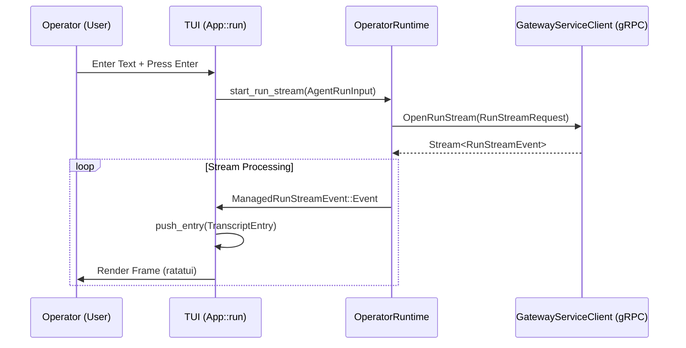
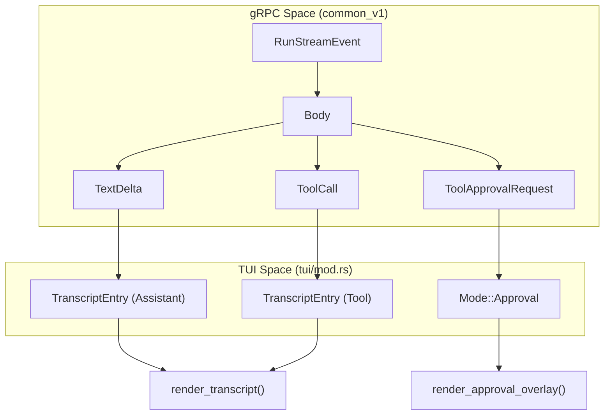

# Terminal User Interface (TUI)

Relevant source files

The following files were used as context for generating this wiki page:

- crates/palyra-cli/src/acp_bridge.rs
- crates/palyra-cli/src/args/config.rs
- crates/palyra-cli/src/args/models.rs
- crates/palyra-cli/src/args/sessions.rs
- crates/palyra-cli/src/client/control_plane.rs
- crates/palyra-cli/src/client/mod.rs
- crates/palyra-cli/src/client/operator.rs
- crates/palyra-cli/src/client/runtime.rs
- crates/palyra-cli/src/commands/agent.rs
- crates/palyra-cli/src/commands/agents.rs
- crates/palyra-cli/src/commands/config.rs
- crates/palyra-cli/src/commands/models.rs
- crates/palyra-cli/src/commands/sessions.rs
- crates/palyra-cli/src/commands/tui.rs
- crates/palyra-cli/src/tui/mod.rs
- crates/palyra-daemon/src/application/session_compaction.rs

The Terminal User Interface (TUI) provides an interactive, high-fidelity operator session within the terminal. Built using the `ratatui` and `crossterm` libraries, it enables real-time agent interaction, session management, and tool approval workflows without requiring a web browser.

## Overview and Architecture

The TUI is implemented as a stateful application within the `palyra-cli` crate [crates/palyra-cli/src/tui/mod.rs#107-130](http://crates/palyra-cli/src/tui/mod.rs#107-130). It connects to the `palyrad` daemon via gRPC using the `OperatorRuntime` [crates/palyra-cli/src/client/operator.rs#15-17](http://crates/palyra-cli/src/client/operator.rs#15-17), which abstracts the underlying `GatewayRuntimeClient` [crates/palyra-cli/src/client/runtime.rs#9-12](http://crates/palyra-cli/src/client/runtime.rs#9-12).

### Core Components

| Component | Role |
| :--- | :--- |
| `App` | The main state container managing the transcript, input buffer, and UI mode [crates/palyra-cli/src/tui/mod.rs#107-130](http://crates/palyra-cli/src/tui/mod.rs#107-130). |
| `OperatorRuntime` | Handles gRPC communication, session resolution, and run stream management [crates/palyra-cli/src/client/operator.rs#71-74](http://crates/palyra-cli/src/client/operator.rs#71-74). |
| `ManagedRunStream` | Wraps the bidirectional gRPC stream for a specific agent run, handling events and control messages [crates/palyra-cli/src/client/operator.rs#31-35](http://crates/palyra-cli/src/client/operator.rs#31-35). |
| `PickerState` | Manages the interactive selection UI for agents, sessions, and models [crates/palyra-cli/src/tui/mod.rs#75-81](http://crates/palyra-cli/src/tui/mod.rs#75-81). |

### Data Flow: TUI to Daemon

The following diagram illustrates how the TUI bridges user input to the gRPC protocol via the operator client.

**TUI Interaction Flow**

**Sources:** [crates/palyra-cli/src/tui/mod.rs#148-164](http://crates/palyra-cli/src/tui/mod.rs#148-164), [crates/palyra-cli/src/client/operator.rs#137-146](http://crates/palyra-cli/src/client/operator.rs#137-146), [crates/palyra-cli/src/client/runtime.rs#206-210](http://crates/palyra-cli/src/client/runtime.rs#206-210)

## Session Management and Bootstrap

The TUI is launched via the `palyra tui` command, which invokes `tui::run` [crates/palyra-cli/src/commands/tui.rs#17-25](http://crates/palyra-cli/src/commands/tui.rs#17-25). During bootstrap, the application performs several critical initialization steps:

1.  **Terminal Setup**: Enables raw mode and enters the alternate screen buffer [crates/palyra-cli/src/tui/mod.rs#166-171](http://crates/palyra-cli/src/tui/mod.rs#166-171).
2.  **Session Resolution**: Calls `OperatorRuntime::resolve_session` to either attach to an existing session or create a new one based on provided keys or labels [crates/palyra-cli/src/tui/mod.rs#185-196](http://crates/palyra-cli/src/tui/mod.rs#185-196).
3.  **Identity Resolution**: Fetches the default agent and available model catalog [crates/palyra-cli/src/tui/mod.rs#221-229](http://crates/palyra-cli/src/tui/mod.rs#221-229).

### UI Modes and Focus

The TUI operates in several distinct modes defined by the `Mode` enum [crates/palyra-cli/src/tui/mod.rs#45-52](http://crates/palyra-cli/src/tui/mod.rs#45-52):
*   **Chat**: The primary interaction mode for sending prompts and viewing transcripts.
*   **Picker**: An overlay for selecting different Agents, Sessions, or Models [crates/palyra-cli/src/tui/mod.rs#54-59](http://crates/palyra-cli/src/tui/mod.rs#54-59).
*   **Approval**: A specialized state for handling human-in-the-loop tool execution requests [crates/palyra-cli/src/tui/mod.rs#50](http://crates/palyra-cli/src/tui/mod.rs#50).
*   **Settings**: Toggles for UI features like `show_tools`, `show_thinking`, and `local_shell_enabled` [crates/palyra-cli/src/tui/mod.rs#62-66](http://crates/palyra-cli/src/tui/mod.rs#62-66).

## Agent Interaction and Run Streams

Interaction with agents is managed through the `ManagedRunStream`. This component handles the asynchronous nature of LLM responses by mapping gRPC `RunStreamEvent` variants into the TUI transcript [crates/palyra-cli/src/client/operator.rs#25-29](http://crates/palyra-cli/src/client/operator.rs#25-29).

### Event Handling Logic

The `App::drain_stream_events` function is responsible for processing incoming events from the active run [crates/palyra-cli/src/tui/mod.rs#150](http://crates/palyra-cli/src/tui/mod.rs#150).

**Code Entity Mapping: Stream Events to UI**

**Sources:** [crates/palyra-cli/src/tui/mod.rs#84-91](http://crates/palyra-cli/src/tui/mod.rs#84-91), [crates/palyra-cli/src/client/operator.rs#42-48](http://crates/palyra-cli/src/client/operator.rs#42-48), [crates/palyra-cli/src/tui/mod.rs#114-118](http://crates/palyra-cli/src/tui/mod.rs#114-118)

### Tool Approvals

When an agent requests a sensitive tool, the TUI enters `Mode::Approval`. The `ManagedRunStream` provides a `control_tx` channel [crates/palyra-cli/src/client/operator.rs#34](http://crates/palyra-cli/src/client/operator.rs#34) that allows the TUI to send a `ToolApprovalResponse` back to the daemon without breaking the stream connection [crates/palyra-cli/src/client/operator.rs#50-68](http://crates/palyra-cli/src/client/operator.rs#50-68).

## Picker and Selection Logic

The Picker provides a searchable interface for switching contexts. It uses a `PickerState` to track items and selection indices [crates/palyra-cli/src/tui/mod.rs#76-81](http://crates/palyra-cli/src/tui/mod.rs#76-81).

| Picker Kind | Data Source |
| :--- | :--- |
| `Agent` | `OperatorRuntime::list_agents` [crates/palyra-cli/src/client/operator.rs#84-91](http://crates/palyra-cli/src/client/operator.rs#84-91) |
| `Session` | `OperatorRuntime::list_sessions` [crates/palyra-cli/src/client/operator.rs#101-110](http://crates/palyra-cli/src/client/operator.rs#101-110) |
| `Model` | `OperatorRuntime::list_models` (via models list payload) [crates/palyra-cli/src/tui/mod.rs#222](http://crates/palyra-cli/src/tui/mod.rs#222) |

## Key Functions and Implementation Details

### Bootstrap and Shutdown
*   `App::bootstrap(options)`: Initializes the `OperatorRuntime` and fetches initial session/agent state [crates/palyra-cli/src/tui/mod.rs#183-232](http://crates/palyra-cli/src/tui/mod.rs#183-232).
*   `restore_terminal(terminal)`: Ensures the terminal is returned to a usable state (disabling raw mode, leaving alternate screen) even if the app crashes [crates/palyra-cli/src/tui/mod.rs#173-180](http://crates/palyra-cli/src/tui/mod.rs#173-180).

### Main Loop
The `run_loop` function implements the core execution cycle [crates/palyra-cli/src/tui/mod.rs#148-164](http://crates/palyra-cli/src/tui/mod.rs#148-164):
1.  **Drain Events**: Updates internal state from the gRPC background task.
2.  **Draw**: Renders the UI via `terminal.draw`.
3.  **Poll Input**: Checks for keyboard events with a 50ms timeout to maintain UI responsiveness [crates/palyra-cli/src/tui/mod.rs#155](http://crates/palyra-cli/src/tui/mod.rs#155).
4.  **Handle Key**: Dispatches keyboard events to state mutation logic [crates/palyra-cli/src/tui/mod.rs#158](http://crates/palyra-cli/src/tui/mod.rs#158).

### Sources:
*   [crates/palyra-cli/src/tui/mod.rs#1-232](http://crates/palyra-cli/src/tui/mod.rs#1-232)
*   [crates/palyra-cli/src/client/operator.rs#1-150](http://crates/palyra-cli/src/client/operator.rs#1-150)
*   [crates/palyra-cli/src/commands/tui.rs#1-27](http://crates/palyra-cli/src/commands/tui.rs#1-27)
*   [crates/palyra-cli/src/client/runtime.rs#1-105](http://crates/palyra-cli/src/client/runtime.rs#1-105)
