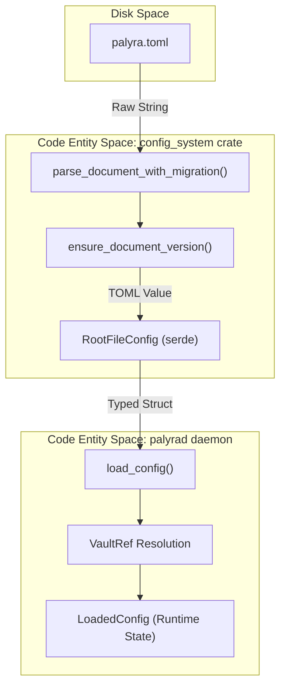
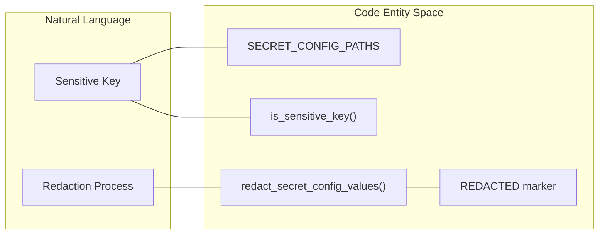

# Configuration System

Relevant source files

The following files were used as context for generating this wiki page:

- .githooks/pre-push
- apps/desktop/src-tauri/docs/security/advisories/GHSA-wrw7-89jp-8q8g.md
- apps/desktop/src-tauri/docs/security/dependency-graph/glib.md
- apps/desktop/src-tauri/third_party/glib-0.18.5-patched/PALYRA_PATCH_GOVERNANCE.env
- crates/palyra-cli/src/cli.rs
- crates/palyra-cli/tests/config_mutation.rs
- crates/palyra-common/src/config_system.rs
- crates/palyra-common/src/daemon_config_schema.rs
- crates/palyra-common/src/redaction.rs
- crates/palyra-daemon/src/config/load.rs
- crates/palyra-daemon/src/config/schema.rs
- crates/palyra-daemon/src/cron.rs
- crates/palyra-daemon/src/gateway.rs
- crates/palyra-daemon/src/journal.rs
- crates/palyra-daemon/src/model_provider.rs
- crates/palyra-daemon/tests/gateway_grpc.rs
- scripts/check-desktop-glib-patch.sh
- scripts/clean-runtime-artifacts.sh

The Palyra configuration system provides a robust, versioned, and secure mechanism for managing daemon settings, secrets, and environment-specific behaviors. It is built on TOML and utilizes a multi-layered validation pipeline that supports secret indirection via the Vault.

## Core Architecture

The system is centered around the `palyra.toml` file, which is parsed into a structured schema and then transformed into runtime configuration objects.

### Configuration Data Flow

The following diagram illustrates how a configuration file is processed from disk to the runtime state of the `palyrad` daemon.

**Config Loading and Validation Pipeline**

Sources: [crates/palyra-common/src/config_system.rs#89-99](http://crates/palyra-common/src/config_system.rs#89-99), [crates/palyra-daemon/src/config/load.rs#29-56](http://crates/palyra-daemon/src/config/load.rs#29-56)

## The `palyra.toml` Schema

The root configuration structure is defined by `RootFileConfig`, which organizes settings into functional blocks (e.g., `daemon`, `gateway`, `model_provider`).

### Key Configuration Sections

| Section | Purpose | Key Fields |
| :--- | :--- | :--- |
| `daemon` | Basic network settings | `bind_addr`, `port` |
| `gateway` | gRPC/QUIC and mTLS | `grpc_port`, `quic_enabled`, `tls.cert_path` |
| `model_provider` | AI backend settings | `kind`, `openai_api_key`, `openai_model` |
| `tool_call` | Sandbox and tool execution | `sandbox_tier`, `egress_mode`, `browser_service` |
| `memory` | RAG and persistence | `max_item_tokens`, `retention.ttl_days` |

Sources: [crates/palyra-common/src/daemon_config_schema.rs#64-81](http://crates/palyra-common/src/daemon_config_schema.rs#64-81), [crates/palyra-daemon/src/config/load.rs#65-136](http://crates/palyra-daemon/src/config/load.rs#65-136)

## Secret Management and Redaction

To prevent sensitive information from leaking into logs or being exposed via the CLI/Console API, the system implements two primary security features: `VaultRef` indirection and automatic redaction.

### VaultRef for Secret Indirection
Instead of hardcoding API keys, configuration fields support `VaultRef` values (e.g., `model_provider.openai_api_key_vault_ref`). During the `load_config` phase, these references are resolved through the `palyra-vault` system.
Sources: [crates/palyra-common/src/daemon_config_schema.rs#9-14](http://crates/palyra-common/src/daemon_config_schema.rs#9-14), [crates/palyra-daemon/src/config/load.rs#15-17](http://crates/palyra-daemon/src/config/load.rs#15-17)

### Automatic Redaction
The `palyra-common` crate maintains a list of sensitive paths in `SECRET_CONFIG_PATHS`. The function `redact_secret_config_values` recursively traverses the TOML document and replaces sensitive values with `<redacted>`.

**Redaction Logic Association**

Sources: [crates/palyra-common/src/daemon_config_schema.rs#6-14](http://crates/palyra-common/src/daemon_config_schema.rs#6-14), [crates/palyra-common/src/daemon_config_schema.rs#22-26](http://crates/palyra-common/src/daemon_config_schema.rs#22-26), [crates/palyra-common/src/redaction.rs#3-22](http://crates/palyra-common/src/redaction.rs#3-22)

## Configuration Mutation

Configuration can be modified at runtime via the CLI or the Admin/Console API. The `config_system` crate provides utilities for safe path-based updates.

### Mutation Pipeline
1. **Validation**: The system ensures the path does not cross scalar values using `get_value_at_path`.
2. **Backup**: Before writing to disk, the system rotates existing backups (e.g., `palyra.toml.bak.1`) up to a configured limit (default: 5).
3. **Atomic Write**: The updated TOML is serialized and written to the configuration file.

### Key Functions
- `set_value_at_path`: Updates or creates a value at a dotted path (e.g., `daemon.port`). [crates/palyra-common/src/config_system.rs#174-204](http://crates/palyra-common/src/config_system.rs#174-204)
- `unset_value_at_path`: Removes a key from the configuration. [crates/palyra-common/src/config_system.rs#206-210](http://crates/palyra-common/src/config_system.rs#206-210)
- `serialize_document_pretty`: Ensures consistent formatting of the TOML file on disk. [crates/palyra-common/src/config_system.rs#131-137](http://crates/palyra-common/src/config_system.rs#131-137)

## Implementation Details

### Versioning and Migration
The configuration system supports versioning (currently `CONFIG_VERSION_V1 = 1`). The `ensure_document_version` function handles the transition of legacy unversioned files to the current schema.
Sources: [crates/palyra-common/src/config_system.rs#14-15](http://crates/palyra-common/src/config_system.rs#14-15), [crates/palyra-common/src/config_system.rs#101-129](http://crates/palyra-common/src/config_system.rs#101-129)

### CLI Integration
The `palyra config` command group provides `get`, `set`, `list`, and `unset` subcommands. By default, `get` and `list` redact secrets unless the `--show-secrets` flag is provided.
Sources: [crates/palyra-cli/tests/config_mutation.rs#149-192](http://crates/palyra-cli/tests/config_mutation.rs#149-192)

### Environment Variables
While the primary configuration is TOML-based, certain bootstrap settings (like `PALYRA_SKILLS_TRUST_STORE`) can be overridden via environment variables.
Sources: [crates/palyra-daemon/src/cron.rs#52-54](http://crates/palyra-daemon/src/cron.rs#52-54)
