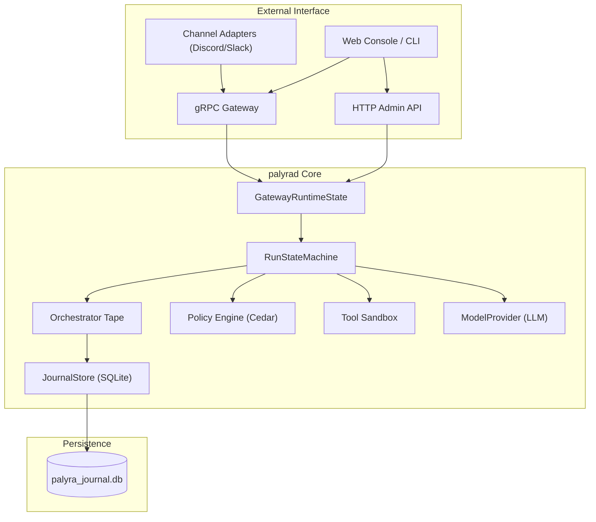
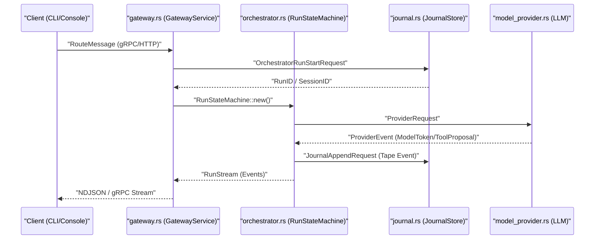

# Core Daemon (palyrad)

Relevant source files

The following files were used as context for generating this wiki page:

- crates/palyra-cli/src/cli.rs
- crates/palyra-common/src/daemon_config_schema.rs
- crates/palyra-control-plane/src/client.rs
- crates/palyra-control-plane/src/models.rs
- crates/palyra-daemon/src/cron.rs
- crates/palyra-daemon/src/gateway.rs
- crates/palyra-daemon/src/journal.rs
- crates/palyra-daemon/src/lib.rs
- crates/palyra-daemon/src/model_provider.rs
- crates/palyra-daemon/src/transport/http/handlers/console/mod.rs
- crates/palyra-daemon/src/transport/http/router.rs
- crates/palyra-daemon/tests/gateway_grpc.rs

The `palyrad` daemon is the central orchestrator of the Palyra platform. It manages the lifecycle of AI agent interactions, enforces security policies, maintains long-term memory via a journaled store, and provides the transport layer for both human operators and automated connectors.

## Overview and Gateway State

At the heart of the daemon is the `GatewayRuntimeState`, which acts as the shared memory and coordination point for all active processes. It holds references to the model providers, the policy engine, the tool execution environment, and the active session registry.

### Core Components
*   **GatewayRuntimeState**: The primary shared state container used by gRPC and HTTP services [crates/palyra-daemon/src/gateway.rs#74-76](http://crates/palyra-daemon/src/gateway.rs#74-76).
*   **RunStateMachine**: Manages the lifecycle of a single "Run" (an interaction turn), handling transitions from `Accepted` to `Running`, `PendingApproval`, or `Completed` [crates/palyra-daemon/src/gateway.rs#77-77](http://crates/palyra-daemon/src/gateway.rs#77-77).
*   **JournalStore**: A SQLite-backed persistence layer that records every event (the "Orchestrator Tape") for auditability and state recovery [crates/palyra-daemon/src/journal.rs#63-63](http://crates/palyra-daemon/src/journal.rs#63-63).

### System Architecture Diagram

This diagram illustrates the flow from external inputs through the core daemon's internal subsystems.

**Sources:** [crates/palyra-daemon/src/gateway.rs#40-82](http://crates/palyra-daemon/src/gateway.rs#40-82), [crates/palyra-daemon/src/lib.rs#73-83](http://crates/palyra-daemon/src/lib.rs#73-83)

---

## Major Subsystems

The daemon's functionality is partitioned into several specialized subsystems, each documented in detail in child pages.

### Gateway and Session Orchestration
The Orchestrator is responsible for the "Run Loop." When a message is received via `RouteMessage`, the daemon initializes a `RunStateMachine`. It pulls context from the `JournalStore`, queries the LLM via the `ModelProvider`, and executes tools if proposed.
*   **Key Entity**: `OrchestratorTapeRecord` [crates/palyra-daemon/src/gateway.rs#69-69](http://crates/palyra-daemon/src/gateway.rs#69-69).
*   **For details, see [Gateway and Session Orchestration](gateway_and_session_orchestration/README.md).**

### Journal Store and Persistence
All interactions are persisted in a hash-chained audit log. This ensures that the agent's "memory" and the operator's audit trail are immutable and verifiable. It also handles RAG (Retrieval-Augmented Generation) via the `MemoryEmbeddingProvider`.
*   **Key Entity**: `JournalStore` [crates/palyra-daemon/src/journal.rs#63-63](http://crates/palyra-daemon/src/journal.rs#63-63).
*   **For details, see [Journal Store and Persistence](journal_store_and_persistence/README.md).**

### HTTP Transport and Admin API
The daemon exposes an Axum-based HTTP server providing RESTful endpoints for the Web Console and administrative tasks. This includes `/admin/v1/` for system management and `/console/v1/` for operator interactions.
*   **Key Entity**: `build_router` [crates/palyra-daemon/src/transport/http/router.rs#17-17](http://crates/palyra-daemon/src/transport/http/router.rs#17-17).
*   **For details, see [HTTP Transport Layer and Admin/Console API](http_transport_layer_and_admin-console_api/README.md).**

### gRPC and QUIC Transport
For high-performance, bidirectional streaming (such as real-time log tailing or CLI interactions), the daemon uses gRPC over both TCP and QUIC. It supports mTLS for secure node-to-node communication.
*   **Key Entity**: `GatewayAuthConfig` [crates/palyra-daemon/src/transport/grpc/auth.rs#162-164](http://crates/palyra-daemon/src/transport/grpc/auth.rs#162-164).
*   **For details, see [gRPC and QUIC Transport](grpc_and_quic_transport/README.md).**

### Cron and Background Tasks
The daemon includes a built-in scheduler for recurring tasks, such as periodic skill audits, memory maintenance (vacuuming), and scheduled agent routines.
*   **Key Entity**: `spawn_scheduler_loop` [crates/palyra-daemon/src/cron.rs#72-72](http://crates/palyra-daemon/src/cron.rs#72-72).
*   **For details, see [Cron Scheduler and Background Tasks](cron_scheduler_and_background_tasks/README.md).**

### Usage Governance
To prevent runaway costs or resource exhaustion, the `UsageGovernance` subsystem tracks token usage and enforces budget limits per session or principal.
*   **Key Entity**: `OrchestratorUsageDelta` [crates/palyra-daemon/src/gateway.rs#70-70](http://crates/palyra-daemon/src/gateway.rs#70-70).
*   **For details, see [Usage Governance and Budget Controls](usage_governance_and_budget_controls/README.md).**

---

## Code Entity Map: Request Flow

The following diagram bridges the natural language concept of a "Request" to the specific code entities and files that handle it within `palyrad`.

**Sources:** [crates/palyra-daemon/src/gateway.rs#56-82](http://crates/palyra-daemon/src/gateway.rs#56-82), [crates/palyra-daemon/src/model_provider.rs#176-181](http://crates/palyra-daemon/src/model_provider.rs#176-181), [crates/palyra-daemon/src/journal.rs#232-248](http://crates/palyra-daemon/src/journal.rs#232-248)

## Configuration

The daemon is configured via a TOML file (typically `palyra.toml`). The schema is defined by the `RootFileConfig` struct, which includes sections for `gateway`, `model_provider`, `storage`, and `identity`.

| Config Section | Purpose | Code Reference |
| :--- | :--- | :--- |
| `daemon` | Network binding and ports | [crates/palyra-common/src/daemon_config_schema.rs#92-95](http://crates/palyra-common/src/daemon_config_schema.rs#92-95) |
| `gateway` | gRPC/QUIC and TLS settings | [crates/palyra-common/src/daemon_config_schema.rs#99-112](http://crates/palyra-common/src/daemon_config_schema.rs#99-112) |
| `model_provider` | LLM API keys and model selection | [crates/palyra-common/src/daemon_config_schema.rs#195-212](http://crates/palyra-common/src/daemon_config_schema.rs#195-212) |
| `memory` | Retention policies and RAG limits | [crates/palyra-common/src/daemon_config_schema.rs#145-151](http://crates/palyra-common/src/daemon_config_schema.rs#145-151) |

**Sources:** [crates/palyra-common/src/daemon_config_schema.rs#64-81](http://crates/palyra-common/src/daemon_config_schema.rs#64-81)

## Child Pages

- [Gateway and Session Orchestration](gateway_and_session_orchestration/README.md)
- [Journal Store and Persistence](journal_store_and_persistence/README.md)
- [HTTP Transport Layer and Admin/Console API](http_transport_layer_and_admin-console_api/README.md)
- [gRPC and QUIC Transport](grpc_and_quic_transport/README.md)
- [Cron Scheduler and Background Tasks](cron_scheduler_and_background_tasks/README.md)
- [Usage Governance and Budget Controls](usage_governance_and_budget_controls/README.md)
