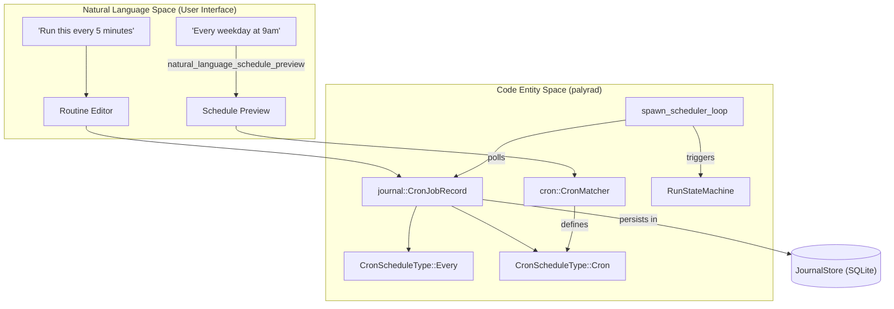
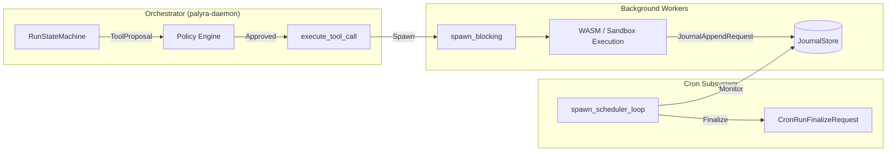

# Cron Scheduler and Background Tasks

Relevant source files

The following files were used as context for generating this wiki page:

- apps/web/src/console/sections/ApprovalsSection.tsx
- apps/web/src/console/sections/BrowserSection.tsx
- apps/web/src/console/sections/CronSection.tsx
- apps/web/src/console/sections/routinesHelpers.ts
- crates/palyra-cli/src/args/routines.rs
- crates/palyra-cli/src/cli.rs
- crates/palyra-cli/src/commands/cron.rs
- crates/palyra-cli/src/commands/routines.rs
- crates/palyra-cli/tests/help_snapshots/cron-help.txt
- crates/palyra-common/src/daemon_config_schema.rs
- crates/palyra-daemon/src/cron.rs
- crates/palyra-daemon/src/gateway.rs
- crates/palyra-daemon/src/journal.rs
- crates/palyra-daemon/src/model_provider.rs
- crates/palyra-daemon/src/routines.rs
- crates/palyra-daemon/src/transport/http/handlers/console/routines.rs
- crates/palyra-daemon/tests/gateway_grpc.rs

The Cron subsystem in Palyra is responsible for the orchestration of time-based triggers, periodic system maintenance, and the execution of background tasks. It enables the transition from interactive, user-initiated runs to autonomous agent behaviors scheduled via natural language or traditional cron expressions.

## Cron Architecture and Lifecycle

The scheduler operates as a centralized loop within the `palyrad` daemon, monitoring the `JournalStore` for jobs that have reached their `next_run_at_unix_ms` threshold.

### Core Scheduler Loop
The `spawn_scheduler_loop` function initializes the background orchestration. It runs at a default idle interval of 15 seconds `[crates/palyra-daemon/src/cron.rs#42-42](http://crates/palyra-daemon/src/cron.rs#42-42)`. During each tick, it performs the following:
1.  **Job Polling**: Fetches a batch of due jobs (up to 64) from the SQLite journal `[crates/palyra-daemon/src/cron.rs#43-43](http://crates/palyra-daemon/src/cron.rs#43-43)`.
2.  **Concurrency Evaluation**: Checks the `CronConcurrencyPolicy` (Forbid, Replace, or QueueOne) to determine if a new run can start if a previous one is still active `[crates/palyra-daemon/src/journal.rs#132-136](http://crates/palyra-daemon/src/journal.rs#132-136)`.
3.  **Misfire Handling**: Applies `CronMisfirePolicy` (Skip or CatchUp) if the system was offline during a scheduled trigger `[crates/palyra-daemon/src/journal.rs#160-164](http://crates/palyra-daemon/src/journal.rs#160-164)`.
4.  **Run Dispatch**: Spawns a `RunStateMachine` for the job's prompt using a system principal `[crates/palyra-daemon/src/cron.rs#55-55](http://crates/palyra-daemon/src/cron.rs#55-55)`.

### Cron Schedule Types
Palyra supports three primary scheduling mechanisms defined in `CronScheduleType` `[crates/palyra-daemon/src/journal.rs#104-108](http://crates/palyra-daemon/src/journal.rs#104-108)`:

| Type | Description | Implementation Detail |
| :--- | :--- | :--- |
| `Cron` | Standard 5-field cron expression. | Parsed via `CronMatcher` `[crates/palyra-daemon/src/cron.rs#129-137](http://crates/palyra-daemon/src/cron.rs#129-137)`. |
| `Every` | Fixed interval (e.g., every 1 hour). | Calculated using `interval_ms` `[crates/palyra-daemon/src/cron.rs#124-124](http://crates/palyra-daemon/src/cron.rs#124-124)`. |
| `At` | One-off execution at a specific timestamp. | Uses RFC3339 timestamps `[crates/palyra-daemon/src/cron.rs#125-125](http://crates/palyra-daemon/src/cron.rs#125-125)`. |

### Natural Language Space to Code Entity Space: Scheduling
This diagram maps the user-facing "Routine" concepts to the underlying Cron implementation.

Title: Routine to Cron Mapping

Sources: `[crates/palyra-daemon/src/cron.rs#139-156](http://crates/palyra-daemon/src/cron.rs#139-156)`, `[crates/palyra-daemon/src/journal.rs#250-280](http://crates/palyra-daemon/src/journal.rs#250-280)`, `[apps/web/src/console/sections/routinesHelpers.ts#12-44](http://apps/web/src/console/sections/routinesHelpers.ts#12-44)`.

## System Maintenance Ticks

Beyond user-defined jobs, the scheduler manages critical internal maintenance tasks to ensure the health of the `JournalStore` and RAG (Retrieval-Augmented Generation) capabilities.

### Memory Maintenance and Retention
The daemon executes a `MemoryMaintenanceRequest` every 5 minutes `[crates/palyra-daemon/src/cron.rs#56-56](http://crates/palyra-daemon/src/cron.rs#56-56)`. This task enforces the `MemoryRetentionPolicy`:
*   **TTL Expiry**: Deletes memory items that have exceeded their time-to-live.
*   **Capacity Culling**: If `max_entries` or `max_bytes` are exceeded, the system purges the oldest items to maintain the configured budget `[crates/palyra-common/src/daemon_config_schema.rs#162-167](http://crates/palyra-common/src/daemon_config_schema.rs#162-167)`.

### Embeddings Backfill
To support hybrid search, the system must ensure all memory items have vector embeddings. The `MEMORY_EMBEDDINGS_BACKFILL_INTERVAL` (10 minutes) triggers a process that:
1.  Identifies memory items missing embeddings for the current `MemoryEmbeddingProvider` version `[crates/palyra-daemon/src/cron.rs#57-57](http://crates/palyra-daemon/src/cron.rs#57-57)`.
2.  Batches items (default 64) for the LLM embedding model `[crates/palyra-daemon/src/cron.rs#58-58](http://crates/palyra-daemon/src/cron.rs#58-58)`.
3.  Updates the `JournalStore` with the generated vectors `[crates/palyra-daemon/src/gateway.rs#64-66](http://crates/palyra-daemon/src/gateway.rs#64-66)`.

### Periodic Skill Reaudit
Security is maintained through the `PeriodicSkillReaudit` task. By default, every 6 hours, the system re-scans installed skills `[crates/palyra-daemon/src/cron.rs#54-54](http://crates/palyra-daemon/src/cron.rs#54-54)`.
*   **Trust Verification**: Checks `SkillArtifact` signatures against the `SkillTrustStore` `[crates/palyra-daemon/src/cron.rs#18-18](http://crates/palyra-daemon/src/cron.rs#18-18)`.
*   **Quarantine**: If a skill fails the re-audit (e.g., due to a changed policy or tampered file), it is marked as `Quarantine` and disabled from execution `[crates/palyra-daemon/src/journal.rs#70-70](http://crates/palyra-daemon/src/journal.rs#70-70)`.

## Background Queue and Delegated Sub-runs

Palyra utilizes a background queue for "delegated" tasks where an agent spawns sub-processes or long-running tool executions that should not block the main orchestrator tape.

### Data Flow: Background Task Execution
This diagram illustrates how a task moves from an LLM proposal to background execution.

Title: Background Task Delegation Flow

Sources: `[crates/palyra-daemon/src/gateway.rs#77-81](http://crates/palyra-daemon/src/gateway.rs#77-81)`, `[crates/palyra-daemon/src/cron.rs#35-36](http://crates/palyra-daemon/src/cron.rs#35-36)`, `[crates/palyra-daemon/src/journal.rs#63-63](http://crates/palyra-daemon/src/journal.rs#63-63)`.

### Routine Registry
Routines are a higher-level abstraction over Cron jobs, stored in `definitions.json` within the `routines` directory `[crates/palyra-daemon/src/routines.rs#22-23](http://crates/palyra-daemon/src/routines.rs#22-23)`.
*   **Trigger Kinds**: Includes `Schedule`, `Hook`, `Webhook`, `SystemEvent`, and `Manual` `[crates/palyra-daemon/src/routines.rs#35-41](http://crates/palyra-daemon/src/routines.rs#35-41)`.
*   **Delivery Config**: Determines where the output of a background task is sent (e.g., `SameChannel`, `SpecificChannel`, or `LogsOnly`) `[crates/palyra-daemon/src/routines.rs#69-74](http://crates/palyra-daemon/src/routines.rs#69-74)`.
*   **Quiet Hours**: Prevents background tasks from sending notifications during specific windows, configured via `start_minute_of_day` and `end_minute_of_day` `[crates/palyra-daemon/src/routines.rs#167-172](http://crates/palyra-daemon/src/routines.rs#167-172)`.

## CLI and API Management

Operators manage the Cron subsystem via the `palyra cron` command group and the Web Console's "Cron" section.

### Key Management Commands
*   `palyra cron add`: Creates a new scheduled job with specific retry and jitter parameters `[crates/palyra-cli/src/commands/cron.rs#51-67](http://crates/palyra-cli/src/commands/cron.rs#51-67)`.
*   `palyra cron run-now`: Manually triggers a job regardless of its next scheduled time `[crates/palyra-cli/src/commands/cron.rs#166-167](http://crates/palyra-cli/src/commands/cron.rs#166-167)`.
*   `palyra cron status`: Provides a summary of active jobs, their last outcome, and upcoming runs `[crates/palyra-cli/src/commands/cron.rs#23-34](http://crates/palyra-cli/src/commands/cron.rs#23-34)`.

### Jitter and Retries
To prevent "thundering herd" problems where multiple jobs trigger simultaneously, the system supports `jitter_ms` (up to 60,000ms) `[crates/palyra-daemon/src/gateway.rs#106-106](http://crates/palyra-daemon/src/gateway.rs#106-106)`. Failed jobs are retried based on the `CronRetryPolicy`, which defines `max_attempts` and an exponential `backoff_ms` `[crates/palyra-daemon/src/journal.rs#226-229](http://crates/palyra-daemon/src/journal.rs#226-229)`.

Sources:
- `crates/palyra-daemon/src/cron.rs`
- `crates/palyra-daemon/src/journal.rs`
- `crates/palyra-daemon/src/gateway.rs`
- `crates/palyra-daemon/src/routines.rs`
- `crates/palyra-cli/src/commands/cron.rs`
- `crates/palyra-common/src/daemon_config_schema.rs`
- `apps/web/src/console/sections/routinesHelpers.ts`
