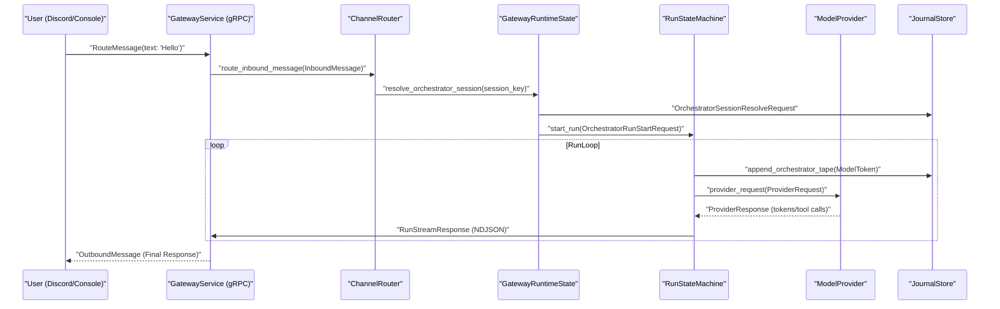
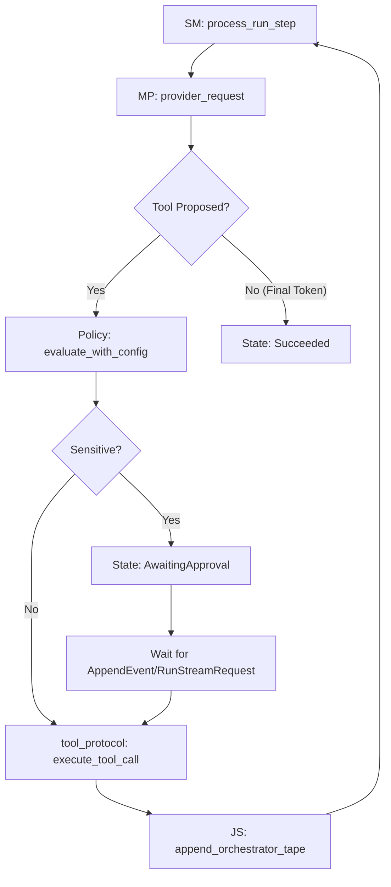

# Gateway and Session Orchestration

Relevant source files

The following files were used as context for generating this wiki page:

- crates/palyra-cli/src/cli.rs
- crates/palyra-cli/tests/help_snapshots/sessions-help.txt
- crates/palyra-common/src/daemon_config_schema.rs
- crates/palyra-daemon/src/application/mod.rs
- crates/palyra-daemon/src/application/provider_events.rs
- crates/palyra-daemon/src/application/provider_input.rs
- crates/palyra-daemon/src/application/run_stream/cancellation.rs
- crates/palyra-daemon/src/application/run_stream/mod.rs
- crates/palyra-daemon/src/application/run_stream/tool_flow.rs
- crates/palyra-daemon/src/background_queue.rs
- crates/palyra-daemon/src/channel_router.rs
- crates/palyra-daemon/src/channels.rs
- crates/palyra-daemon/src/cron.rs
- crates/palyra-daemon/src/domain/workspace.rs
- crates/palyra-daemon/src/gateway.rs
- crates/palyra-daemon/src/gateway/canvas.rs
- crates/palyra-daemon/src/gateway/runtime.rs
- crates/palyra-daemon/src/gateway/tests.rs
- crates/palyra-daemon/src/journal.rs
- crates/palyra-daemon/src/media.rs
- crates/palyra-daemon/src/model_provider.rs
- crates/palyra-daemon/src/transport/grpc/services/gateway/service.rs
- crates/palyra-daemon/src/transport/http/handlers/console/chat.rs
- crates/palyra-daemon/src/transport/http/handlers/console/sessions.rs
- crates/palyra-daemon/tests/gateway_grpc.rs

The Gateway and Session Orchestration layer is the central processing hub of `palyrad`. it manages the lifecycle of AI interactions, from receiving inbound messages via gRPC or Channel Connectors to executing multi-step agent "runs" that involve LLM inference, tool execution, and human-in-the-loop approvals.

## GatewayRuntimeState

The `GatewayRuntimeState` is the primary container for the daemon's operational state. It acts as a facade over various subsystems, including the `JournalStore`, `AgentRegistry`, `ChannelRouter`, and `ModelProvider`.

| Component | Role |
| :--- | :--- |
| `JournalStore` | Handles persistence of sessions, runs, and the audit-trailed Orchestrator Tape. |
| `AgentRegistry` | Resolves agent definitions and system prompts. |
| `ChannelRouter` | Manages inbound/outbound message routing for platforms like Discord. |
| `ModelProvider` | Interfaces with LLM backends (OpenAI-compatible or Deterministic). |
| `Vault` | Provides access to secrets required during tool execution. |

**Key Code Entities:**
- `GatewayRuntimeState` struct: [crates/palyra-daemon/src/gateway.rs#183-205](http://crates/palyra-daemon/src/gateway.rs#183-205)
- `GatewayRuntimeConfigSnapshot`: [crates/palyra-daemon/src/gateway/runtime.rs#29-49](http://crates/palyra-daemon/src/gateway/runtime.rs#29-49)

**Sources:**
- `crates/palyra-daemon/src/gateway.rs`
- `crates/palyra-daemon/src/gateway/runtime.rs`

## Session and Run Lifecycle

Palyra distinguishes between **Sessions** (long-lived conversational containers) and **Runs** (individual execution units within a session).

### Orchestrator Session
A session is identified by a `session_id` (ULID) and optionally a `session_key`. It maintains the continuity of a conversation across multiple user interactions. The `resolve_orchestrator_session` function is used to either retrieve an existing session or initialize a new one based on the incoming message context (Principal, Device, and Channel).

### Orchestrator Run
A run represents a single "turn" or background task. It is governed by the `RunStateMachine`, which tracks the lifecycle through various states:
- `Accepted`: The run has been created and is awaiting processing.
- `Running`: The LLM is generating tokens or a tool is executing.
- `AwaitingApproval`: Execution is paused pending human authorization for a sensitive tool call.
- `Succeeded` / `Failed` / `Cancelled`: Terminal states.

**Key Code Entities:**
- `OrchestratorSessionRecord`: [crates/palyra-daemon/src/journal.rs#360-375](http://crates/palyra-daemon/src/journal.rs#360-375)
- `RunLifecycleState` enum: [crates/palyra-daemon/src/orchestrator.rs#10-25](http://crates/palyra-daemon/src/orchestrator.rs#10-25)
- `RunStateMachine` struct: [crates/palyra-daemon/src/orchestrator.rs#50-65](http://crates/palyra-daemon/src/orchestrator.rs#50-65)

**Sources:**
- `crates/palyra-daemon/src/journal.rs`
- `crates/palyra-daemon/src/orchestrator.rs`

## The Orchestrator Tape

The "Tape" is a hash-chained, append-only log of events occurring within a run. Every interaction—user messages, LLM tokens, tool calls, tool outputs, and internal thoughts—is recorded as an `OrchestratorTapeRecord`.

### Tape Event Types
- `Message`: Inbound user text or outbound agent responses.
- `ToolCallProposal`: The LLM requesting to run a specific tool.
- `ToolCallOutput`: The result of a tool execution.
- `ModelToken`: Raw fragments of text generated by the model.
- `ApprovalRequest`: A pause in the tape requiring user intervention.

**Key Code Entities:**
- `OrchestratorTapeRecord`: [crates/palyra-daemon/src/journal.rs#410-430](http://crates/palyra-daemon/src/journal.rs#410-430)
- `JournalStore::append_orchestrator_tape`: [crates/palyra-daemon/src/journal.rs#1540-1560](http://crates/palyra-daemon/src/journal.rs#1540-1560)

**Sources:**
- `crates/palyra-daemon/src/journal.rs`

## Message Flow and gRPC Endpoints

The Gateway exposes several gRPC endpoints under the `gateway.v1.GatewayService` to facilitate message flow.

### RouteMessage
Used by external connectors (e.g., Discord) to inject messages into the system. The `RouteMessage` call triggers the `ChannelRouter`, which determines if the message should start a new run or be ignored based on mention patterns and pairing policies.

### RunStream
A bidirectional streaming endpoint used by the Web Console and CLI. It streams real-time events (tokens, tool calls) from the `RunStateMachine` to the client and allows the client to send `RunStreamRequest` messages (like approvals or cancellations) back to the gateway.

### AppendEvent
Allows manual insertion of events into a run's tape, often used for injecting external context or manual overrides.

### Data Flow Diagram: Inbound Message to LLM

The following diagram bridges the "Natural Language Space" (User Input) to the "Code Entity Space" (Internal Gateway logic).

**Sources:**
- `crates/palyra-daemon/src/transport/grpc/services/gateway/service.rs`
- `crates/palyra-daemon/src/gateway.rs`
- `crates/palyra-daemon/src/channel_router.rs`

## Orchestration Logic and Tool Execution

When the `RunStateMachine` encounters a `ToolProposal` from the `ModelProvider`, it follows a strict execution flow:

1.  **Policy Check**: Consults the `palyra-policy` engine (Cedar) to see if the tool is allowed.
2.  **Approval Check**: If the tool is marked as sensitive or the policy requires it, the run transitions to `AwaitingApproval`.
3.  **Sandbox Execution**: Once approved, the tool is executed via `execute_tool_call` in the appropriate tier (WASM, Unix rlimit, or Bubblewrap).
4.  **Tape Update**: The output is appended to the tape and fed back into the LLM for the next turn.

**Sources:**
- `crates/palyra-daemon/src/orchestrator.rs`
- `crates/palyra-daemon/src/gateway/runtime.rs`
- `crates/palyra-daemon/src/tool_protocol.rs`

## Key Functions and Classes Reference

| Symbol | Location | Description |
| :--- | :--- | :--- |
| `GatewayRuntimeState` | [crates/palyra-daemon/src/gateway.rs#183](http://crates/palyra-daemon/src/gateway.rs#183) | The main coordinator for daemon operations. |
| `route_message` | [crates/palyra-daemon/src/gateway.rs#430](http://crates/palyra-daemon/src/gateway.rs#430) | Entry point for gRPC `RouteMessage` requests. |
| `run_stream` | [crates/palyra-daemon/src/gateway.rs#650](http://crates/palyra-daemon/src/gateway.rs#650) | Entry point for bidirectional gRPC `RunStream`. |
| `RunStateMachine::next_transition` | [crates/palyra-daemon/src/orchestrator.rs#120](http://crates/palyra-daemon/src/orchestrator.rs#120) | Computes the next state transition for a run. |
| `OrchestratorTapeAppendRequest` | [crates/palyra-daemon/src/journal.rs#720](http://crates/palyra-daemon/src/journal.rs#720) | Data structure for adding new events to the audit log. |

**Sources:**
- `crates/palyra-daemon/src/gateway.rs`
- `crates/palyra-daemon/src/orchestrator.rs`
- `crates/palyra-daemon/src/journal.rs`
