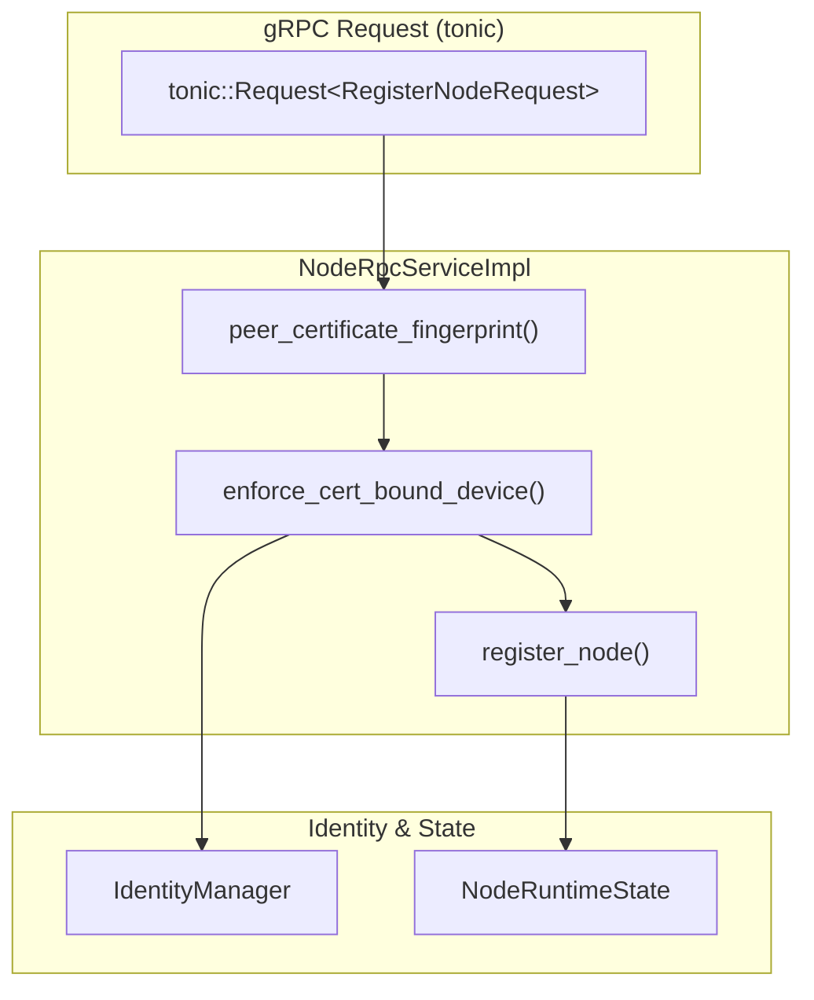
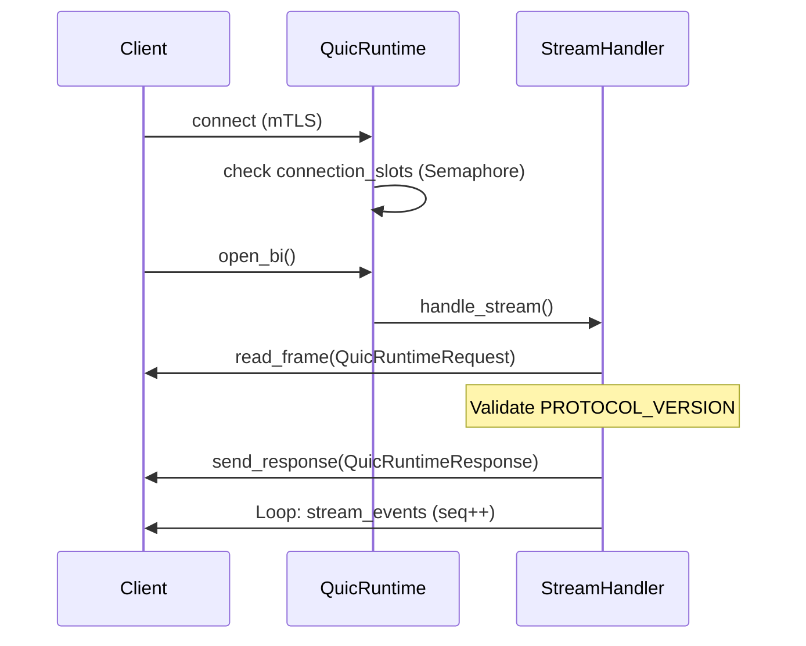

# gRPC and QUIC Transport

Relevant source files

The following files were used as context for generating this wiki page:

- crates/palyra-cli/src/commands/node.rs
- crates/palyra-daemon/src/node_rpc.rs
- crates/palyra-daemon/src/node_runtime.rs
- crates/palyra-daemon/src/quic_runtime.rs
- crates/palyra-daemon/tests/node_rpc_mtls.rs
- crates/palyra-identity/src/lib.rs
- crates/palyra-identity/src/mtls.rs
- crates/palyra-identity/src/pairing/manager.rs
- crates/palyra-identity/src/pairing/tests.rs
- crates/palyra-transport-quic/src/lib.rs
- crates/palyra-transport-quic/tests/transport.rs
- schemas/generated/kotlin/ProtocolStubs.kt
- schemas/generated/rust/protocol_stubs.rs
- schemas/generated/swift/ProtocolStubs.swift
- schemas/proto/palyra/v1/gateway.proto
- scripts/protocol/check-generated-stubs.ps1
- scripts/protocol/generate-stubs.ps1
- scripts/protocol/validate-kotlin-stubs.ps1
- scripts/protocol/validate-proto.ps1
- scripts/protocol/validate-rust-stubs.ps1
- scripts/protocol/validate-swift-stubs.ps1
- scripts/protocol/validate-swift-stubs.sh

This page documents the transport layer of the Palyra platform, focusing on the gRPC gateway for service-to-service communication and the QUIC-based runtime for node events. It covers the protobuf-driven build pipeline, mTLS security enforcement for external nodes, and the integration between the daemon and its clients (CLI, desktop, and remote nodes).

## Protocol Definition and Build Pipeline

Palyra uses Protocol Buffers (proto3) as the source of truth for all internal and external service contracts. The schemas are located in `schemas/proto/palyra/v1/` [schemas/proto/palyra/v1/gateway.proto#1-3](http://schemas/proto/palyra/v1/gateway.proto#1-3).

### Supported Services
The system defines several core gRPC services:
*   **GatewayService**: Orchestrates sessions, runs, and message routing [schemas/proto/palyra/v1/gateway.proto#7-29](http://schemas/proto/palyra/v1/gateway.proto#7-29).
*   **NodeService**: Manages remote device registration and pairing [crates/palyra-daemon/src/node_rpc.rs#38-54](http://crates/palyra-daemon/src/node_rpc.rs#38-54).
*   **ApprovalsService**: Handles human-in-the-loop authorization [schemas/proto/palyra/v1/gateway.proto#31-35](http://schemas/proto/palyra/v1/gateway.proto#31-35).
*   **VaultService**: Provides secret management [schemas/proto/palyra/v1/gateway.proto#37-42](http://schemas/proto/palyra/v1/gateway.proto#37-42).
*   **BrowserService**: Interfaces with `palyra-browserd` for automation [schemas/generated/rust/protocol_stubs.rs#61-144](http://schemas/generated/rust/protocol_stubs.rs#61-144).

### Stub Generation
A multi-platform build pipeline generates language-specific stubs to ensure type safety across the monorepo:
*   **Rust**: Generated via `tonic` and stored in `schemas/generated/rust/protocol_stubs.rs` [schemas/generated/rust/protocol_stubs.rs#1-7](http://schemas/generated/rust/protocol_stubs.rs#1-7).
*   **Kotlin**: Stubs for mobile/Android integration in `schemas/generated/kotlin/ProtocolStubs.kt` [schemas/generated/kotlin/ProtocolStubs.kt#1-10](http://schemas/generated/kotlin/ProtocolStubs.kt#1-10).
*   **Swift**: Stubs for iOS/macOS integration in `schemas/generated/swift/ProtocolStubs.swift` [schemas/generated/swift/ProtocolStubs.swift#1-10](http://schemas/generated/swift/ProtocolStubs.swift#1-10).

Validation scripts (e.g., `validate-proto.ps1`) use `protoc` to verify schema integrity during CI [scripts/protocol/validate-proto.ps1#43-69](http://scripts/protocol/validate-proto.ps1#43-69).

**Sources:** [schemas/proto/palyra/v1/gateway.proto](), [schemas/generated/rust/protocol_stubs.rs](), [scripts/protocol/validate-proto.ps1]()

---

## gRPC Gateway (tonic)

The primary interface for the `palyrad` daemon is a gRPC server implemented using the `tonic` library. It serves as the control plane for the CLI and the desktop application.

### Node RPC Implementation
The `NodeRpcServiceImpl` handles the registration of remote execution nodes. It enforces security through mandatory mTLS when configured [crates/palyra-daemon/src/node_rpc.rs#38-54](http://crates/palyra-daemon/src/node_rpc.rs#38-54).

#### Data Flow: Node Registration
1.  **Transport Validation**: The service extracts `TlsConnectInfo` to verify the peer's certificate [crates/palyra-daemon/src/node_rpc.rs#60-68](http://crates/palyra-daemon/src/node_rpc.rs#60-68).
2.  **Revocation Check**: Fingerprints are checked against the `IdentityManager` to ensure the certificate hasn't been revoked [crates/palyra-daemon/src/node_rpc.rs#85-96](http://crates/palyra-daemon/src/node_rpc.rs#85-96).
3.  **Device Binding**: The `device_id` in the request is validated against the fingerprint bound during the pairing process [crates/palyra-daemon/src/node_rpc.rs#116-128](http://crates/palyra-daemon/src/node_rpc.rs#116-128).

### Node Pairing Handshake
Nodes pair with the daemon using either a PIN or a QR code [crates/palyra-daemon/src/node_runtime.rs#26-45](http://crates/palyra-daemon/src/node_runtime.rs#26-45). This process generates a `VerifiedPairing` record and issues a client certificate for subsequent mTLS communication [crates/palyra-daemon/src/node_runtime.rs#79-103](http://crates/palyra-daemon/src/node_runtime.rs#79-103).

#### Code Entity Mapping: gRPC Node Service

**Sources:** [crates/palyra-daemon/src/node_rpc.rs#38-128](http://crates/palyra-daemon/src/node_rpc.rs#38-128), [crates/palyra-daemon/src/node_runtime.rs#17-103](http://crates/palyra-daemon/src/node_runtime.rs#17-103)

---

## QUIC Transport Runtime (quinn)

For low-latency event streaming and robust connectivity over unstable networks, Palyra implements a custom QUIC transport layer using the `quinn` library.

### QuicRuntime
The `QuicRuntime` in `palyrad` manages high-frequency "node events" and health checks. It operates independently of the gRPC gateway to provide a fallback and high-performance telemetry channel [crates/palyra-daemon/src/quic_runtime.rs#13-17](http://crates/palyra-daemon/src/quic_runtime.rs#13-17).

#### Key Features:
*   **Connection Limiting**: Uses an `Arc<Semaphore>` to enforce `MAX_CONCURRENT_CONNECTIONS` (default 256) [crates/palyra-daemon/src/quic_runtime.rs#16-91](http://crates/palyra-daemon/src/quic_runtime.rs#16-91).
*   **Frame-based Protocol**: Implements `read_frame` and `write_frame` for structured message passing over QUIC streams [crates/palyra-daemon/src/quic_runtime.rs#149-152](http://crates/palyra-daemon/src/quic_runtime.rs#149-152).
*   **Session Resumption**: Supports resuming event streams from a specific sequence number (`resume_from`) [crates/palyra-daemon/src/quic_runtime.rs#46-181](http://crates/palyra-daemon/src/quic_runtime.rs#46-181).

### Protocol Flow
The QUIC server listens for bidirectional streams. Each stream starts with a `QuicRuntimeRequest` containing a protocol version and method [crates/palyra-daemon/src/quic_runtime.rs#42-47](http://crates/palyra-daemon/src/quic_runtime.rs#42-47).

**Sources:** [crates/palyra-daemon/src/quic_runtime.rs#42-196](http://crates/palyra-daemon/src/quic_runtime.rs#42-196), [crates/palyra-transport-quic/tests/transport.rs#46-140](http://crates/palyra-transport-quic/tests/transport.rs#46-140)

---

## mTLS and Security Enforcement

Security for both gRPC and QUIC is anchored in the `palyra-identity` crate, which provides a custom `ClientCertVerifier` capable of real-time revocation checks.

### Revocation-Aware Verification
The `RevocationAwareClientVerifier` wraps the standard `rustls` verifier. During the TLS handshake, it extracts the peer's certificate fingerprint and queries the `RevocationIndex` [crates/palyra-identity/src/mtls.rs#63-105](http://crates/palyra-identity/src/mtls.rs#63-105).

### mTLS Configuration
The daemon constructs its server configuration using the Gateway CA certificate and a `MemoryRevocationIndex` [crates/palyra-identity/src/mtls.rs#149-164](http://crates/palyra-identity/src/mtls.rs#149-164).
*   **Node RPC**: Requires mTLS by default to ensure only paired devices can register [crates/palyra-daemon/src/node_rpc.rs#62-84](http://crates/palyra-daemon/src/node_rpc.rs#62-84).
*   **CLI/Desktop**: Typically connects via the local loopback, but can use mTLS when acting as a remote operator.

### Verification Logic in Code
| Entity | Responsibility | Location |
| :--- | :--- | :--- |
| `IdentityManager` | Manages CA, issues certs, tracks revocation | [crates/palyra-identity/src/pairing/manager.rs]() |
| `RevocationIndex` | Trait for checking if a fingerprint is blacklisted | [crates/palyra-identity/src/mtls.rs#23-25](http://crates/palyra-identity/src/mtls.rs#23-25) |
| `QuicServerTlsConfig` | Defines TLS material for the QUIC endpoint | [crates/palyra-daemon/src/quic_runtime.rs#19-25](http://crates/palyra-daemon/src/quic_runtime.rs#19-25) |
| `ChildGuard` | Test utility to manage daemon lifecycle in mTLS tests | [crates/palyra-daemon/tests/node_rpc_mtls.rs#49-50](http://crates/palyra-daemon/tests/node_rpc_mtls.rs#49-50) |

**Sources:** [crates/palyra-identity/src/mtls.rs#63-182](http://crates/palyra-identity/src/mtls.rs#63-182), [crates/palyra-daemon/src/node_rpc.rs#56-97](http://crates/palyra-daemon/src/node_rpc.rs#56-97), [crates/palyra-daemon/tests/node_rpc_mtls.rs#45-138](http://crates/palyra-daemon/tests/node_rpc_mtls.rs#45-138)
