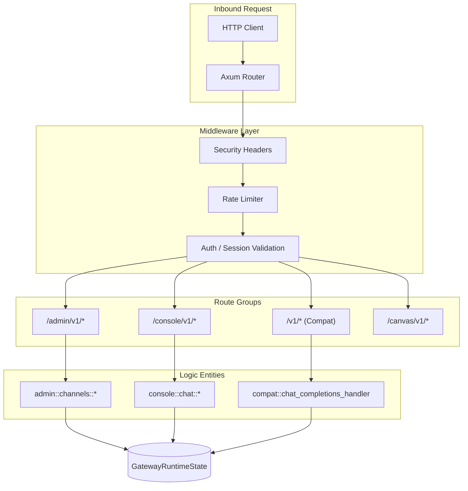
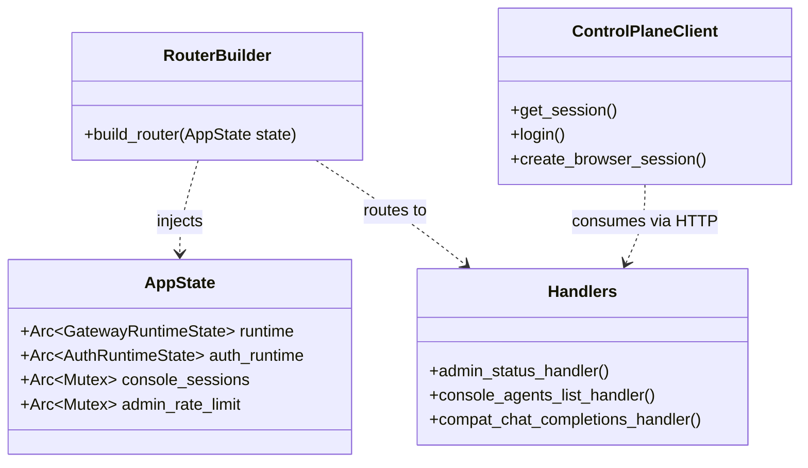

# HTTP Transport Layer and Admin/Console API

Relevant source files

The following files were used as context for generating this wiki page:

- apps/web/src/console/ConsoleRoutedShell.tsx
- apps/web/src/console/ConsoleShell.snapshot.test.tsx
- apps/web/src/console/ConsoleShell.tsx
- apps/web/src/console/components/layout/ConsoleAuthScreen.tsx
- apps/web/src/console/components/layout/ConsoleBootScreen.tsx
- apps/web/src/console/sections/AgentsSection.tsx
- crates/palyra-cli/src/commands/auth.rs
- crates/palyra-control-plane/src/client.rs
- crates/palyra-control-plane/src/models.rs
- crates/palyra-daemon/src/access_control.rs
- crates/palyra-daemon/src/app/runtime.rs
- crates/palyra-daemon/src/app/state.rs
- crates/palyra-daemon/src/lib.rs
- crates/palyra-daemon/src/transport/http/handlers/compat.rs
- crates/palyra-daemon/src/transport/http/handlers/console/access.rs
- crates/palyra-daemon/src/transport/http/handlers/console/agents.rs
- crates/palyra-daemon/src/transport/http/handlers/console/auth.rs
- crates/palyra-daemon/src/transport/http/handlers/console/diagnostics.rs
- crates/palyra-daemon/src/transport/http/handlers/console/mod.rs
- crates/palyra-daemon/src/transport/http/handlers/mod.rs
- crates/palyra-daemon/src/transport/http/handlers/web_ui.rs
- crates/palyra-daemon/src/transport/http/middleware.rs
- crates/palyra-daemon/src/transport/http/router.rs

The HTTP Transport Layer in `palyrad` provides the primary web-based interface for management, agent interaction, and system diagnostics. Built on the **Axum** framework, it organizes functionality into distinct route groups catering to different consumers: the React-based Web Console, administrative CLI tools, and OpenAI-compatible API clients.

## AppState and Router Construction

The HTTP server is initialized by building an `AppState` which acts as the shared context for all request handlers. This state holds references to core subsystems like the `GatewayRuntimeState`, `JournalStore`, and `IdentityManager` [crates/palyra-daemon/src/app/runtime.rs#42-83](http://crates/palyra-daemon/src/app/runtime.rs#42-83).

The router is constructed in `build_router`, which partitions the API into four major namespaces [crates/palyra-daemon/src/transport/http/router.rs#17-150](http://crates/palyra-daemon/src/transport/http/router.rs#17-150):

| Route Group | Base Path | Purpose |
|:---|:---|:---|
| **Admin API** | `/admin/v1/` | Low-level system management, channel debugging, and skill quarantine. |
| **Console API** | `/console/v1/` | Backs the Web UI; handles sessions, chat, and resource management. |
| **Canvas API** | `/canvas/v1/` | Specialized endpoints for A2UI (Agent-to-User Interface) interactive components. |
| **Compat API** | `/v1/` | OpenAI-compatible surface for chat completions and model listing. |

### System Flow: Request to Handler
The following diagram illustrates how an inbound HTTP request is routed through middleware to the specific domain logic.

**HTTP Request Dispatch Flow**

Sources: [crates/palyra-daemon/src/transport/http/router.rs#17-150](http://crates/palyra-daemon/src/transport/http/router.rs#17-150), [crates/palyra-daemon/src/app/runtime.rs#42-83](http://crates/palyra-daemon/src/app/runtime.rs#42-83)

## Route Groups and Handlers

### Admin API (`/admin/v1/`)
The Admin API is used primarily for system-level introspection and recovery. Key handlers include:
*   **Journal/Status:** `admin_status_handler` and `admin_journal_recent_handler` provide visibility into the `JournalStore` [crates/palyra-daemon/src/transport/http/router.rs#19-20](http://crates/palyra-daemon/src/transport/http/router.rs#19-20).
*   **Channel Management:** Comprehensive endpoints for Discord/Slack connector lifecycle, including `admin_channel_health_refresh_handler` and `admin_channel_dead_letter_replay_handler` [crates/palyra-daemon/src/transport/http/router.rs#43-60](http://crates/palyra-daemon/src/transport/http/router.rs#43-60).
*   **Skill Control:** Allows administrators to manually `quarantine` or `enable` skills [crates/palyra-daemon/src/transport/http/router.rs#119-125](http://crates/palyra-daemon/src/transport/http/router.rs#119-125).

### Console API (`/console/v1/`)
This group supports the `apps/web` frontend. It is heavily focused on session-based operations:
*   **Auth & Access:** Handles `console_access_snapshot_handler` and API token rotation [crates/palyra-daemon/src/transport/http/router.rs#135-163](http://crates/palyra-daemon/src/transport/http/router.rs#135-163).
*   **Agent Management:** `console_agents_list_handler` and `console_agent_create_handler` interact with the `AgentRecord` logic [crates/palyra-daemon/src/transport/http/handlers/console/agents.rs#44-91](http://crates/palyra-daemon/src/transport/http/handlers/console/agents.rs#44-91).
*   **Diagnostics:** The `console_diagnostics_handler` aggregates health data from the browser service, plugins, and memory maintenance tasks [crates/palyra-daemon/src/transport/http/handlers/console/diagnostics.rs#6-70](http://crates/palyra-daemon/src/transport/http/handlers/console/diagnostics.rs#6-70).

### OpenAI Compatibility Layer (`/v1/`)
Palyra implements a subset of the OpenAI API to allow existing tools to connect seamlessly.
*   **Chat Completions:** `compat_chat_completions_handler` maps OpenAI-style `CompatChatCompletionsRequest` to internal `RunStreamRequest` objects [crates/palyra-daemon/src/transport/http/handlers/compat.rs#128-175](http://crates/palyra-daemon/src/transport/http/handlers/compat.rs#128-175).
*   **Models:** `compat_models_handler` returns a list of available model profiles configured in the daemon [crates/palyra-daemon/src/transport/http/handlers/compat.rs#105-126](http://crates/palyra-daemon/src/transport/http/handlers/compat.rs#105-126).

Sources: [crates/palyra-daemon/src/transport/http/router.rs#18-134](http://crates/palyra-daemon/src/transport/http/router.rs#18-134), [crates/palyra-daemon/src/transport/http/handlers/console/agents.rs#44-147](http://crates/palyra-daemon/src/transport/http/handlers/console/agents.rs#44-147), [crates/palyra-daemon/src/transport/http/handlers/compat.rs#128-175](http://crates/palyra-daemon/src/transport/http/handlers/compat.rs#128-175)

## Middleware and Security

The transport layer enforces several security and resource constraints via Axum middleware:

1.  **Rate Limiting:** Separate buckets are maintained in `AppState` for Admin, Canvas, and Compat APIs. Limits are enforced per IP address or per API token [crates/palyra-daemon/src/app/runtime.rs#62-66](http://crates/palyra-daemon/src/app/runtime.rs#62-66).
2.  **CSRF & Session Cookies:** The Console API uses `authorize_console_session` to validate session cookies and CSRF tokens for state-changing (POST/PUT) requests [crates/palyra-daemon/src/transport/http/handlers/console/diagnostics.rs#10-11](http://crates/palyra-daemon/src/transport/http/handlers/console/diagnostics.rs#10-11).
3.  **Security Headers:** The `admin_console_security_headers_middleware` injects `Content-Security-Policy`, `X-Frame-Options`, and `Strict-Transport-Security` to protect the Web UI [crates/palyra-daemon/src/transport/http/router.rs#131-133](http://crates/palyra-daemon/src/transport/http/router.rs#131-133).
4.  **Body Limits:** A global `HTTP_MAX_REQUEST_BODY_BYTES` is enforced to prevent DoS via large payloads [crates/palyra-daemon/src/transport/http/router.rs#126](http://crates/palyra-daemon/src/transport/http/router.rs#126).

Sources: [crates/palyra-daemon/src/transport/http/router.rs#126-133](http://crates/palyra-daemon/src/transport/http/router.rs#126-133), [crates/palyra-daemon/src/app/runtime.rs#62-66](http://crates/palyra-daemon/src/app/runtime.rs#62-66)

## Web UI Serving

The daemon includes a built-in handler for serving the React dashboard (`apps/web`). The `web_ui_entry_handler` resolves assets from the local filesystem or an environment-specified directory [crates/palyra-daemon/src/transport/http/handlers/web_ui.rs#16-34](http://crates/palyra-daemon/src/transport/http/handlers/web_ui.rs#16-34).

*   **Asset Resolution:** It searches for a `web/` or `dist/` folder relative to the `palyrad` executable [crates/palyra-daemon/src/transport/http/handlers/web_ui.rs#125-148](http://crates/palyra-daemon/src/transport/http/handlers/web_ui.rs#125-148).
*   **Fallback SPA Routing:** If a requested path does not exist as a file, the handler serves `index.html` to support client-side React routing [crates/palyra-daemon/src/transport/http/handlers/web_ui.rs#187-192](http://crates/palyra-daemon/src/transport/http/handlers/web_ui.rs#187-192).

**Code Entity Association: Transport to State**

Sources: [crates/palyra-daemon/src/app/runtime.rs#42-83](http://crates/palyra-daemon/src/app/runtime.rs#42-83), [crates/palyra-daemon/src/transport/http/router.rs#17-150](http://crates/palyra-daemon/src/transport/http/router.rs#17-150), [crates/palyra-control-plane/src/client.rs#40-91](http://crates/palyra-control-plane/src/client.rs#40-91)

## Control Plane Client

The `palyra-control-plane` crate provides a Rust-native `ControlPlaneClient` used by the CLI and desktop app to interact with the HTTP API. It manages:
*   **CSRF Lifecycle:** Automatically extracts and includes CSRF tokens from the `console/v1/auth/session` endpoint [crates/palyra-control-plane/src/client.rs#67-73](http://crates/palyra-control-plane/src/client.rs#67-73).
*   **Retry Logic:** Implements `safe_read_retries` for GET requests [crates/palyra-control-plane/src/client.rs#12](http://crates/palyra-control-plane/src/client.rs#12).
*   **Typed Models:** Uses shared structs from `models.rs` (e.g., `AgentRecord`, `SecretMetadata`) to ensure protocol parity between the daemon and its clients [crates/palyra-control-plane/src/models.rs#177-190](http://crates/palyra-control-plane/src/models.rs#177-190).

Sources: [crates/palyra-control-plane/src/client.rs#33-83](http://crates/palyra-control-plane/src/client.rs#33-83), [crates/palyra-control-plane/src/models.rs#177-190](http://crates/palyra-control-plane/src/models.rs#177-190)
