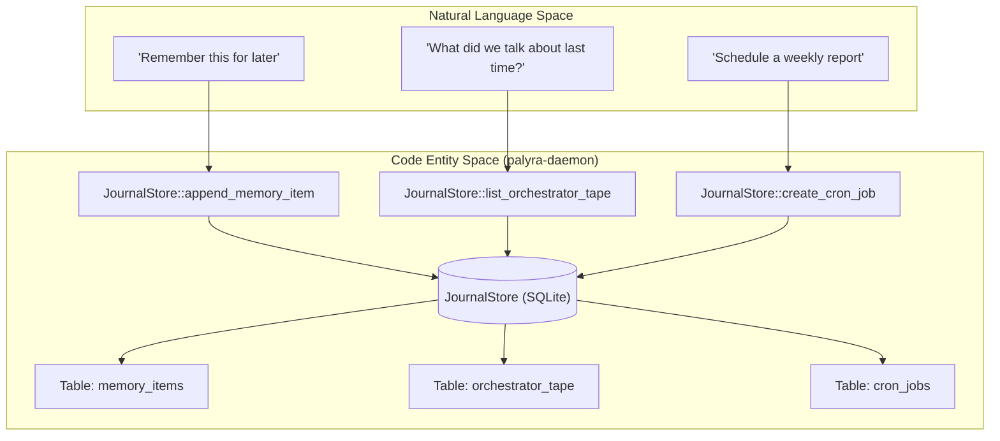
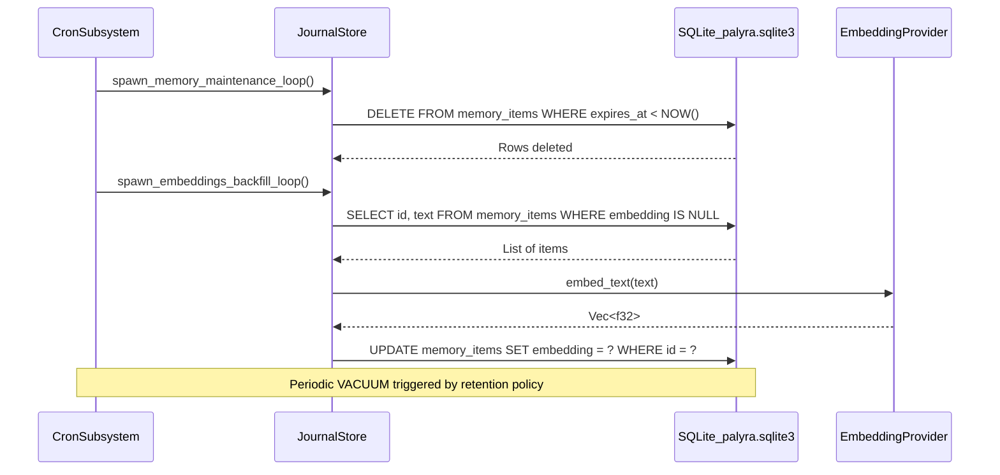

# Journal Store and Persistence

Relevant source files

The following files were used as context for generating this wiki page:

- crates/palyra-cli/src/cli.rs
- crates/palyra-cli/tests/help_snapshots/sessions-help.txt
- crates/palyra-common/src/daemon_config_schema.rs
- crates/palyra-daemon/src/application/mod.rs
- crates/palyra-daemon/src/application/provider_input.rs
- crates/palyra-daemon/src/background_queue.rs
- crates/palyra-daemon/src/channels.rs
- crates/palyra-daemon/src/cron.rs
- crates/palyra-daemon/src/domain/workspace.rs
- crates/palyra-daemon/src/gateway.rs
- crates/palyra-daemon/src/gateway/canvas.rs
- crates/palyra-daemon/src/gateway/runtime.rs
- crates/palyra-daemon/src/gateway/tests.rs
- crates/palyra-daemon/src/journal.rs
- crates/palyra-daemon/src/media.rs
- crates/palyra-daemon/src/media_derived.rs
- crates/palyra-daemon/src/model_provider.rs
- crates/palyra-daemon/src/transport/grpc/services/gateway/service.rs
- crates/palyra-daemon/src/transport/http/handlers/console/chat.rs
- crates/palyra-daemon/src/transport/http/handlers/console/memory.rs
- crates/palyra-daemon/src/transport/http/handlers/console/sessions.rs
- crates/palyra-daemon/tests/gateway_grpc.rs

The **Journal Store** is the primary persistence engine for the Palyra daemon (`palyrad`). It is a SQLite-backed system responsible for maintaining the immutable audit log (hash-chained), managing orchestrator sessions, storing memory items for RAG (Retrieval-Augmented Generation), and handling background task states.

## SQLite Journal Architecture

The system uses a centralized SQLite database to ensure ACID compliance across diverse data types, including session tapes, cron jobs, and vector-like memory embeddings.

### Hash-Chained Audit Log
To ensure integrity and non-repudiation, the `JournalStore` implements a hash-chained audit log. Every significant event appended to the journal includes a `parent_hash` and a `record_hash` (SHA-256).
*   **Chain Seed**: The chain starts with a predefined seed `[gateway.rs#114-115](http://gateway.rs#114-115)`.
*   **Validation**: New events are hashed using the previous record's hash, creating a cryptographic link between all journal entries.

### Orchestrator Tape
The `OrchestratorTapeRecord` is the persistent representation of an agent's "thought process" and interaction history within a specific `Run`.
*   **Events**: Tapes store `ModelToken` events, `ToolProposal` events, and `ToolExecution` outcomes `[journal.rs#69-70](http://journal.rs#69-70)`.
*   **Context Management**: When starting a new run, the system retrieves previous tape events to build the LLM prompt context, limited by `MAX_PREVIOUS_RUN_CONTEXT_TAPE_EVENTS` (128) and `MAX_PREVIOUS_RUN_CONTEXT_TURNS` (6) `[gateway.rs#122-123](http://gateway.rs#122-123)`.

### Data Flow: Persistence Layer
The following diagram illustrates how the `JournalStore` bridges high-level orchestrator requests to the underlying SQLite implementation.

**Diagram: Persistence Layer Mapping**

Sources: `[crates/palyra-daemon/src/journal.rs#63-71](http://crates/palyra-daemon/src/journal.rs#63-71)`, `[crates/palyra-daemon/src/gateway.rs#122-124](http://crates/palyra-daemon/src/gateway.rs#122-124)`

---

## Memory Items and RAG

Palyra implements a hybrid search system for long-term memory, combining traditional metadata filtering with vector-based similarity.

### MemoryEmbeddingProvider
The `MemoryEmbeddingProvider` trait defines how text is transformed into vectors for search `[journal.rs#64-68](http://journal.rs#64-68)`.
*   **HashMemoryEmbeddingProvider**: A deterministic provider that generates fixed-dimension vectors (default 64) using a hashing algorithm `[journal.rs#71-100](http://journal.rs#71-100)`.
*   **OpenAI Embeddings**: Can be configured via `model_provider` to use external LLM embedding models like `text-embedding-3-small` `[daemon_config_schema.rs#199-201](http://daemon_config_schema.rs#199-201)`.

### Hybrid Search and Ranking
The `MemorySearchRequest` triggers a two-phase process:
1.  **Candidate Selection**: Filters by `principal`, `device_id`, and `tags` `[journal.rs#66-67](http://journal.rs#66-67)`.
2.  **Vector Comparison**: Calculates cosine similarity (or hash distance) between the query embedding and stored items.
3.  **Limits**: Search is capped at `MAX_MEMORY_SEARCH_TOP_K` (64) results `[gateway.rs#117-117](http://gateway.rs#117-117)`.

---

## Session Maintenance and Compaction

To prevent database bloat and maintain LLM performance, Palyra implements several maintenance strategies.

### Session Compaction
As sessions grow, the orchestrator triggers compaction via `build_session_compaction_plan` `[transport/http/handlers/console/chat.rs#2-4](http://transport/http/handlers/console/chat.rs#2-4)`. This process:
1.  Identifies old or redundant tape events.
2.  Creates a `Checkpoint` representing the summarized state.
3.  Archives or deletes the granular events to save space.

### Cron Maintenance Tasks
The system runs several background loops for data hygiene:
*   **Memory Maintenance**: Runs every 5 minutes (`MEMORY_MAINTENANCE_INTERVAL`) to prune items exceeding the `MemoryRetentionPolicy` `[cron.rs#56-56](http://cron.rs#56-56)`.
*   **Embeddings Backfill**: Every 10 minutes, the system checks for memory items missing embeddings and generates them in batches of 64 `[cron.rs#57-58](http://cron.rs#57-58)`.
*   **VACUUM**: Standard SQLite maintenance tasks are scheduled to reclaim disk space after large deletions `[daemon_config_schema.rs#167-167](http://daemon_config_schema.rs#167-167)`.

**Diagram: Journal Maintenance Lifecycle**

Sources: `[crates/palyra-daemon/src/cron.rs#56-58](http://crates/palyra-daemon/src/cron.rs#56-58)`, `[crates/palyra-daemon/src/journal.rs#55-57](http://crates/palyra-daemon/src/journal.rs#55-57)`, `[crates/palyra-daemon/src/gateway/runtime.rs#72-73](http://crates/palyra-daemon/src/gateway/runtime.rs#72-73)`

---

## Configuration and Governance

The persistence layer is governed by the `FileMemoryConfig` and `FileStorageConfig` sections of the `palyra.toml` `[daemon_config_schema.rs#145-151](http://daemon_config_schema.rs#145-151)`.

| Configuration Key | Default Value | Purpose |
| :--- | :--- | :--- |
| `max_item_bytes` | 16 KB | Max size of a single memory item `[gateway.rs#118-118](http://gateway.rs#118-118)` |
| `retention_ttl_days` | 30 Days | How long memory items persist before pruning `[gateway/runtime.rs#119-119](http://gateway/runtime.rs#119-119)` |
| `vacuum_schedule` | `0 0 * * 0` | Cron expression for database optimization `[gateway/runtime.rs#123-123](http://gateway/runtime.rs#123-123)` |
| `max_tape_entries` | 1024 | Hard limit on events per run to prevent context overflow `[gateway.rs#103-103](http://gateway.rs#103-103)` |

### Security and Redaction
Sensitive keys (e.g., "password", "api_key", "secret") are automatically detected and redacted before being logged to the journal to prevent accidental credential leakage in audit logs `[journal.rs#31-45](http://journal.rs#31-45)`.

Sources: `[crates/palyra-daemon/src/gateway.rs#118-121](http://crates/palyra-daemon/src/gateway.rs#118-121)`, `[crates/palyra-daemon/src/journal.rs#31-45](http://crates/palyra-daemon/src/journal.rs#31-45)`, `[crates/palyra-common/src/daemon_config_schema.rs#145-151](http://crates/palyra-common/src/daemon_config_schema.rs#145-151)`
