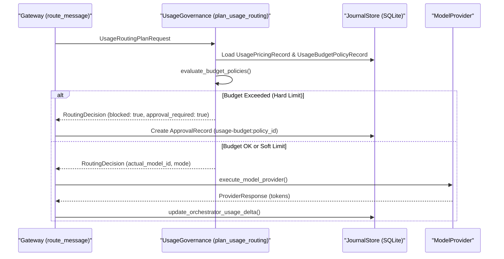

# Usage Governance and Budget Controls

<details>
<summary>Relevant source files</summary>

The following files were used as context for generating this wiki page:

- apps/web/src/App.test.tsx
- apps/web/src/App.tsx
- apps/web/src/console/hooks/useUsageDomain.ts
- apps/web/src/consoleApi.test.ts
- apps/web/src/consoleApi.ts
- crates/palyra-browserd/src/engine/chromium.rs
- crates/palyra-cli/src/commands/daemon.rs
- crates/palyra-daemon/src/application/route_message/orchestration.rs
- crates/palyra-daemon/src/application/run_stream/orchestration.rs
- crates/palyra-daemon/src/transport/http/handlers/console/usage.rs
- crates/palyra-daemon/src/usage_governance.rs
- crates/palyra-daemon/tests/admin_surface.rs

</details>


The `UsageGovernance` subsystem is responsible for tracking token consumption, estimating financial costs, and enforcing budget policies across the Palyra platform. It provides the mechanism for "Smart Routing" based on cost/complexity and manages the lifecycle of budget overrides through human-in-the-loop approvals.

## Architecture Overview

Usage governance sits between the Gateway orchestration layer and the Model Providers. Every LLM request (Run) triggers a routing plan evaluation that checks against defined `UsageBudgetPolicyRecord` entries.

### Key Components

*   **Token Tracking**: Real-time estimation of prompt tokens and recording of actual completion tokens in the `JournalStore`.
*   **Cost Estimation**: Calculation of `estimated_cost_usd` using `UsagePricingRecord` snapshots [crates/palyra-daemon/src/usage_governance.rs#11-13](http://crates/palyra-daemon/src/usage_governance.rs#11-13).
*   **Budget Evaluation**: The `UsageBudgetEvaluation` struct tracks consumption against soft and hard limits [crates/palyra-daemon/src/usage_governance.rs#88-105](http://crates/palyra-daemon/src/usage_governance.rs#88-105).
*   **Approval Workflow**: When a hard limit is hit, the system can transition to a `requestUsageBudgetOverride` state, requiring an `ApprovalRecord` to proceed [crates/palyra-daemon/src/usage_governance.rs#228-230](http://crates/palyra-daemon/src/usage_governance.rs#228-230).

### Data Flow: Request Routing and Budgeting

The following diagram illustrates how a message request is processed through the governance layer.

**Usage Governance Data Flow**

Sources: [crates/palyra-daemon/src/application/route_message/orchestration.rs#33-34](http://crates/palyra-daemon/src/application/route_message/orchestration.rs#33-34), [crates/palyra-daemon/src/usage_governance.rs#201-213](http://crates/palyra-daemon/src/usage_governance.rs#201-213), [crates/palyra-daemon/src/usage_governance.rs#108-126](http://crates/palyra-daemon/src/usage_governance.rs#108-126)

## Smart Routing and Enforcement Modes

Routing behavior is governed by the `RoutingMode` enum, which determines how strictly budget and model recommendations are applied.

| Mode | Behavior |
| :--- | :--- |
| `Suggest` | Records recommendations but uses the default model. Does not block for budgets [crates/palyra-daemon/src/usage_governance.rs#33](http://crates/palyra-daemon/src/usage_governance.rs#33). |
| `DryRun` | Simulates enforcement in logs but does not interrupt the flow [crates/palyra-daemon/src/usage_governance.rs#34](http://crates/palyra-daemon/src/usage_governance.rs#34). |
| `Enforced` | Strictly applies model overrides and blocks execution if budgets are exceeded [crates/palyra-daemon/src/usage_governance.rs#35](http://crates/palyra-daemon/src/usage_governance.rs#35). |

Sources: [crates/palyra-daemon/src/usage_governance.rs#24-47](http://crates/palyra-daemon/src/usage_governance.rs#24-47)

## Implementation Details

### Usage Tracking Entities
The system maps high-level usage concepts to specific Rust structs used for persistence and API transport.

**Governance Entity Mapping**
```mermaid
classDiagram
    class "UsageBudgetPolicyRecord" {
        +policy_id: String
        +soft_limit_value: f64
        +hard_limit_value: f64
        +metric_kind: String
    }
    class "UsageBudgetEvaluation" {
        +status: String
        +consumed_value: f64
        +projected_value: f64
        +message: String
    }
    class "PricingEstimate" {
        +lower_usd: f64
        +upper_usd: f64
        +source: String
    }
    
    UsageBudgetPolicyRecord --> UsageBudgetEvaluation : "generates"
    UsageBudgetEvaluation ..> PricingEstimate : "uses for projection"
```
Sources: [crates/palyra-daemon/src/usage_governance.rs#88-105](http://crates/palyra-daemon/src/usage_governance.rs#88-105), [crates/palyra-daemon/src/usage_governance.rs#64-73](http://crates/palyra-daemon/src/usage_governance.rs#64-73), [apps/web/src/consoleApi.ts#245-260](http://apps/web/src/consoleApi.ts#245-260)

### Budget Evaluation Logic
The `evaluate_budget_policies` function (called via `plan_usage_routing`) performs the following steps:
1.  Retrieves consumption totals from the `JournalStore` for the relevant `scope_id` (e.g., a specific session or principal).
2.  Calculates the `projected_value` by adding the current request's `prompt_tokens_estimate` to the consumed total [crates/palyra-daemon/src/usage_governance.rs#137](http://crates/palyra-daemon/src/usage_governance.rs#137).
3.  Compares totals against `soft_limit_value` (triggers alerts) and `hard_limit_value` (triggers blocks) [crates/palyra-daemon/src/usage_governance.rs#101-103](http://crates/palyra-daemon/src/usage_governance.rs#101-103).

## Approval Workflow for Overrides

When a user encounters a budget block, they can request an override. This is handled by the `request_usage_budget_override` function.

1.  **Request**: The client calls the `/console/v1/usage/budget/policy/:id/override` endpoint [crates/palyra-daemon/src/transport/http/handlers/console/usage.rs#126-129](http://crates/palyra-daemon/src/transport/http/handlers/console/usage.rs#126-129).
2.  **Creation**: The system creates an `ApprovalRecord` with a subject ID prefixed by `usage-budget:` [crates/palyra-daemon/src/usage_governance.rs#20](http://crates/palyra-daemon/src/usage_governance.rs#20).
3.  **Human Intervention**: An administrator reviews the request in the "Approvals" section of the Web Console.
4.  **Resolution**: Once approved, the `evaluate_budget_policies` logic checks for valid `ApprovalDecision` entries that cover the current time window, allowing the run to proceed despite the limit [crates/palyra-daemon/src/usage_governance.rs#15-16](http://crates/palyra-daemon/src/usage_governance.rs#15-16).

Sources: [crates/palyra-daemon/src/usage_governance.rs#228-230](http://crates/palyra-daemon/src/usage_governance.rs#228-230), [crates/palyra-daemon/src/transport/http/handlers/console/usage.rs#132-144](http://crates/palyra-daemon/src/transport/http/handlers/console/usage.rs#132-144)

## Console Integration

The Web Console provides a dedicated "Usage" domain for visualizing these controls.

*   **`useUsageDomain`**: A React hook that orchestrates fetching `UsageSummaryEnvelope`, `UsageAgentsEnvelope`, and `UsageModelsEnvelope` [apps/web/src/console/hooks/useUsageDomain.ts#23-35](http://apps/web/src/console/hooks/useUsageDomain.ts#23-35).
*   **`ConsoleApiClient`**: Implements methods like `getUsageSummary` and `requestUsageBudgetOverride` to interface with the daemon's HTTP handlers [apps/web/src/consoleApi.ts#80-162](http://apps/web/src/consoleApi.ts#80-162).
*   **Timeline Visualization**: Data is aggregated into `UsageTimelineBucket` objects for rendering cost and token charts [apps/web/src/consoleApi.ts#110-122](http://apps/web/src/consoleApi.ts#110-122).

Sources: [apps/web/src/console/hooks/useUsageDomain.ts#72-83](http://apps/web/src/console/hooks/useUsageDomain.ts#72-83), [apps/web/src/consoleApi.ts#124-130](http://apps/web/src/consoleApi.ts#124-130)
