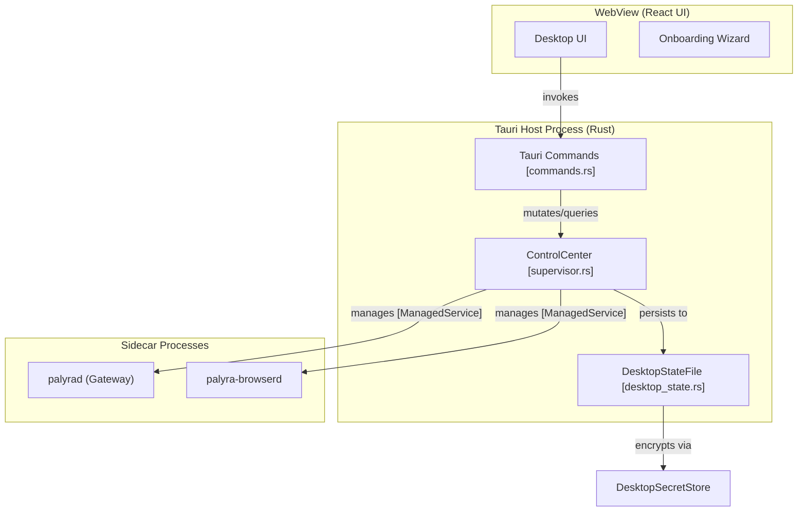

# Desktop Application (Tauri)

<details>
<summary>Relevant source files</summary>

The following files were used as context for generating this wiki page:

- apps/desktop/README.md
- apps/desktop/src-tauri/src/commands.rs
- apps/desktop/src-tauri/src/desktop_state.rs
- apps/desktop/src-tauri/src/lib.rs
- apps/desktop/src-tauri/src/onboarding.rs
- apps/desktop/src-tauri/src/snapshot.rs
- apps/desktop/src-tauri/src/supervisor.rs
- apps/desktop/src-tauri/src/tests.rs
- apps/web/README.md

</details>


The Palyra Desktop Application is a Tauri-based control center that acts as a process supervisor for the core system daemons: `palyrad` (the gateway) and `palyra-browserd` (the browser automation engine) [apps/desktop/README.md#3-5](http://apps/desktop/README.md#3-5). It provides a native management surface for operators on Windows and macOS, handling the initial setup, health monitoring, and secure handoff to the web-based operator console [apps/desktop/README.md#9-36](http://apps/desktop/README.md#9-36).

The application serves three primary roles:
1.  **Process Supervision**: Ensuring the local daemons are running, healthy, and correctly configured with loopback-only networking [apps/desktop/src-tauri/src/supervisor.rs#201-218](http://apps/desktop/src-tauri/src/supervisor.rs#201-218).
2.  **Onboarding**: Guiding new users through environment checks, state root initialization, and model provider (OpenAI) or channel (Discord) authentication [apps/desktop/src-tauri/src/desktop_state.rs#209-219](http://apps/desktop/src-tauri/src/desktop_state.rs#209-219).
3.  **Desktop Companion**: A lightweight chat and notification interface that allows for quick interactions and approval management without opening a full browser [apps/desktop/README.md#27-33](http://apps/desktop/README.md#27-33).

### System Component Relationship

The following diagram illustrates how the Tauri application bridges the native host environment with the Palyra service layer.

**Tauri Desktop Architecture**

Sources: [apps/desktop/src-tauri/src/lib.rs#24-45](http://apps/desktop/src-tauri/src/lib.rs#24-45), [apps/desktop/src-tauri/src/supervisor.rs#201-218](http://apps/desktop/src-tauri/src/supervisor.rs#201-218), [apps/desktop/README.md#42-59](http://apps/desktop/README.md#42-59)

---

### ControlCenter and Process Supervision
The core logic of the desktop application resides in the `ControlCenter` struct. It manages the lifecycle of `palyrad` and `palyra-browserd` using a `supervisor_loop` that runs every 500ms [apps/desktop/src-tauri/src/lib.rs#1-1](http://apps/desktop/src-tauri/src/lib.rs#1-1). The supervisor handles automatic restarts with exponential backoff and aggregates logs into a bounded memory buffer for diagnostic display [apps/desktop/src-tauri/src/supervisor.rs#97-123](http://apps/desktop/src-tauri/src/supervisor.rs#97-123).

**Key Entities:**
| Entity | Responsibility |
| :--- | :--- |
| `ManagedService` | Tracks PID, child process handle, exit status, and log buffer for a sidecar [apps/desktop/src-tauri/src/supervisor.rs#97-123](http://apps/desktop/src-tauri/src/supervisor.rs#97-123). |
| `ServiceKind` | Enum defining the two managed services: `Gateway` and `Browserd` [apps/desktop/src-tauri/src/supervisor.rs#30-33](http://apps/desktop/src-tauri/src/supervisor.rs#30-33). |
| `DesktopStateFile` | JSON-based persistence for onboarding progress and user preferences [apps/desktop/src-tauri/src/desktop_state.rs#245-257](http://apps/desktop/src-tauri/src/desktop_state.rs#245-257). |

For details, see [ControlCenter and Process Supervision](controlcenter_and_process_supervision/README.md).

---

### Desktop Onboarding and UI
The application includes a multi-step `DesktopOnboardingStep` state machine that ensures the environment is ready before the operator transitions to the main dashboard [apps/desktop/src-tauri/src/desktop_state.rs#209-219](http://apps/desktop/src-tauri/src/desktop_state.rs#209-219). This includes verifying port availability, setting up the `PALYRA_STATE_ROOT`, and bootstrapping the initial admin token for the gateway [apps/desktop/src-tauri/src/onboarding.rs#199-210](http://apps/desktop/src-tauri/src/onboarding.rs#199-210).

The UI is built with React and communicates with the Rust backend via Tauri commands like `get_snapshot` and `get_onboarding_status` [apps/desktop/src-tauri/src/commands.rs#54-92](http://apps/desktop/src-tauri/src/commands.rs#54-92).

**Onboarding Flow Mapping**
```mermaid
state_transitionGraph
    direction LR
    "Welcome [Step]" --> "Environment [Check]"
    "Environment [Check]" --> "StateRoot [Init]"
    "StateRoot [Init]" --> "GatewayInit [palyrad]"
    "GatewayInit [palyrad]" --> "OperatorAuthBootstrap"
    "OperatorAuthBootstrap" --> "OpenAiConnect"
    "OpenAiConnect" --> "DashboardHandoff"
```
Sources: [apps/desktop/src-tauri/src/desktop_state.rs#209-219](http://apps/desktop/src-tauri/src/desktop_state.rs#209-219), [apps/desktop/src-tauri/src/onboarding.rs#78-110](http://apps/desktop/src-tauri/src/onboarding.rs#78-110)

For details, see [Desktop Onboarding and UI](desktop_onboarding_and_ui/README.md).

---

### Security and Handoff
The desktop app maintains security by ensuring all control-plane communication occurs over loopback (`127.0.0.1`) [apps/desktop/README.md#91-95](http://apps/desktop/README.md#91-95). It manages sensitive credentials like the `desktop_admin_token` using the `DesktopSecretStore`, which interfaces with platform-native vaults (e.g., macOS Keychain, Windows DPAPI) [apps/desktop/src-tauri/src/lib.rs#11-12](http://apps/desktop/src-tauri/src/lib.rs#11-12), [apps/desktop/src-tauri/src/desktop_state.rs#231-232](http://apps/desktop/src-tauri/src/desktop_state.rs#231-232).

When an operator clicks "Open Dashboard", the application generates a secure handoff URL that includes the admin token, allowing the browser to authenticate the session without manual password entry [apps/desktop/src-tauri/src/snapshot.rs#30-31](http://apps/desktop/src-tauri/src/snapshot.rs#30-31).

Sources: [apps/desktop/README.md#42-59](http://apps/desktop/README.md#42-59), [apps/desktop/src-tauri/src/lib.rs#5-12](http://apps/desktop/src-tauri/src/lib.rs#5-12), [apps/desktop/src-tauri/src/supervisor.rs#201-218](http://apps/desktop/src-tauri/src/supervisor.rs#201-218)

## Child Pages

- [ControlCenter and Process Supervision](controlcenter_and_process_supervision/README.md)
- [Desktop Onboarding and UI](desktop_onboarding_and_ui/README.md)
