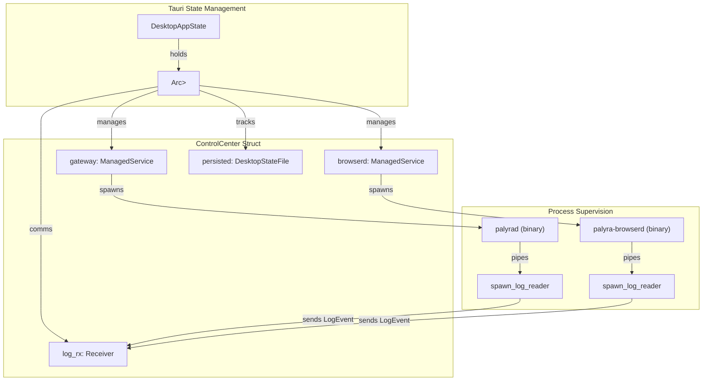
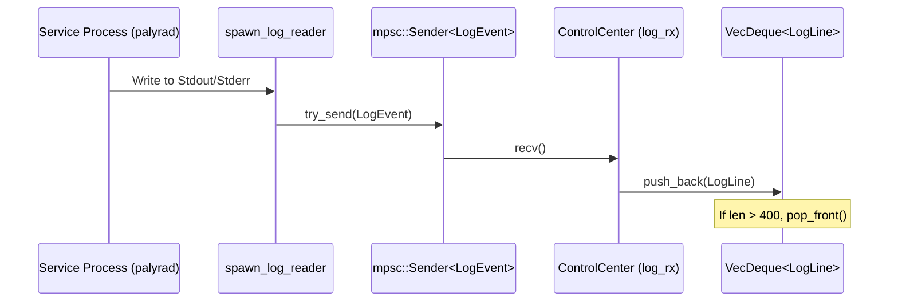

# ControlCenter and Process Supervision

Relevant source files

The following files were used as context for generating this wiki page:

- apps/README.md
- apps/desktop/src-tauri/Cargo.lock
- apps/desktop/src-tauri/Cargo.toml
- apps/desktop/src-tauri/build.rs
- apps/desktop/src-tauri/icons/icon.ico
- apps/desktop/src-tauri/src/commands.rs
- apps/desktop/src-tauri/src/desktop_state.rs
- apps/desktop/src-tauri/src/lib.rs
- apps/desktop/src-tauri/src/main.rs
- apps/desktop/src-tauri/src/onboarding.rs
- apps/desktop/src-tauri/src/snapshot.rs
- apps/desktop/src-tauri/src/supervisor.rs
- apps/desktop/src-tauri/src/tests.rs

The `ControlCenter` is the core supervisor of the Palyra Desktop application. It acts as a process manager for the two primary backend services: `palyrad` (the Gateway) and `palyra-browserd` (the Browser Service). It handles their lifecycle, monitors health, aggregates logs, and manages the persistence of the desktop application's state.

## ControlCenter Architecture

The `ControlCenter` struct is the central authority for the desktop app's runtime. It is managed as a thread-safe state within Tauri using `Arc<Mutex<ControlCenter>>` [apps/desktop/src-tauri/src/commands.rs#49-51](http://apps/desktop/src-tauri/src/commands.rs#49-51).

### ManagedService Lifecycle
Each service (Gateway and Browserd) is wrapped in a `ManagedService` struct [apps/desktop/src-tauri/src/supervisor.rs#97-107](http://apps/desktop/src-tauri/src/supervisor.rs#97-107).
*   **Desired State**: The `desired_running` flag determines if the supervisor should attempt to keep the process alive [apps/desktop/src-tauri/src/supervisor.rs#98](http://apps/desktop/src-tauri/src/supervisor.rs#98).
*   **Process Tracking**: It tracks the `Child` process handle, the `pid`, and the `last_start_unix_ms` [apps/desktop/src-tauri/src/supervisor.rs#99-101](http://apps/desktop/src-tauri/src/supervisor.rs#99-101).
*   **Port Mapping**: It maintains a list of `bound_ports` (e.g., 7142 for Gateway Admin, 7543 for Browser gRPC) used for health checks [apps/desktop/src-tauri/src/supervisor.rs#106](http://apps/desktop/src-tauri/src/supervisor.rs#106).

### Supervisor Loop and Reconciliation
The supervisor operates on a periodic tick defined by `SUPERVISOR_TICK_MS` (500ms) [apps/desktop/src-tauri/src/lib.rs#1](http://apps/desktop/src-tauri/src/lib.rs#1). In each iteration, it performs:
1.  **Liveness Checks**: Verifies if the child processes are still running.
2.  **Backoff Logic**: If a service has exited but `desired_running` is true, it calculates a restart delay using exponential backoff [apps/desktop/src-tauri/src/supervisor.rs#102-103](http://apps/desktop/src-tauri/src/supervisor.rs#102-103).
3.  **Health Probing**: Attempts to reach the health endpoints of the services via the `http_client` [apps/desktop/src-tauri/src/supervisor.rs#212](http://apps/desktop/src-tauri/src/supervisor.rs#212).

### ControlCenter Entity Mapping
The following diagram maps the high-level supervision concepts to the specific Rust entities in the codebase.

**Diagram: Supervision Entity Map**

*Sources: [apps/desktop/src-tauri/src/commands.rs#49-51](http://apps/desktop/src-tauri/src/commands.rs#49-51), [apps/desktop/src-tauri/src/supervisor.rs#201-218](http://apps/desktop/src-tauri/src/supervisor.rs#201-218), [apps/desktop/src-tauri/src/supervisor.rs#97-107](http://apps/desktop/src-tauri/src/supervisor.rs#97-107)*

---

## Log Aggregation and Rotation

The `ControlCenter` implements an asynchronous log reading pipeline to capture `stdout` and `stderr` from managed processes without blocking the supervisor loop.

### Implementation Details
*   **Reader Task**: For every started service, the supervisor calls `spawn_log_reader`, which uses `tokio::io::BufReader` to stream lines [apps/desktop/src-tauri/src/supervisor.rs#17-18](http://apps/desktop/src-tauri/src/supervisor.rs#17-18).
*   **Channel Communication**: Logs are sent through an `mpsc` channel with a capacity of `LOG_EVENT_CHANNEL_CAPACITY` (2,048) to prevent backpressure from slowing down the services [apps/desktop/src-tauri/src/lib.rs#3](http://apps/desktop/src-tauri/src/lib.rs#3).
*   **In-Memory Buffer**: Each `ManagedService` maintains a `VecDeque<LogLine>` [apps/desktop/src-tauri/src/supervisor.rs#105](http://apps/desktop/src-tauri/src/supervisor.rs#105).
*   **Rotation**: To prevent unbounded memory growth, the buffer is capped at `MAX_LOG_LINES_PER_SERVICE` (400 lines) [apps/desktop/src-tauri/src/lib.rs#2](http://apps/desktop/src-tauri/src/lib.rs#2).
*   **Sanitization**: Sensitive information in logs is passed through `sanitize_log_line` before being stored or sent to the UI [apps/desktop/src-tauri/src/snapshot.rs#23-27](http://apps/desktop/src-tauri/src/snapshot.rs#23-27).

**Diagram: Log Data Flow**

*Sources: [apps/desktop/src-tauri/src/lib.rs#1-3](http://apps/desktop/src-tauri/src/lib.rs#1-3), [apps/desktop/src-tauri/src/supervisor.rs#105](http://apps/desktop/src-tauri/src/supervisor.rs#105), [apps/desktop/src-tauri/src/supervisor.rs#215-216](http://apps/desktop/src-tauri/src/supervisor.rs#215-216)*

---

## DesktopStateFile and Persistence

The `DesktopStateFile` manages the persistent configuration and onboarding progress of the desktop application.

### Schema Versioning and Migration
The system uses `DESKTOP_STATE_SCHEMA_VERSION` (currently 4) to handle data evolution [apps/desktop/src-tauri/src/lib.rs#9](http://apps/desktop/src-tauri/src/lib.rs#9). 
*   **Loading**: The `load_or_initialize_state_file` function attempts to read `state.json` from the runtime root [apps/desktop/src-tauri/src/supervisor.rs#232](http://apps/desktop/src-tauri/src/supervisor.rs#232).
*   **Migration**: It utilizes `palyra_common::config_system::parse_document_with_migration` to upgrade older schema versions to the current format [apps/desktop/src-tauri/src/snapshot.rs#11-13](http://apps/desktop/src-tauri/src/snapshot.rs#11-13).

### DesktopSecretStore
Secrets such as the `desktop_admin_token` and `desktop_browser_auth_token` are not stored in the plain-text `state.json`. Instead, they are managed by the `DesktopSecretStore`, which interfaces with the `palyra-vault` crate [apps/desktop/src-tauri/src/desktop_state.rs#8](http://apps/desktop/src-tauri/src/desktop_state.rs#8).
*   **Keys**: Fixed keys are used for lookups, such as `desktop_admin_token` [apps/desktop/src-tauri/src/lib.rs#11](http://apps/desktop/src-tauri/src/lib.rs#11).
*   **Constraints**: Secrets are limited to `DESKTOP_SECRET_MAX_BYTES` (4,096) [apps/desktop/src-tauri/src/lib.rs#10](http://apps/desktop/src-tauri/src/lib.rs#10).

| Field | Type | Description |
| :--- | :--- | :--- |
| `onboarding_step` | `DesktopOnboardingStep` | Current phase of the setup wizard [apps/desktop/src-tauri/src/desktop_state.rs#209-219](http://apps/desktop/src-tauri/src/desktop_state.rs#209-219) |
| `runtime_state_root_override` | `Option<PathBuf>` | User-selected path for data storage [apps/desktop/src-tauri/src/supervisor.rs#140-146](http://apps/desktop/src-tauri/src/supervisor.rs#140-146) |
| `browser_service_enabled` | `bool` | Whether `palyra-browserd` should be started [apps/desktop/src-tauri/src/commands.rs#154-162](http://apps/desktop/src-tauri/src/commands.rs#154-162) |
| `companion` | `DesktopCompanionState` | State for the tray-based companion UI [apps/desktop/src-tauri/src/desktop_state.rs#90-101](http://apps/desktop/src-tauri/src/desktop_state.rs#90-101) |

*Sources: [apps/desktop/src-tauri/src/lib.rs#9-12](http://apps/desktop/src-tauri/src/lib.rs#9-12), [apps/desktop/src-tauri/src/desktop_state.rs#209-219](http://apps/desktop/src-tauri/src/desktop_state.rs#209-219), [apps/desktop/src-tauri/src/supervisor.rs#231-233](http://apps/desktop/src-tauri/src/supervisor.rs#231-233)*

---

## Tauri Command Interface

The `ControlCenter` exposes its functionality to the frontend via Tauri commands defined in `commands.rs`.

### Key Commands
*   **`get_snapshot`**: Returns a `ControlCenterSnapshot` containing the current status of all processes, aggregated logs, and system health metrics [apps/desktop/src-tauri/src/commands.rs#54-62](http://apps/desktop/src-tauri/src/commands.rs#54-62).
*   **`get_onboarding_status`**: Provides the current step and progress of the onboarding flow [apps/desktop/src-tauri/src/commands.rs#83-92](http://apps/desktop/src-tauri/src/commands.rs#83-92).
*   **`set_onboarding_state_root_command`**: Allows the user to configure where the Palyra data (SQLite DBs, logs, etc.) is stored [apps/desktop/src-tauri/src/commands.rs#135-151](http://apps/desktop/src-tauri/src/commands.rs#135-151).
*   **`set_browser_service_enabled`**: Toggles the lifecycle of the `palyra-browserd` process [apps/desktop/src-tauri/src/commands.rs#154-162](http://apps/desktop/src-tauri/src/commands.rs#154-162).

### Snapshot Generation
The snapshot is built by calling `capture_snapshot_inputs` on the `ControlCenter`, which gathers volatile process information, and then passing it to `build_snapshot_from_inputs` [apps/desktop/src-tauri/src/snapshot.rs#204-216](http://apps/desktop/src-tauri/src/snapshot.rs#204-216). This includes:
*   `OverallStatus`: (Healthy, Degraded, or Down) [apps/desktop/src-tauri/src/snapshot.rs#166-170](http://apps/desktop/src-tauri/src/snapshot.rs#166-170).
*   `QuickFacts`: Version info, uptime, and dashboard URLs [apps/desktop/src-tauri/src/snapshot.rs#88-96](http://apps/desktop/src-tauri/src/snapshot.rs#88-96).
*   `Diagnostics`: Recent errors and dropped log event counts [apps/desktop/src-tauri/src/snapshot.rs#99-104](http://apps/desktop/src-tauri/src/snapshot.rs#99-104).

*Sources: [apps/desktop/src-tauri/src/commands.rs#54-162](http://apps/desktop/src-tauri/src/commands.rs#54-162), [apps/desktop/src-tauri/src/snapshot.rs#173-182](http://apps/desktop/src-tauri/src/snapshot.rs#173-182), [apps/desktop/src-tauri/src/snapshot.rs#204-216](http://apps/desktop/src-tauri/src/snapshot.rs#204-216)*
