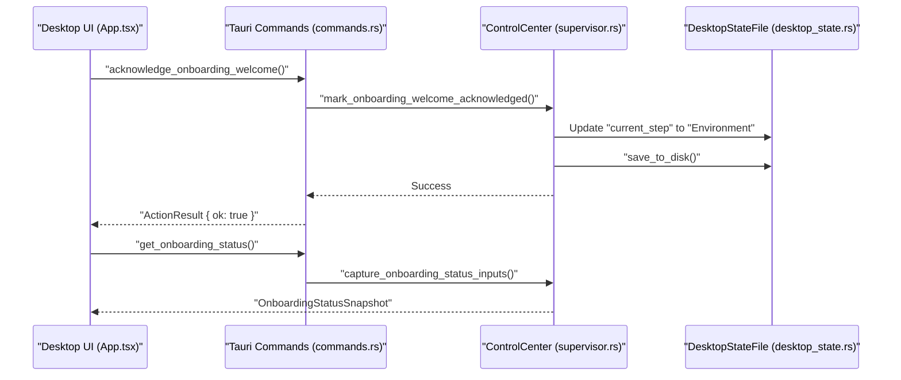
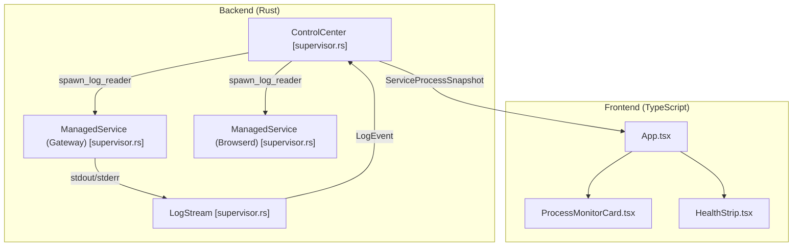

# Desktop Onboarding and UI

Relevant source files

The following files were used as context for generating this wiki page:

- apps/desktop/src-tauri/src/commands.rs
- apps/desktop/src-tauri/src/companion.rs
- apps/desktop/src-tauri/src/desktop_state.rs
- apps/desktop/src-tauri/src/lib.rs
- apps/desktop/src-tauri/src/onboarding.rs
- apps/desktop/src-tauri/src/snapshot.rs
- apps/desktop/src-tauri/src/supervisor.rs
- apps/desktop/src-tauri/src/tests.rs
- apps/desktop/src-tauri/tauri.conf.json
- apps/desktop/ui/index.html
- apps/desktop/ui/src/App.tsx
- apps/desktop/ui/src/hooks/useDesktopCompanion.ts
- apps/desktop/ui/src/lib/desktopApi.ts
- apps/desktop/ui/src/styles.css

The Palyra Desktop application, built on the Tauri framework, serves as the primary control center and supervisor for the Palyra ecosystem on local workstations. It manages the lifecycle of the core daemon (`palyrad`) and the browser automation service (`palyra-browserd`), provides a guided onboarding experience for new operators, and offers a companion chat interface for interacting with agents.

## Desktop Onboarding State Machine

The onboarding process is governed by a formal state machine defined in the `DesktopOnboardingStep` enum. This machine ensures that prerequisites—such as filesystem roots, gateway initialization, and third-party provider connections—are met before the operator is handed off to the main dashboard.

### Onboarding Steps
The flow progresses through the following sequence:

1.  **Welcome**: Initial landing and introduction.
2.  **Environment**: Validation of system prerequisites and binary paths [apps/desktop/src-tauri/src/desktop_state.rs#211](http://apps/desktop/src-tauri/src/desktop_state.rs#211).
3.  **StateRoot**: Configuration of the runtime state directory where the database and logs reside [apps/desktop/src-tauri/src/desktop_state.rs#212](http://apps/desktop/src-tauri/src/desktop_state.rs#212).
4.  **GatewayInit**: Bootstrapping the `palyrad` daemon and generating internal credentials [apps/desktop/src-tauri/src/desktop_state.rs#213](http://apps/desktop/src-tauri/src/desktop_state.rs#213).
5.  **OperatorAuthBootstrap**: Creation of the initial admin token and security profile [apps/desktop/src-tauri/src/desktop_state.rs#214](http://apps/desktop/src-tauri/src/desktop_state.rs#214).
6.  **OpenAiConnect**: OAuth or API key integration for LLM capabilities [apps/desktop/src-tauri/src/desktop_state.rs#215](http://apps/desktop/src-tauri/src/desktop_state.rs#215).
7.  **DiscordConnect**: Optional pairing with Discord for remote channel access [apps/desktop/src-tauri/src/desktop_state.rs#216](http://apps/desktop/src-tauri/src/desktop_state.rs#216).
8.  **DashboardHandoff**: Final verification before redirecting the user to the Web Console [apps/desktop/src-tauri/src/desktop_state.rs#217](http://apps/desktop/src-tauri/src/desktop_state.rs#217).

### State Management and Persistence
The `ControlCenter` struct acts as the supervisor, capturing inputs via `capture_onboarding_status_inputs` [apps/desktop/src-tauri/src/onboarding.rs#137-154](http://apps/desktop/src-tauri/src/onboarding.rs#137-154) and persisting progress in the `DesktopStateFile` [apps/desktop/src-tauri/src/desktop_state.rs#223](http://apps/desktop/src-tauri/src/desktop_state.rs#223). Onboarding failures are recorded with specific step context to allow for guided recovery [apps/desktop/src-tauri/src/onboarding.rs#56-61](http://apps/desktop/src-tauri/src/onboarding.rs#56-61).

**Sources:** [apps/desktop/src-tauri/src/desktop_state.rs](), [apps/desktop/src-tauri/src/onboarding.rs](), [apps/desktop/src-tauri/src/supervisor.rs]()

---

## Desktop UI Components

The Desktop UI is a React application styled with Tailwind CSS and HeroUI, optimized for a "Control Center" aesthetic.

### Key Components

| Component | Purpose | Implementation Pointer |
| :--- | :--- | :--- |
| `HealthStrip` | High-level status indicator showing the `OverallStatus` (Healthy, Degraded, Down). | [apps/desktop/ui/src/App.tsx#6](http://apps/desktop/ui/src/App.tsx#6) |
| `ProcessMonitorCard` | Displays real-time metrics for `palyrad` and `palyra-browserd`, including PID, uptime, and port bindings. | [apps/desktop/ui/src/App.tsx#8](http://apps/desktop/ui/src/App.tsx#8) |
| `LifecycleActionBar` | Controls for starting, stopping, and restarting the managed services. | [apps/desktop/ui/src/App.tsx#7](http://apps/desktop/ui/src/App.tsx#7) |
| `QuickFactsCard` | Summarizes gateway version, git hash, and active dashboard URL. | [apps/desktop/ui/src/App.tsx#9](http://apps/desktop/ui/src/App.tsx#9) |
| `AttentionCard` | Surfaces critical errors or pending approvals that require operator intervention. | [apps/desktop/ui/src/App.tsx#4](http://apps/desktop/ui/src/App.tsx#4) |

### Data Flow: Rust to UI
The UI retrieves system state using the `get_snapshot` [apps/desktop/src-tauri/src/commands.rs#54-62](http://apps/desktop/src-tauri/src/commands.rs#54-62) and `get_desktop_companion_snapshot` [apps/desktop/src-tauri/src/commands.rs#108-123](http://apps/desktop/src-tauri/src/commands.rs#108-123) Tauri commands. These commands return a `ControlCenterSnapshot` containing redacted logs, process liveness, and diagnostic metrics [apps/desktop/src-tauri/src/snapshot.rs#173-182](http://apps/desktop/src-tauri/src/snapshot.rs#173-182).

**Sources:** [apps/desktop/ui/src/App.tsx](), [apps/desktop/src-tauri/src/snapshot.rs](), [apps/desktop/src-tauri/src/commands.rs]()

---

## Desktop Companion Chat

The Desktop app includes a "Companion" mode, allowing operators to interact with agents without opening a full browser. This interface communicates with the local `palyrad` via a specialized `ControlPlaneClient` [apps/desktop/src-tauri/src/snapshot.rs#17](http://apps/desktop/src-tauri/src/snapshot.rs#17).

### Companion Architecture
The companion logic is encapsulated in `companion.rs`, which handles:
*   **Session Resolution**: Mapping UI requests to active agent sessions [apps/desktop/src-tauri/src/companion.rs#9](http://apps/desktop/src-tauri/src/companion.rs#9).
*   **Message Dispatch**: Sending text to the gateway and handling "Offline Drafts" if the daemon is unreachable [apps/desktop/src-tauri/src/companion.rs#134](http://apps/desktop/src-tauri/src/companion.rs#134).
*   **Transcript Sync**: Fetching the `DesktopSessionTranscriptEnvelope` which includes the audit log of events and tool calls [apps/desktop/src-tauri/src/companion.rs#195-201](http://apps/desktop/src-tauri/src/companion.rs#195-201).

### Offline Drafts and Notifications
To handle intermittent daemon availability, the companion supports `DesktopCompanionOfflineDraft` [apps/desktop/src-tauri/src/desktop_state.rs#60-66](http://apps/desktop/src-tauri/src/desktop_state.rs#60-66). If a message fails to send, it is queued locally and surfaced via the `DesktopCompanionNotification` system [apps/desktop/src-tauri/src/desktop_state.rs#50-57](http://apps/desktop/src-tauri/src/desktop_state.rs#50-57).

**Sources:** [apps/desktop/src-tauri/src/companion.rs](), [apps/desktop/src-tauri/src/desktop_state.rs](), [apps/desktop/ui/src/lib/desktopApi.ts]()

---

## Implementation Diagrams

### Onboarding Data Flow
This diagram bridges the frontend request to the backend state transition.

**Sources:** [apps/desktop/src-tauri/src/commands.rs#126-132](http://apps/desktop/src-tauri/src/commands.rs#126-132), [apps/desktop/src-tauri/src/supervisor.rs#221-233](http://apps/desktop/src-tauri/src/supervisor.rs#221-233), [apps/desktop/src-tauri/src/onboarding.rs#137-154](http://apps/desktop/src-tauri/src/onboarding.rs#137-154)

### Process Supervision and UI Monitoring
This diagram shows how the `ControlCenter` monitors the `ManagedService` and provides telemetry to the UI.

**Sources:** [apps/desktop/src-tauri/src/supervisor.rs#97-107](http://apps/desktop/src-tauri/src/supervisor.rs#97-107), [apps/desktop/src-tauri/src/snapshot.rs#173-182](http://apps/desktop/src-tauri/src/snapshot.rs#173-182), [apps/desktop/ui/src/App.tsx#52-70](http://apps/desktop/ui/src/App.tsx#52-70)

### Desktop Secret Management
The desktop app uses a specialized `DesktopSecretStore` to handle sensitive tokens like the `desktop_admin_token`.

| Secret Key | Purpose |
| :--- | :--- |
| `desktop_admin_token` | Authenticates the Desktop App against the `palyrad` Admin API [apps/desktop/src-tauri/src/lib.rs#11](http://apps/desktop/src-tauri/src/lib.rs#11). |
| `desktop_browser_auth_token` | Used to authorize the `palyra-browserd` sidecar [apps/desktop/src-tauri/src/lib.rs#12](http://apps/desktop/src-tauri/src/lib.rs#12). |

The store leverages the `palyra-vault` crate to interface with platform-specific secure storage (e.g., macOS Keychain, Windows DPAPI) [apps/desktop/src-tauri/src/desktop_state.rs#8](http://apps/desktop/src-tauri/src/desktop_state.rs#8).

**Sources:** [apps/desktop/src-tauri/src/lib.rs](), [apps/desktop/src-tauri/src/desktop_state.rs]()
