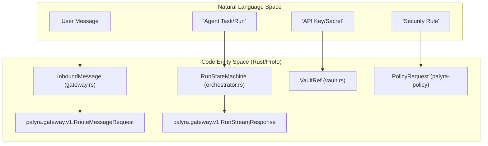
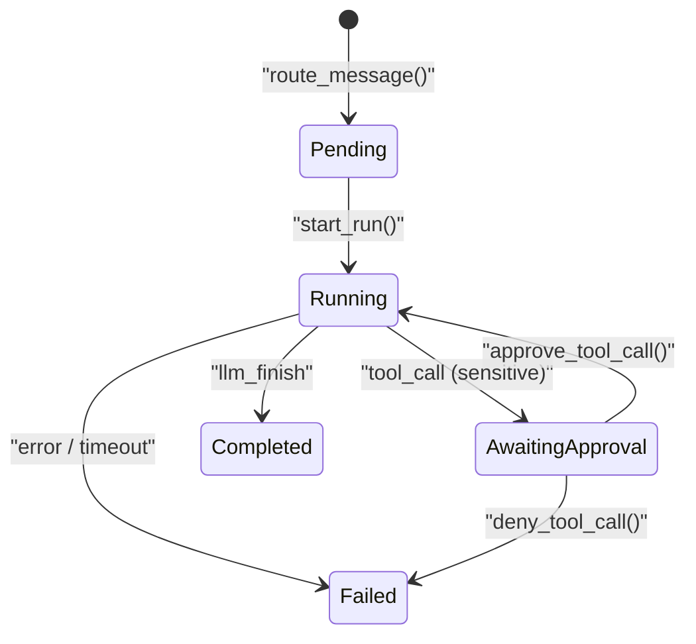
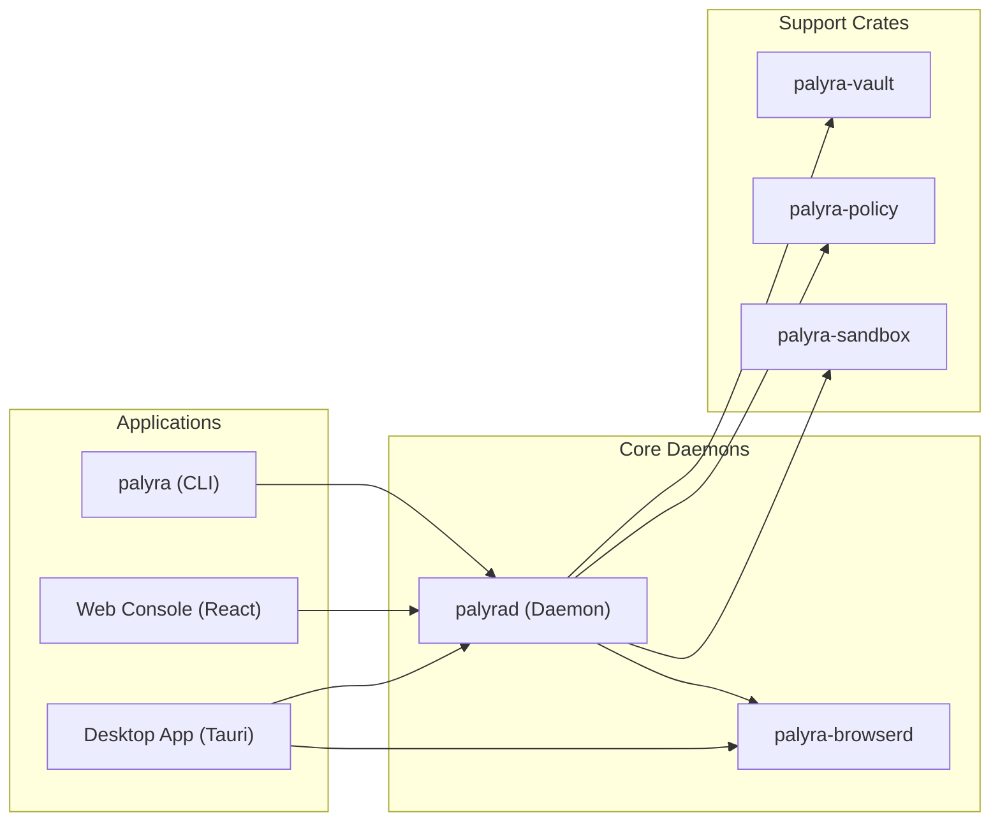

# Glossary

Relevant source files

The following files were used as context for generating this wiki page:

- Cargo.lock
- Cargo.toml
- apps/desktop/src-tauri/src/commands.rs
- apps/desktop/src-tauri/src/desktop_state.rs
- apps/desktop/src-tauri/src/lib.rs
- apps/desktop/src-tauri/src/onboarding.rs
- apps/desktop/src-tauri/src/snapshot.rs
- apps/desktop/src-tauri/src/supervisor.rs
- apps/desktop/src-tauri/src/tests.rs
- apps/web/src/App.test.tsx
- apps/web/src/App.tsx
- apps/web/src/consoleApi.test.ts
- apps/web/src/consoleApi.ts
- crates/palyra-browserd/Cargo.toml
- crates/palyra-browserd/build.rs
- crates/palyra-cli/Cargo.toml
- crates/palyra-cli/build.rs
- crates/palyra-cli/src/cli.rs
- crates/palyra-cli/tests/config_validate.rs
- crates/palyra-cli/tests/pairing_flow.rs
- crates/palyra-common/src/daemon_config_schema.rs
- crates/palyra-common/src/lib.rs
- crates/palyra-daemon/Cargo.toml
- crates/palyra-daemon/build.rs
- crates/palyra-daemon/src/cron.rs
- crates/palyra-daemon/src/gateway.rs
- crates/palyra-daemon/src/journal.rs
- crates/palyra-daemon/src/model_provider.rs
- crates/palyra-daemon/src/sandbox_runner.rs
- crates/palyra-daemon/src/tool_protocol.rs
- crates/palyra-daemon/tests/admin_surface.rs
- crates/palyra-daemon/tests/gateway_grpc.rs
- crates/palyra-policy/src/lib.rs
- crates/palyra-sandbox/src/lib.rs
- crates/palyra-vault/src/backend.rs
- crates/palyra-vault/src/lib.rs
- schemas/generated/kotlin/ProtocolStubs.kt
- schemas/generated/rust/protocol_stubs.rs
- schemas/generated/swift/ProtocolStubs.swift
- schemas/proto/palyra/v1/browser.proto
- schemas/proto/palyra/v1/gateway.proto

This glossary defines the technical terms, abbreviations, and domain-specific concepts used throughout the Palyra codebase. It serves as a reference for onboarding engineers to bridge the gap between high-level architectural descriptions and specific implementation details.

## Core System Concepts

### Gateway Runtime State
The central in-memory state of the `palyrad` daemon. It orchestrates the lifecycle of sessions, runs, and the routing of messages between inbound channels (e.g., Discord, CLI) and the LLM provider.
*   **Implementation**: Managed via `GatewayRuntimeState` in [crates/palyra-daemon/src/gateway.rs#1-100](http://crates/palyra-daemon/src/gateway.rs#1-100).
*   **Key Function**: `route_message` handles the entry point for new user interactions [crates/palyra-daemon/src/gateway.rs#96-96](http://crates/palyra-daemon/src/gateway.rs#96-96).

### Journal Store
The persistence layer for all system events, audit logs, and agent memory. It uses an append-only logic backed by SQLite with hash-chaining to ensure audit integrity.
*   **Implementation**: `JournalStore` struct in [crates/palyra-daemon/src/journal.rs#63-71](http://crates/palyra-daemon/src/journal.rs#63-71).
*   **Data Flow**: Every state transition in a `RunStateMachine` is persisted as a `JournalEventRecord` [crates/palyra-daemon/src/journal.rs#63-63](http://crates/palyra-daemon/src/journal.rs#63-63).

### Orchestrator Tape
A linear sequence of events belonging to a specific "Run". It includes the prompt, LLM responses, tool calls, and tool outputs. It acts as the "memory" of a single conversation turn.
*   **Code Pointer**: `OrchestratorTapeRecord` in [crates/palyra-daemon/src/journal.rs#69-69](http://crates/palyra-daemon/src/journal.rs#69-69).
*   **Usage**: The `RunStateMachine` appends events to the tape during execution [crates/palyra-daemon/src/gateway.rs#69-71](http://crates/palyra-daemon/src/gateway.rs#69-71).

## Security & Governance

### Cedar Policy Engine
The authorization layer that evaluates whether a principal (user/agent) is allowed to perform an action (e.g., execute a tool) on a resource.
*   **Implementation**: `palyra-policy` crate using the Cedar language [crates/palyra-policy/src/lib.rs#1-10](http://crates/palyra-policy/src/lib.rs#1-10).
*   **Key Function**: `evaluate_with_context` [crates/palyra-daemon/src/tool_protocol.rs#4-6](http://crates/palyra-daemon/src/tool_protocol.rs#4-6).

### Tool Sandboxing Tiers
Palyra categorizes tool execution into three isolation tiers to balance performance and security.
*   **Tier A**: WASM-based isolation using `wasmtime` [crates/palyra-daemon/src/tool_protocol.rs#17-17](http://crates/palyra-daemon/src/tool_protocol.rs#17-17).
*   **Tier B**: Unix-level resource controls (`rlimit`) [crates/palyra-daemon/src/sandbox_runner.rs#65-78](http://crates/palyra-daemon/src/sandbox_runner.rs#65-78).
*   **Tier C**: OS-level sandboxing (e.g., `bwrap` on Linux, `sandbox-exec` on macOS) [crates/palyra-daemon/src/sandbox_runner.rs#65-78](http://crates/palyra-daemon/src/sandbox_runner.rs#65-78).

### Vault
A secure storage abstraction for secrets (API keys, tokens). It supports platform-specific backends like macOS Keychain or Linux Secret Service.
*   **Implementation**: `palyra-vault` crate [crates/palyra-vault/src/lib.rs#1-28](http://crates/palyra-vault/src/lib.rs#1-28).
*   **Code Pointer**: `Vault` trait and `VaultScope` [crates/palyra-daemon/src/gateway.rs#28-28](http://crates/palyra-daemon/src/gateway.rs#28-28).

## Technical Domain Map

### Natural Language to Code Entity Space
The following diagram maps high-level user concepts to the specific Rust structs and Protobuf definitions that implement them.

**System Concept Mapping**

**Sources**: [crates/palyra-daemon/src/gateway.rs#50-54](http://crates/palyra-daemon/src/gateway.rs#50-54), [crates/palyra-daemon/src/tool_protocol.rs#4-6](http://crates/palyra-daemon/src/tool_protocol.rs#4-6), [crates/palyra-vault/src/lib.rs#28-28](http://crates/palyra-vault/src/lib.rs#28-28)

## Data Flow & Lifecycle

### Run State Machine (RSM)
The RSM manages the lifecycle of an AI interaction, transitioning through states like `Pending`, `Running`, `AwaitingApproval`, and `Completed`.

**Run Lifecycle Transitions**

**Sources**: [crates/palyra-daemon/src/gateway.rs#77-77](http://crates/palyra-daemon/src/gateway.rs#77-77), [crates/palyra-daemon/src/orchestrator.rs#1-100](http://crates/palyra-daemon/src/orchestrator.rs#1-100)

## Key Abbreviations

| Abbreviation | Full Term | Description | Code Pointer |
| :--- | :--- | :--- | :--- |
| **ACP** | Agent Control Protocol | Protocol for external tools to control the daemon via stdio/gRPC. | [crates/palyra-cli/src/cli.rs#1-2](http://crates/palyra-cli/src/cli.rs#1-2) |
| **A2UI** | Agent-to-User Interface | JSON-patch based protocol for rendering dynamic UIs in the console. | [crates/palyra-a2ui/src/lib.rs#1-15](http://crates/palyra-a2ui/src/lib.rs#1-15) |
| **CDP** | Chrome DevTools Protocol | Used by `browserd` to automate headless Chromium. | [crates/palyra-browserd/Cargo.toml#1-20](http://crates/palyra-browserd/Cargo.toml#1-20) |
| **mTLS** | Mutual TLS | Used for secure Node-to-Daemon communication. | [crates/palyra-daemon/src/gateway.rs#116-121](http://crates/palyra-daemon/src/gateway.rs#116-121) |
| **TOFU** | Trust On First Use | Security model for pairing new devices or installing skills. | [crates/palyra-identity/src/lib.rs#1-10](http://crates/palyra-identity/src/lib.rs#1-10) |

## System Components Relationship
This diagram illustrates how the various daemons and libraries interact within the monorepo.

**Crate Architecture**

**Sources**: [Cargo.toml#1-21](http://Cargo.toml#1-21), [apps/desktop/src-tauri/src/supervisor.rs#1-50](http://apps/desktop/src-tauri/src/supervisor.rs#1-50)

## Configuration Terms

### Redacted Config Path
A set of hardcoded paths in `palyra.toml` that the system ensures are never logged or returned in plain text via the Admin API.
*   **Definition**: `SECRET_CONFIG_PATHS` in [crates/palyra-common/src/daemon_config_schema.rs#6-14](http://crates/palyra-common/src/daemon_config_schema.rs#6-14).
*   **Mechanism**: `redact_secret_config_values` function [crates/palyra-common/src/daemon_config_schema.rs#22-26](http://crates/palyra-common/src/daemon_config_schema.rs#22-26).

### Cron Schedule Types
Definitions for recurring background tasks.
*   **Cron**: Standard crontab string.
*   **Every**: Interval-based (e.g., every 5 minutes).
*   **At**: One-time execution at a specific timestamp.
*   **Implementation**: `CronScheduleType` enum in [crates/palyra-daemon/src/journal.rs#104-108](http://crates/palyra-daemon/src/journal.rs#104-108).

**Sources**: [crates/palyra-common/src/daemon_config_schema.rs#1-81](http://crates/palyra-common/src/daemon_config_schema.rs#1-81), [crates/palyra-daemon/src/journal.rs#102-128](http://crates/palyra-daemon/src/journal.rs#102-128)
