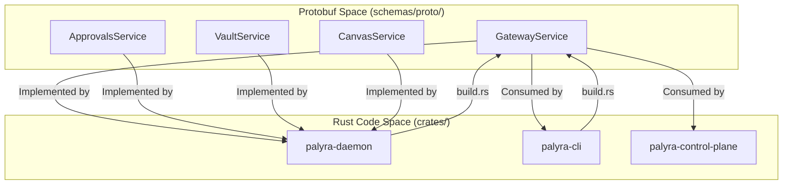
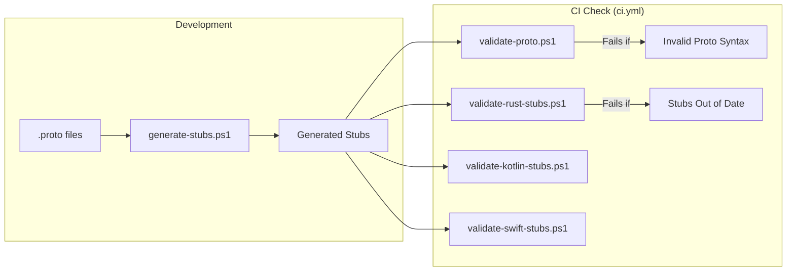

# Protocol Schemas and Cross-Platform Stubs

Relevant source files

The following files were used as context for generating this wiki page:

- Cargo.lock
- Cargo.toml
- crates/palyra-cli/Cargo.toml
- crates/palyra-cli/build.rs
- crates/palyra-daemon/Cargo.toml
- crates/palyra-daemon/build.rs
- schemas/generated/kotlin/ProtocolStubs.kt
- schemas/generated/rust/protocol_stubs.rs
- schemas/generated/swift/ProtocolStubs.swift
- schemas/proto/palyra/v1/common.proto
- schemas/proto/palyra/v1/gateway.proto
- scripts/protocol/check-generated-stubs.ps1
- scripts/protocol/generate-stubs.ps1
- scripts/protocol/validate-kotlin-stubs.ps1
- scripts/protocol/validate-proto.ps1
- scripts/protocol/validate-rust-stubs.ps1
- scripts/protocol/validate-swift-stubs.ps1
- scripts/protocol/validate-swift-stubs.sh

Palyra utilizes a **schema-first design** where all cross-process and cross-platform communication is defined using Protocol Buffers (Protobuf). These definitions serve as the single source of truth for the gRPC services and message structures used by the Rust daemon, CLI, and various mobile/web stubs.

## Architecture Overview

The protocol architecture is designed to ensure strict versioning and prevent "schema drift" between the central daemon (`palyrad`) and its clients (CLI, Mobile, Browser Extension).

### Data Flow and Contract Enforcement

The system maintains a hierarchy of schema definitions and generated artifacts:

1.  **Definitions**: `.proto` files located in `schemas/proto/palyra/v1/`.
2.  **Rust Stubs**: Generated during the build process of internal crates (e.g., `palyra-daemon`, `palyra-cli`) using `tonic-build`.
3.  **Cross-Platform Stubs**: Pre-generated stubs for Kotlin and Swift, stored in `schemas/generated/`, ensuring that mobile and external clients can interact with the daemon without requiring a local Protobuf compiler.
4.  **Validation**: CI/CD scripts that verify the generated stubs match the current `.proto` definitions.

### System Entity Mapping

The following diagram bridges the Protobuf service definitions to the actual code entities within the Rust crates.

**Diagram: Service to Code Entity Mapping**

Sources: [schemas/proto/palyra/v1/gateway.proto#7-29](http://schemas/proto/palyra/v1/gateway.proto#7-29), [crates/palyra-daemon/build.rs#8-35](http://crates/palyra-daemon/build.rs#8-35), [crates/palyra-cli/build.rs#8-35](http://crates/palyra-cli/build.rs#8-35)

---

## Schema Definitions

The schemas are organized by domain under `schemas/proto/palyra/v1/`.

### Core Services and Messages

| Service | Proto File | Primary Responsibility |
| :--- | :--- | :--- |
| `GatewayService` | `gateway.proto` | Run orchestration, session management, and agent CRUD. |
| `ApprovalsService` | `gateway.proto` | Querying and exporting human-in-the-loop approval records. |
| `VaultService` | `gateway.proto` | Secure storage and retrieval of secrets. |
| `CanvasService` | `gateway.proto` | Real-time state synchronization for A2UI (Agent-to-User Interface). |
| `BrowserService` | `browser.proto` | Headless browser control and automation. |

### Common Types (`common.proto`)

The `palyra.common.v1` package defines primitives used across all services:
*   `CanonicalId`: A ULID-based identifier encoded in Crockford Base32 [schemas/proto/palyra/v1/common.proto#6-11](http://schemas/proto/palyra/v1/common.proto#6-11).
*   `RunStreamEvent`: A `oneof` message containing `ModelToken`, `ToolProposal`, `ToolResult`, and `StreamStatus` [schemas/proto/palyra/v1/common.proto#300-310](http://schemas/proto/palyra/v1/common.proto#300-310).
*   `JournalEvent`: The structure for the hash-chained audit log [schemas/proto/palyra/v1/common.proto#110-142](http://schemas/proto/palyra/v1/common.proto#110-142).

Sources: [schemas/proto/palyra/v1/gateway.proto#1-51](http://schemas/proto/palyra/v1/gateway.proto#1-51), [schemas/proto/palyra/v1/common.proto#1-310](http://schemas/proto/palyra/v1/common.proto#1-310)

---

## Generated Stubs

### Rust Build Pipeline
The Rust crates use `build.rs` scripts to compile Protobuf files into Rust code at compile time. They utilize `protoc-bin-vendored` to ensure a consistent `protoc` version across developer environments.

*   **palyra-daemon**: Generates both server and client stubs [crates/palyra-daemon/build.rs#24-35](http://crates/palyra-daemon/build.rs#24-35).
*   **palyra-cli**: Generates only client stubs [crates/palyra-cli/build.rs#24-35](http://crates/palyra-cli/build.rs#24-35).

### Cross-Platform Support
For platforms where a Rust toolchain or `protoc` might not be available (e.g., lightweight mobile development), the repository includes pre-generated stubs:

*   **Kotlin**: `schemas/generated/kotlin/ProtocolStubs.kt` contains data classes for `PalyraAuthV1`, `PalyraBrowserV1`, etc. [schemas/generated/kotlin/ProtocolStubs.kt#4-34](http://schemas/generated/kotlin/ProtocolStubs.kt#4-34).
*   **Swift**: `schemas/generated/swift/ProtocolStubs.swift` provides `public struct` and `protocol` definitions for iOS/macOS integration [schemas/generated/swift/ProtocolStubs.swift#3-77](http://schemas/generated/swift/ProtocolStubs.swift#3-77).
*   **Rust (Static)**: `schemas/generated/rust/protocol_stubs.rs` serves as a reference for the expected Rust structure [schemas/generated/rust/protocol_stubs.rs#1-59](http://schemas/generated/rust/protocol_stubs.rs#1-59).

Sources: [crates/palyra-daemon/build.rs#1-38](http://crates/palyra-daemon/build.rs#1-38), [schemas/generated/kotlin/ProtocolStubs.kt#1-145](http://schemas/generated/kotlin/ProtocolStubs.kt#1-145), [schemas/generated/swift/ProtocolStubs.swift#1-250](http://schemas/generated/swift/ProtocolStubs.swift#1-250)

---

## Validation and Drift Prevention

To ensure that the pre-generated stubs never fall out of sync with the `.proto` files, the system employs a suite of validation scripts.

**Diagram: Protocol Validation Workflow**

### Key Validation Scripts
*   **validate-proto.ps1**: Uses `protoc` with `--descriptor_set_out` to ensure all `.proto` files are syntactically correct and imports are resolvable [scripts/protocol/validate-proto.ps1#57-66](http://scripts/protocol/validate-proto.ps1#57-66).
*   **check-generated-stubs.ps1**: Orchestrates the validation of all language-specific stubs.
*   **validate-rust-stubs.ps1**: Compiles the Rust stubs and compares the output against the tracked `protocol_stubs.rs`.

Sources: [scripts/protocol/validate-proto.ps1#1-72](http://scripts/protocol/validate-proto.ps1#1-72), [schemas/generated/rust/protocol_stubs.rs#1-5](http://schemas/generated/rust/protocol_stubs.rs#1-5)

---

## Implementation Details

### Versioning
The protocol defines a `PROTOCOL_MAJOR_VERSION` (currently `1`) to handle breaking changes in the future [schemas/generated/rust/protocol_stubs.rs#5](http://schemas/generated/rust/protocol_stubs.rs#5). Every message typically includes a `uint32 v = 1;` field to allow for per-message schema evolution [schemas/proto/palyra/v1/gateway.proto#86](http://schemas/proto/palyra/v1/gateway.proto#86).

### Field Reservations
To maintain backward compatibility during development, the schemas extensively use the `reserved` keyword for deleted field numbers and names [schemas/proto/palyra/v1/gateway.proto:82, 105, 119]().

Sources: [schemas/generated/rust/protocol_stubs.rs#1-10](http://schemas/generated/rust/protocol_stubs.rs#1-10), [schemas/proto/palyra/v1/gateway.proto#80-120](http://schemas/proto/palyra/v1/gateway.proto#80-120)
