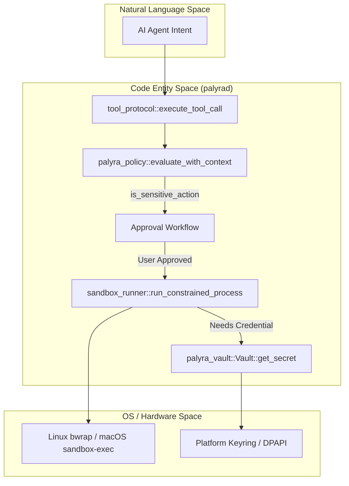
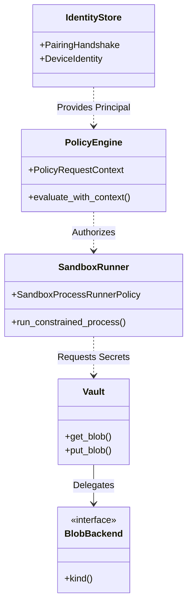

# Security Architecture

Relevant source files

The following files were used as context for generating this wiki page:

- crates/palyra-cli/tests/config_validate.rs
- crates/palyra-cli/tests/pairing_flow.rs
- crates/palyra-common/src/lib.rs
- crates/palyra-daemon/src/sandbox_runner.rs
- crates/palyra-daemon/src/tool_protocol.rs
- crates/palyra-identity/Cargo.toml
- crates/palyra-identity/src/device.rs
- crates/palyra-policy/Cargo.toml
- crates/palyra-policy/src/lib.rs
- crates/palyra-sandbox/src/lib.rs
- crates/palyra-vault/Cargo.toml
- crates/palyra-vault/src/backend.rs
- crates/palyra-vault/src/envelope.rs
- crates/palyra-vault/src/lib.rs

Palyra employs a multi-layered security model designed to provide defense-in-depth for AI agent operations. The architecture transitions from high-level policy intent down to low-level operating system primitives to ensure that agent actions—especially those involving tool execution or secret access—are governed, audited, and constrained.

### Core Security Principles

*   **Policy-First Execution**: Every action (tool call, memory access, cron management) must be authorized by the Cedar-based policy engine before execution [crates/palyra-policy/src/lib.rs#99-181](http://crates/palyra-policy/src/lib.rs#99-181).
*   **Tiered Sandboxing**: Tool execution is isolated using a three-tier model, ranging from WASM fuel-metering to OS-level namespaces (Bubblewrap/sandbox-exec) [crates/palyra-daemon/src/sandbox_runner.rs#64-68](http://crates/palyra-daemon/src/sandbox_runner.rs#64-68).
*   **Hardware-Backed Secrets**: Sensitive credentials are never stored in plaintext and prefer platform-specific secure enclaves (macOS Keychain, Windows DPAPI) [crates/palyra-vault/src/backend.rs#41-49](http://crates/palyra-vault/src/backend.rs#41-49).
*   **Cryptographic Identity**: All nodes and devices communicate via mTLS, using ed25519-based identities established through a secure pairing handshake [crates/palyra-identity/Cargo.toml#11-25](http://crates/palyra-identity/Cargo.toml#11-25).

### Security Component Interaction

The following diagram illustrates how a request from an AI agent flows through the security subsystems.

**AI Agent Tool Call Security Flow**

Sources: [crates/palyra-daemon/src/tool_protocol.rs#148-150](http://crates/palyra-daemon/src/tool_protocol.rs#148-150), [crates/palyra-daemon/src/sandbox_runner.rs#147-209](http://crates/palyra-daemon/src/sandbox_runner.rs#147-209), [crates/palyra-policy/src/lib.rs#211-215](http://crates/palyra-policy/src/lib.rs#211-215), [crates/palyra-vault/src/backend.rs#135-158](http://crates/palyra-vault/src/backend.rs#135-158)

---

### 3.1 Policy Engine (Cedar)
The `palyra-policy` crate integrates the **Cedar Policy Language** to provide fine-grained authorization. The system evaluates a `PolicyRequest` (Principal, Action, Resource) against a `PolicyRequestContext` containing metadata like `device_id`, `skill_id`, and `capabilities`.

*   **Key Logic**: The `evaluate_with_context` function determines if an action is permitted [crates/palyra-policy/src/lib.rs#211](http://crates/palyra-policy/src/lib.rs#211).
*   **Default Deny**: A baseline `forbid` rule (`deny_sensitive_without_approval`) blocks sensitive actions unless explicit criteria are met [crates/palyra-policy/src/lib.rs#100-105](http://crates/palyra-policy/src/lib.rs#100-105).

For details, see [Policy Engine (Cedar)](policy_engine_cedar/README.md).

### 3.2 Tool Sandboxing and Execution Tiers
Palyra categorizes tool execution into three tiers to balance performance and security. The `sandbox_runner` manages these tiers:
*   **Tier A**: WASM-based plugins with resource "fuel" metering.
*   **Tier B**: Unix-specific resource limits (`rlimit`).
*   **Tier C**: Full OS-level isolation using `bwrap` (Linux) or `sandbox-exec` (macOS) [crates/palyra-sandbox/src/lib.rs#8-13](http://crates/palyra-sandbox/src/lib.rs#8-13).

The `SandboxProcessRunnerPolicy` enforces quotas on CPU time, memory, and output bytes [crates/palyra-daemon/src/sandbox_runner.rs#81-93](http://crates/palyra-daemon/src/sandbox_runner.rs#81-93).

For details, see [Tool Sandboxing and Execution Tiers](tool_sandboxing_and_execution_tiers/README.md).

### 3.3 Vault and Secret Management
The `palyra-vault` crate provides a secure abstraction for sensitive data. It uses a `BlobBackend` trait to support multiple storage engines [crates/palyra-vault/src/backend.rs#88-93](http://crates/palyra-vault/src/backend.rs#88-93).
*   **Backends**: Supports `MacosKeychain`, `LinuxSecretService`, and `WindowsDpapi` [crates/palyra-vault/src/backend.rs#41-49](http://crates/palyra-vault/src/backend.rs#41-49).
*   **Indirection**: Configuration files use `VaultRef` to point to secrets, preventing plaintext credentials from being checked into source control or logs.

For details, see [Vault and Secret Management](vault_and_secret_management/README.md).

### 3.4 Identity, mTLS, and Device Pairing
Palyra establishes a private PKI for all components. The `palyra-identity` crate manages the Gateway CA and issues mTLS certificates to paired devices.
*   **Pairing**: A multi-step handshake using PINs or QR codes ensures only authorized devices can connect [crates/palyra-cli/tests/pairing_flow.rs#32-52](http://crates/palyra-cli/tests/pairing_flow.rs#32-52).
*   **TOFU**: Trust-on-first-use is employed for initial bootstrapping, followed by strict certificate pinning.

For details, see [Identity, mTLS, and Device Pairing](identity_mtls_and_device_pairing/README.md).

### 3.5 Approval Workflows (Human-in-the-Loop)
Sensitive actions—defined in policy as `is_sensitive_action`—trigger an `ApprovalRecord`. This pauses the agent's run stream until a human operator provides authorization via the CLI or Web Console.
*   **Subjects**: Approvals can be requested for `Tool` execution, `SecretAccess`, or `DevicePairing` [crates/palyra-cli/tests/pairing_flow.rs#17-27](http://crates/palyra-cli/tests/pairing_flow.rs#17-27).
*   **Scopes**: Decisions can be scoped to `Once`, `Session`, or `Timeboxed`.

For details, see [Approval Workflows and Human-in-the-Loop](approval_workflows_and_human-in-the-loop/README.md).

### 3.6 Authentication and OpenAI OAuth
The `palyra-auth` crate manages user-level access to the Control Plane.
*   **Admin API**: Uses Bearer token authentication.
*   **Web Console**: Secured via session cookies and CSRF protection.
*   **OpenAI Integration**: Implements OAuth bootstrap flows to securely connect agent capabilities to LLM providers.

For details, see [Authentication and OpenAI OAuth](authentication_and_openai_oauth/README.md).

---

### Security Architecture Entity Map

This diagram maps security concepts to the specific Rust structs and traits that implement them.

Sources: [crates/palyra-policy/src/lib.rs#11-26](http://crates/palyra-policy/src/lib.rs#11-26), [crates/palyra-daemon/src/sandbox_runner.rs#81-93](http://crates/palyra-daemon/src/sandbox_runner.rs#81-93), [crates/palyra-vault/src/backend.rs#88-93](http://crates/palyra-vault/src/backend.rs#88-93), [crates/palyra-identity/src/device.rs]()

## Child Pages

- [Policy Engine (Cedar)](policy_engine_cedar/README.md)
- [Tool Sandboxing and Execution Tiers](tool_sandboxing_and_execution_tiers/README.md)
- [Vault and Secret Management](vault_and_secret_management/README.md)
- [Identity, mTLS, and Device Pairing](identity_mtls_and_device_pairing/README.md)
- [Approval Workflows and Human-in-the-Loop](approval_workflows_and_human-in-the-loop/README.md)
- [Authentication and OpenAI OAuth](authentication_and_openai_oauth/README.md)
