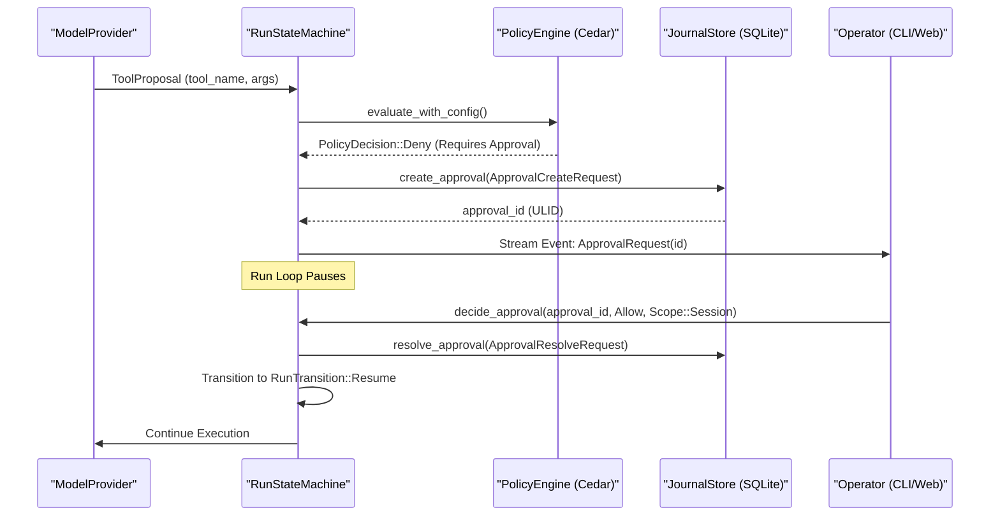
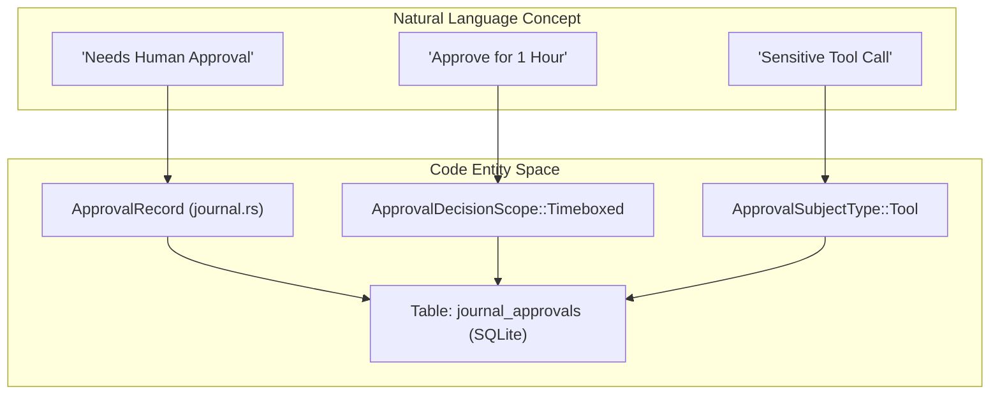

# Approval Workflows and Human-in-the-Loop

<details>
<summary>Relevant source files</summary>

The following files were used as context for generating this wiki page:

- crates/palyra-cli/src/app/mod.rs
- crates/palyra-cli/src/args/approvals.rs
- crates/palyra-cli/src/args/devices.rs
- crates/palyra-cli/src/args/node.rs
- crates/palyra-cli/src/args/nodes.rs
- crates/palyra-cli/src/args/pairing.rs
- crates/palyra-cli/src/cli.rs
- crates/palyra-cli/src/client/channels.rs
- crates/palyra-cli/src/client/grpc.rs
- crates/palyra-cli/src/commands/approvals.rs
- crates/palyra-cli/src/commands/channels/connectors/discord/setup.rs
- crates/palyra-cli/src/commands/channels/connectors/discord/verify.rs
- crates/palyra-cli/src/commands/channels/router.rs
- crates/palyra-cli/src/commands/devices.rs
- crates/palyra-common/src/daemon_config_schema.rs
- crates/palyra-daemon/src/cron.rs
- crates/palyra-daemon/src/gateway.rs
- crates/palyra-daemon/src/journal.rs
- crates/palyra-daemon/src/model_provider.rs
- crates/palyra-daemon/tests/gateway_grpc.rs

</details>


The Approval system in Palyra provides a structured mechanism for pausing autonomous agent execution to solicit human authorization for sensitive operations. It acts as a gatekeeper between the **Policy Engine** and the **Tool Execution** layer, ensuring that high-risk actions—such as accessing secrets, performing browser automation, or pairing new devices—are explicitly sanctioned by an operator.

### System Overview

When the `palyrad` orchestrator encounters a request that requires human-in-the-loop (HITL) intervention (determined by `palyra-policy`), it suspends the current `RunStream` and creates an `ApprovalRecord` in the `JournalStore`. The run remains in a `Pending` state until a decision is submitted via the gRPC `ApprovalsService` or the Web Console.

#### Key Entities

| Entity | Description | Code Reference |
| :--- | :--- | :--- |
| `ApprovalRecord` | The persisted state of an approval request, including subject details and decision. | [crates/palyra-daemon/src/journal.rs#604-630](http://crates/palyra-daemon/src/journal.rs#604-630) |
| `ApprovalSubjectType` | Categorization of the action being approved (Tool, Secret, Browser, etc.). | [crates/palyra-daemon/src/journal.rs#570-580](http://crates/palyra-daemon/src/journal.rs#570-580) |
| `DecisionScope` | Defines the longevity of the approval (Once, Session, or Timeboxed). | [crates/palyra-daemon/src/journal.rs#585-595](http://crates/palyra-daemon/src/journal.rs#585-595) |
| `ApprovalResolveRequest` | The payload sent by an operator to grant or deny an approval. | [crates/palyra-daemon/src/journal.rs#720-735](http://crates/palyra-daemon/src/journal.rs#720-735) |

**Sources:** [crates/palyra-daemon/src/journal.rs#570-735](http://crates/palyra-daemon/src/journal.rs#570-735), [crates/palyra-daemon/src/gateway.rs#57-71](http://crates/palyra-daemon/src/gateway.rs#57-71)

---

### Approval Subjects and Risk Levels

The system classifies approvals based on the `ApprovalSubjectType`. This allows the UI to render specific prompts (e.g., showing the specific tool arguments or the secret name being requested).

*   **`Tool`**: Execution of a specific tool call (e.g., `shell_execute`, `filesystem_write`).
*   **`SecretAccess`**: Request to retrieve a value from the `Vault`.
*   **`BrowserAction`**: High-risk automation like `Click` or `Type` on sensitive domains.
*   **`DevicePairing`**: Authorizing a new node or CLI to connect to the Gateway.

#### Risk Assessment
Each request is assigned an `ApprovalRiskLevel` ([crates/palyra-daemon/src/journal.rs#597-602](http://crates/palyra-daemon/src/journal.rs#597-602)), typically `Low`, `Medium`, or `High`. This level influences how prominently the request is displayed in the operator's queue.

**Sources:** [crates/palyra-daemon/src/journal.rs#570-602](http://crates/palyra-daemon/src/journal.rs#570-602), [crates/palyra-daemon/src/gateway.rs#78-81](http://crates/palyra-daemon/src/gateway.rs#78-81)

---

### Data Flow: From Tool Proposal to Approval Decision

The following diagram illustrates the transition from an LLM proposing a tool call to the system pausing for human intervention.

**Title: Tool Approval Sequence**

**Sources:** [crates/palyra-daemon/src/gateway.rs#77-81](http://crates/palyra-daemon/src/gateway.rs#77-81), [crates/palyra-daemon/src/journal.rs#63-71](http://crates/palyra-daemon/src/journal.rs#63-71), [crates/palyra-daemon/src/orchestrator.rs#77-80](http://crates/palyra-daemon/src/orchestrator.rs#77-80)

---

### Decision Scopes and Persistence

Operators can choose how long an approval remains valid using the `ApprovalDecisionScope`. This reduces "approval fatigue" by caching decisions.

1.  **`Once`**: The decision applies only to the specific `approval_id`.
2.  **`Session`**: The decision applies to all identical subjects within the current `OrchestratorSession`.
3.  **`Timeboxed`**: The decision is valid globally for a specific duration (e.g., 1 hour), stored with a TTL.

#### Implementation in Gateway
The `GatewayRuntimeState` maintains an `APPROVAL_DECISION_CACHE_CAPACITY` ([crates/palyra-daemon/src/gateway.rs#102](http://crates/palyra-daemon/src/gateway.rs#102)) to check for existing session-scoped or timeboxed approvals before creating a new record.

**Sources:** [crates/palyra-daemon/src/journal.rs#585-595](http://crates/palyra-daemon/src/journal.rs#585-595), [crates/palyra-daemon/src/gateway.rs#102-115](http://crates/palyra-daemon/src/gateway.rs#102-115)

---

### Technical Implementation: gRPC and CLI

The `ApprovalsServiceClient` provides the interface for external tools to interact with the approval queue.

#### Key gRPC Methods
*   `ListApprovals`: Filters by `principal`, `subject_type`, or `decision` status. [crates/palyra-cli/src/commands/approvals.rs#35-70](http://crates/palyra-cli/src/commands/approvals.rs#35-70)
*   `GetApproval`: Retrieves full context, including the `ApprovalPromptRecord`. [crates/palyra-cli/src/commands/approvals.rs#71-89](http://crates/palyra-cli/src/commands/approvals.rs#71-89)
*   `ResolveApproval`: Submits the human decision (`Allow`/`Deny`). [crates/palyra-cli/src/commands/approvals.rs#136-163](http://crates/palyra-cli/src/commands/approvals.rs#136-163)

#### CLI Usage
The `palyra` CLI implements the `ApprovalsCommand` ([crates/palyra-cli/src/args/approvals.rs#4-61](http://crates/palyra-cli/src/args/approvals.rs#4-61)) to allow operators to manage the queue from the terminal.

```bash
# List pending approvals
palyra approvals list --decision pending

# Approve a specific tool call for the rest of the session
palyra approvals decide <ULID> --decision allow --scope session
```

**Sources:** [crates/palyra-cli/src/commands/approvals.rs#7-163](http://crates/palyra-cli/src/commands/approvals.rs#7-163), [crates/palyra-cli/src/args/approvals.rs#4-61](http://crates/palyra-cli/src/args/approvals.rs#4-61)

---

### Natural Language to Code Mapping

This diagram maps the conceptual "Approval" workflow to the specific Rust structs and SQLite tables used in the implementation.

**Title: Entity Mapping**

**Sources:** [crates/palyra-daemon/src/journal.rs#570-630](http://crates/palyra-daemon/src/journal.rs#570-630), [crates/palyra-daemon/src/gateway.rs#57-71](http://crates/palyra-daemon/src/gateway.rs#57-71)
