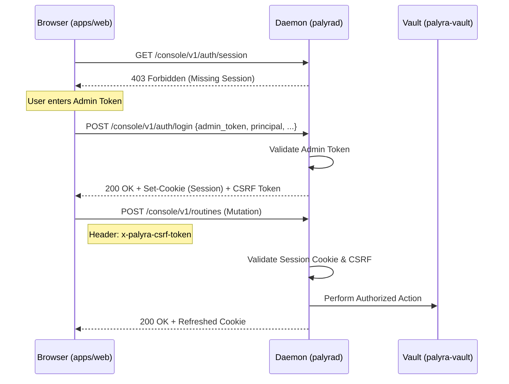
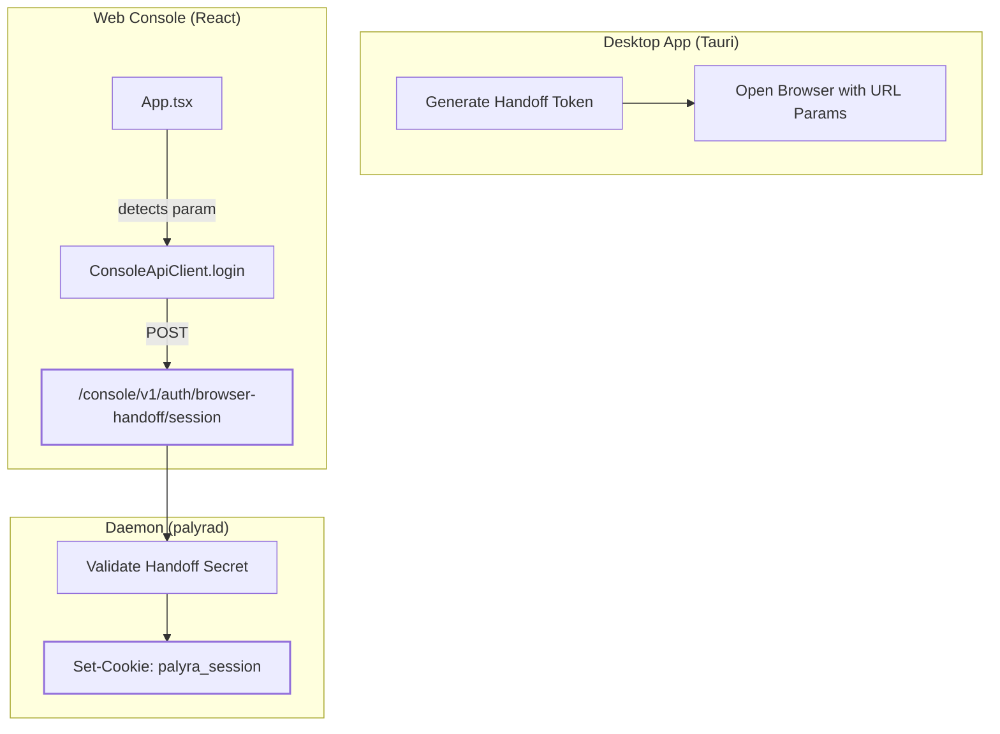

# Authentication and OpenAI OAuth

Relevant source files

The following files were used as context for generating this wiki page:

- apps/web/src/App.test.tsx
- apps/web/src/App.tsx
- apps/web/src/consoleApi.test.ts
- apps/web/src/consoleApi.ts
- crates/palyra-auth/src/lib.rs
- crates/palyra-daemon/src/agents.rs
- crates/palyra-daemon/src/openai_auth.rs
- crates/palyra-daemon/src/openai_surface.rs
- crates/palyra-daemon/src/transport/http/handlers/console/auth.rs
- crates/palyra-daemon/src/transport/http/handlers/web_ui.rs
- crates/palyra-daemon/src/transport/http/middleware.rs
- crates/palyra-daemon/tests/admin_surface.rs
- crates/palyra-daemon/tests/openai_auth_surface.rs

Palyra implements a multi-tiered authentication architecture designed to secure administrative interfaces, the web-based operator console, and third-party model provider integrations. The system distinguishes between stateless API access and stateful web sessions, while providing a specialized bootstrap flow for OpenAI OAuth.

## Authentication Mechanisms

The `palyrad` daemon exposes several HTTP route groups, each governed by different authentication and security requirements.

### Admin API (Bearer Token)
The `/admin/v1/` routes are used for low-level system management and CLI interactions. 
- **Mechanism**: Static Bearer Token.
- **Requirements**: Requests must include an `Authorization: Bearer <token>` header along with context headers: `x-palyra-principal`, `x-palyra-device-id`, and `x-palyra-channel` [crates/palyra-daemon/tests/admin_surface.rs#48-61](http://crates/palyra-daemon/tests/admin_surface.rs#48-61).
- **Rate Limiting**: Protected by `admin_rate_limit_middleware` which enforces per-IP buckets to prevent brute-force attempts [crates/palyra-daemon/src/transport/http/middleware.rs#172-204](http://crates/palyra-daemon/src/transport/http/middleware.rs#172-204).

### Web Console (Session Cookie + CSRF)
The `/console/v1/` routes serve the React-based operator dashboard.
- **Session Management**: Uses an encrypted, `HttpOnly` session cookie refreshed automatically by `console_session_cookie_refresh_middleware` [crates/palyra-daemon/src/transport/http/middleware.rs#87-107](http://crates/palyra-daemon/src/transport/http/middleware.rs#87-107).
- **CSRF Protection**: Mutating requests (POST/PUT/DELETE) require a valid `x-palyra-csrf-token` header matching the session state [apps/web/src/consoleApi.test.ts#44-90](http://apps/web/src/consoleApi.test.ts#44-90).
- **Security Headers**: All responses include `no-store` cache controls and strict `Content-Security-Policy` to prevent framing and sniffing [crates/palyra-daemon/src/transport/http/middleware.rs#37-52](http://crates/palyra-daemon/src/transport/http/middleware.rs#37-52).

## Data Flow: Web Console Authentication

The following diagram illustrates the lifecycle of a web console session, from initial bootstrap to authenticated mutation.

**Web Console Auth Sequence**

Sources: [apps/web/src/consoleApi.test.ts#44-64](http://apps/web/src/consoleApi.test.ts#44-64), [crates/palyra-daemon/src/transport/http/middleware.rs#87-107](http://crates/palyra-daemon/src/transport/http/middleware.rs#87-107), [crates/palyra-daemon/src/transport/http/handlers/web_ui.rs#16-34](http://crates/palyra-daemon/src/transport/http/handlers/web_ui.rs#16-34)

## OpenAI OAuth and Profile Registry

The `palyra-auth` crate manages model provider credentials via an `AuthProfileRegistry` [crates/palyra-auth/src/lib.rs#21-21](http://crates/palyra-auth/src/lib.rs#21-21). It supports both static API keys and dynamic OAuth2 flows.

### OAuth Bootstrap Flow
For OpenAI, Palyra implements a PKCE-based OAuth2 flow to obtain refresh tokens, ensuring the daemon can autonomously rotate access tokens.

1.  **Bootstrap**: The operator initiates the flow via `start_openai_oauth_attempt_from_request`, which generates a PKCE verifier and challenge [crates/palyra-daemon/src/openai_surface.rs#68-112](http://crates/palyra-daemon/src/openai_surface.rs#68-112).
2.  **Redirection**: The daemon constructs an authorization URL pointing to `auth.openai.com` [crates/palyra-daemon/src/openai_auth.rs#109-130](http://crates/palyra-daemon/src/openai_auth.rs#109-130).
3.  **Callback**: Upon return to `console/v1/auth/providers/openai/callback`, the daemon exchanges the authorization code for an `access_token` and `refresh_token` [crates/palyra-daemon/src/openai_auth.rs#132-187](http://crates/palyra-daemon/src/openai_auth.rs#132-187).
4.  **Persistence**: Credentials are encrypted and stored in the Vault as `AuthProfileRecord` entries [crates/palyra-daemon/src/openai_surface.rs#35-54](http://crates/palyra-daemon/src/openai_surface.rs#35-54).

### Profile Registry Entities
| Entity | Role | Source |
| :--- | :--- | :--- |
| `AuthProfileRecord` | Persisted record of a provider's credential and scope. | [crates/palyra-auth/src/lib.rs#13-13](http://crates/palyra-auth/src/lib.rs#13-13) |
| `AuthCredentialType` | Enum: `ApiKey`, `OAuth2`, or `None`. | [crates/palyra-auth/src/lib.rs#10-12](http://crates/palyra-auth/src/lib.rs#10-12) |
| `OAuthRefreshAdapter` | Trait for handling background token rotation. | [crates/palyra-auth/src/lib.rs#18-20](http://crates/palyra-auth/src/lib.rs#18-20) |
| `AuthProfileRegistry` | Orchestrates storage and retrieval of auth profiles. | [crates/palyra-auth/src/lib.rs#21-21](http://crates/palyra-auth/src/lib.rs#21-21) |

Sources: [crates/palyra-auth/src/lib.rs#1-33](http://crates/palyra-auth/src/lib.rs#1-33), [crates/palyra-daemon/src/openai_auth.rs#132-187](http://crates/palyra-daemon/src/openai_auth.rs#132-187)

## Browser Handoff Mechanism

To provide a seamless transition from the Desktop Application (Tauri) to the Web Dashboard, Palyra uses a "Browser Handoff" token.

1.  **Generation**: The desktop app generates a short-lived `desktop_handoff_token`.
2.  **Transfer**: The desktop app opens the system browser to the dashboard URL with the token in the query string: `/?desktop_handoff_token=...` [apps/web/src/App.test.tsx#69-75](http://apps/web/src/App.test.tsx#69-75).
3.  **Consumption**: The web app's `ConsoleApp` detects the token and calls `POST /console/v1/auth/browser-handoff/session` [apps/web/src/App.test.tsx#102-105](http://apps/web/src/App.test.tsx#102-105).
4.  **Session Promotion**: The daemon validates the handoff token and issues a full web session cookie, effectively logging the user in without requiring the manual admin token [apps/web/src/App.test.tsx#109-147](http://apps/web/src/App.test.tsx#109-147).

**Handoff Logic (Code Entity Mapping)**

Sources: [apps/web/src/App.tsx#11-33](http://apps/web/src/App.tsx#11-33), [apps/web/src/App.test.tsx#69-107](http://apps/web/src/App.test.tsx#69-107), [apps/web/src/consoleApi.ts#36-42](http://apps/web/src/consoleApi.ts#36-42)

## Configuration and Secrets

Auth profiles are often linked to the system configuration. When a profile is selected as default, the daemon updates the `model_provider.auth_profile_id` in the local `palyra.toml` [crates/palyra-daemon/tests/openai_auth_surface.rs#118-125](http://crates/palyra-daemon/tests/openai_auth_surface.rs#118-125). Raw secrets like API keys are never stored in plain text in the config; they are always abstracted behind a `VaultRef` [crates/palyra-daemon/tests/openai_auth_surface.rs#92-104](http://crates/palyra-daemon/tests/openai_auth_surface.rs#92-104).

Sources: [crates/palyra-daemon/src/openai_surface.rs#35-57](http://crates/palyra-daemon/src/openai_surface.rs#35-57), [crates/palyra-daemon/tests/openai_auth_surface.rs#29-146](http://crates/palyra-daemon/tests/openai_auth_surface.rs#29-146)
