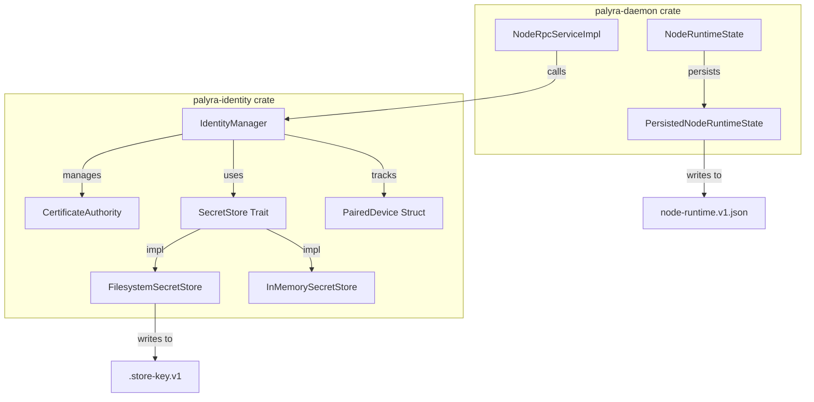
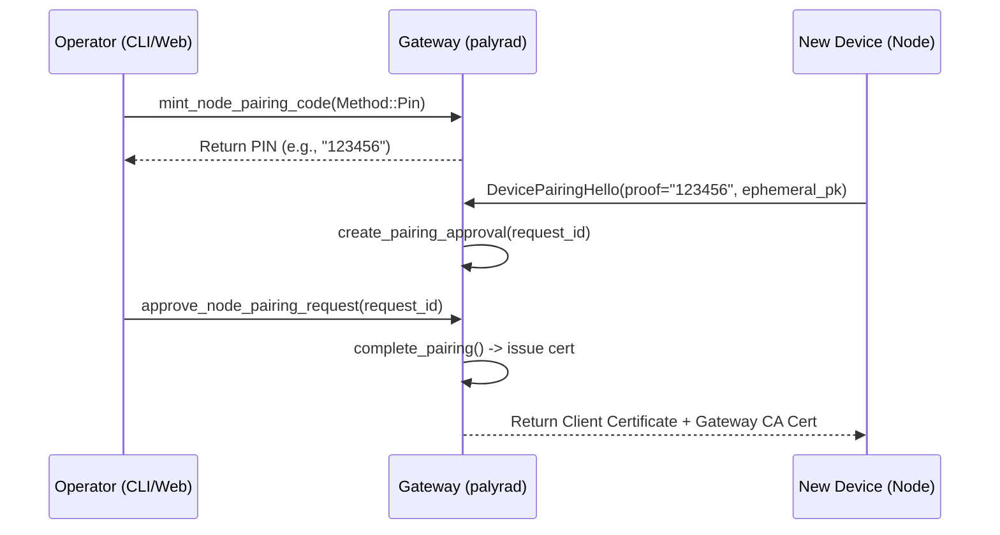

# Identity, mTLS, and Device Pairing

Relevant source files

The following files were used as context for generating this wiki page:

- crates/palyra-browserd/src/persistence/state_store.rs
- crates/palyra-cli/src/commands/node.rs
- crates/palyra-cli/src/commands/pairing.rs
- crates/palyra-cli/tests/cli_v1_acp_shim.rs
- crates/palyra-cli/tests/daemon_status.rs
- crates/palyra-daemon/src/node_rpc.rs
- crates/palyra-daemon/src/node_runtime.rs
- crates/palyra-daemon/src/transport/http/handlers/console/pairing.rs
- crates/palyra-daemon/tests/health_endpoint.rs
- crates/palyra-daemon/tests/node_rpc_mtls.rs
- crates/palyra-identity/Cargo.toml
- crates/palyra-identity/src/device.rs
- crates/palyra-identity/src/pairing/handshake.rs
- crates/palyra-identity/src/pairing/manager.rs
- crates/palyra-identity/src/pairing/models.rs
- crates/palyra-identity/src/pairing/persistence.rs
- crates/palyra-identity/src/pairing/revocation.rs
- crates/palyra-identity/src/pairing/tests.rs
- crates/palyra-identity/src/store.rs
- crates/palyra-policy/Cargo.toml
- crates/palyra-vault/Cargo.toml
- crates/palyra-vault/src/envelope.rs
- crates/palyra-vault/src/filesystem.rs
- crates/palyra-vault/src/metadata.rs

The `palyra-identity` crate provides the security foundation for node-to-gateway communication. It manages the Gateway Certificate Authority (CA), device identity keys, and the cryptographic handshake required to pair new devices (Nodes, CLI, or Desktop) with a Palyra daemon. All node communication is secured via mutual TLS (mTLS) using certificates issued during this pairing process.

## Identity Architecture

The system relies on Ed25519 keypairs for device identity and X.509 certificates for transport security.

### Key Entities
*   **Gateway CA**: A self-signed root CA generated by the daemon on first boot. It is used to sign client certificates for paired devices [crates/palyra-identity/src/ca.rs]().
*   **Device Identity**: Each client (Node, CLI, or Desktop) generates a local Ed25519 keypair. The public key fingerprint serves as the unique `device_id` [crates/palyra-identity/src/device.rs]().
*   **IdentityManager**: The central orchestrator in `palyra-identity` that manages pairing sessions, certificate issuance, and revocation lists [crates/palyra-identity/src/pairing/manager.rs]().
*   **SecretStore**: An abstraction for persisting sensitive identity material (CA keys, paired device records). Implementations include `FilesystemSecretStore` (encrypted at rest) and `InMemorySecretStore` [crates/palyra-identity/src/store.rs#25-31](http://crates/palyra-identity/src/store.rs#25-31).

### Identity Data Flow
The following diagram illustrates how identity entities relate to code structures:

**Identity Entity Mapping**

Sources: [crates/palyra-identity/src/store.rs#25-31](http://crates/palyra-identity/src/store.rs#25-31), [crates/palyra-identity/src/pairing/manager.rs](), [crates/palyra-daemon/src/node_runtime.rs#19-22](http://crates/palyra-daemon/src/node_runtime.rs#19-22), [crates/palyra-daemon/src/node_rpc.rs#38-43](http://crates/palyra-daemon/src/node_rpc.rs#38-43)

## The NodePairing Handshake

Pairing a new device follows a multi-step cryptographic handshake designed to prevent man-in-the-middle (MITM) attacks while remaining user-friendly (using PIN or QR codes).

### Handshake Steps
1.  **Minting a Code**: An operator uses the CLI or Web Console to generate a `PairingCode`. This creates a `PairingSession` in the `IdentityManager` [crates/palyra-identity/src/pairing/handshake.rs#83-109](http://crates/palyra-identity/src/pairing/handshake.rs#83-109).
2.  **Device Hello**: The new device generates an ephemeral X25519 key and sends a `DevicePairingHello` containing its `device_id`, the pairing `proof` (PIN/QR token), and a signature [crates/palyra-identity/src/pairing/handshake.rs#111-118](http://crates/palyra-identity/src/pairing/handshake.rs#111-118).
3.  **Approval**: The daemon creates an `ApprovalRecord`. The operator must explicitly approve the pairing request via the `approve_node_pairing_request` gRPC/HTTP endpoint [crates/palyra-daemon/src/node_rpc.rs#187-210](http://crates/palyra-daemon/src/node_rpc.rs#187-210).
4.  **Finalization**: Upon approval, the `IdentityManager` issues an X.509 client certificate to the device, valid for `DEFAULT_CERT_VALIDITY` [crates/palyra-identity/src/pairing/manager.rs]().

### Pairing Handshake Sequence

Sources: [crates/palyra-daemon/src/node_rpc.rs#187-210](http://crates/palyra-daemon/src/node_rpc.rs#187-210), [crates/palyra-identity/src/pairing/handshake.rs#120-127](http://crates/palyra-identity/src/pairing/handshake.rs#120-127), [crates/palyra-cli/src/commands/pairing.rs#72-96](http://crates/palyra-cli/src/commands/pairing.rs#72-96)

## mTLS Enforcement

Once paired, all subsequent gRPC calls from the device to the gateway are protected by mTLS.

### Certificate Verification
The `NodeRpcServiceImpl` enforces mTLS by inspecting the `TlsConnectInfo` extension on incoming gRPC requests [crates/palyra-daemon/src/node_rpc.rs#56-97](http://crates/palyra-daemon/src/node_rpc.rs#56-97).
*   **Fingerprint Matching**: The SHA-256 fingerprint of the client certificate is extracted [crates/palyra-daemon/src/node_rpc.rs#85](http://crates/palyra-daemon/src/node_rpc.rs#85).
*   **Device Binding**: The system ensures the `device_id` provided in the request body matches the one bound to the certificate fingerprint in the `IdentityManager` [crates/palyra-daemon/src/node_rpc.rs#116-127](http://crates/palyra-daemon/src/node_rpc.rs#116-127).
*   **Revocation Check**: The fingerprint is checked against `revoked_certificate_fingerprints` [crates/palyra-daemon/src/node_rpc.rs#91-95](http://crates/palyra-daemon/src/node_rpc.rs#91-95).

### Opt-out (Insecure Mode)
For local development or specialized environments, mTLS enforcement can be disabled via the `--insecure-node-rpc-opt-out` flag, which allows clients to connect without certificates [crates/palyra-daemon/tests/node_rpc_mtls.rs#121-138](http://crates/palyra-daemon/tests/node_rpc_mtls.rs#121-138).

## Trust Policy: TOFU and Revocation

Palyra uses a **Trust On First Use (TOFU)** model for pairing, where the initial association is established via the PIN/QR code.

### Revocation
Identity can be revoked at two levels:
1.  **Device Revocation**: Prevents a specific `device_id` from ever pairing again or using existing sessions [crates/palyra-identity/src/pairing/revocation.rs]().
2.  **Certificate Revocation**: Invalidates a specific issued certificate fingerprint while potentially allowing the device to re-pair [crates/palyra-daemon/src/node_rpc.rs#91](http://crates/palyra-daemon/src/node_rpc.rs#91).

### Persistence and Locking
The identity state is stored in `identity/state.v1.json` [crates/palyra-identity/src/pairing/persistence.rs#26](http://crates/palyra-identity/src/pairing/persistence.rs#26). To prevent corruption from concurrent processes (e.g., a CLI and a Daemon accessing the same state root), the `IdentityManager` uses a filesystem-based lock file `.identity-state.lock` [crates/palyra-identity/src/pairing/persistence.rs#34](http://crates/palyra-identity/src/pairing/persistence.rs#34).

| File/Entity | Role |
| :--- | :--- |
| `FilesystemSecretStore` | Handles AES-GCM encryption of identity files on disk [crates/palyra-identity/src/store.rs#87](http://crates/palyra-identity/src/store.rs#87). |
| `StateMutationGuard` | Ensures exclusive access during CA operations or pairing updates [crates/palyra-identity/src/pairing/persistence.rs#51](http://crates/palyra-identity/src/pairing/persistence.rs#51). |
| `NodeRuntimeState` | Tracks active nodes and their capabilities (e.g., "browser", "shell") [crates/palyra-daemon/src/node_runtime.rs#177](http://crates/palyra-daemon/src/node_runtime.rs#177). |

Sources: [crates/palyra-identity/src/store.rs](), [crates/palyra-identity/src/pairing/persistence.rs](), [crates/palyra-daemon/src/node_rpc.rs](), [crates/palyra-daemon/src/node_runtime.rs]()
