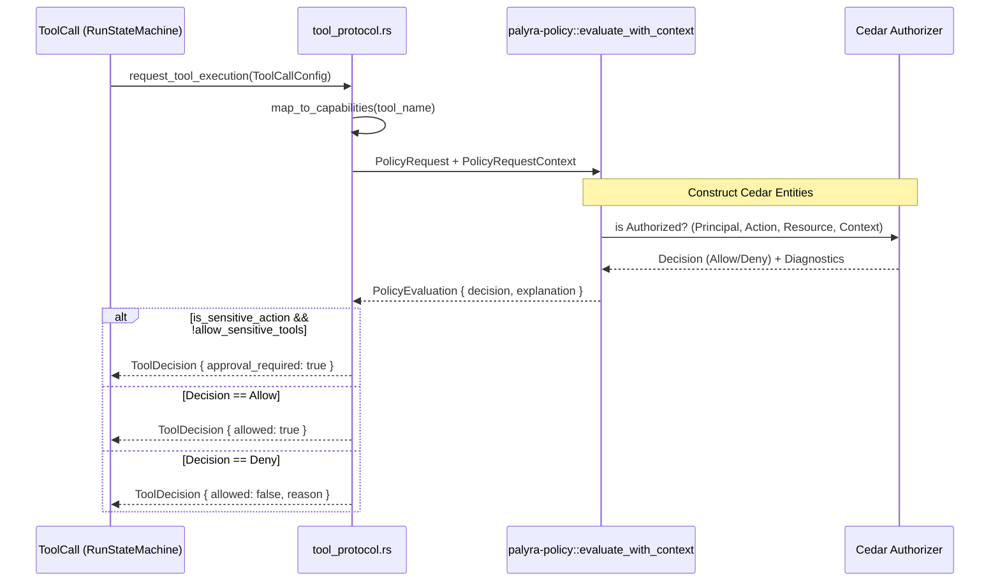
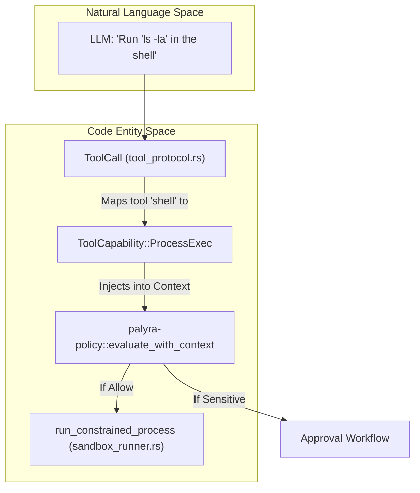

# Policy Engine (Cedar)

Relevant source files

The following files were used as context for generating this wiki page:

- apps/web/src/App.test.tsx
- apps/web/src/App.tsx
- apps/web/src/consoleApi.test.ts
- apps/web/src/consoleApi.ts
- crates/palyra-daemon/src/sandbox_runner.rs
- crates/palyra-daemon/src/tool_protocol.rs
- crates/palyra-daemon/tests/admin_surface.rs
- crates/palyra-policy/src/lib.rs
- crates/palyra-sandbox/src/lib.rs

The Palyra Policy Engine provides a centralized, high-performance authorization layer based on the **Cedar** policy language. It governs all sensitive operations within the daemon, including tool execution, memory management, and secret access. By decoupling authorization logic from functional code, Palyra ensures consistent enforcement across different interfaces (CLI, Web Console, and API).

## Overview and Purpose

The policy engine is primarily housed in the `palyra-policy` crate. It is designed to evaluate whether a `principal` (the user or agent) can perform an `action` on a specific `resource` within a given `context`.

Key responsibilities include:
*   **Tool Execution Governance**: Determining if an LLM-requested tool call is permitted or requires human approval.
*   **Resource Protection**: Controlling access to the `JournalStore`, `Vault`, and `Cron` scheduler.
*   **Sensitive Action Identification**: Flagging high-risk operations (e.g., `process_exec`) that necessitate `ApprovalRequestContext`.

Sources: [crates/palyra-policy/src/lib.rs#1-26](http://crates/palyra-policy/src/lib.rs#1-26), [crates/palyra-daemon/src/tool_protocol.rs#3-6](http://crates/palyra-daemon/src/tool_protocol.rs#3-6)

---

## Key Data Structures

The engine operates on three primary structures that map directly to Cedar's authorization model.

### PolicyRequest
Represents the core authorization triple.
*   `principal`: The identity requesting the action (e.g., `user:ops` or `admin:web-console`).
*   `action`: The operation being attempted (e.g., `tool.execute`, `memory.purge`).
*   `resource`: The target of the action (e.g., `tool:shell`, `session:01ARZ...`).

### PolicyRequestContext
Provides environmental metadata used in `when` clauses of Cedar policies.
*   `device_id`: The hardware identifier of the requester.
*   `channel`: The entry point (e.g., `cli`, `web`, `discord`).
*   `capabilities`: A list of required capabilities for a tool (e.g., `network`, `process_exec`).
*   `is_sensitive_action`: A boolean flag calculated by the engine to trigger stricter rules.

### PolicyEvaluationConfig
Defines the dynamic state of the engine, such as allowlists and sensitivity overrides.
*   `allowlisted_tools`: List of tool IDs permitted for execution.
*   `sensitive_tool_names`: Tools that always trigger the `deny_sensitive_without_approval` rule.

Sources: [crates/palyra-policy/src/lib.rs#11-38](http://crates/palyra-policy/src/lib.rs#11-38), [crates/palyra-policy/src/lib.rs#67-81](http://crates/palyra-policy/src/lib.rs#67-81)

---

## Implementation and Data Flow

The following diagram illustrates how a tool call from the LLM is processed through the Policy Engine within the `palyrad` runtime.

### Tool Call Decision Logic
"Code Entity Space" mapping of `tool_protocol.rs` to `palyra-policy`.

Sources: [crates/palyra-daemon/src/tool_protocol.rs#151-186](http://crates/palyra-daemon/src/tool_protocol.rs#151-186), [crates/palyra-policy/src/lib.rs#211-230](http://crates/palyra-policy/src/lib.rs#211-230)

---

## Default Policy Rules (`DEFAULT_POLICY_SRC`)

Palyra ships with a built-in set of Cedar policies defined in `DEFAULT_POLICY_SRC`. These rules implement a "deny-by-default" posture while allowing common operations.

| Policy ID | Effect | Condition |
| :--- | :--- | :--- |
| `deny_sensitive_without_approval` | **Forbid** | `context.is_sensitive_action` AND NOT `context.allow_sensitive_tools` |
| `allow_read_only_actions` | **Permit** | Action is `tool.read`, `tool.status`, `daemon.status`, etc. |
| `allow_allowlisted_tool_execute` | **Permit** | Action is `tool.execute` AND `is_allowlisted_tool` AND principal/channel are allowlisted. |
| `allow_memory_actions` | **Permit** | Action is `memory.ingest`, `memory.search`, etc. |
| `allow_vault_actions` | **Permit** | Action is `vault.put`, `vault.get`, etc. |

### The `deny_sensitive_without_approval` Rule
This is the core of Palyra's human-in-the-loop security. Even if a tool is allowlisted, if it possesses sensitive capabilities (like `process_exec`), this `forbid` rule overrides any `permit` unless the `allow_sensitive_tools` flag is set in the context (which happens only after a human approval).

Sources: [crates/palyra-policy/src/lib.rs#99-181](http://crates/palyra-policy/src/lib.rs#99-181), [crates/palyra-daemon/src/tool_protocol.rs#148-150](http://crates/palyra-daemon/src/tool_protocol.rs#148-150)

---

## Tool Call Decision Mapping

The engine bridges high-level tool requests to low-level sandbox constraints using capabilities.

### Capability Sensitivity
Capabilities defined in `ToolCapability` are mapped to Cedar context attributes. The following are treated as sensitive:
*   `process_exec` ([crates/palyra-daemon/src/tool_protocol.rs#48](http://crates/palyra-daemon/src/tool_protocol.rs#48))
*   `network` ([crates/palyra-daemon/src/tool_protocol.rs#49](http://crates/palyra-daemon/src/tool_protocol.rs#49))
*   `secrets_read` ([crates/palyra-daemon/src/tool_protocol.rs#50](http://crates/palyra-daemon/src/tool_protocol.rs#50))
*   `filesystem_write` ([crates/palyra-daemon/src/tool_protocol.rs#51](http://crates/palyra-daemon/src/tool_protocol.rs#51))

Sources: [crates/palyra-daemon/src/tool_protocol.rs#47-64](http://crates/palyra-daemon/src/tool_protocol.rs#47-64), [crates/palyra-daemon/src/tool_protocol.rs#148-150](http://crates/palyra-daemon/src/tool_protocol.rs#148-150)

---

## Admin and Debugging

The Policy Engine's decisions can be inspected via the Admin API. This is used by the `palyra policy explain` CLI command and the Web Console to debug why a specific action was blocked.

*   **Endpoint**: `GET /admin/v1/policy/explain`
*   **Parameters**: `principal`, `action`, `resource`
*   **Response**: Returns a `PolicyExplanation` containing `matched_policy_ids` and `diagnostics_errors`.

Sources: [crates/palyra-daemon/tests/admin_surface.rs#110-149](http://crates/palyra-daemon/tests/admin_surface.rs#110-149), [crates/palyra-policy/src/lib.rs#67-81](http://crates/palyra-policy/src/lib.rs#67-81)
