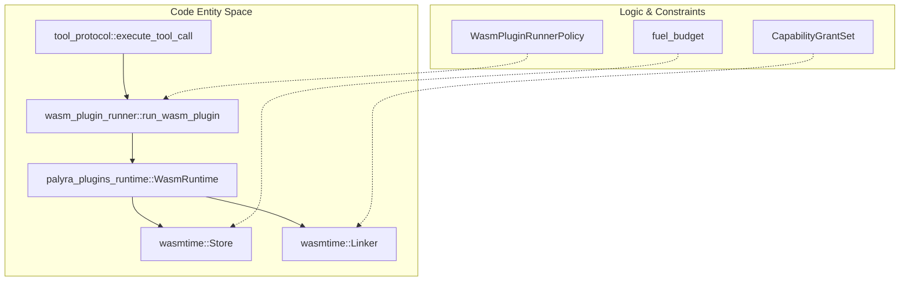
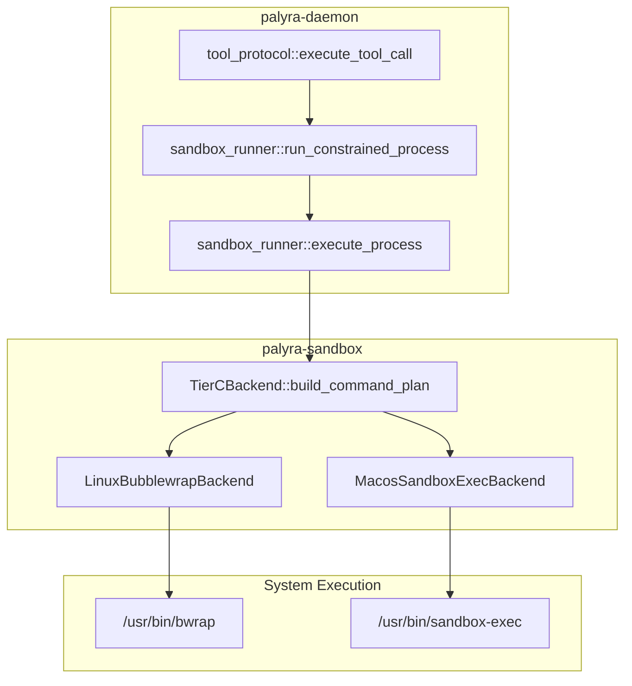

# Tool Sandboxing and Execution Tiers

Relevant source files

The following files were used as context for generating this wiki page:

- crates/palyra-daemon/src/sandbox_runner.rs
- crates/palyra-daemon/src/tool_protocol.rs
- crates/palyra-daemon/src/wasm_plugin_runner.rs
- crates/palyra-identity/src/ca.rs
- crates/palyra-identity/src/error.rs
- crates/palyra-identity/tests/mtls_pairing_flow.rs
- crates/palyra-plugins/runtime/src/lib.rs
- crates/palyra-policy/src/lib.rs
- crates/palyra-sandbox/src/lib.rs

Palyra employs a multi-layered sandboxing model to execute untrusted code and tools generated by AI agents. This model ensures that any tool execution—whether it be a filesystem operation, a network request, or a shell command—is constrained by resource quotas, capability grants, and platform-specific isolation mechanisms.

The system categorizes execution into three distinct tiers (A, B, and C), moving from high-density language-level isolation to OS-level process virtualization.

### Execution Tier Overview

| Tier | Technology | Scope | Primary Use Case |
| :--- | :--- | :--- | :--- |
| **Tier A** | WASM (Wasmtime) | Language Runtime | High-performance plugins, portable skills, inline logic. |
| **Tier B** | Unix `rlimit` | OS Process | Native binaries on Unix systems with basic resource caps. |
| **Tier C** | `bwrap` / `sandbox-exec` | OS Virtualization | Strict filesystem/network isolation for native binaries. |

Sources: [crates/palyra-daemon/src/sandbox_runner.rs#64-78](http://crates/palyra-daemon/src/sandbox_runner.rs#64-78), [crates/palyra-daemon/src/tool_protocol.rs#19-26](http://crates/palyra-daemon/src/tool_protocol.rs#19-26)

---

## Tier A: WASM Plugin Runtime

Tier A execution leverages the `wasmtime` engine to provide a memory-safe, capability-based environment. This tier is managed by the `WasmPluginRunnerPolicy` and executed via `run_wasm_plugin`.

### Capability-Based Security
Unlike native processes, WASM modules in Palyra have zero access to the host system by default. Access is granted through `CapabilityGrantSet`, which maps specific host resources to virtual handles within the WASM guest.

*   **Fuel Budget**: Execution is metered using Wasmtime "fuel" to prevent infinite loops [crates/palyra-plugins/runtime/src/lib.rs#25-40](http://crates/palyra-plugins/runtime/src/lib.rs#25-40).
*   **Memory Limits**: Strict `max_memory_bytes` enforcement [crates/palyra-plugins/runtime/src/lib.rs#35-35](http://crates/palyra-plugins/runtime/src/lib.rs#35-35).
*   **Host Imports**: The runtime provides specific imports for HTTP, Secrets, Storage, and Channels [crates/palyra-plugins/runtime/src/lib.rs#3-9](http://crates/palyra-plugins/runtime/src/lib.rs#3-9).

### Code Entity Mapping: Tier A Execution
The following diagram shows the flow from a tool call to the WASM runtime.

Title: Tier A WASM Execution Flow

Sources: [crates/palyra-daemon/src/wasm_plugin_runner.rs#96-126](http://crates/palyra-daemon/src/wasm_plugin_runner.rs#96-126), [crates/palyra-plugins/runtime/src/lib.rs#105-186](http://crates/palyra-plugins/runtime/src/lib.rs#105-186)

---

## Tier B & C: Process Sandboxing

For native binaries that cannot run in WASM, Palyra uses the `SandboxProcessRunner`. This component handles validation, workspace scoping, and execution via `run_constrained_process`.

### Tier B: Resource Limits (Unix)
Tier B uses standard Unix `setrlimit` (via the `rlimit` crate) to constrain CPU time and memory usage. It does not provide filesystem isolation beyond standard permission checks. It is primarily used when Tier C backends are unavailable or when lightweight isolation is sufficient.

### Tier C: OS-Level Virtualization
Tier C provides the highest level of isolation for native processes by using platform-specific "jails":
*   **Linux**: Uses `bwrap` (Bubblewrap) to create new namespaces (PID, Network, Mount). It mounts a minimal root filesystem and bind-mounts only the required workspace [crates/palyra-sandbox/src/lib.rs#130-182](http://crates/palyra-sandbox/src/lib.rs#130-182).
*   **macOS**: Uses `sandbox-exec` with Seatbelt profiles to restrict syscalls and file access.

### Execution Lifecycle
1.  **Validation**: The `execute_tool_call` function validates the input against `MAX_PROCESS_RUNNER_TOOL_INPUT_BYTES` [crates/palyra-daemon/src/tool_protocol.rs#144-144](http://crates/palyra-daemon/src/tool_protocol.rs#144-144).
2.  **Workspace Scoping**: `validate_argument_workspace_scope` ensures all file paths in arguments reside within the `workspace_root` [crates/palyra-daemon/src/sandbox_runner.rs#175-180](http://crates/palyra-daemon/src/sandbox_runner.rs#175-180).
3.  **Interpreter Guardrails**: A denylist (e.g., `bash`, `python`, `node`) prevents agents from escaping the sandbox via shell injection unless explicitly allowed by policy [crates/palyra-daemon/src/sandbox_runner.rs#30-44](http://crates/palyra-daemon/src/sandbox_runner.rs#30-44).

### Code Entity Mapping: Process Execution
Title: Native Process Sandbox Orchestration

Sources: [crates/palyra-daemon/src/sandbox_runner.rs#147-210](http://crates/palyra-daemon/src/sandbox_runner.rs#147-210), [crates/palyra-sandbox/src/lib.rs#81-91](http://crates/palyra-sandbox/src/lib.rs#81-91)

---

## Egress Enforcement Modes

Network isolation is managed through `EgressEnforcementMode`, which determines how outbound requests from tools are handled:

1.  **None**: No network restrictions applied.
2.  **Preflight**: The daemon parses tool arguments to find URLs and checks them against `allowed_egress_hosts` before spawning the process [crates/palyra-daemon/src/sandbox_runner.rs#189-191](http://crates/palyra-daemon/src/sandbox_runner.rs#189-191).
3.  **Strict**: Requires the underlying sandbox (Tier C) to enforce network isolation at the kernel/namespace level (e.g., `--unshare-net` in `bwrap`) [crates/palyra-daemon/src/sandbox_runner.rs#192-194](http://crates/palyra-daemon/src/sandbox_runner.rs#192-194), [crates/palyra-sandbox/src/lib.rs#176-178](http://crates/palyra-sandbox/src/lib.rs#176-178).

Sources: [crates/palyra-daemon/src/sandbox_runner.rs#46-62](http://crates/palyra-daemon/src/sandbox_runner.rs#46-62), [crates/palyra-daemon/src/sandbox_runner.rs#181-195](http://crates/palyra-daemon/src/sandbox_runner.rs#181-195)

---

## Quota and Output Enforcement

To prevent Denial of Service (DoS) attacks via log-flooding or memory exhaustion, the sandbox runner implements active monitoring of process output:

*   **Output Quota**: `max_output_bytes` defines the total allowed size for `stdout` and `stderr`.
*   **Chunked Capture**: The runner polls the process pipes in `CAPTURE_CHUNK_BYTES` increments [crates/palyra-daemon/src/sandbox_runner.rs#29-29](http://crates/palyra-daemon/src/sandbox_runner.rs#29-29).
*   **Termination**: If the cumulative output exceeds the quota, the runner immediately kills the child process and returns `SandboxProcessRunErrorKind::QuotaExceeded` [crates/palyra-daemon/src/sandbox_runner.rs#219-227](http://crates/palyra-daemon/src/sandbox_runner.rs#219-227).

Sources: [crates/palyra-daemon/src/sandbox_runner.rs#92-92](http://crates/palyra-daemon/src/sandbox_runner.rs#92-92), [crates/palyra-daemon/src/sandbox_runner.rs#130-145](http://crates/palyra-daemon/src/sandbox_runner.rs#130-145)
