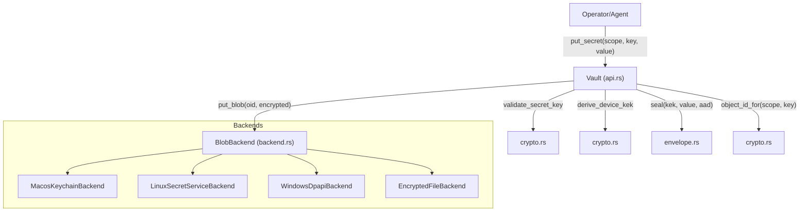
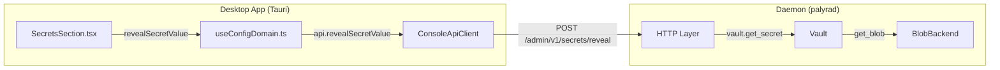

# Vault and Secret Management

Relevant source files

The following files were used as context for generating this wiki page:

- apps/web/src/console/hooks/useConfigDomain.ts
- apps/web/src/console/sections/SecretsSection.tsx
- crates/palyra-cli/src/args/secrets.rs
- crates/palyra-cli/src/args/security.rs
- crates/palyra-cli/src/commands/secrets.rs
- crates/palyra-cli/src/output/mod.rs
- crates/palyra-cli/tests/config_validate.rs
- crates/palyra-cli/tests/pairing_flow.rs
- crates/palyra-cli/tests/secrets_cli.rs
- crates/palyra-common/src/lib.rs
- crates/palyra-vault/src/backend.rs
- crates/palyra-vault/src/crypto.rs
- crates/palyra-vault/src/lib.rs
- crates/palyra-vault/src/tests.rs

The `palyra-vault` crate provides a secure, cross-platform abstraction for storing sensitive data such as LLM API keys, OAuth tokens, and database credentials. It utilizes platform-specific hardware-backed stores (Keychain, Secret Service, DPAPI) when available, falling back to an encrypted filesystem backend.

## Architecture and Core Traits

The vault architecture is centered around the `Vault` struct and the `BlobBackend` trait. The `Vault` handles high-level operations like encryption, metadata management, and scoping, while the `BlobBackend` handles the physical storage of encrypted payloads.

### BlobBackend Trait
The `BlobBackend` trait defines the interface for storage providers:
*   `put_blob`: Persists an encrypted payload.
*   `get_blob`: Retrieves a payload by its object ID.
*   `delete_blob`: Removes a payload.

### Backend Selection Logic
The `select_backend` function determines which backend to use based on the operating system and a `BackendPreference` [crates/palyra-vault/src/backend.rs#95-133](http://crates/palyra-vault/src/backend.rs#95-133). If no preference is specified, `choose_auto_backend` attempts to use the most secure platform-native option [crates/palyra-vault/src/backend.rs#135-158](http://crates/palyra-vault/src/backend.rs#135-158).

| Platform | Primary Backend | Implementation |
| :--- | :--- | :--- |
| **macOS** | `MacosKeychain` | Uses the system Keychain via `security` CLI [crates/palyra-vault/src/backend.rs#28-29](http://crates/palyra-vault/src/backend.rs#28-29) |
| **Linux** | `LinuxSecretService` | Uses `secret-tool` (libsecret) [crates/palyra-vault/src/backend.rs#30-35](http://crates/palyra-vault/src/backend.rs#30-35) |
| **Windows** | `WindowsDpapi` | Uses DPAPI for user-level encryption [crates/palyra-vault/src/backend.rs#16-16](http://crates/palyra-vault/src/backend.rs#16-16) |
| **Fallback** | `EncryptedFile` | AES-GCM encrypted files in the state directory [crates/palyra-vault/src/backend.rs#42-42](http://crates/palyra-vault/src/backend.rs#42-42) |

**Sources:** [crates/palyra-vault/src/backend.rs#88-93](http://crates/palyra-vault/src/backend.rs#88-93), [crates/palyra-vault/src/backend.rs#135-158](http://crates/palyra-vault/src/backend.rs#135-158), [crates/palyra-vault/src/lib.rs#12-16](http://crates/palyra-vault/src/lib.rs#12-16)

## Data Flow: Putting a Secret

When a secret is stored, it undergoes several transformations before reaching the backend.

### Secret Storage Flow
1.  **Key Validation**: The key is checked for length and character constraints [crates/palyra-vault/src/crypto.rs#93-113](http://crates/palyra-vault/src/crypto.rs#93-113).
2.  **KEK Derivation**: A Key Encryption Key (KEK) is derived from the device identity using HKDF-SHA256 [crates/palyra-vault/src/crypto.rs#20-33](http://crates/palyra-vault/src/crypto.rs#20-33).
3.  **Envelope Sealing**: The secret is encrypted using AES-GCM. The `VaultScope` and `key` are used as Authenticated Additional Data (AAD) to prevent substitution attacks [crates/palyra-vault/src/crypto.rs#89-91](http://crates/palyra-vault/src/crypto.rs#89-91).
4.  **Object ID Generation**: A unique object ID is generated by hashing the scope and key [crates/palyra-vault/src/crypto.rs#115-122](http://crates/palyra-vault/src/crypto.rs#115-122).
5.  **Backend Storage**: The encrypted blob is passed to the selected `BlobBackend`.
6.  **Metadata Update**: A local metadata file tracks the mapping between keys and object IDs [crates/palyra-vault/src/tests.rs#6-9](http://crates/palyra-vault/src/tests.rs#6-9).

### Code Entity Mapping: Storage
Title: Secret Storage Data Flow

**Sources:** [crates/palyra-vault/src/api.rs#12-12](http://crates/palyra-vault/src/api.rs#12-12), [crates/palyra-vault/src/crypto.rs#89-122](http://crates/palyra-vault/src/crypto.rs#89-122), [crates/palyra-vault/src/backend.rs#88-93](http://crates/palyra-vault/src/backend.rs#88-93)

## VaultRef and Configuration Indirection

Palyra uses `VaultRef` to avoid storing raw secrets in configuration files. A `VaultRef` is a string representation of a secret's location in the vault, typically formatted as `scope/key`.

### Configuration Integration
When the system encounters a field like `openai_api_key_vault_ref` in `palyra.toml`, it uses the `Vault` to resolve the reference at runtime [crates/palyra-cli/tests/secrets_cli.rs#175-183](http://crates/palyra-cli/tests/secrets_cli.rs#175-183). This ensures that the configuration file itself contains no sensitive material and can be safely audited or checked into version control.

The CLI command `secrets configure` automates this by:
1.  Storing the secret in the vault.
2.  Updating the TOML configuration to point to the new `VaultRef` [crates/palyra-cli/tests/secrets_cli.rs#144-174](http://crates/palyra-cli/tests/secrets_cli.rs#144-174).

**Sources:** [crates/palyra-vault/src/api.rs#12-12](http://crates/palyra-vault/src/api.rs#12-12), [crates/palyra-cli/tests/secrets_cli.rs#144-183](http://crates/palyra-cli/tests/secrets_cli.rs#144-183), [crates/palyra-common/src/daemon_config_schema.rs#1-10](http://crates/palyra-common/src/daemon_config_schema.rs#1-10)

## Security and Memory Safety

### SensitiveBytes
The `SensitiveBytes` wrapper is used for secret values in memory. It implements the `Drop` trait to zero-fill the underlying buffer when the object goes out of scope, reducing the window for memory forensics [crates/palyra-vault/src/crypto.rs#156-174](http://crates/palyra-vault/src/crypto.rs#156-174).

### Scoping
The `VaultScope` enum provides logical isolation for secrets:
*   `Global`: Accessible by the system and authorized agents.
*   `Principal`: Scoped to a specific user or identity ID.
*   `Session`: Temporary secrets tied to a specific run lifecycle.

**Sources:** [crates/palyra-vault/src/crypto.rs#156-174](http://crates/palyra-vault/src/crypto.rs#156-174), [crates/palyra-vault/src/scope.rs#16-16](http://crates/palyra-vault/src/scope.rs#16-16)

## Desktop Secret Store

The desktop application utilizes `DesktopSecretStore` (integrated via the Tauri layer) to manage secrets required for onboarding and process supervision.

### Component Interaction
Title: Desktop Secret Management

The web-based management UI in `SecretsSection.tsx` allows operators to:
*   **List Metadata**: View keys and update timestamps without revealing values [apps/web/src/console/sections/SecretsSection.tsx#129-147](http://apps/web/src/console/sections/SecretsSection.tsx#129-147).
*   **Explicit Reveal**: Decrypt and show a secret value only after an explicit "Reveal" action [apps/web/src/console/sections/SecretsSection.tsx#161-171](http://apps/web/src/console/sections/SecretsSection.tsx#161-171).
*   **Audit**: Perform an audit of secret references across the configuration [crates/palyra-cli/src/commands/secrets.rs#147-163](http://crates/palyra-cli/src/commands/secrets.rs#147-163).

**Sources:** [apps/web/src/console/sections/SecretsSection.tsx#1-40](http://apps/web/src/console/sections/SecretsSection.tsx#1-40), [apps/web/src/console/hooks/useConfigDomain.ts#33-38](http://apps/web/src/console/hooks/useConfigDomain.ts#33-38), [crates/palyra-cli/src/commands/secrets.rs#61-146](http://crates/palyra-cli/src/commands/secrets.rs#61-146)
