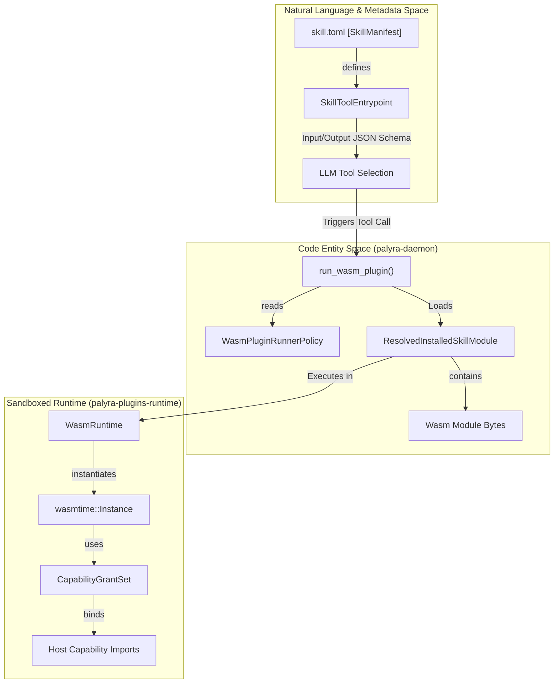
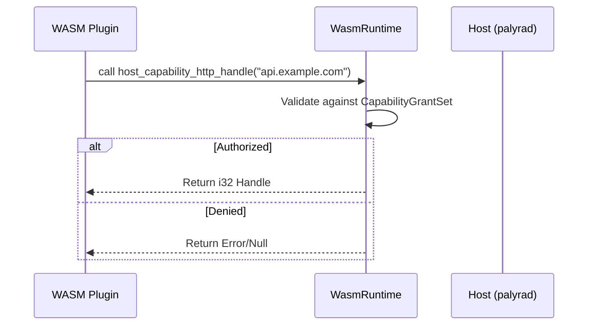

# Skills and Plugin System

Relevant source files

The following files were used as context for generating this wiki page:

- crates/palyra-daemon/src/wasm_plugin_runner.rs
- crates/palyra-identity/src/ca.rs
- crates/palyra-identity/src/error.rs
- crates/palyra-identity/tests/mtls_pairing_flow.rs
- crates/palyra-plugins/runtime/src/lib.rs
- crates/palyra-skills/Cargo.toml
- crates/palyra-skills/examples/echo-http/skill.toml
- crates/palyra-skills/src/lib.rs

The Skills and Plugin system provides the extensibility framework for Palyra. It allows the platform to safely execute third-party capabilities—ranging from simple data transformations to complex API integrations—within a strictly governed and sandboxed environment.

Capabilities are packaged as **Skills**, which contain metadata, security manifests, and compiled **Plugins** (WebAssembly modules). The system ensures that every plugin execution is resource-constrained, audited, and bound by explicit capability grants.

## System Architecture

The following diagram illustrates the relationship between a Skill's definition in the "Natural Language Space" (manifests and tool descriptions) and its execution in the "Code Entity Space" (WASM runtimes and host bindings).

### Skill Execution Flow

**Sources:** [crates/palyra-daemon/src/wasm_plugin_runner.rs#96-126](http://crates/palyra-daemon/src/wasm_plugin_runner.rs#96-126), [crates/palyra-plugins/runtime/src/lib.rs#105-110](http://crates/palyra-plugins/runtime/src/lib.rs#105-110), [crates/palyra-skills/src/models.rs#1-50](http://crates/palyra-skills/src/models.rs#1-50)

---

## Skills: Packaging and Trust

A **Skill** is the unit of distribution in Palyra. It is a signed artifact (`.palyra-skill`) containing a `skill.toml` manifest and one or more WASM modules.

### The Skill Manifest
The `skill.toml` file defines the identity of the skill, the tools it exposes to the LLM, and the specific capabilities (like network access or secret retrieval) it requires.

| Component | Description | Code Reference |
| :--- | :--- | :--- |
| **Identity** | `skill_id`, `version`, and `publisher`. | [crates/palyra-skills/examples/echo-http/skill.toml#2-5](http://crates/palyra-skills/examples/echo-http/skill.toml#2-5) |
| **Tools** | JSON Schema definitions for tool inputs and outputs. | [crates/palyra-skills/examples/echo-http/skill.toml#8-22](http://crates/palyra-skills/examples/echo-http/skill.toml#8-22) |
| **Capabilities** | Explicit allowlists for HTTP hosts, secrets, and filesystem paths. | [crates/palyra-skills/examples/echo-http/skill.toml#24-36](http://crates/palyra-skills/examples/echo-http/skill.toml#24-36) |
| **Quotas** | Resource limits like `fuel_budget` and `max_memory_bytes`. | [crates/palyra-skills/examples/echo-http/skill.toml#37-41](http://crates/palyra-skills/examples/echo-http/skill.toml#37-41) |

### Trust and Verification
Palyra uses a Trust-on-First-Use (TOFU) model combined with cryptographic signing. Artifacts are verified using Ed25519 signatures before installation. The `SkillTrustStore` manages known publishers and their public keys.

For details on signing, verification, and the lifecycle states (e.g., Quarantine), see **[Skills Lifecycle and Trust](skills_lifecycle_and_trust/README.md)**.

**Sources:** [crates/palyra-skills/src/lib.rs#11-24](http://crates/palyra-skills/src/lib.rs#11-24), [crates/palyra-skills/examples/echo-http/skill.toml#1-45](http://crates/palyra-skills/examples/echo-http/skill.toml#1-45)

---

## Plugins: WASM Runtime

The execution of skill logic happens within the `palyra-plugins-runtime`. This crate utilizes `wasmtime` to provide a high-performance, memory-safe sandbox.

### Resource Constraints
To prevent "noisy neighbor" issues or malicious resource exhaustion, every plugin run is governed by `RuntimeLimits`:
*   **Fuel Budget:** Instruction-level accounting to prevent infinite loops. [crates/palyra-plugins/runtime/src/lib.rs#25](http://crates/palyra-plugins/runtime/src/lib.rs#25)
*   **Memory Limits:** Hard caps on linear memory allocation (default 64MB). [crates/palyra-plugins/runtime/src/lib.rs#35](http://crates/palyra-plugins/runtime/src/lib.rs#35)
*   **Table/Instance Limits:** Constraints on WASM table elements and concurrent instances. [crates/palyra-plugins/runtime/src/lib.rs#27-28](http://crates/palyra-plugins/runtime/src/lib.rs#27-28)

### Host Capability Bindings
Plugins cannot access the host system directly. They must use the `palyra-plugins-sdk` to interact with the host via a handle-based system. The runtime injects `CapabilityHandles` which represent specific granted permissions (e.g., a handle for a specific allowlisted HTTP host).

For details on the SDK and runtime internals, see **[WASM Plugin Runtime](wasm_plugin_runtime/README.md)**.

**Sources:** [crates/palyra-plugins/runtime/src/lib.rs#24-40](http://crates/palyra-plugins/runtime/src/lib.rs#24-40), [crates/palyra-plugins/runtime/src/lib.rs#160-186](http://crates/palyra-plugins/runtime/src/lib.rs#160-186), [crates/palyra-daemon/src/wasm_plugin_runner.rs#18-30](http://crates/palyra-daemon/src/wasm_plugin_runner.rs#18-30)

---

## Child Pages

*   **[Skills Lifecycle and Trust](skills_lifecycle_and_trust/README.md)**: Deep dive into `palyra-skills`, `skill.toml` schemas, artifact signing, the `SkillTrustStore`, and periodic re-auditing.
*   **[WASM Plugin Runtime](wasm_plugin_runtime/README.md)**: Technical details of `palyra-plugins-runtime`, `wasmtime` configuration, fuel instrumentation, and the guest-host communication protocol.

## Child Pages

- [Skills Lifecycle and Trust](skills_lifecycle_and_trust/README.md)
- [WASM Plugin Runtime](wasm_plugin_runtime/README.md)
