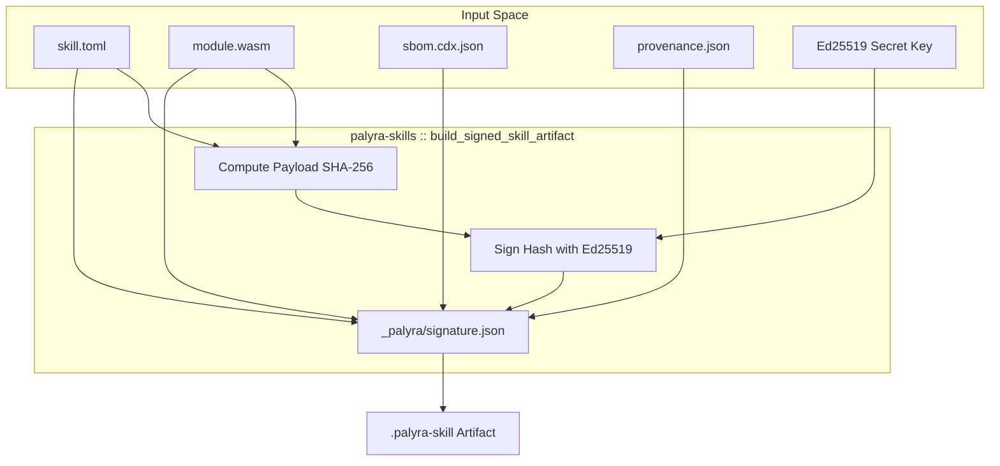

# Skills Lifecycle and Trust

<details>
<summary>Relevant source files</summary>

The following files were used as context for generating this wiki page:

- crates/palyra-cli/src/args/skills.rs
- crates/palyra-cli/src/commands/operator_wizard.rs
- crates/palyra-cli/src/commands/skills.rs
- crates/palyra-cli/src/output/skills.rs
- crates/palyra-cli/tests/skills_lifecycle.rs
- crates/palyra-cli/tests/wizard_cli.rs
- crates/palyra-skills/Cargo.toml
- crates/palyra-skills/examples/echo-http/skill.toml
- crates/palyra-skills/src/lib.rs
- crates/palyra-skills/src/manifest.rs
- crates/palyra-skills/src/tests.rs

</details>


The `palyra-skills` crate provides the core logic for packaging, verifying, and managing the lifecycle of agent capabilities. It ensures that skills—which contain executable WASM modules and sensitive capability requests—are signed by trusted publishers and audited before execution.

### Skill Manifest (skill.toml)

Every skill is defined by a `skill.toml` manifest. This file declares the skill's identity, its entrypoint tools, and the specific capabilities (filesystem, network, secrets) it requires from the host.

| Field | Description | Source |
| :--- | :--- | :--- |
| `skill_id` | Unique dot-separated identifier (e.g., `acme.echo_http`). | [crates/palyra-skills/src/manifest.rs#59-59](http://crates/palyra-skills/src/manifest.rs#59-59) |
| `publisher` | The entity responsible for the skill. Used for namespace validation. | [crates/palyra-skills/src/manifest.rs#58-58](http://crates/palyra-skills/src/manifest.rs#58-58) |
| `entrypoints.tools` | List of tools exposed to the LLM, including JSON schemas and risk levels. | [crates/palyra-skills/src/manifest.rs#65-69](http://crates/palyra-skills/src/manifest.rs#65-69) |
| `capabilities` | Requests for `http_egress_allowlist`, `filesystem`, and `secrets`. | [crates/palyra-skills/src/manifest.rs#99-123](http://crates/palyra-skills/src/manifest.rs#99-123) |
| `quotas` | Resource limits: `fuel_budget`, `max_memory_bytes`, and `wall_clock_timeout_ms`. | [crates/palyra-skills/src/manifest.rs#138-145](http://crates/palyra-skills/src/manifest.rs#138-145) |

**Validation Rules:**
- Tool IDs must be namespaced with the publisher name (e.g., `acme.echo`) [crates/palyra-skills/src/manifest.rs#74-79](http://crates/palyra-skills/src/manifest.rs#74-79).
- Wildcards in capabilities (e.g., `read_roots = ["skills/*"]`) require an explicit `wildcard_opt_in` flag [crates/palyra-skills/src/manifest.rs#100-107](http://crates/palyra-skills/src/manifest.rs#100-107).
- Runtime compatibility is checked against `min_palyra_version` and `required_protocol_major` [crates/palyra-skills/src/manifest.rs#149-168](http://crates/palyra-skills/src/manifest.rs#149-168).

**Sources:** [crates/palyra-skills/src/manifest.rs#12-147](http://crates/palyra-skills/src/manifest.rs#12-147), [crates/palyra-skills/examples/echo-http/skill.toml#1-45](http://crates/palyra-skills/examples/echo-http/skill.toml#1-45)

---

### SkillArtifact Packaging and Signing

A `.palyra-skill` artifact is a signed ZIP archive containing the manifest, WASM modules, assets, and security metadata (SBOM and Provenance).

#### The Build Process
1. **Gather Inputs:** Manifest TOML, WASM bytes, static assets, CycloneDX SBOM, and SLSA provenance [crates/palyra-cli/src/commands/skills.rs#20-51](http://crates/palyra-cli/src/commands/skills.rs#20-51).
2. **Sign:** The `build_signed_skill_artifact` function uses an Ed25519 key to sign the SHA-256 hash of the payload [crates/palyra-skills/src/lib.rs#11-11](http://crates/palyra-skills/src/lib.rs#11-11).
3. **Bundle:** Files are packed into a ZIP with standard paths: `skill.toml`, `_palyra/signature.json`, `_palyra/sbom.cdx.json`, and `_palyra/provenance.json` [crates/palyra-skills/src/lib.rs#13-17](http://crates/palyra-skills/src/lib.rs#13-17).

**Diagram: Skill Artifact Construction**

**Sources:** [crates/palyra-skills/src/lib.rs#1-33](http://crates/palyra-skills/src/lib.rs#1-33), [crates/palyra-cli/src/commands/skills.rs#59-67](http://crates/palyra-cli/src/commands/skills.rs#59-67)

---

### Trust Store and TOFU

The `SkillTrustStore` manages the public keys of trusted publishers. It supports **Trust On First Use (TOFU)** for local development or unmanaged environments.

- **Verification:** `verify_skill_artifact` checks the signature against the `SkillTrustStore`. If the publisher is unknown and `allow_tofu` is enabled, the key is pinned to that publisher [crates/palyra-cli/src/commands/skills.rs#125-126](http://crates/palyra-cli/src/commands/skills.rs#125-126).
- **Trust Decisions:** Decisions are categorized as `Allowlisted` (explicitly trusted), `TofuPinned` (already seen), or `TofuNewlyPinned` [crates/palyra-cli/src/commands/skills.rs#136-140](http://crates/palyra-cli/src/commands/skills.rs#136-140).
- **Integrity:** The trust store is typically stored in a JSON file and loaded/saved with integrity checks during the install/verify flow [crates/palyra-cli/src/commands/skills.rs#119-127](http://crates/palyra-cli/src/commands/skills.rs#119-127).

**Sources:** [crates/palyra-skills/src/lib.rs#8-9](http://crates/palyra-skills/src/lib.rs#8-9), [crates/palyra-cli/src/commands/skills.rs#106-127](http://crates/palyra-cli/src/commands/skills.rs#106-127)

---

### Lifecycle Management

Skills move through various states managed by the CLI and the `palyrad` daemon.

#### 1. Installation
The `skills install` command validates the artifact, verifies the signature, and extracts the contents to the managed skills directory [crates/palyra-cli/src/args/skills.rs#9-34](http://crates/palyra-cli/src/args/skills.rs#9-34). It also registers the skill's initial status in the `JournalStore` [crates/palyra-cli/tests/skills_lifecycle.rs#186-197](http://crates/palyra-cli/tests/skills_lifecycle.rs#186-197).

#### 2. Periodic Reaudit
The daemon runs a `PeriodicSkillReaudit` task (via the Cron subsystem) to ensure installed skills still meet security policies.
- **WASM Audit:** Checks for excessive exported functions or module size [crates/palyra-skills/src/lib.rs#13-15](http://crates/palyra-skills/src/lib.rs#13-15).
- **Policy Check:** Validates that the skill's requested capabilities align with the current `palyra-policy` [crates/palyra-skills/src/lib.rs#21-23](http://crates/palyra-skills/src/lib.rs#21-23).

#### 3. Quarantine State
If a skill fails an audit or is manually flagged, it is moved to a `Quarantine` state.
- **Effect:** Quarantined skills cannot be loaded into the WASM runtime.
- **Triggers:** Signature mismatch, failed security audit, or operator command `skills quarantine` [crates/palyra-cli/src/args/skills.rs#138-158](http://crates/palyra-cli/src/args/skills.rs#138-158).
- **Storage:** Status is persisted in the `skill_status` table of the SQLite `JournalStore` [crates/palyra-cli/tests/skills_lifecycle.rs#125-175](http://crates/palyra-cli/tests/skills_lifecycle.rs#125-175).

**Diagram: Skill Lifecycle Transitions**
```mermaid
stateDiagram-v2
    [*] --> Uninstalled
    Uninstalled --> Installed: "skills install"
    Installed --> Verified: "verify_skill_artifact()"
    Verified --> Quarantined: "Tamper detected / Audit fail"
    Verified --> Active: "Runtime load"
    Quarantined --> Active: "skills enable --override"
    Active --> Quarantined: "PeriodicSkillReaudit fail"
    Active --> Uninstalled: "skills remove"
    Quarantined --> Uninstalled: "skills remove"

    note right of Active
        Uses palyra_plugins_runtime
        to execute WASM
    end
```
**Sources:** [crates/palyra-cli/src/args/skills.rs#3-182](http://crates/palyra-cli/src/args/skills.rs#3-182), [crates/palyra-cli/src/output/skills.rs#101-119](http://crates/palyra-cli/src/output/skills.rs#101-119), [crates/palyra-cli/tests/skills_lifecycle.rs#125-175](http://crates/palyra-cli/tests/skills_lifecycle.rs#125-175)

---

### Security Auditing

The `audit_skill_artifact_security` function performs static analysis on the skill artifact before it is allowed to run.

- **Module Limits:** Enforces `DEFAULT_SKILL_AUDIT_MAX_MODULE_BYTES` and `DEFAULT_SKILL_AUDIT_MAX_EXPORTED_FUNCTIONS` [crates/palyra-skills/src/lib.rs#13-14](http://crates/palyra-skills/src/lib.rs#13-14).
- **Capability Mapping:** Converts manifest requests into `CapabilityGrants` and `PolicyRequests` [crates/palyra-skills/src/lib.rs#21-23](http://crates/palyra-skills/src/lib.rs#21-23).
- **Check Results:** The CLI `skills check` command aggregates these audits, reporting `trust_accepted`, `audit_passed`, and `quarantine_required` [crates/palyra-cli/src/output/skills.rs#104-113](http://crates/palyra-cli/src/output/skills.rs#104-113).

**Sources:** [crates/palyra-skills/src/lib.rs#11-24](http://crates/palyra-skills/src/lib.rs#11-24), [crates/palyra-cli/src/output/skills.rs#85-119](http://crates/palyra-cli/src/output/skills.rs#85-119)
