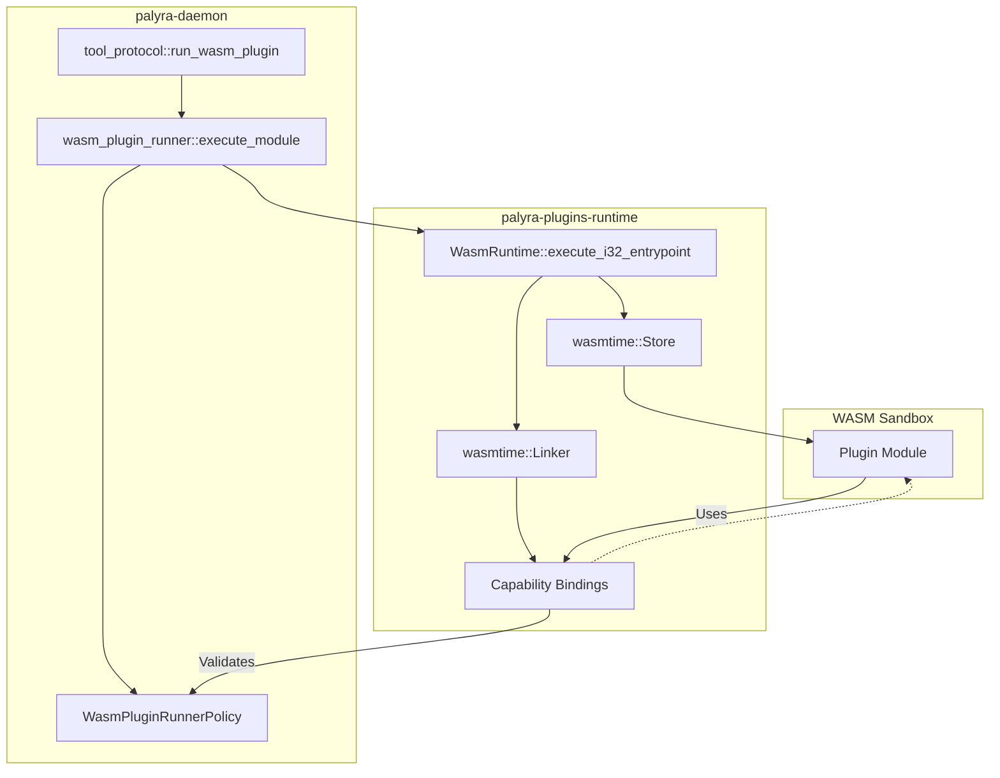

# WASM Plugin Runtime

<details>
<summary>Relevant source files</summary>

The following files were used as context for generating this wiki page:

- crates/palyra-daemon/src/sandbox_runner.rs
- crates/palyra-daemon/src/tool_protocol.rs
- crates/palyra-daemon/src/wasm_plugin_runner.rs
- crates/palyra-identity/src/ca.rs
- crates/palyra-identity/src/error.rs
- crates/palyra-identity/tests/mtls_pairing_flow.rs
- crates/palyra-plugins/runtime/src/lib.rs
- crates/palyra-policy/src/lib.rs
- crates/palyra-sandbox/src/lib.rs

</details>


The WASM Plugin Runtime provides a high-performance, sandboxed environment for executing untrusted code within the Palyra ecosystem. It leverages `wasmtime` with the `cranelift` compiler to execute WebAssembly (WASM) modules while enforcing strict resource constraints and capability-based security. This runtime is primarily used for executing complex tool logic that requires isolation beyond standard process-level sandboxing.

## Architecture and Execution Model

The runtime is divided into the core execution engine (`palyra-plugins-runtime`) and the integration layer within the daemon (`palyra-daemon`). The execution follows a "Shared-Nothing" architecture where each plugin run is instantiated in a fresh `wasmtime::Store` with its own memory and fuel allocation.

### Plugin Execution Flow

The `run_wasm_plugin` function in `palyra-daemon` serves as the primary entry point, coordinating module resolution, policy validation, and execution.

1.  **Policy Check**: The system verifies if WASM execution is enabled and if the module source (inline vs. artifact) complies with `WasmPluginRunnerPolicy` [crates/palyra-daemon/src/wasm_plugin_runner.rs#101-106](http://crates/palyra-daemon/src/wasm_plugin_runner.rs#101-106).
2.  **Module Resolution**: Modules can be loaded from inline Base64/WAT strings or from installed Skill artifacts [crates/palyra-daemon/src/wasm_plugin_runner.rs#183-214](http://crates/palyra-daemon/src/wasm_plugin_runner.rs#183-214).
3.  **Store Initialization**: A `wasmtime::Store` is created with specific `RuntimeLimits` (memory, table elements, instances) [crates/palyra-plugins/runtime/src/lib.rs#161-172](http://crates/palyra-plugins/runtime/src/lib.rs#161-172).
4.  **Resource Budgeting**: "Fuel" is injected into the store to limit total instruction execution [crates/palyra-plugins/runtime/src/lib.rs#174-174](http://crates/palyra-plugins/runtime/src/lib.rs#174-174).
5.  **Capability Binding**: Host functions are linked to the module, providing controlled access to HTTP, Secrets, and Storage via handle-based indirection [crates/palyra-plugins/runtime/src/lib.rs#193-195](http://crates/palyra-plugins/runtime/src/lib.rs#193-195).

### System Integration Diagram

The following diagram illustrates how the `WasmRuntime` bridges the `palyra-daemon` tool protocol to the underlying `wasmtime` engine.


Sources: `[crates/palyra-daemon/src/wasm_plugin_runner.rs#96-126](http://crates/palyra-daemon/src/wasm_plugin_runner.rs#96-126)`, `[crates/palyra-plugins/runtime/src/lib.rs#133-150](http://crates/palyra-plugins/runtime/src/lib.rs#133-150)`, `[crates/palyra-daemon/src/tool_protocol.rs#17-17](http://crates/palyra-daemon/src/tool_protocol.rs#17-17)`

## Resource Controls and Sandboxing

The runtime enforces strict limits to prevent Denial of Service (DoS) attacks and resource exhaustion. These are defined in `RuntimeLimits` and enforced at the `wasmtime` level.

| Control | Description | Implementation |
| :--- | :--- | :--- |
| **Fuel Budget** | Limits the number of WASM instructions executed. | `store.set_fuel()` [crates/palyra-plugins/runtime/src/lib.rs#174-174](http://crates/palyra-plugins/runtime/src/lib.rs#174-174) |
| **Memory Limit** | Maximum linear memory (heap) available to the plugin. | `StoreLimitsBuilder::memory_size()` [crates/palyra-plugins/runtime/src/lib.rs#162-162](http://crates/palyra-plugins/runtime/src/lib.rs#162-162) |
| **Table Elements** | Limits the number of elements in WASM tables (prevents recursion/stack bombs). | `StoreLimitsBuilder::table_elements()` [crates/palyra-plugins/runtime/src/lib.rs#163-163](http://crates/palyra-plugins/runtime/src/lib.rs#163-163) |
| **Instance Limit** | Maximum number of module instances allowed. | `StoreLimitsBuilder::instances()` [crates/palyra-plugins/runtime/src/lib.rs#164-164](http://crates/palyra-plugins/runtime/src/lib.rs#164-164) |
| **Epoch Timeout** | Hard wall-clock timeout for execution. | `config.epoch_interruption(true)` [crates/palyra-plugins/runtime/src/lib.rs#118-118](http://crates/palyra-plugins/runtime/src/lib.rs#118-118) |

### Execution State Machine

This diagram shows the lifecycle of a WASM call and the transition to failure states when limits are exceeded.

```mermaid
stateDiagram-v2
    [*] --> Initializing: run_wasm_plugin()
    Initializing --> Compiling: Module::new()
    Compiling --> Linking: register_capability_bindings()
    Linking --> Running: function.call()
    
    Running --> Success: Returns i32
    Running --> FuelExhausted: Out of Fuel
    Running --> MemoryExhausted: OOM
    Running --> TimedOut: Epoch Deadline
    
    FuelExhausted --> Error: WasmPluginRunErrorKind::QuotaExceeded
    MemoryExhausted --> Error: WasmPluginRunErrorKind::QuotaExceeded
    TimedOut --> Error: WasmPluginRunErrorKind::TimedOut
    Success --> [*]
    Error --> [*]
```
Sources: `[crates/palyra-plugins/runtime/src/lib.rs#152-186](http://crates/palyra-plugins/runtime/src/lib.rs#152-186)`, `[crates/palyra-daemon/src/wasm_plugin_runner.rs#38-51](http://crates/palyra-daemon/src/wasm_plugin_runner.rs#38-51)`

## Capability-Based Security

Plugins do not have direct access to host resources. Instead, they use a handle-based system where the host grants specific permissions during initialization.

### Capability Grants
The `CapabilityGrantSet` defines what a plugin is allowed to access [crates/palyra-plugins/runtime/src/lib.rs#42-48](http://crates/palyra-plugins/runtime/src/lib.rs#42-48):
*   `http_hosts`: Allowed domains for outgoing requests.
*   `secret_keys`: Specific keys the plugin can read from the vault.
*   `storage_prefixes`: Filesystem paths (scoped to the skill) the plugin can write to.
*   `channels`: Messaging channels the plugin can interact with.

### Handle Indirection
When a plugin requests a capability, the runtime provides an `i32` handle. These handles are offset by base constants to prevent accidental collisions [crates/palyra-plugins/runtime/src/lib.rs#16-19](http://crates/palyra-plugins/runtime/src/lib.rs#16-19):
*   **HTTP**: Starts at `10,000`
*   **Secrets**: Starts at `20,000`
*   **Storage**: Starts at `30,000`
*   **Channels**: Starts at `40,000`

The host implementation of these functions (e.g., `HOST_CAPABILITY_HTTP_HANDLE_FN`) validates that the requested handle exists in the plugin's `CapabilityHandles` before proceeding [crates/palyra-plugins/runtime/src/lib.rs#63-81](http://crates/palyra-plugins/runtime/src/lib.rs#63-81).

## Plugin SDK Integration

The `palyra-plugins-sdk` provides the standard interface for authoring plugins in Rust. It defines the `DEFAULT_RUNTIME_ENTRYPOINT` (usually `main` or `run`) that the daemon looks for when executing a module [crates/palyra-daemon/src/wasm_plugin_runner.rs#9-9](http://crates/palyra-daemon/src/wasm_plugin_runner.rs#9-9).

### Tool Protocol Mapping
In the `tool_protocol`, WASM plugins are treated as high-capability tools. They are automatically assigned capabilities such as `Network`, `SecretsRead`, and `FilesystemWrite` based on their manifest [crates/palyra-daemon/src/tool_protocol.rs#137-138](http://crates/palyra-daemon/src/tool_protocol.rs#137-138).

When a tool call is initiated:
1.  The `ToolCallConfig` provides the `WasmPluginRunnerPolicy` [crates/palyra-daemon/src/tool_protocol.rs#25-25](http://crates/palyra-daemon/src/tool_protocol.rs#25-25).
2.  If the tool is a WASM plugin, `run_wasm_plugin` is invoked with the provided JSON input [crates/palyra-daemon/src/tool_protocol.rs#17-17](http://crates/palyra-daemon/src/tool_protocol.rs#17-17).
3.  The result is wrapped in a `ToolExecutionOutcome`, including a `ToolAttestation` that captures the executor used (e.g., `wasmtime`) and the resources consumed [crates/palyra-daemon/src/tool_protocol.rs#83-88](http://crates/palyra-daemon/src/tool_protocol.rs#83-88).

Sources: `[crates/palyra-daemon/src/tool_protocol.rs#19-26](http://crates/palyra-daemon/src/tool_protocol.rs#19-26)`, `[crates/palyra-daemon/src/wasm_plugin_runner.rs#96-126](http://crates/palyra-daemon/src/wasm_plugin_runner.rs#96-126)`, `[crates/palyra-plugins/runtime/src/lib.rs#1-15](http://crates/palyra-plugins/runtime/src/lib.rs#1-15)`
