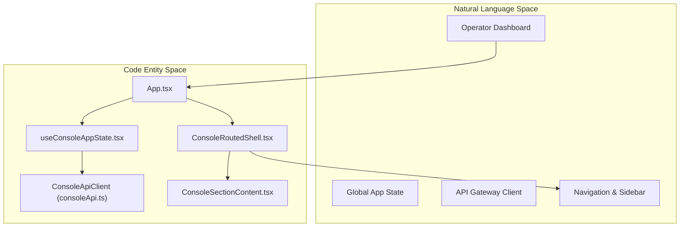
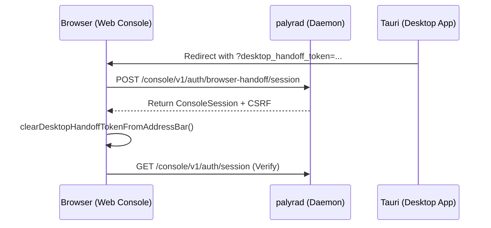

# Web Console (Operator Dashboard)

Relevant source files

The following files were used as context for generating this wiki page:

- apps/web/src/App.test.tsx
- apps/web/src/App.tsx
- apps/web/src/chat/ChatComposer.tsx
- apps/web/src/chat/ChatConsolePanel.test.tsx
- apps/web/src/chat/ChatConsolePanel.tsx
- apps/web/src/chat/ChatTranscript.tsx
- apps/web/src/chat/chatInspectorActions.ts
- apps/web/src/console/ConsoleSectionContent.tsx
- apps/web/src/console/components/layout/ConsoleSidebarNav.tsx
- apps/web/src/console/navigation.ts
- apps/web/src/console/sectionMetadata.ts
- apps/web/src/console/sections/MemorySection.tsx
- apps/web/src/console/useConsoleAppState.tsx
- apps/web/src/consoleApi.test.ts
- apps/web/src/consoleApi.ts
- crates/palyra-daemon/tests/admin_surface.rs

The Palyra Web Console is a React-based single-page application (SPA) that serves as the primary graphical user interface for operators. It provides a comprehensive dashboard for managing AI agents, inspecting system logs, configuring security policies, and interacting with the gateway through a rich chat workspace.

The console communicates with the `palyrad` daemon via the `ConsoleApiClient`, utilizing a specialized control plane API that supports both standard RESTful interactions and NDJSON-based streaming for real-time agent feedback.

## System Architecture

The console is built using a "shell and section" architecture. The `ConsoleRoutedShell` manages the global layout, including the `ConsoleSidebarNav`, while the `ConsoleSectionContent` component dynamically switches between different functional modules based on the active route.

### High-Level Component Relationship

The following diagram maps the logical components of the dashboard to their corresponding code entities.

**Sources:**
- [apps/web/src/App.tsx#11-33](http://apps/web/src/App.tsx#11-33)
- [apps/web/src/console/useConsoleAppState.tsx#163-220](http://apps/web/src/console/useConsoleAppState.tsx#163-220)
- [apps/web/src/console/ConsoleSectionContent.tsx#26-98](http://apps/web/src/console/ConsoleSectionContent.tsx#26-98)
- [apps/web/src/console/ConsoleRoutedShell.tsx#4-32](http://apps/web/src/console/ConsoleRoutedShell.tsx#4-32)

## Core State and Authentication

Global application state is managed by the `useConsoleAppState` hook. This hook handles:
- **Authentication Lifecycle**: Managing the `ConsoleSession`, including bootstrap retries and desktop handoff tokens [apps/web/src/console/useConsoleAppState.tsx#87-122](http://apps/web/src/console/useConsoleAppState.tsx#87-122).
- **Section Navigation**: Tracking the active `Section` and managing auto-refresh intervals [apps/web/src/console/useConsoleAppState.tsx#41-53](http://apps/web/src/console/useConsoleAppState.tsx#41-53).
- **Domain Logic**: Initializing sub-states for features like Channels, Auth, and Support [apps/web/src/console/useConsoleAppState.tsx#211-224](http://apps/web/src/console/useConsoleAppState.tsx#211-224).

### Authentication Flow

The console supports multiple entry points, including a direct login via admin token and a "browser handoff" mechanism where the Desktop Application (Tauri) transfers a session to the web browser.

**Sources:**
- [apps/web/src/console/useConsoleAppState.tsx#108-152](http://apps/web/src/console/useConsoleAppState.tsx#108-152)
- [apps/web/src/App.test.tsx#69-107](http://apps/web/src/App.test.tsx#69-107)

## Console Sections

The dashboard is organized into five primary navigation groups, defined in `sectionMetadata.ts` and `navigation.ts`.

| Group | Purpose | Key Sections |
| :--- | :--- | :--- |
| **Chat** | Real-time agent interaction | `chat` |
| **Observability** | Monitoring and logs | `overview`, `sessions`, `usage`, `logs` |
| **Control** | Human-in-the-loop and automation | `approvals`, `cron`, `channels`, `browser` |
| **Agent** | Capability management | `agents`, `skills`, `memory` |
| **Settings** | System configuration | `auth`, `access`, `config`, `secrets` |

For details on section implementation, see [Console Sections and Navigation](console_sections_and_navigation/README.md).

**Sources:**
- [apps/web/src/console/navigation.ts#26-52](http://apps/web/src/console/navigation.ts#26-52)
- [apps/web/src/console/ConsoleSectionContent.tsx#27-95](http://apps/web/src/console/ConsoleSectionContent.tsx#27-95)

## Chat Workspace

The `ChatConsolePanel` is the most complex component in the console, providing a "workspace" for interacting with agents. It leverages `useChatRunStream` to manage the real-time flow of `RunStream` events from the daemon.

### Key Workspace Features:
- **ChatComposer**: Supports slash commands (e.g., `/queue`), context budget visualization, and drag-and-drop file attachments [apps/web/src/chat/ChatComposer.tsx#124-142](http://apps/web/src/chat/ChatComposer.tsx#124-142).
- **ChatTranscript**: Renders the conversation history, including `approval_request` entries for human-in-the-loop actions and `a2ui` (Agent-to-User Interface) frames [apps/web/src/chat/ChatTranscript.tsx#150-185](http://apps/web/src/chat/ChatTranscript.tsx#150-185).
- **Inspector Side Panel**: Provides deep-dive views into tool payloads, background tasks, and derived artifacts [apps/web/src/chat/ChatConsolePanel.tsx#173-178](http://apps/web/src/chat/ChatConsolePanel.tsx#173-178).

For details, see [Chat Workspace](chat_workspace/README.md).

**Sources:**
- [apps/web/src/chat/ChatConsolePanel.tsx#70-153](http://apps/web/src/chat/ChatConsolePanel.tsx#70-153)
- [apps/web/src/chat/ChatComposer.tsx#53-84](http://apps/web/src/chat/ChatComposer.tsx#53-84)
- [apps/web/src/chat/ChatTranscript.tsx#27-42](http://apps/web/src/chat/ChatTranscript.tsx#27-42)

## API and Control Plane

The `ConsoleApiClient` (defined in `consoleApi.ts`) is the TypeScript implementation of the Palyra Control Plane. It handles:
- **CSRF Protection**: Automatically injecting `x-palyra-csrf-token` headers into mutating (POST/PUT/DELETE) requests [apps/web/src/consoleApi.test.ts#44-90](http://apps/web/src/consoleApi.test.ts#44-90).
- **Streaming**: Consuming NDJSON streams for chat messages and system logs.
- **Error Handling**: Wrapping API failures in `ControlPlaneApiError` for consistent UI error reporting [apps/web/src/consoleApi.test.ts#3-8](http://apps/web/src/consoleApi.test.ts#3-8).

For details, see [ConsoleApiClient and Control Plane](consoleapiclient_and_control_plane/README.md).

**Sources:**
- [apps/web/src/consoleApi.ts#1-27](http://apps/web/src/consoleApi.ts#1-27)
- [apps/web/src/consoleApi.test.ts#15-42](http://apps/web/src/consoleApi.test.ts#15-42)

## Child Pages

- [Chat Workspace](chat_workspace/README.md) — Deep dive into the `ChatConsolePanel`, `useChatRunStream`, and the media/derived-artifact pipeline.
- [Console Sections and Navigation](console_sections_and_navigation/README.md) — Documents the section architecture, `ConsoleSidebarNav`, and individual management views.
- [A2UI (Agent-to-User Interface) Renderer](a2ui_agent-to-user_interface_renderer/README.md) — Documents the `a2ui` subsystem, JSON patch protocol, and sandboxed rendering.
- [ConsoleApiClient and Control Plane](consoleapiclient_and_control_plane/README.md) — Documents the `ConsoleApiClient` lifecycle, CSRF management, and the Rust `ControlPlaneClient`.

## Child Pages

- [Chat Workspace](chat_workspace/README.md)
- [Console Sections and Navigation](console_sections_and_navigation/README.md)
- [A2UI (Agent-to-User Interface) Renderer](a2ui_agent-to-user_interface_renderer/README.md)
- [ConsoleApiClient and Control Plane](consoleapiclient_and_control_plane/README.md)
