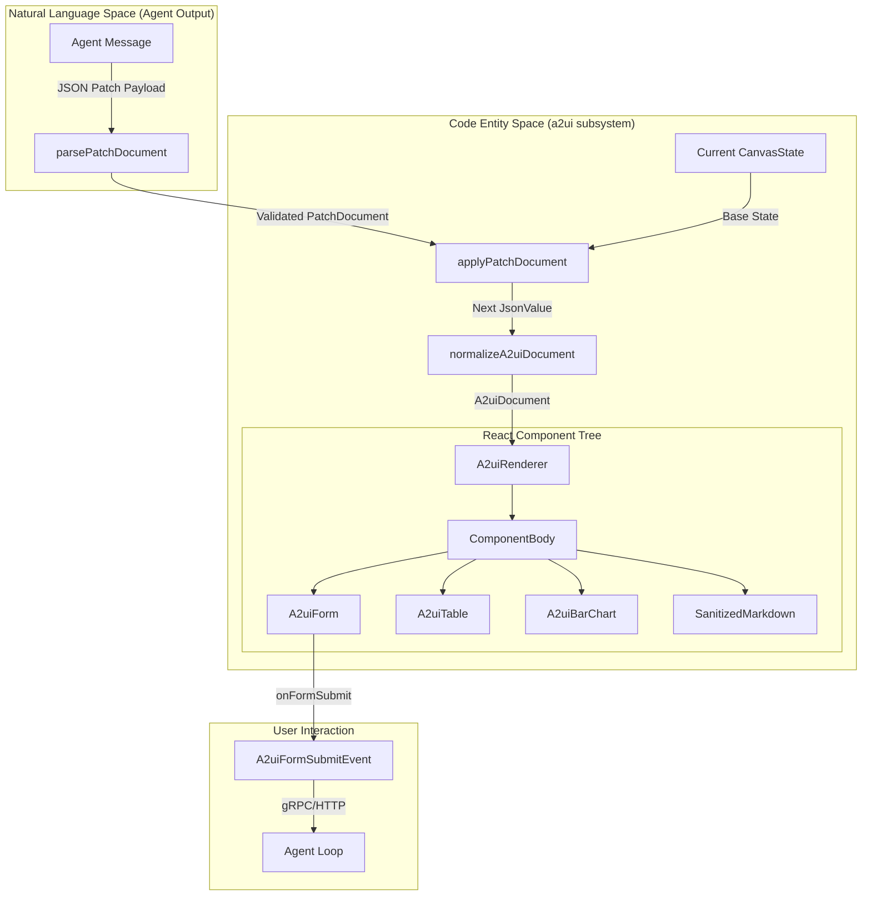
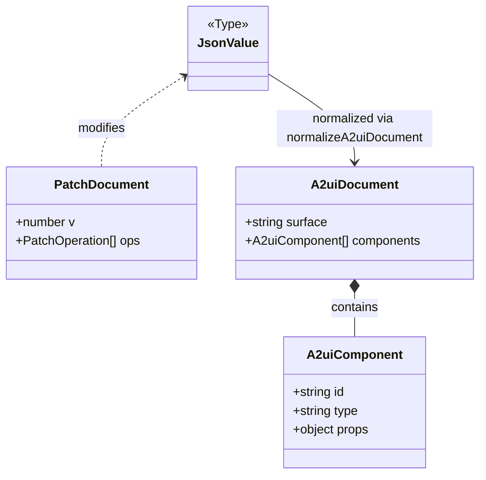

# A2UI (Agent-to-User Interface) Renderer

Relevant source files

The following files were used as context for generating this wiki page:

- apps/web/src/a2ui/__tests__/patch.security.test.tsx
- apps/web/src/a2ui/__tests__/renderer.snapshot.test.tsx
- apps/web/src/a2ui/patch.ts
- apps/web/src/a2ui/renderer.tsx
- crates/palyra-common/src/process_runner_input.rs
- fuzz/Cargo.lock
- fuzz/Cargo.toml
- fuzz/fuzz_targets/process_runner_input_parser.rs
- fuzz/fuzz_targets/workspace_patch_parser.rs

The **A2UI (Agent-to-User Interface)** subsystem is a specialized rendering engine within the Palyra Web Console designed to provide agents with a structured, interactive, and secure way to present information and collect input from users. Unlike standard text-based chat, A2UI allows agents to "patch" a live UI state, enabling dynamic updates to tables, forms, charts, and markdown documents without re-rendering the entire conversation history.

### Purpose and Scope
A2UI bridges the gap between raw LLM outputs and rich user interfaces. It provides:
- **Incremental Updates**: A JSON Patch-based protocol for efficient UI state transitions.
- **Rich Components**: Native support for tables, forms, charts, and sanitized markdown.
- **Security Sandboxing**: Strict validation of patch operations to prevent prototype pollution and unauthorized state access.
- **Human-in-the-Loop**: Interactive forms that allow users to submit structured data back to the agent.

---

## System Architecture

The A2UI lifecycle involves the transformation of agent-generated patches into a validated UI state, which is then rendered by React components.

### A2UI Data Flow Diagram
This diagram illustrates the path from a patch operation to the final rendered React component.

**Sources:** `apps/web/src/a2ui/renderer.tsx:33-59`(), `apps/web/src/a2ui/patch.ts:47-89`(), `apps/web/src/a2ui/types.ts:1-20`()

---

## JSON Patch Protocol (`patch.ts`)

A2UI uses a versioned JSON Patch protocol (v1) to manipulate the UI state. This allows agents to send small updates (e.g., updating a single cell in a table) rather than the entire document.

### Patch Operations
The system supports three primary operations defined in `PatchOperationKind`:
1.  **add**: Inserts a value at a specified path or appends to an array using the `-` token.
2.  **replace**: Updates an existing value at a path.
3.  **remove**: Deletes a value or array element.

### Security and Sanitization
The patch engine implements several security layers to prevent malicious state manipulation:
- **Prototype Pollution Protection**: The `FORBIDDEN_POINTER_TOKENS` set (containing `__proto__`, `prototype`, and `constructor`) is checked during path resolution to prevent attacks on the JavaScript object prototype.
- **Recursive Cloning**: Every value added or replaced is passed through `cloneJsonValue` to ensure no shared references exist between the patch and the state.
- **Budget Enforcement**: The `PatchProcessingBudget` limits the complexity of patches to prevent Denial of Service (DoS) via deeply nested objects or massive arrays.

| Constraint | Default Value | Purpose |
| :--- | :--- | :--- |
| `maxOpsPerPatch` | 100 | Limits the number of operations in a single tick. |
| `maxPathLength` | 1024 | Prevents extremely deep/complex JSON pointers. |
| `maxApplyMsPerTick` | 50ms | Ensures the UI thread is not blocked by heavy patch logic. |

**Sources:** `apps/web/src/a2ui/patch.ts:16-45`(), `apps/web/src/a2ui/patch.ts:69-86`(), `apps/web/src/a2ui/__tests__/patch.security.test.tsx:9-30`()

---

## The Renderer (`renderer.tsx`)

The `A2uiRenderer` is the entry point for turning a `A2uiDocument` into DOM elements. It iterates through a list of components and delegates rendering to the `ComponentBody` switcher.

### Key Components

#### 1. A2uiForm
The `A2uiForm` component handles structured user input. It supports `checkbox`, `select`, `number`, and `text` fields.
- **State Management**: It maintains internal state for field values using `useState` and initializes them from `field.defaultValue`.
- **Submission**: When the user clicks the submit button, it triggers `onFormSubmit` with an `A2uiFormSubmitEvent`, containing the `componentId` and the collected `values`.

#### 2. A2uiTable
The `A2uiTable` maps the agent's tabular data into the `EntityTable` UI component.
- **Row Headers**: By default, the first column is treated as the row header (`isRowHeader: index === 0`).
- **Dynamic Rows**: Tables can be updated incrementally by the agent using array index patches (e.g., `/components/2/props/rows/5`).

#### 3. SanitizedMarkdown
To prevent XSS, all markdown content is passed through `SanitizedMarkdown`, which ensures that only safe HTML tags and attributes are rendered.

**Sources:** `apps/web/src/a2ui/renderer.tsx:66-97`(), `apps/web/src/a2ui/renderer.tsx:130-177`(), `apps/web/src/a2ui/renderer.tsx:99-123`()

---

## State Resolution and Normalization

Before rendering, the raw `JsonValue` resulting from a patch application must be validated and converted into a typed `A2uiDocument`.

### CanvasStatePatchRecord
In the persistence layer, A2UI state transitions are stored as `CanvasStatePatchRecord` entries. This allows the Web Console to "replay" the state of a UI surface by applying patches in sequence to an initial empty state.

**Sources:** `apps/web/src/a2ui/types.ts:1-20`(), `apps/web/src/a2ui/renderer.tsx:33-49`()

---

## Fuzzing and Robustness

Because A2UI processes JSON payloads from potentially untrusted or hallucinatory agents, the system includes fuzz targets to ensure the parser's stability.

### a2ui_json_parser Fuzz Target
Located in `fuzz/fuzz_targets/a2ui_json_parser.rs`, this target stress-tests the Rust-side representation of A2UI data. It ensures that:
- Malformed JSON does not crash the daemon.
- Extremely large payloads are rejected.
- Deeply nested structures do not cause stack overflows.

Additional fuzz targets like `workspace_patch_parser` and `process_runner_input_parser` provide similar protections for related subsystems that share the JSON-based communication pattern.

**Sources:** `fuzz/Cargo.toml:26-30`(), `fuzz/fuzz_targets/workspace_patch_parser.rs:29-41`(), `crates/palyra-common/src/process_runner_input.rs:26-31`()
