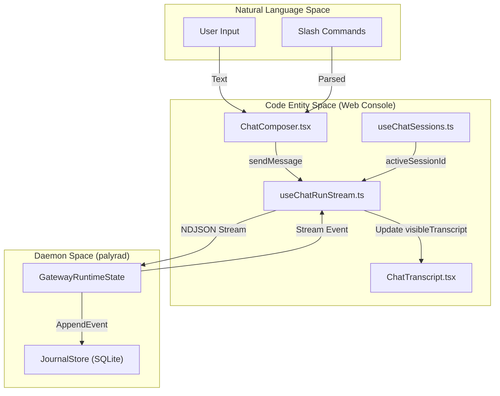
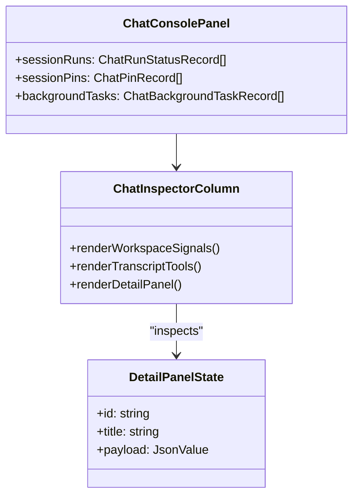

# Chat Workspace

Relevant source files

The following files were used as context for generating this wiki page:

- apps/web/src/chat/ChatComposer.tsx
- apps/web/src/chat/ChatConsolePanel.test.tsx
- apps/web/src/chat/ChatConsolePanel.tsx
- apps/web/src/chat/ChatInspectorColumn.tsx
- apps/web/src/chat/ChatRunDrawer.tsx
- apps/web/src/chat/ChatSessionsSidebar.tsx
- apps/web/src/chat/ChatTranscript.tsx
- apps/web/src/chat/chatConsoleUtils.ts
- apps/web/src/chat/chatInspectorActions.ts
- apps/web/src/chat/chatPhase4Actions.ts
- apps/web/src/chat/chatSessionActions.ts
- apps/web/src/chat/chatShared.test.ts
- apps/web/src/chat/chatShared.tsx
- apps/web/src/chat/useChatRunStream.ts
- apps/web/src/chat/useChatSessions.ts
- apps/web/src/chat/useContextReferencePreview.ts
- apps/web/src/chat/useRecallPreview.ts
- apps/web/src/console/sections/MemorySection.tsx
- apps/web/src/console/useConsoleAppState.tsx
- crates/palyra-common/src/context_references.rs
- crates/palyra-daemon/src/delegation.rs

The **Chat Workspace** is the primary operational interface within the Palyra Web Console. It provides a high-fidelity environment for interacting with AI agents, managing multi-session lineages, and inspecting the internal state of the gateway's execution pipeline.

## Overview and Core Orchestration

The workspace is centered around the `ChatConsolePanel`, which orchestrates several specialized hooks and components to maintain a real-time, streaming view of agent activity [apps/web/src/chat/ChatConsolePanel.tsx#70-75](http://apps/web/src/chat/ChatConsolePanel.tsx#70-75).

### State Management and Hooks
- **`useChatRunStream`**: Manages the active gRPC/NDJSON stream from the daemon. It handles the `RunStateMachine` transitions, accumulates the `runTape`, and manages `a2uiDocuments` [apps/web/src/chat/ChatConsolePanel.tsx#117-153](http://apps/web/src/chat/ChatConsolePanel.tsx#117-153).
- **`useChatSessions`**: Controls the session lifecycle, including creation, renaming, archiving, and switching between sessions in the "Session Rail" [apps/web/src/chat/useChatSessions.ts#37-42](http://apps/web/src/chat/useChatSessions.ts#37-42).
- **`useContextReferencePreview`**: Provides a "look-ahead" for the composer, resolving `@` references to files or entities before the message is sent [apps/web/src/chat/ChatConsolePanel.tsx#58-58](http://apps/web/src/chat/ChatConsolePanel.tsx#58-58).

### Workspace Data Flow
The following diagram illustrates how user input in the `ChatComposer` flows through the streaming architecture to update the `ChatTranscript`.

**Chat Workspace Data Flow**

Sources: [apps/web/src/chat/ChatConsolePanel.tsx#117-153](http://apps/web/src/chat/ChatConsolePanel.tsx#117-153), [apps/web/src/chat/useChatRunStream.ts#1-10](http://apps/web/src/chat/useChatRunStream.ts#1-10), [apps/web/src/chat/ChatComposer.tsx#53-84](http://apps/web/src/chat/ChatComposer.tsx#53-84).

---

## Chat Composer

The `ChatComposer` is a sophisticated input area that supports multi-modal attachments, context budgeting, and command execution [apps/web/src/chat/ChatComposer.tsx#53-84](http://apps/web/src/chat/ChatComposer.tsx#53-84).

### Slash Commands
The workspace supports various `/` commands to perform administrative and session actions without leaving the keyboard [apps/web/src/chat/chatShared.tsx#76-163](http://apps/web/src/chat/chatShared.tsx#76-163).
- `/new [label]`: Creates a fresh session.
- `/branch [label]`: Creates a child session from the current state.
- `/compact [apply|preview]`: Triggers transcript compaction to save tokens.
- `/delegate <profile> <text>`: Spawns a background sub-run using a specific agent profile [crates/palyra-daemon/src/delegation.rs#1-10](http://crates/palyra-daemon/src/delegation.rs#1-10).

### Context Budgeting
To prevent LLM context overflow, the composer calculates a `ContextBudgetSummary` [apps/web/src/chat/chatShared.tsx#54-65](http://apps/web/src/chat/chatShared.tsx#54-65). It tracks:
- **Baseline Tokens**: Existing session history.
- **Draft Tokens**: Current text in the composer.
- **Attachment Tokens**: Estimated tokens for uploaded files/images.
The UI displays a warning if the total exceeds `CONTEXT_BUDGET_SOFT_LIMIT` (12,000 tokens) or `CONTEXT_BUDGET_HARD_LIMIT` (16,000 tokens) [apps/web/src/chat/chatShared.tsx#22-23](http://apps/web/src/chat/chatShared.tsx#22-23).

### Drag-and-Drop & Attachments
The composer implements a `pushFiles` handler that processes `FileList` objects from drag-and-drop events [apps/web/src/chat/ChatComposer.tsx#112-121](http://apps/web/src/chat/ChatComposer.tsx#112-121). Files are uploaded via `api.uploadChatAttachment`, returning a `ChatAttachmentRecord` that includes a `content_hash` and `budget_tokens` [apps/web/src/chat/chatConsoleUtils.ts#164-186](http://apps/web/src/chat/chatConsoleUtils.ts#164-186).

---

## Chat Transcript and A2UI

The `ChatTranscript` renders the conversation history as a series of `TranscriptEntry` items [apps/web/src/chat/ChatTranscript.tsx#27-42](http://apps/web/src/chat/ChatTranscript.tsx#27-42).

### Specialized Entry Types
- **`approval_request`**: Pauses the run and renders `ApprovalRequestControls`. Operators can grant permissions (Once, Session, or Timeboxed) for sensitive tool calls [apps/web/src/chat/chatShared.tsx#230-235](http://apps/web/src/chat/chatShared.tsx#230-235).
- **`a2ui` (Agent-to-User Interface)**: Renders dynamic, JSON-patched UI components using the `A2uiRenderer`. These are used for interactive dashboards or complex data visualizations generated by the agent [apps/web/src/chat/ChatTranscript.tsx#1-2](http://apps/web/src/chat/ChatTranscript.tsx#1-2).
- **`canvas`**: Renders sandboxed iframes for web-based artifacts. The `collectCanvasFrameUrls` utility deduplicates and limits these URLs for security and performance [apps/web/src/chat/chatShared.test.ts#93-142](http://apps/web/src/chat/chatShared.test.ts#93-142).

### Media and Derived Artifacts
When files are uploaded, the `MediaDerivedArtifactRecord` pipeline triggers. For example, an image might generate an OCR text artifact or a thumbnail. The transcript allows operators to `recompute`, `quarantine`, or `purge` these derived outputs [apps/web/src/chat/ChatTranscript.tsx#82-142](http://apps/web/src/chat/ChatTranscript.tsx#82-142).

---

## The Inspector Side Panel

The `ChatInspectorColumn` provides deep visibility into the "Code Entity Space" of the current session [apps/web/src/chat/ChatInspectorColumn.tsx#96-141](http://apps/web/src/chat/ChatInspectorColumn.tsx#96-141).

### Workspace Signals
- **Branch Lineage**: Displays the parent-child relationship of the current session [apps/web/src/chat/ChatInspectorColumn.tsx#181-184](http://apps/web/src/chat/ChatInspectorColumn.tsx#181-184).
- **Queue Backlog**: Shows `queuedInputs`—messages sent by the user while a run was already active [apps/web/src/chat/ChatInspectorColumn.tsx#74-74](http://apps/web/src/chat/ChatInspectorColumn.tsx#74-74).
- **Background Tasks**: Monitors `ChatBackgroundTaskRecord` entries for delegated runs or long-running async operations [apps/web/src/chat/ChatInspectorColumn.tsx#75-75](http://apps/web/src/chat/ChatInspectorColumn.tsx#75-75).

### Transcript Tools
The inspector includes a `TranscriptSearchMatch` interface for querying the `JournalStore` [apps/web/src/chat/ChatInspectorColumn.tsx#27-36](http://apps/web/src/chat/ChatInspectorColumn.tsx#27-36). Users can search for specific tool calls, payloads, or assistant summaries across the entire session history.

**Inspector Entity Mapping**

Sources: [apps/web/src/chat/ChatConsolePanel.tsx#86-103](http://apps/web/src/chat/ChatConsolePanel.tsx#86-103), [apps/web/src/chat/ChatInspectorColumn.tsx#38-44](http://apps/web/src/chat/ChatInspectorColumn.tsx#38-44), [apps/web/src/chat/chatConsoleUtils.ts#22-30](http://apps/web/src/chat/chatConsoleUtils.ts#22-30).

---

## Implementation Details

### Session Compaction
To maintain performance in long-running conversations, the workspace supports `ChatCompactionArtifactRecord`. Compaction summarizes older transcript segments, replacing raw records with a `summary_preview` to reduce the context load while preserving intent [apps/web/src/chat/chatConsoleUtils.ts#50-70](http://apps/web/src/chat/chatConsoleUtils.ts#50-70).

### Data Persistence
Every event in the workspace is backed by the `JournalStore`. The `ChatTranscriptRecord` includes `origin_kind` and `origin_run_id`, allowing the UI to reconstruct the provenance of every message, especially in branched or delegated scenarios [apps/web/src/chat/chatConsoleUtils.ts#32-39](http://apps/web/src/chat/chatConsoleUtils.ts#32-39).

Sources:
- [apps/web/src/chat/ChatConsolePanel.tsx#1-153](http://apps/web/src/chat/ChatConsolePanel.tsx#1-153)
- [apps/web/src/chat/ChatComposer.tsx#1-121](http://apps/web/src/chat/ChatComposer.tsx#1-121)
- [apps/web/src/chat/ChatTranscript.tsx#1-173](http://apps/web/src/chat/ChatTranscript.tsx#1-173)
- [apps/web/src/chat/ChatInspectorColumn.tsx#1-220](http://apps/web/src/chat/ChatInspectorColumn.tsx#1-220)
- [apps/web/src/chat/chatShared.tsx#1-235](http://apps/web/src/chat/chatShared.tsx#1-235)
- [apps/web/src/chat/chatConsoleUtils.ts#1-195](http://apps/web/src/chat/chatConsoleUtils.ts#1-195)
- [apps/web/src/chat/useChatSessions.ts#1-199](http://apps/web/src/chat/useChatSessions.ts#1-199)
