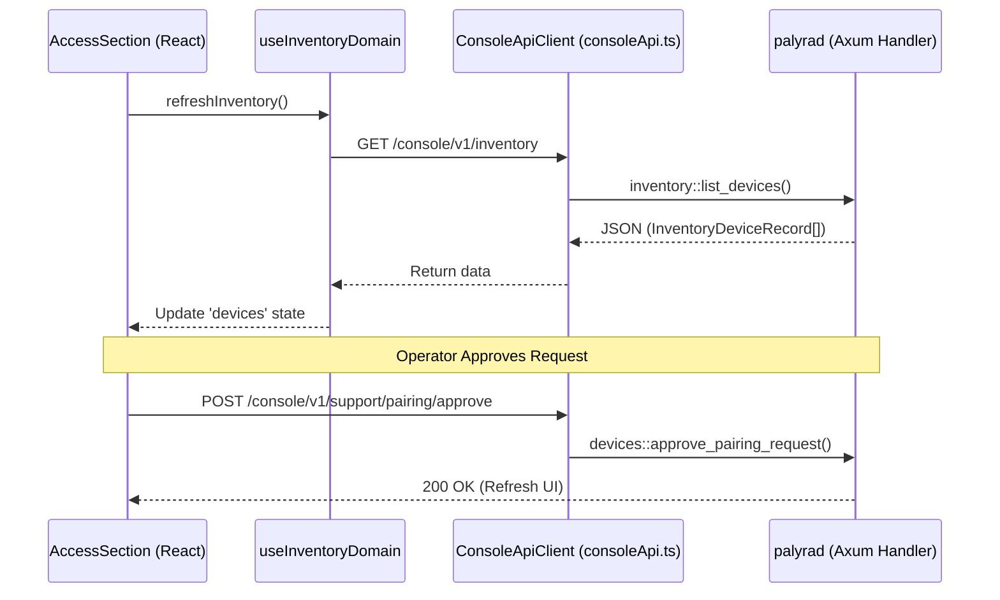

# Console Sections and Navigation

<details>
<summary>Relevant source files</summary>

The following files were used as context for generating this wiki page:

- apps/web/src/App.config-access-support.test.tsx
- apps/web/src/App.openai-auth.test.tsx
- apps/web/src/App.runtime-operations.test.tsx
- apps/web/src/console/ConsoleSectionContent.tsx
- apps/web/src/console/__fixtures__/m56ControlPlane.ts
- apps/web/src/console/components/layout/ConsoleSidebarNav.tsx
- apps/web/src/console/hooks/useOverviewDomain.ts
- apps/web/src/console/hooks/useSupportDomain.ts
- apps/web/src/console/navigation.ts
- apps/web/src/console/sectionMetadata.ts
- apps/web/src/console/sections/AccessSection.tsx
- apps/web/src/console/sections/ApprovalsSection.tsx
- apps/web/src/console/sections/BrowserSection.tsx
- apps/web/src/console/sections/ConfigSection.tsx
- apps/web/src/console/sections/CronSection.tsx
- apps/web/src/console/sections/InventorySection.tsx
- apps/web/src/console/sections/OperationsSection.tsx
- apps/web/src/console/sections/OverviewSection.tsx
- apps/web/src/console/sections/SupportSection.tsx
- apps/web/src/console/sections/UsageSection.tsx
- apps/web/src/console/sections/routinesHelpers.ts
- crates/palyra-daemon/src/transport/http/handlers/console/devices.rs
- crates/palyra-daemon/src/transport/http/handlers/console/inventory.rs
- scripts/check-local-only-tracked-files.sh
- scripts/run-pre-push-checks.sh

</details>


The Palyra Web Console is organized into distinct functional domains called **Sections**. This architecture ensures that complex operational tasks—ranging from real-time chat and session management to low-level hardware inventory and security policy audits—are decoupled into maintainable React components while sharing a unified navigation and state management layer.

## Navigation Architecture

Navigation is governed by a central metadata registry and a grouped hierarchy that maps logical operator domains to physical routes and UI components.

### Section Metadata and Groups
The system defines 19 primary sections in `CONSOLE_SECTIONS` [apps/web/src/console/sectionMetadata.ts#1-33](http://apps/web/src/console/sectionMetadata.ts#1-33). These are categorized into five `NavigationGroup` buckets [apps/web/src/console/navigation.ts#26-52](http://apps/web/src/console/navigation.ts#26-52):

| Group | Label | Included Sections |
| :--- | :--- | :--- |
| `chat` | Chat | `chat` |
| `control` | Observability | `overview`, `sessions`, `usage`, `logs`, `inventory`, `support` |
| `operations` | Control | `approvals`, `cron`, `channels`, `browser` |
| `agent` | Agent | `agents`, `skills`, `memory` |
| `settings` | Settings | `auth`, `access`, `config`, `secrets`, `operations` |

### Data Flow: Navigation to Component
The `ConsoleSidebarNav` component renders the global navigation rail using `CONSOLE_NAV_GROUPS` [apps/web/src/console/components/layout/ConsoleSidebarNav.tsx#30-68](http://apps/web/src/console/components/layout/ConsoleSidebarNav.tsx#30-68). When a user selects an item, the `onSelect` callback updates the `app.section` state in `useConsoleAppState`, and the `ConsoleSectionContent` switch-case renders the corresponding view [apps/web/src/console/ConsoleSectionContent.tsx#26-97](http://apps/web/src/console/ConsoleSectionContent.tsx#26-97).

### System Component Mapping
The following diagram bridges the logical navigation names used by operators to the underlying React components and API routes.

**Navigation to Code Entity Mapping**
```mermaid
graph TD
    subgraph "Navigation Logic"
        NAV["CONSOLE_NAV_GROUPS (navigation.ts)"] -->|defines| ID["Section ID"]
        ID -->|maps to| PATH["SECTION_PATHS (navigation.ts)"]
    end

    subgraph "UI Implementation"
        CONTENT["ConsoleSectionContent.tsx"] -->|switch(section)| SECTIONS["Section Components"]
        SECTIONS -->|Overview| OV["OverviewSection.tsx"]
        SECTIONS -->|Access| AC["AccessSection.tsx"]
        SECTIONS -->|Usage| US["UsageSection.tsx"]
        SECTIONS -->|Diagnostics| OP["OperationsSection.tsx"]
    end

    subgraph "API Layer"
        AC -->|calls| API_PAIR["/console/v1/support/pairing/..."]
        US -->|calls| API_USAGE["/console/v1/usage/..."]
        OP -->|calls| API_DIAG["/console/v1/diagnostics/..."]
    end

    ID -.->|triggers| CONTENT
```
Sources: [apps/web/src/console/navigation.ts#26-103](http://apps/web/src/console/navigation.ts#26-103), [apps/web/src/console/ConsoleSectionContent.tsx#26-97](http://apps/web/src/console/ConsoleSectionContent.tsx#26-97), [apps/web/src/console/sections/AccessSection.tsx#118-127](http://apps/web/src/console/sections/AccessSection.tsx#118-127).

---

## Major Console Sections

### 1. Overview and Diagnostics
The **Overview** section provides a high-level posture summary, while the **Diagnostics** (Operations) section handles technical deep-dives and audit logs.
- **Implementation**: `OverviewSection` and `OperationsSection`.
- **Key Features**: 
    - Capability Catalog: Displays available system features based on the `capability-catalog.v2` contract [apps/web/src/console/__fixtures__/m56ControlPlane.ts#5-105](http://apps/web/src/console/__fixtures__/m56ControlPlane.ts#5-105).
    - Audit Events: A filtered table of system events with principal and payload search [apps/web/src/console/sections/OperationsSection.tsx#151-180](http://apps/web/src/console/sections/OperationsSection.tsx#151-180).
    - CLI Handoffs: Displays commands that must be run locally for high-trust operations [apps/web/src/console/sections/OperationsSection.tsx#68-79](http://apps/web/src/console/sections/OperationsSection.tsx#68-79).

### 2. Access and Inventory
Manages the trust relationship between the gateway and external devices or nodes.
- **Implementation**: `AccessSection` [apps/web/src/console/sections/AccessSection.tsx#64-166](http://apps/web/src/console/sections/AccessSection.tsx#64-166) and `InventorySection`.
- **Data Flow**:
    1. `useInventoryDomain` hook fetches device records and pairing requests [apps/web/src/console/sections/AccessSection.tsx#73-78](http://apps/web/src/console/sections/AccessSection.tsx#73-78).
    2. Operators approve or reject `NodePairingRequestView` items [apps/web/src/console/sections/AccessSection.tsx#118-127](http://apps/web/src/console/sections/AccessSection.tsx#118-127).
    3. Trust actions (Rotate, Revoke, Remove) are dispatched to the `/console/v1/inventory` endpoints.

### 3. Usage and Governance
Tracks resource consumption and enforces budget controls.
- **Implementation**: `UsageSection` [apps/web/src/console/sections/UsageSection.tsx#30-78](http://apps/web/src/console/sections/UsageSection.tsx#30-78).
- **Metrics**: Displays total tokens, run counts, estimated USD cost, and average latency [apps/web/src/console/sections/UsageSection.tsx#80-106](http://apps/web/src/console/sections/UsageSection.tsx#80-106).
- **Governance**: Integrates with the `UsageGovernance` subsystem to display budget evaluations and active overrides [apps/web/src/console/sections/UsageSection.tsx#161-190](http://apps/web/src/console/sections/UsageSection.tsx#161-190).

### 4. Config and Secrets
Handles the management of `palyra.toml` and sensitive vault-backed values.
- **Implementation**: `ConfigSection` and `SecretsSection`.
- **Safety Mechanisms**:
    - **Redaction**: Secrets are masked by default and require an explicit "Reveal" action [apps/web/src/App.config-access-support.test.tsx#134-139](http://apps/web/src/App.config-access-support.test.tsx#134-139).
    - **Lifecycle**: Supports config mutation, migration (schema versioning), and recovery from backups [apps/web/src/App.config-access-support.test.tsx#113-123](http://apps/web/src/App.config-access-support.test.tsx#113-123).

### 5. Control (Routines, Channels, Browser)
- **Routines (Cron)**: Manages scheduled tasks and manual triggers for `CronScheduleType` automations [apps/web/src/App.runtime-operations.test.tsx#48-56](http://apps/web/src/App.runtime-operations.test.tsx#48-56).
- **Channels**: Configures Discord, Slack, or Webhook connectors, including "Dead Letter" replay/discard logic [apps/web/src/App.runtime-operations.test.tsx#57-106](http://apps/web/src/App.runtime-operations.test.tsx#57-106).
- **Browser**: Manages `palyra-browserd` profiles and relay tokens for browser automation [apps/web/src/console/sectionMetadata.ts#23-23](http://apps/web/src/console/sectionMetadata.ts#23-23).

---

## Technical Interaction Model

The console sections interact with the backend via the `ConsoleApiClient`. The following diagram illustrates how a section (e.g., Access) utilizes hooks and the API client to perform stateful operations.

**Console Section Data Flow (Access Example)**

Sources: [apps/web/src/console/sections/AccessSection.tsx#111-127](http://apps/web/src/console/sections/AccessSection.tsx#111-127), [crates/palyra-daemon/src/transport/http/handlers/console/inventory.rs](), [crates/palyra-daemon/src/transport/http/handlers/console/devices.rs]().

### Section Summary Table

| Section ID | Primary Component | Primary API Endpoint | Purpose |
| :--- | :--- | :--- | :--- |
| `overview` | `OverviewSection` | `/console/v1/health` | System posture summary |
| `sessions` | `SessionsSection` | `/console/v1/sessions` | Audit and manage chat runs |
| `usage` | `UsageSection` | `/console/v1/usage` | Token and cost tracking |
| `approvals` | `ApprovalsSection` | `/console/v1/approvals` | Human-in-the-loop gate |
| `cron` | `CronSection` | `/console/v1/routines` | Automation scheduling |
| `auth` | `AuthSection` | `/console/v1/auth/profiles` | LLM provider credentials |
| `secrets` | `SecretsSection` | `/console/v1/secrets` | Vault management |

Sources: [apps/web/src/console/ConsoleSectionContent.tsx#26-97](http://apps/web/src/console/ConsoleSectionContent.tsx#26-97), [apps/web/src/console/navigation.ts#54-74](http://apps/web/src/console/navigation.ts#54-74), [apps/web/src/console/sectionMetadata.ts#1-33](http://apps/web/src/console/sectionMetadata.ts#1-33).
