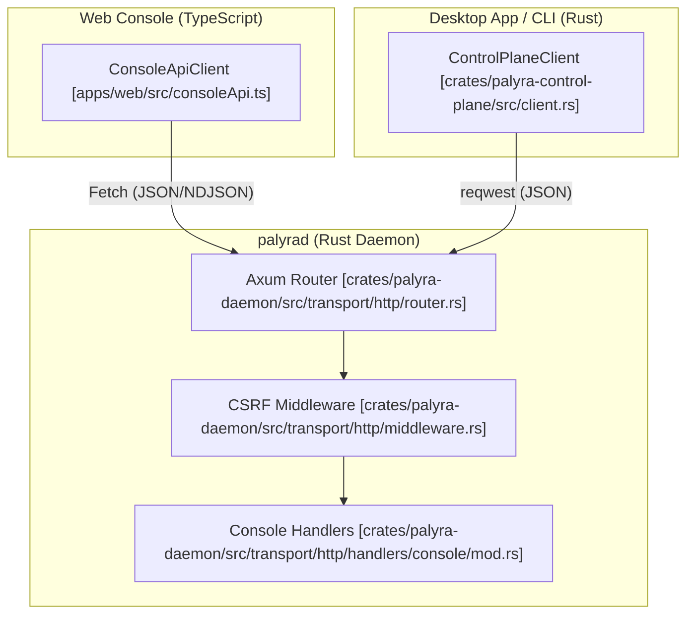
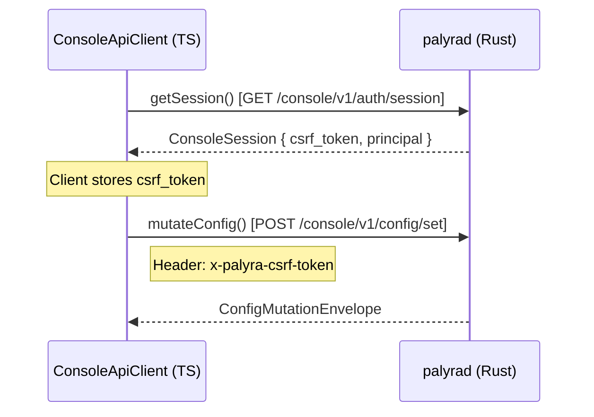

# ConsoleApiClient and Control Plane

Relevant source files

The following files were used as context for generating this wiki page:

- apps/web/src/App.test.tsx
- apps/web/src/App.tsx
- apps/web/src/consoleApi.test.ts
- apps/web/src/consoleApi.ts
- crates/palyra-control-plane/src/client.rs
- crates/palyra-control-plane/src/models.rs
- crates/palyra-daemon/src/lib.rs
- crates/palyra-daemon/src/transport/http/handlers/console/mod.rs
- crates/palyra-daemon/src/transport/http/router.rs
- crates/palyra-daemon/tests/admin_surface.rs

The **ConsoleApiClient** and the Rust-based **ControlPlaneClient** serve as the primary programmatic interfaces for interacting with the Palyra daemon (`palyrad`). These clients encapsulate the authentication lifecycle, CSRF protection, and the multiplexed communication required for both standard RESTful operations and real-time NDJSON (Newline Delimited JSON) streaming of agent activities.

### System Architecture and Data Flow

The Control Plane architecture bridges the TypeScript-based Web Console and Rust-based external tools (like the Desktop App) to the daemon's Axum-based HTTP transport layer.

#### Control Plane Connectivity Diagram
This diagram illustrates how code entities across different languages and processes interact via the Control Plane.

**Sources:** [apps/web/src/consoleApi.ts#1-100](http://apps/web/src/consoleApi.ts#1-100), [crates/palyra-control-plane/src/client.rs#33-40](http://crates/palyra-control-plane/src/client.rs#33-40), [crates/palyra-daemon/src/transport/http/router.rs#134-180](http://crates/palyra-daemon/src/transport/http/router.rs#134-180), [crates/palyra-daemon/src/transport/http/handlers/console/mod.rs#1-28](http://crates/palyra-daemon/src/transport/http/handlers/console/mod.rs#1-28)

---

### Authentication and Session Lifecycle

The authentication flow is designed to support both browser-based sessions (Web Console) and direct token-based access (Admin/Desktop).

1.  **Session Bootstrap**: The client attempts to retrieve an existing session via `GET /console/v1/auth/session`. If a session cookie exists, the daemon returns a `ConsoleSession` containing a CSRF token.
2.  **Login**: If no session exists, the client calls `login()` with an `admin_token`.
3.  **CSRF Management**: For all mutating requests (POST, PUT, DELETE), the client must include the `x-palyra-csrf-token` header. The `ConsoleApiClient` automatically manages this state once a session is established.
4.  **Handoff**: The Desktop App can generate a `desktop_handoff_token` to transition a secure session from the local desktop process to the web browser.

#### Code Entity Mapping: Auth Flow

**Sources:** [apps/web/src/consoleApi.ts#1330-1360](http://apps/web/src/consoleApi.ts#1330-1360), [crates/palyra-control-plane/src/client.rs#67-83](http://crates/palyra-control-plane/src/client.rs#67-83), [apps/web/src/App.test.tsx#38-67](http://apps/web/src/App.test.tsx#38-67), [crates/palyra-control-plane/src/models.rs#7-16](http://crates/palyra-control-plane/src/models.rs#7-16)

---

### Key Client Methods and Capabilities

Both clients provide a comprehensive suite of methods for managing the Palyra environment.

| Category | Key Methods (TypeScript / Rust) | Description |
| :--- | :--- | :--- |
| **Chat** | `streamChatMessage`, `getSessionTranscript` | Streams agent responses via NDJSON or fetches full history. |
| **Config** | `mutateConfig`, `getRawConfig` | Updates `palyra.toml` values at specific paths. |
| **Browser** | `createBrowserSession`, `navigateBrowserSession` | Proxies automation commands to `palyra-browserd`. |
| **Governance** | `getUsageSummary`, `listUsagePolicies` | Monitors token consumption and budget limits. |
| **Security** | `listSecrets`, `revealSecret`, `decideApproval` | Manages vault entries and human-in-the-loop decisions. |

#### Safe-Read Retry Policy
The Rust `ControlPlaneClient` implements a retry policy for "safe" (idempotent) read operations (GET requests). If a request fails due to transient network issues, it retries up to `safe_read_retries` times (defaulting to 1) [crates/palyra-control-plane/src/client.rs#12-27](http://crates/palyra-control-plane/src/client.rs#12-27).

---

### NDJSON Streaming and Error Handling

The `streamChatMessage` method is the most complex interaction, utilizing Newline Delimited JSON to provide real-time updates from the `Orchestrator`.

#### Implementation Details
*   **Streaming**: The client uses the `ReadableStream` API (in TS) or `ReceiverStream` (in Rust) to process chunks of text as they arrive.
*   **Line Parsing**: Each line is parsed as a `ChatStreamLine` [apps/web/src/consoleApi.ts#500-520](http://apps/web/src/consoleApi.ts#500-520).
*   **Error Envelopes**: If the API returns a non-200 status, the response body is expected to be an `ErrorEnvelope` containing a machine-readable error code and a human-readable message [crates/palyra-control-plane/src/errors.rs#7-15](http://crates/palyra-control-plane/src/errors.rs#7-15).

#### Error Handling Logic
The `ConsoleApiClient` throws a `ControlPlaneApiError` which includes the HTTP status and the server-provided error details. This allows the UI to distinguish between "Rate Limit Exceeded" (429) and "Authentication Required" (401/403) [apps/web/src/consoleApi.test.ts#4-8](http://apps/web/src/consoleApi.test.ts#4-8).

---

### Security Middleware and Headers

All requests passing through the Control Plane are subject to security middleware in the daemon.

*   **Rate Limiting**: `admin_rate_limit_middleware` prevents brute-force attempts on the admin token [crates/palyra-daemon/src/transport/http/router.rs#127-130](http://crates/palyra-daemon/src/transport/http/router.rs#127-130).
*   **Security Headers**: `admin_console_security_headers_middleware` injects `X-Content-Type-Options: nosniff` and strict `Content-Security-Policy` headers [crates/palyra-daemon/src/transport/http/router.rs#131-133](http://crates/palyra-daemon/src/transport/http/router.rs#131-133).
*   **Principal Validation**: The daemon validates the `x-palyra-principal` and `x-palyra-device-id` headers for all admin requests to ensure they match the authenticated session [crates/palyra-daemon/tests/admin_surface.rs#46-64](http://crates/palyra-daemon/tests/admin_surface.rs#46-64).

**Sources:** [crates/palyra-daemon/src/transport/http/router.rs#127-133](http://crates/palyra-daemon/src/transport/http/router.rs#127-133), [crates/palyra-daemon/tests/admin_surface.rs#30-72](http://crates/palyra-daemon/tests/admin_surface.rs#30-72), [apps/web/src/consoleApi.ts#1400-1450](http://apps/web/src/consoleApi.ts#1400-1450)
